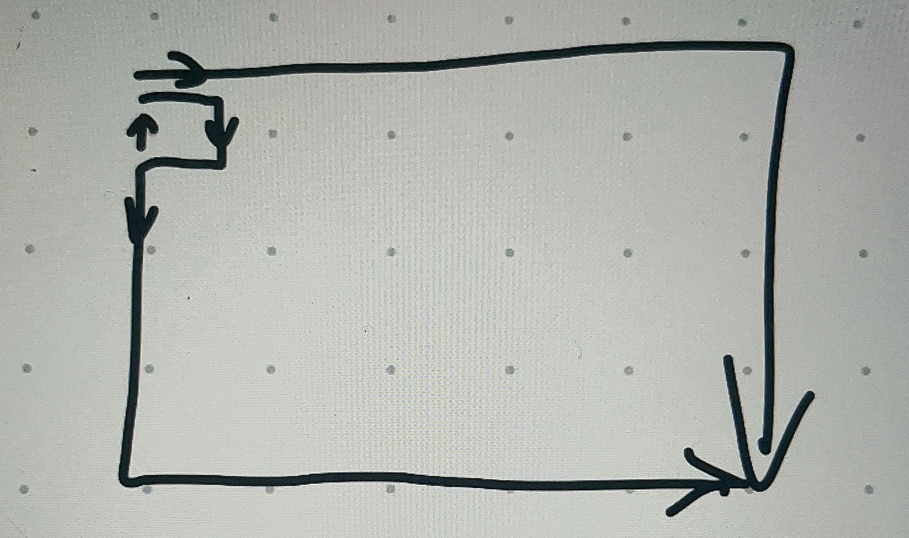

构造一个环和两条到终点的路，没走一圈环 可以加$+4$步。两台路要满足一条可以走出最短路，另一条路可以走出最短路 $+2$。

<div align="center"></div>

```cpp
#include <bits/stdc++.h>
using namespace std;
const int MAX = 4e6 + 100;
typedef long long ll;
typedef unsigned long long ull;
const ll mod = 998244353;
const ll inf = 0x3f3f3f3f3f3fll;
void solve();

int main()
{
	ios::sync_with_stdio(false);
	cin.tie(0), cout.tie(0);
	// clock_t c1 = clock();
#ifdef LOCAL
	freopen("in.in", "r", stdin);
	freopen("out.out", "w", stdout);
#endif
	int T;
	for (cin >> T; T--;)
	solve();
	// f()
	// cerr << "Time Used: " << clock() - c1 << " ms\n";
	return 0;
}

void change(char& now)
{
	now = now =='R'?'B':'R';
}

void solve()
{
	int n,m,k;
	cin >> m >> n >> k;
	if(n + m - 2 > k)
		return cout << "No\n",void();
	if(((n + m - 2) & 1)!= (k&1))
		return cout << "No\n",void();
	cout <<"Yes\n";
	vector<vector<char>> h(m,vector<char>(n - 1,'B'));
	vector<vector<char>> s(m - 1,vector<char>(n,'R'));
	char now = 'B';
	for(int i = 0;i < n - 1;++i)
		h[0][i] = now,change(now);
	for(int i = 0;i < m - 1;++i)
		s[i][n - 1] = now,change(now);
	now = 'R';
	for(int i = 1;i < m - 1;++i)
		s[i][0] = now,change(now);
	for(int i = 0;i < n - 1;++i)
		h[m - 1][i] = now,change(now);

	for(int i = 0;i < m;++i)
		for(int j = 0;j < n - 1;++j)
			cout << h[i][j] << " \n"[j == n - 2];
	for(int i = 0;i < m - 1;++i)
		for(int j = 0;j < n;++j)
			cout << s[i][j] << " \n"[j == n - 1];
}
```