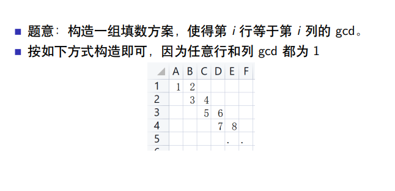

<div align="center"></div>

```cpp
#include <bits/stdc++.h>
using namespace std;
const int MAX = 4e6 + 100;
typedef long long ll;
typedef unsigned long long ull;
const ll mod = 998244353;
const ll inf = 0x3f3f3f3f3f3fll;
void solve();

int main()
{
	// ios::sync_with_stdio(false);
	// cin.tie(0), cout.tie(0);
	// clock_t c1 = clock();
#ifdef LOCAL
	freopen("in.in", "r", stdin);
	freopen("out.out", "w", stdout);
#endif
	// int T;
	// for(cin >> T;T--;)
	solve();

	// cerr << "Time Used: " << clock() - c1 << " ms\n";
	return 0;
}


void solve()
{
	int n,k;
	cin >> n >> k;
	set<pair<int,int>> st;
	ll x = 1,cnt = 0;
	for(int i = 1;i <= n;++i)
	{
		cout << i << ' ' << x << '\n';
		st.insert({i,x});
		(x %= n)++;
		cout << i << ' ' << x << '\n';
		st.insert({i,x});
		cnt += 2;
	}
	for(int i = 1;i <= n;++i)
	{
		for(int j = 1;j <= n;++j)
		{
			if(cnt == k)return;
			if(st.find({i,j}) == st.end())
				cout << i << ' ' << j << '\n',cnt++;
		}
	}
}
```