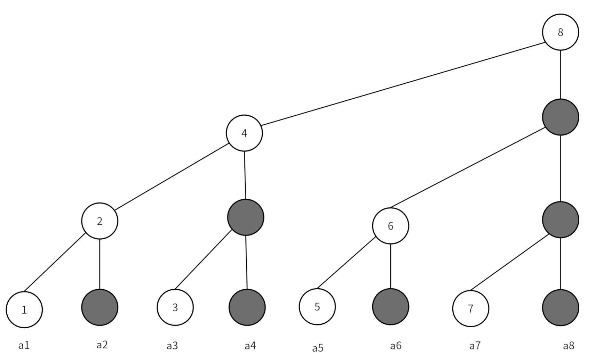
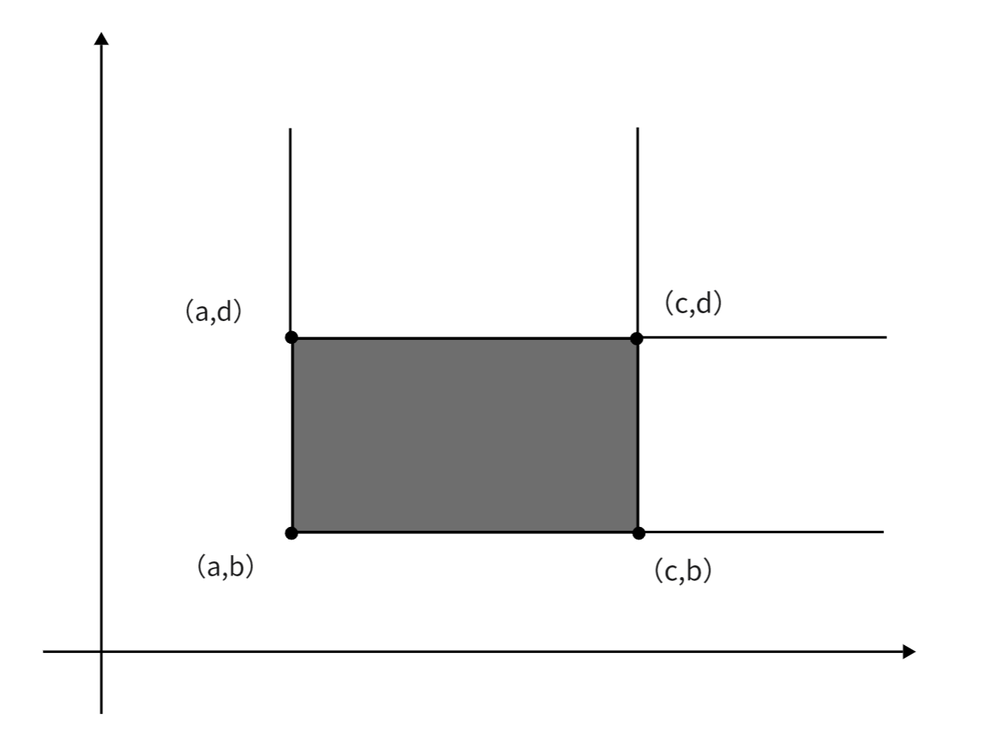

## **定义**

树状数组是利用数的二进制特征进行检索的一种树状的结构。它用于维护前缀和的数据结构，支持单点修改、区间查询；区间修改、区间查询等一系列操作。
树状数组维护的元素要满足**结合律**和**可差分**的性质。

# **树状数组**

给定一个数组$\{a_1,a_2\dots ,a_8 \}$，我们如何快速的求其前缀和呢？
一般我们求前缀和就是累加，时间复杂度是$O(n)$，一种容易想到的分治的优化策略是，对数组中的元素两两求和并且存到新的数组中，一直这样计算下去直到新数组中只有一个元素，如下：

 <div align=center></div>

这样就优化成线段树了，求前缀和、修改元素值的复杂度就都是$O(\log n)$了，但是对于求前缀和有很多元素是多余的，如：我们要求$a_1$到$a_4$的前缀和，只需要用到$a_4$的父节点，并不需要`$a_4$其本身。我们将类似的节点都删掉，就得到树状数组：

 <div align=center></div>

图中黑色节点都是被删除的节点，这样空间复杂度就优化为$O(n)$了，我们可以直接将节点值存到一个数组中。但是问题来了，我们该怎么在数组中正确快速的求前缀和呢？这就要用到大名鼎鼎的$lowbit$函数了

## **$lowbit$函数**

我们将每个节点下标对应的二进制形式写出来，就能看出一些规律：

 <div align=center></div>

*   每个节点覆盖的长度是其二进制表示下的最低位$1$及其后面的$0$构成的数值
*   每个节点的父节点的下标就是在其二进制的最低位$1$加上$1$。

那么实现树状数组的就归结到一个关键问题：如何快速找到一个数二进制表示下最低位$1$及其后面的$0$构成的数值。这也就是$lowbit$函数的功能。
<br>
<br>

我们举个例子：求$lowbit(10)$

我们先将$10$的二进制位写出来$(1010)_2$，在对其按位取反得到$(0101)_2$，再加上$1$，就得到$(0110)_2$，我们对比两个二进制数，发现除了最低位$1$及其后面的$0$，两个数字其他位上的数完全不同，我将两个数进行按位与&运算，就得到$lowbit$值了。

我们再思考，按位取反再加$1$，这不就是负数补码的运算过程吗，所以我们直接将该数取负再按位与即可得到$lowbit$的值，下面是代码：

```cpp
inline int lowbit(int x) 
{
    return x & -x;
}
```

所以节点$x$覆盖的长度就是其$lowbit(x)$的值，其父节点下标就是$x+lowbit(x)$

## **实现**

### **单点修改，区间查询**

[【模板】树状数组 1](https://www.luogu.com.cn/problem/P3374)

最简单的树状数组可以在$O(\log n)$的复杂度实现这两种操作

### **单点修改**

我们修改某一位置的值，就将覆盖其的父节点的值都进行修改，将节点$x$加上$d$的实现如下：

```cpp
inline void update(int x, int d) 
{
    for (; x <= n; x += lowbit(x))
        f[x] += d;
}
```

### **区间查询**

我们要求区间$[l,r]$的和，其实就是$sum(r)-sum(l-1)$，$sum(x)$代表下标从$1$到$x$的前缀和，查询某个点的前缀和就是树状数组擅长的，就是从这个节点开始，向坐上找到上一个节点，并加上其节点的值，可以发现向左上找上一个节点，只需要将下标减去当前下标的$lowbit$值，下面是实现代码：

```cpp
inline int ask(int x) 
{
    int sum = 0;
    for (; x >= 1; x -= lowbit(x))
        sum += f[x];
    return sum;
}
//求区间[l,r]的和
//ask(r)-ask(l-1);
```

### **区间修改，单点查询**

[【模板】树状数组 2](https://www.luogu.com.cn/problem/P3368)

### **区间修改**

我们只需一个简单而巧妙的操作，就能利用树状数组高效的实现区间修改，这个操作就是差分数组，我们用树状数组维护原数组的差分数组，这样我当我们要修改某个区间的值时，只需要修改两个端点即可。

```cpp
void update(int x,int d)
{
    for(int i=x;i<=n;i+=lowbit(i))
        f[i]+=d;
}
void change(int x,int y,int k)
{
    update(x,k);
    update(y+1,-k);
}
```

### **单点查询**

众所周知，差分的逆运算是求前缀和，树状数组计算的就是前缀和，用树状数组维护差分数组，那么树状数组计算得到就是单点的元素值，即$ask(x)=a[x]$，所以单点查询和上面的查询实现相同：

```cpp
int ask(int x)
{
    int sum=0;
    for(int i=x;i>=1;i-=lowbit(i))
        sum+=f[i];
    return sum;
}
```

### **区间修改，区间查询**

[【模板】线段树 1](https://www.luogu.com.cn/problem/P3372)

### **区间查询**

我们要利用树状数组求区间和，首先要求前缀和$sum(k)$，这里我们定义差分数组$d$，它和原数组的关系是$a[k]=d[1]+d[2]+\cdots+d[k]$，$d[k]=a[k]-a[k-1]$，下面推导前缀和与差分数组的关系：

$$
\begin{align*}
&a_1+a_2+\cdots + a_k\\
~\\
=&d_1+(d_1+d_2)+\cdots +(d_1+d_2+\cdots +d_k)\\
~\\
=&kd_1+(k-1)d_2+\cdots +(k-(k-1))d_k\\
~\\
=&k(d_1+d_2+\cdots +d_l)-(d_2+2d_3+\cdots +(k-1)d_k)\\
~\\
=&k\sum_{i=1}^{k} d_i-\sum_{i=1}^{k}(i-1)d_i
\end{align*}
$$

公式最后一行是求两个前缀和，可以用两个树状数组分别来维护，这样就可计算出前缀和$sum(x)$，区间和也就很好计算了，下面是实现：

```cpp
int ask1(int x)
{ 
    int sum = 0; 
    for (; x > 0; x -= lowbit(x))
        sum += f1[x];
    return sum; 
}
int ask2(int x)
{ 
    int sum = 0; 
    for (; x > 0; x -= lowbit(x))
        sum += f2[x]; 
    return sum; 
}
int ask(int l, int r) 
{
    return r * ask1(r) - ask2(r) - (l - 1) * ask1(l - 1) + ask2(l - 1);
}
```

### **区间修改**

区间修改时，两个数组要同时修改，实现方式和上面相同。

维护$\sum_{i=1}^{k}(i-1)d_i$时，对$k$位置增加$d$时，$f[k]$变为$(k - 1)(d_k+d)$，将其拆开得到，$(k-1)d_k+(k-1)d$，所以在修改后者时，我们要修改的值变为$(i-1)d$，下面时具体实现:

```cpp
void update1(int x, int d) 
{ 
    for (; x <= n; x += lowbit(x))
        f1[x] += d; 
}
void update2(int x, int d) 
{ 
    for (; x <= n; x += lowbit(x))
        f2[x] += d; 
}
void change(int l, int r, int d)
{
    update1(l, d), update1(r + 1, -d);
    update2(l, (l - 1) * d), update2(r + 1, -r * d);
}
```

# **树状数组扩展**

## **二维树状数组**

二维树状数组，也被称作**树状数组套树状数组**，用来维护二维数组上的单点修改和前缀信息问题。其实就是一维树状数组上的每个节点变成了一个一维树状数组：

 <div align=center></div>

基本的二维树状数组可以实现单点修改，子矩阵查询

### **单点修改**

修改一个矩阵的值后，我们要将其父节点都修改，例如我们要修改上图的$f[2][2]$元素，那么我们同时也要修改$f[2][5]、f[5][2]、f[5][5]$，这些节点，实现如下：

```cpp
void update(int x,int y,int d)
{
    for(int i=x;i<=n;i+=lowbit(i))
        for(int j=y;j<=m;j+=lowbit(j))
            f[i][j]+=d;
}
```

时间复杂度为$O(\log n\log m)$

### **子矩阵查询**

现在我们可以求$\sum_{i=1}^{n}\sum_{j=1}^{m}a[i][j]$的值，要我们计算下图中黑色矩阵的值

 <div align=center></div>

很明显，计算黑色矩阵的面积有下面的公式：

$$
\sum_{i=x_2}^{x_1}\sum_{j=y_2}^{y_1}a[i][j]=\sum_{i=1}^{x_1}\sum_{j=1}^{y_1}a[i][j]-\sum_{i=1}^{x_2-1}\sum_{j=1}^{y_1}a[i][j]-\sum_{i=1}^{x_1}\sum_{j=1}^{y_2-1}a[i][j]+\sum_{i=1}^{x_2}\sum_{j=1}^{y_2}a[i][j]
$$

有了公式代码也就很容易写了：

```cpp
int ask(int x,int y)
{
    int sum=0;
    for(int i=x;i>0;i-=lowbit(i))
        for(int j=y;j>0;j-=lowbit(j))
            sum+=f[i][j];
    return sum;
}
int ask(int x1,int y1,int x2,int y2)
{
    return ask(x1,y1)-ask(x1,y2-1)-ask(x2-1,y1)+ask(x2,y2);
}
```

时间复杂度为$O(\log n\log m)$

### **二维树状数组进阶**

[上帝造题的七分钟](https://www.luogu.com.cn/problem/P4514)
该题要我们实现二维树状数组的子矩阵修改和子矩阵查询

### **子矩阵修改**

和一维类似的，这里也要用到差分的思想，使用二维差分，我们定义一个二维差分数组$d[i][j]$，它与原矩阵元素$a[i][j]$的关系如下：

$$
d[i][j]=a[i][j]-a[i][j-1]-a[i-1][j]+a[i-1][j-1]\\
~\\
a[x][y]=\sum_{i=1}^{x}\sum_{j=1}^{y}d[i][j]
$$

现在，假设我们要在顶点为$(a,b)、(c,d)$的矩阵内的每个元素加上$k$，如下图

 <div align=center></div>

因为我们维护的是差分数组，所以我分别修改四个顶点即可完成对区间的修改，实现如下：

```cpp
void update(int x,int y,int d)
{
    for(int i=x;i<=n;i+=lowbit(i))
        for(int j=y;j<=m;j+=lowbit(j))
            f[i][j]+=d;
}
void update(int x1,int y1,int x2,int y2,int k)
{
    update(x1,y1,k),update(x1,y2+1,-k),
    update(x2+1,y1,-k),update(x2+1,y2+1,k);
}
```

### **子矩阵查询**

与一维数组类似的，我们求一个子矩阵的和有下面的式子：

$$
\sum_{i=x_2}^{x_1}\sum_{j=y_2}^{y_1}a[i][j]=\sum_{i=1}^{x_1}\sum_{j=1}^{y_1}a[i][j]-\sum_{i=1}^{x_2-1}\sum_{j=1}^{y_1}a[i][j]-\sum_{i=1}^{x_1}\sum_{j=1}^{y_2-1}a[i][j]+\sum_{i=1}^{x_2}\sum_{j=1}^{y_2}a[i][j]
$$

问题就转换为计算$\sum_{i=1}^{n}\sum_{j=1}^{m}a[i][j]$，与推一维数组区间查询类似，我们利用原数组的与差分数组之间的关系进行变换，下面是推导过程：

$$
\begin{align*}
 &\sum_{i=1}^{n}\sum_{j=1}^{m}a[i][j]\\
= &\sum_{i=1}^{n}\sum_{j=1}^{m}\sum_{k=1}^{i}\sum_{l=1}^{j}d[k][l]\\
 =&\sum_{i=1}^{n}\sum_{j=1}^{m}d[i][j]\times (n-i+1)\times (m-j+1)\\
=&(n+1)(m+1)\sum_{i=1}^{n}\sum_{j=1}^{m}d[i][j]-(m+1)\sum_{i=1}^{n}\sum_{j=1}^{m}d[i][j]\times i\\
&(n+1)\sum_{i=1}^{n}\sum_{j=1}^{m}d[i][j]\times j+\sum_{i=1}^{n}\sum_{j=1}^{m}d[i][j]\times i\times j
\end{align*}
$$

我们可以用四个二维树状数组来分别维护上面四个二维前缀和，下面是实现：

```cpp
int ask(int x,int y)
{
    int sum=0;
    for(int i=x;i>0;i-=lowbit(i))
        for(int j=y;j>0;j-=lowbit(j))
            sum+=(x+1)*(y+1)*f[0][i][j]-(y+1)*f[1][i][j]-(x+1)*f[2][i][j]+f[3][i][j];
    return sum;
}

int ask(int x1,int y1,int x2,int y2)
{
    return ask(x2,y2)-ask(x1-1,y2)-ask(x2,y1-1)+ask(x1-1,y1-1);
}
```


-------
参考文章：<br>
[OI Wiki](https://oi-wiki.org/ds/fenwick/)<br>
《算法竞赛-上册》-罗永军<br>
[B站〔manim | 算法 | 数据结构〕 完全理解并深入应用树状数组](https://www.bilibili.com/video/BV1pE41197Qj/?spm_id_from=333.337.search-card.all.click&vd_source=0de771c86d90f02a6cab8152f6aa173f)
