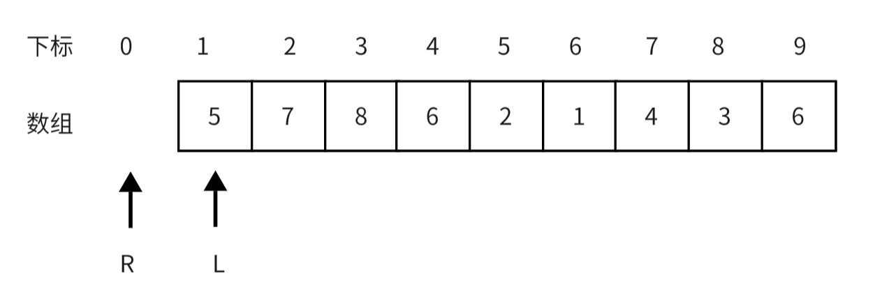
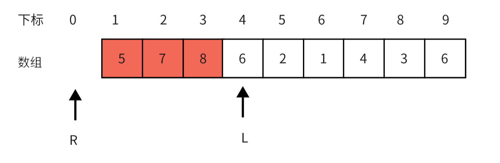
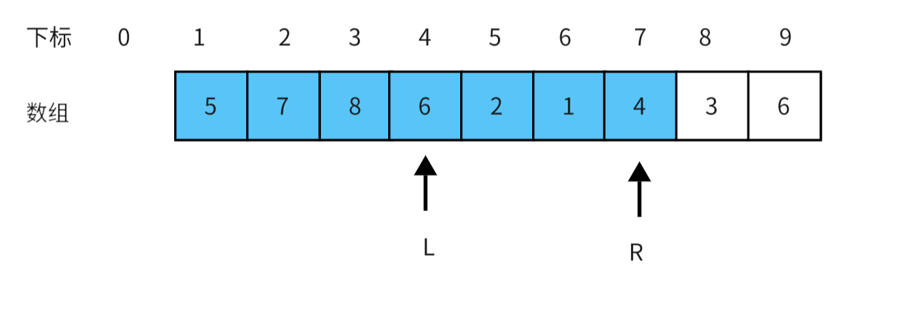
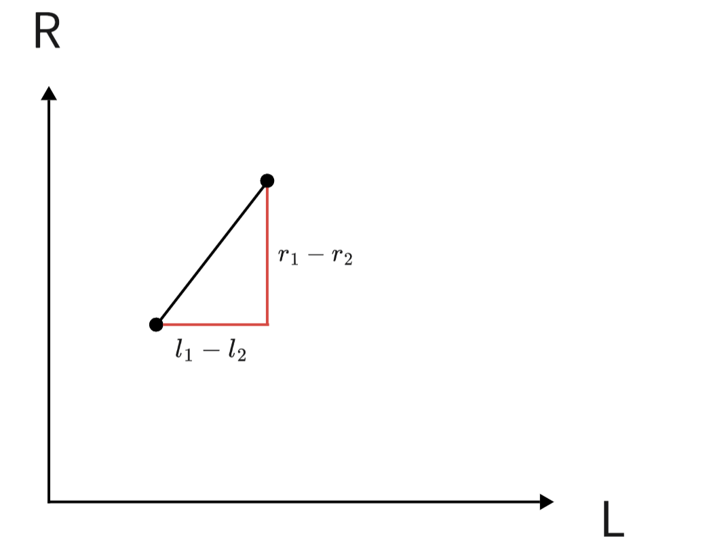
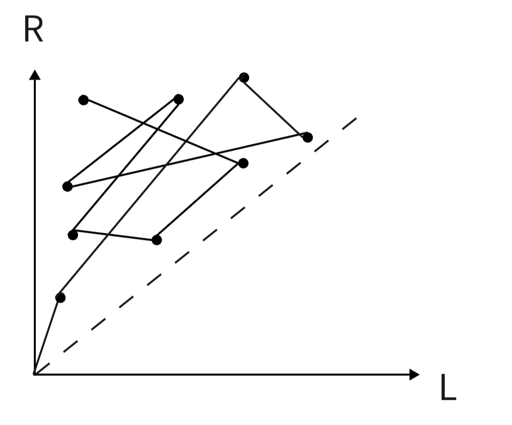
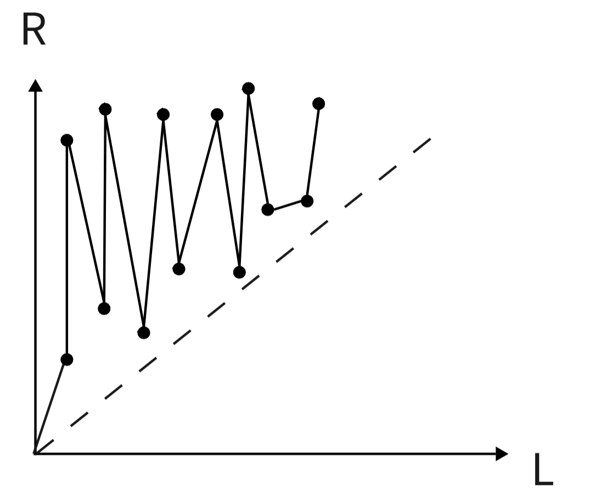
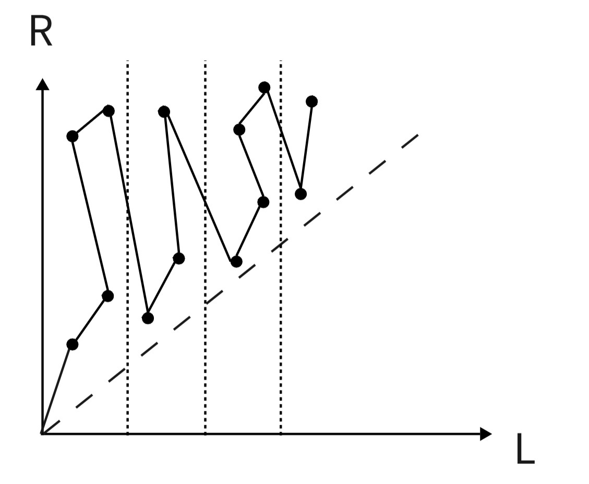

## **引入**

>其实，分块是一种思想，而不是一种数据结构。
分块的基本思想是，通过对原数据的适当划分，并在划分后的每一个块上预处理部分信息，从而较一般的暴力算法取得更优的时间复杂度。              —— **OI Wiki**

面对区间问题，有树状数组，线段树等算法。给定一个长度为$n$的数组，做$m$次区间修改和区间查询。分块算法可以用$O(m\sqrt n)$的复杂度实现操作，比树状数组和线段树慢，但是容易理解。


# **分块算法思路**

我们都知道线段树是一颗高度为$\log n$的二叉树，而分块数组可以看作是一个高度为$3$的树：

<div align=center></div>


我们以最典型的区间操作区间和为例：[P3372](https://www.luogu.com.cn/problem/P3372)


我们将整个数组分为$t$块，每块长度为$block$，$st[i]$表示第$i$块的开始位置，$ed[i]$表示第$i$块的结束位置，$add[i]$表示对第$i$个块整个加的数，$pos[i]$表示第$i$个元素所在的块，$sun[i]$表示第$i$块的区间和。

$block$取$\sqrt n$时有比较好的时间复杂度，之后会具体分析。我们对上述变量进行简单的初始化，即实现对数组的分块。

```cpp
void init()
{
    block = sqrt(n);                        //块大小
    t = (n + block - 1) / block;            //块的个数 
    for (int i = 1; i <= n; ++i)
    {
        pos[i] = (i + block - 1) / block;   //第i个元素所在块
        sum[pos[i]] += a[i];                //sum维护区间和
    }
    for (int i = 1; i <= t; ++i)
    {
        ed[i] = i * block;
        st[i] = (i - 1) * block + 1;
        add[i] = 0;
    }
    ed[t] = n;                              //最后一个块可能不是整块
}
```

分块的区间和，区间修改都非常简单，我们能操作的只有整块和块内的个别元素。对整块的修改直接修改$add$数组即可，对块内个别元素的修改暴力即可。

```cpp
// 区间修改
void update(int l, int r, ll d)
{
    int p = pos[l], q = pos[r];
    // 修改区间在同一个块内
    if (p == q)
    {
        sum[p] += (r - l + 1) * d;
        for (int i = l; i <= r; ++i)
            a[i] += d;
    }
    else
    {
        // 修改整块
        for (int i = p + 1; i <= q - 1; ++i)
            add[i] += d;  //整块增加了d
        // 修改左边多余部分
        for (int i = l; i <= ed[p]; ++i)
            a[i] += d,sum[p] += d;
        // 修改右边多余部分
        for (int i = st[q]; i <= r; ++i)
            a[i] += d,sum[q] += d;
    }
}
```
区间查询同理，操作整块和边界的块内元素即可。


### **时间复杂度分析**

线段树一次操作的复杂度是树的高度，而分块一次操作的复杂度取决于块的大小，我们可以写出一次操作进行的运算次数为$n/block+\Theta(block)$，当$block$取$\sqrt n$是达到最小值。


# **基础莫队**

**莫队算法=离线+分块+暴力**

在线算法是交互式的，一问一答，前面的答案会应用于后面的答案的询问的，被称作强制在线；离线算法则是一次读取所有的查询，然后一起回答。因为离线算法因为有条件考虑所有查询，所以能够得到效率更高的算法。

基础的莫队算法是一种离线算法，他常用于不修改只查询的区间问题。复杂度为$O(n\sqrt{n})$，效率没有线段树，树状数组高，但是易于理解编码简单。

我们以一道区间不同值个数的题目为例：[P1972HH的项链](https://www.luogu.com.cn/problem/P1972)

## 暴力法

我们用滑动窗口的思想，来解决这个问题，把每个查询$[l_i,r_i]$看作一个窗口，我们要做的就是对于每一次查询就将当前的窗口$[L,R]$移动到对应查询的位置。

对于该题我们用$cnt[]$数组记录当前窗口中每个数出现的个数。

在这个过程中当$L$指针向右扫过的位置，就把他出现的次数$cnt[x_L]-1$，$R$指针向右扫过的位置，就把他出现的次数$cnt[x_R]+1$；向左扫过时，与上述情况相反。

当$cnt[x]$从$0$变为$1$的时候说明滑动窗口多了一个新的数字，我们就要给答案$ans$加$1$，如果$cnt[x]$从$1$变为$0$说明窗口内少了一个数字就要给答案$ans$减$1$。

### 过程

初始时我们维护的滑动窗口没有元素

<div align="center"></div>

如果我们下一个要查询寻的区间是$[4,7]$，我们这时就要移动滑动窗口的左右端点

#### 移动左端点

<div align="center"></div>

在这个过程中$cnt[5],cnt[7],cnt[8]$都对应减$1$

#### 移动右端点

<div align="center"></div>

在这个过程中$cnt[5],cnt[7],cnt[8],cnt[6],cnt[2],cnt[1],cnt[4]$都加$1$

在这两个过程中更新不断$ans$的值，移动完成值$ans$就是对应查询的答案。

### 统计多个区间

按照上面的过程，我们可以在每次查询时，移动$L,R$指针即可。

但是这样做，在一些情况下复杂度非常高，比如第一个查询的区间时$[1,1]$，下一个查询是$[n,n]$，这样左右指针都需要扫过整个数组，这样循环往复的询问，复杂度是$O(n^2m)$。

莫队算法就是对暴力法的这个问题进行优化


## 莫队算法

### 暴力法的几何解释

我们将区间$[L,R]$的左右端点看成一个点的横纵坐标。

那么我们在从一个区间移动到另一个区间时，其实就是从一个点移动到另一个点，对应的花费就是两点间的曼哈顿距离


<div align="center"></div>

我们将所以的查询都抽象成点，放到坐标轴里观察，上面的问题其实转化为我们从原点开始，我们要不重不漏的走完这些点，走到一个点就记录一个点的答案。

那么我对算法的优化就是，如何能用尽可能短的曼哈顿距离，去完成上述任务，即求哈密顿最短路径问题，这是$NP$问题，没有多项式复杂度的解法。

我们要做的就是找到一个较优解。

可以看出，这个问题如果是在线查询的话，访问每个节点的顺序是随机的

<div align="center"></div>

访问时可能会一会儿上一会儿下，一会儿左一会儿右，走很多重复的路，导致时间复杂度很高。


所以我们要离线处理这些查询，离线时可以以一个更好的顺序去处理它们。


### 朴素优化

我们对区间一般的排序方式就是按左端点进行排序，左端点相同就按右端点排。这样可以减少横坐标的重复移动

<div align="center"></div>

但是这样从坐标的振荡幅度右很大，复杂度还是很离谱。

### 莫队算法

莫队的排序方式是先把数组下标区间分块，左端点按其所在的块排，左端点所在块相同，按右端点排。

<div align="center"></div>

这样虽然左右仍然有震荡，但是震荡幅度被保持再来$\sqrt{n}$内，是可以接受的。

还有一点可以优化。我们很容易可以发现，在块间移动时，也有可能会有很大的震动，所以在排序时可以使用奇偶性排序，让奇数块和偶数块采用相反的对右端点的排序。


<div align="center"></div>

莫队算法的核心思想就是分块，他把震荡限制在了$\sqrt{n}$，缩短了路径长度，提高了效率。

### 块大小划分

块的大小对莫队算法的效率有很大的影响，有些题目只有正确划分块的大小才能通过。

下面我们设数组长度为$n$，查询$m$次，块长为$t$

那么总共块的个数就是$\frac{n}{t}$，每个块都要遍历整个数组长度，移动次数为$\frac{n^2}{t}$，每次移动有左右的震荡，但幅度不超过$t$，所以移动距离再加上$mt$。可以推出最后复杂度为:
$$
O(\frac{n^2}{t} + mt)
$$

这个函数形式很熟悉，对勾函数（形如：$f(x)=ax+\frac{b}{x}$的函数，当$x=\sqrt{\frac{b}{a}}$时取极值），所以当$t=\frac{n}{\sqrt{m}}$时时间复杂度是最优的，是$O(n\sqrt{m})$。


-----------------------
参考文章：
[Oi-Wiki 普通莫队算法](https://oi-wiki.org/misc/mo-algo/#%E6%99%AE%E9%80%9A%E8%8E%AB%E9%98%9F%E7%9A%84%E4%BC%98%E5%8C%96)
[百度百科-对勾函数](https://baike.baidu.com/item/%E5%AF%B9%E5%8B%BE%E5%87%BD%E6%95%B0/92025)
《算法竞赛》上册 - 罗永军