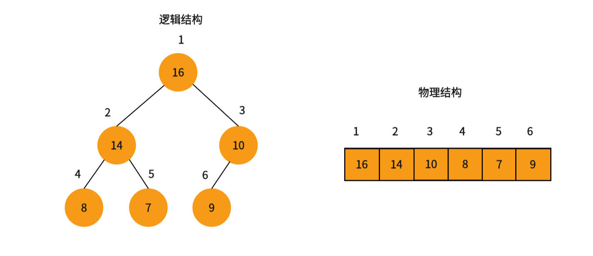
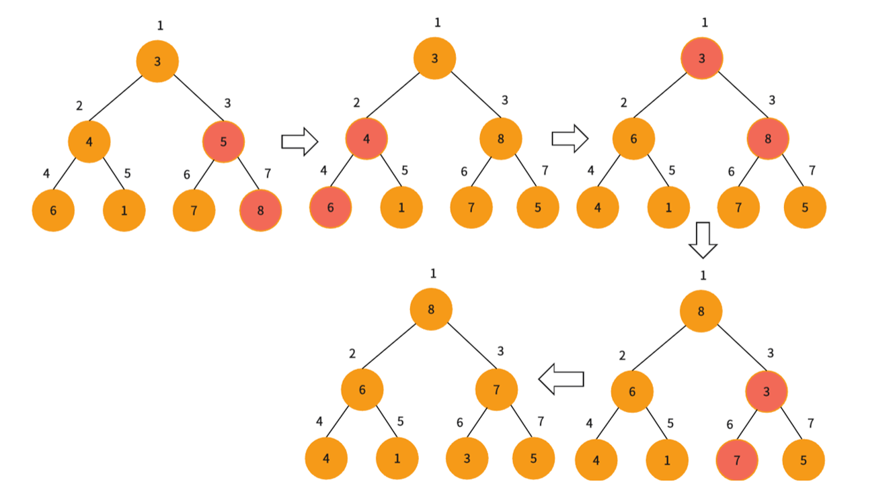

## 定义
二叉堆是一个可以被看做一棵树（完全二叉树）的数组对象。并且堆总是满足下面两条性质：
- 堆中某个节点的值总是不大于或不小于其父节点的值
- 堆总是一棵完全二叉树


## 逻辑结构&物理结构

<div align="center"></div>

根据节点的标号和下标，我们可以看出一定的规律，这样给定一个数组的下标$i$，我们可以很容易的的计算得到它的父节点和左右孩子：
$$
left=2i\\
~\\
right=2i+1\\
~\\
parent=\left \lfloor \frac{i}{2} \right \rfloor
$$
本文实现的堆都是以下标从$1$开始来实现的，从$0$开始大同小异。
## 堆的分类
根据堆不同的堆序性可以将堆分为大堆和小堆
在大堆中，堆满足最大堆性质，即除了根以外的所有节点$i$都要满足：
$$
a[parent(i)]\ge a[i]
$$

在小堆中，堆满足最小堆性质，即除了根以外的所有节点$i$都要满足：

$$
a[parent(i)]\le a[i]
$$

## 堆的实现
### 建堆
建堆需要依靠向下调整算法来实现
#### 向下调整算法
向下调整算法成立的前提是，左右子树都满足大堆（小堆）的性质
该算法的输入是数组$arr$和可能不满足大堆（小堆）性质的节点$i$，算法通过让$arr[i]$的值在大堆中逐级下降，从而使得以$i$为根节点的堆，重写遵循大堆的性质。下面是向下调整算法的运行过程：
<div align="center"></div>

##### 实现
这里以实现大堆为例，通过与左右子节点中的较大值值进行比较，来判断是否满足堆序性，不满足对序性就将根节点的值与子节点进行交换。重复此过程，直到满足对序性或到达叶子节点就停止算法。
```cpp
void Heap::AdjustDown(int* arr,int i,int n) {
    int maxc = i << 1;//找到子节点
    while (maxc <= n) {
        //选出两个子节点中大的那一个
        if ((maxc | 1) <= n && arr[maxc] < arr[maxc | 1])
            maxc |= 1;
        //不满足大堆性质，就将二者交换
        if (arr[i] < arr[maxc]) {
            swap(arr[i], arr[maxc]);
            i = maxc, maxc = i << 1;
        }
        else break;
    }
}
```
时间复杂度为$O(\log n)$
#### 建堆思路
明白的向下调整算法我们就可以进行建堆了。

具体思路是用自底向上的方法，利用向下调整算法，把一个无序的满二叉树转化为大堆（小堆）。

树中每一个叶节点都可以看成只包含一个元素的大堆（小堆），我们只需要从最后一个非叶子节点开始到根节点都调用一次向下调整算法，即可。

下面是建堆的过程：
<div align="center"></div>

##### 实现
```cpp
void Heap::BuildHeap(int* arr,int n){
    for(int i=n>>1;i>=1;--i)
        AdjustDown(arr,i,n);
}
```
建堆的时间复杂度为$O(n)$，证明见算法导论第三版$P88$


## 堆的应用
### 堆排序
排序开始前，我们首先要将输入的数组$arr$根据要排的顺序建立大堆，堆中的数据起初有$n$个元素（即数组元素个数），每次我们将根节点$arr[n]$与$arr[1]$交换，然后去掉节点$n$，再对根根节点调用向下调整算法，这样就在$[1,n-1]$的范围内右构造了一个新的大堆，同时完成了一个元素的排序。堆排序就是不断重复这个过程，直到堆中只剩一个元素时，就将整个数组排好序了。

下面是排序一个元素的过程：
<div align="center"></div>

#### 实现
```cpp
void Heap::HeapSort(int* arr,int n){
    //建堆
    //时间复杂度O(n)
    BuildHeap(arr,n);
    //排序
    //时间复杂度O(nlogn)
    for(int i=n;i>1;--i){
        swap(arr[1],arr[i]);
        AdjustDown(arr,1,i-1);
    }
}
```
时间复杂度为:$O(n\log n)$
### 优先队列
这里对堆进行简单的实现，在解题时不需要自己手写，直接调用$STL$库中的优先队列$priority\_queue<typename>$即可。

和堆一样，优先队列也有两种形式：最大优先队列和最小优先队列。这里我们先关注如何基于大堆实现最大优先队列。最大优先队列支持以下操作：
```cpp
class PriorityQueue {
    vector<int> arr{ 0 };
    int n = 0;//元素个数
    void AdjustDown(int i);//向下调整算法
    void AdjustUp(int i);//向上调整算法
public:
    void push(int x);//插入值x
    int pop();//删除并返回最大值
    int top();//返回最大值，即堆顶元素
    int size() { return n; }//返回元素个数
    void clear() { n = 0; arr.resize(1); }//清空队列
};
```
#### 插入
实现插入操作需要向下调整算法
##### 向下调整算法
和向下调整算法一样，向上调整算法成立的前提是左右子树都满足大堆（小堆）的性质，算法的输入同样是数组  $arr$ 和下标$i$，与向下调整算法不同的是，向上调整算法是通过让$arr[i]$的值在大堆中“逐级上升”，从而使得以$i$为根节点的子树重新遵循大堆的性质。

因为与向上调整算法类似，这里直接给出实现：
```cpp
void PriorityQueue::AdjustUp(int i) {
    //找父节点
    int p = i >> 1;
    //运行到根节点为止
    while (i > 1) {
        //不满足大堆性质就就换其值
        if (arr[i] > arr[p]) {
            swap(arr[p], arr[i]);
            i = p, p = i >> 1;
        }
        else break;
    }
}
```
时间复杂度为$O(\log n)$
##### 插入实现
了解了向上调整算法插入就非常简单了，就是在堆的末尾加上要插入的数字，然后对其调用向上调整算法，找到其满足堆性质的位置。
```cpp
void PriorityQueue::push(int x) {
    arr.push_back(x);
    n++;
    AdjustUp(n);
}
```
时间复杂度$O(\log n)$

#### 删除
优先队列只能删除堆顶元素。

删除就和堆排序的排序过程相同，先将根节点与最后一个元素位置交换，然后删除末尾元素，在对根节点调用向下调整算法即可。
##### 删除实现
```cpp
int PriorityQueue::pop() {
    if (n == 0) {
        cout << "heap underflow\n";
        exit(-1);
    }
    int maxres = arr[1];
    swap(arr[1], arr[n]);
    arr.pop_back();
    n--;
    AdjustDown(1);
    return maxres;
}
```
时间复杂度$O(\log n)$


