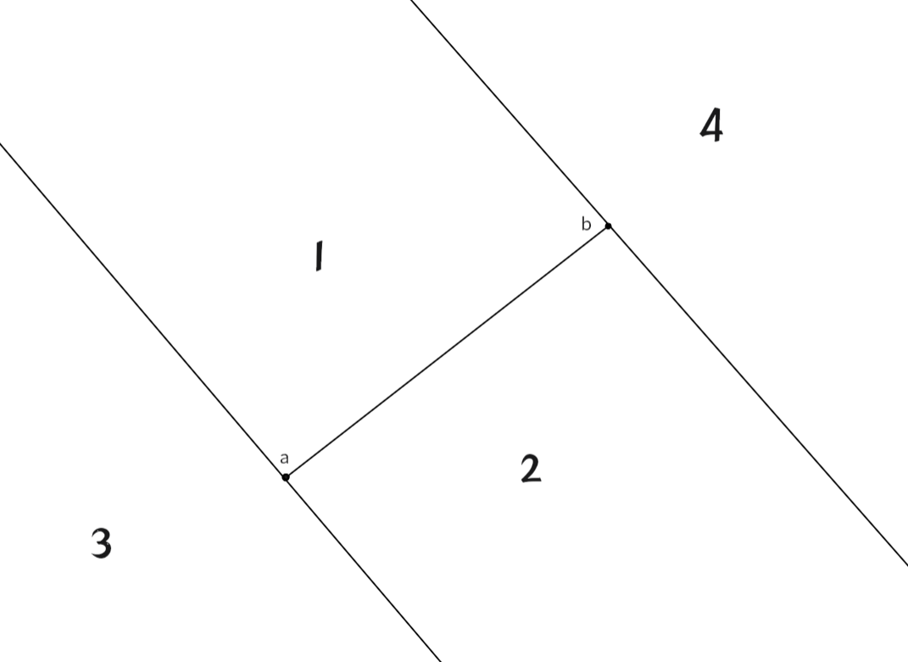

# 二维计算几何

## 点

平面直角坐标系下的点，一般用一个结构体来维护其横纵坐标 $x,y$。与其说是点，不如说它是一个二维向量。因为我们常常会直接拿两个点做向量加减运算，得到我们想要的向量。

### 二维向量

由于向量的坐标表示与点相同，所以只需要像点一样存向量即可（当然点不是向量）。

#### 向量运算

##### 向量加减

就是向量坐标对应位置的值进行加减即可。
```cpp
// 向量+
p p::operator+(const p &a) const 
{ 
    return p{x + a.x, y + a.y}; 
}
// 向量-
p p::operator-(const p &a) const
{ 
    return p{x - a.x, y - a.y}; 
}
```

##### 点乘（内积）
我们知道点乘的结果是一个数，其几何意义为 $\vec{b}$ 在 $\vec{a}$ 上的投影与 $|\vec{a}|$ 的乘积。

计算公式：
$$
\vec{a}\cdot \vec{b}=|\vec{a}|\cdot|\vec{b}|\cos{\theta}
$$

换成坐标的形式，那么 $\vec{a}=(x_1.y_1)$，$\vec{b}=(x_2.y_2)$ 点乘就是对应坐标相乘：

$$
\vec{a}\cdot \vec{b}=x_1x_2+y_1y_2
$$

```cpp
// 我们将点乘重载为 | 符号
double p::operator|(const p &a) const 
{ 
    return x * a.x + y * a.y; 
} // 点乘
```

##### 叉乘（外积）
叉乘的结果是一个向量，其方向遵循右手法则。叉乘结果的模是由两个向量围成的平行四边的面积。

<div align="center"></div>

叉乘模的计算公式：

$$
\vec{a}\times \vec{b}=|\vec{a}||\vec{b}|\sin{\theta}
$$

换成坐标形式，那么 $\vec{a}=(x_1.y_1)$，$\vec{b}=(x_2.y_2)$ 叉乘就是坐标交叉相乘：

$$
\vec{a}\times \vec{b}=x_1xy_2-x_1y_2
$$

```cpp
double p::operator*(const p &a) const 
{ 
    return x * a.y - y * a.x; 
} // 叉乘
```

利用坐标在程序中运算点乘叉乘，对于我们判断几何位置关系时非常有用。

##### 向量取模

向量取模就是取向量的长度。我们可以将任何一个向量平移到远点，那么向量 $\vec{a}=(x,y)$ 的长度就是点 $(x,y)$ 到原点的距离。

$$
|a|=\sqrt{x^2+y^2}
$$

我们可以计算向量和自己的点乘再开平方即可


```cpp
// 向量取平方
double p::pow() const 
{ 
    return x * x + y * y; 
}                    
// 向量取模
double abs(const p &p) 
{ 
    return sqrt(p.pow()); 
}
```


### 点到点的距离

两个点之间的距离有两种定义法：**曼哈顿距离，欧式距离**。

#### 欧式距离
其中欧式距离（欧几里德距离）就是直线距离。点 $A(x_1,y_1),B(x_2,y_2)$ 的欧式距离为：

$$
|AB|=\sqrt{(x_1-x_2)^2+(y _1-y_2)^2}
$$

```cpp
// 点到点的欧式距离
double p::disPoint(const p &a) const
{
    return sqrt((x - a.x) * (x - a.x) + (y - a.y) * (y - a.y));
}
```


#### 曼哈顿距离

在二维空间内，两个点之间的曼哈顿距离为它们横坐标之差的绝对值与纵坐标之差的绝对值之和。点 $A(x_1,y_1),B(x_2,y_2)$ 的曼哈顿距离为：

$$
d(A,B) = |x_1-x_2|+|y_1-y_2|
$$

### 点到直线的距离

#### 公式法

已知直线 $l$ 方程为 $ax+by+c=0$，平面上任意一点 $(x_0,y_0)$ 到该直线距离 $d$ 为:

$$
d = \frac{|ax_0+by_0+c|}{\sqrt{a^2+b^2}}
$$

#### 向量法

我们也可以通过向量叉乘得到点到直线的距离公式。我们以点 $p$ 到直线 $ab$ 为例。我们可以通过坐标计算出向量 $\vec{ap},\vec{ab}$ 和它们叉乘的模。

因为叉乘的模是对应向量所围成平行四边形的面积，而$\left | \vec{ab} \right |$是底边长度，面积除以底就是高，就可以得到对应距离。
<div align="center"></div>

很容易就可以写出下面的公式：

$$
d=\frac{\left | \vec{ap}\times \vec{ab} \right | }{\left | \vec{ab}\right |}
$$

我们一般采用这个方法计算点到直线的距离 $d$ 。

```cpp
// 点到直线的距离
// a,b为直线上两点
double p::disline(const p &a, const p &b) const
{
    p ap = (*this) - a, ab = b - a;
    return abs(ap * ab) / abs(ab);
}
```

### 点到线段的距离

求点到线段的距离就要先判断点和线段的位置关系，才能计算点到线段的距离。

#### 点到线段的位置关系

首先我们设一个点 $p$ 和一个线段 $s_{a,b}$ ，其中 $a,b$ 是线段的端点。


我们可以将点和线段的位置关系分为以下四种，我们可以通过向量的点积叉积来判断具体位置关系：

<div align="center"></div>


我们很容易发现当点在$3，4$区域时，点和线段的夹角总是有一个钝角($\angle pab\space or \space \angle pba$)，我们可以通过计算这两个角的 $\cos$ 值的正负来判断他们中是否有钝角。余弦值计算公式可以由向量点积推导出来：

$$
\cos{\theta}=\frac{\vec{ab}\cdot \vec{ap}}{|\vec{ab}||\vec{ap}|}
$$

应为两个向量的模的乘积一定为整数，所以只需判断两个向量点积的正负。

判断完余弦正负后，如果两个角都是锐角，则点就可能在 $1$ 或 $2$ 区域，这时我们就要判断 $\angle{pab}$ 是正角还是负角，也就是判断 $\sin{\theta}$ 的正负。我们通过向量叉积可以推导出正弦的计算公式：

$$
\sin{\theta}=\frac{\vec{a}\times \vec{b}}{|\vec{a}||\vec{b}|}
$$

和余弦类似的，我们只需要计算两个向量的叉积的结果的正负即可。正数就在 $1$ 区域，负数在 $2$ 区域，为 $0$ 则在线段上。


#### 求点到线段的距离

判断完点和线段的位置关系之后，计算点到线段的距离就很简单了。

当点在$3，4$区域时，点到线段的距离就是到其端点的距离，在$1，2$区域时，点到线段的距离就是到对应直线的距离。套用上文的公式即可。

```cpp
// 点到线段的距离
// a,b线段两端点
double disSeg(const p &a, const p &b) const
{
    // 判断点和线段的位置关系
    if ((((*this) - a) | (b - a)) <= -eps || (((*this) - b) | (a - b)) <= -eps)
        return min(disPoint(a), disPoint(b));
    return disline(a, b);
}
```


### 利用向量求三角形面积
我们了解的三角形面积公式有
```math
\begin{cases}
s=\frac{ah}{2} \\
 s=\frac{ab\sin \theta }{2}\\
s=\sqrt[]{p(p-a)(p-b)(p-c)} ,(p=\frac{a+b+c}{2} )  
\end{cases}
```
而当给定三个顶点坐标$a=(x_1,y_1),b=(x_2,y_2),b=(x_3,y_3)$，求三角形面积，对计算机而言下面这个公式是最合适的：

$$
s=\frac{(x_2-x_1)(y_3-y_1)-(y_2-y_1)(x_3-x_1)}{2}
$$

众所周知，这个公式是由向量叉乘的来的，即我们求出向量$\vec{ab}，\vec{ac}$，二维向量叉乘的模的是以$ab，ac$为两条边，所围成的平行四边形面积，我们求得$ab，ac$，令其取二分之一即可得到上式

```cpp
double triangle(p &a, p &b, p &c) 
{ 
    return (b - a) * (b - c) / 2.0; 
} // 求三角形面积
```


---------------------

参考文章：

[Oi Wiki](https://oi-wiki.org/geometry/2d/#%E5%88%A4%E6%96%AD%E4%B8%80%E7%82%B9%E6%98%AF%E5%90%A6%E5%9C%A8%E4%BB%BB%E6%84%8F%E5%A4%9A%E8%BE%B9%E5%BD%A2%E5%86%85%E9%83%A8)

