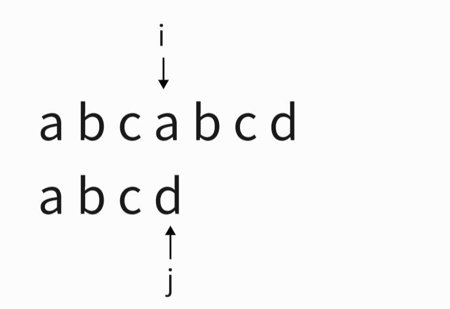
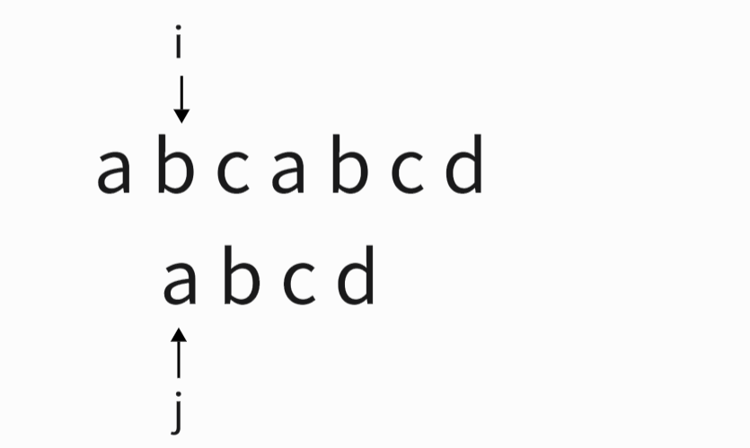

## **简介**
简介：$KMP$算法是$D.E.Knuth、J,H,Morris$ 和 $V.R.Pratt$发表的一个模式匹配算法，可以大大避免重复遍历的情况（即消除了主串指针回溯的），从而提高算法效率

## **朴素匹配算法**

给我们一个主串和模式串，要我们在模式串中找到主串出现的位置，比较容易想到的暴力这做法就是从主串的开头与模式串一一进行比较
<div align=center></div>

如果遇到字符不同，就将两个指针回退，重新开始匹配

<div align=center></div>

这样的问题也很明显，当模式串和主串中有大量重复字符时，算法的效率就会十分低下，如：模式串为：$aaaaaab$主串为$aaab$，每次匹配都要完整遍历主串，然会回溯到主串开头，继续下一次匹配，时间复杂度为$O(nm)$，$n$为模式串长度，$m$为主串长度。


KMP算法就是对此进行的优化，有效的减少了$j$指针无意义的回溯，


# **$KMP$算法思路**

## $next$数组求解

已经在之前的博客讲解过了，可以去看看：[$KMP$算法（$C$语言）——next数组的求解](https://blog.csdn.net/c661280411470yb/article/details/129975604)


## **$KMP$实现**
有了$next$数组，$KMP$就很好实现了，就是在两个串不匹配时，将主串指针回溯到$next$数组中计算出的位置即可。
```cpp
int kmp(string& p, string& s, int pos) {
    int i = pos, j = 0, cnt = 0;
    getNext(s);
    while (i < p.size()) {
        if (j == -1 || p[i] == s[j])
            ++j, ++i;
        else j = nex[j];
        if (j == s.size()) {
            cnt++;
            j = nex[j];
        }
    }
    return cnt;
}
```
## **$nextval$数组**

虽然现在的$next$数组对回溯有很大的优化，但是依然会出现一些无意义的回溯，如：

<div align=center></div>

我们回溯一次后是

<div align=center></div>


这一步是完全没有意义的，$B$已近不匹配了，前面的$B$一定是不匹配的。而导致这样的原因也很简单就是：$s[j]=s[next[j]]$，我们只要在求解$next$数组时加上一层判断即可。

```cpp
void getNext(string& s) {
    nex[0] = -1;
    int i = -1, j = 0;
    while (j < s.size()) {
        if (i == -1 || s[i] == s[j]) {
            if (s[++j] == s[++i])nex[j] = nex[i];
            else nex[j] = i;
        }
        else i = nex[i];
    }
}
```

-------------
参考文章:<br>
[KMP算法—终于全部弄懂了](https://blog.csdn.net/dark_cy/article/details/88698736)<br>
《大话数据结构》<br>
[B-站KMP算法易懂版](https://www.bilibili.com/video/BV1jb411V78H/?spm_id_from=333.337.search-card.all.click&vd_source=0de771c86d90f02a6cab8152f6aa173f)
