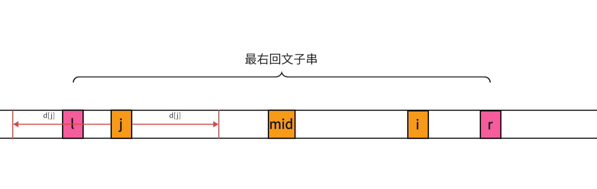

> 回文串定义：即正着看反着看都一样的字符串，如$aba、aaa、cac$，回文串可以分为奇回文串和偶回文串，$abba$就是一个偶回文串，$aba$就是一个奇回文串

## **求最长回文串的其他思路**
[例题 -【模板】manacher 算法](https://www.luogu.com.cn/problem/P3805) 
求最长回文子串的方法，最容易想到的就是暴力枚举，将所有的回文子串都找出来，然后找做大的，时间复杂度就相当高了$O(n^3)$。

还有比较容易想到的就是区间$dp$，想法就是$S[i]$到$S[j]$是回文串的前提是$S[i+1]$到$s[j-1]$是回文串，是区间$dp$时间复杂度就是$O(n^2)$，对于暴力枚举来说有所优化。

还有另一种枚举的方法，是中心扩散法，利用了回文串的对称性，枚举每一个字符，然后从中心向两边比较，时间复杂度也为$O(n^2)$

今天介绍的这个算法可以将时间复杂度降到线性的$O(n)$。

# **Manacher算法思路**

马拉车算法充分利用了回文串的对称性和之前遍历过的区间。算法的主要思路是维护一个最右回文子串，利用该区间的对称性，计算当前遍历位置为中心的回文半径，回文半径就是从中心（如果为奇回文串，就包含中心位置）到回文串一端的距离。

我们设有字符串$S$，$S[l\dots r]$为串$S$中区间为$[l,r]$的子串，$S[i]$表示串$S$中第$i$个字符，我们用$d[i]$表示以第$i$个字符为中心的回文半径。为了便于理解我们这里先只考虑奇回文串。

我们现在维护一个最右回文子串$S[l\dots r]$，设该回文串的中心是$S[mid]$，设这个回文子串的回文半径为$d[mid]$。那么我们要求的当前位置的回文半径$d[i]$就要有下的几种情况

## **$i$在$[l,r]$的范围内**

我们假设$j$为$i$关于$mid$的对称点，对应$j$又有三种情况

- ### **以$j$为中心的回文子串在$[l,r]$内**

 

根据回文串的对称性，我们很容易就可以知道$d[i]=d[j]$

- ### **以$j$为中心回文子串有部分在最右回文子串的外面**

显而易见的，$j-l=r-i=c$，$[j-c,j+c]$ 可以由$mid$对称到$i$，所以$[i-c,i+c]$是回文子串，那么以$i$为中心的回文半径还可以继续增加吗？答案是不行，假如我们让$i$的回文半径再增加$1$

图中绿色的方块都是通过对称性得到的相等的字符，但是最右和最左的两个绿色方块一定是不相等的，因为如果相等$d[mid]$也会增加，从而使得最右回文子串包含他们，但是这里并没有包含，所以最左和最右的两个字符一定不相等，与对称性得到的结论相悖，所以以$i$为中心的回文半径就是$r-i-1$

- ### **以$j$为中心的回文子串的左边界和最右回文子串重合**

这种情况我也可以很容易的看出$d[i]\ge d[j]$的，这时$d[i]$是可以继续增加的，所以我们就要用中心扩散法来求得$d[i]$

## **$i$在$[l,r]$外**

这时我们不能利用对称性来判断回文半径，就要用中心扩散法来求$d[i]$的值。

算法运行过程种，如果有比$[l,r]$更靠右的回文子串区间，就要更新最右回文子串

-------------------------

根据上面的分析，我们很容易可以看出：当$i$在$[l,r]$内时$d[i]=min(d[j],r-i+1)$，但是当边界重合时，还是要中心扩散法求$d[i]$
当$i$在$[l,r]$外时要中心扩散法求$d[i]$

## **处理奇偶回文串**

上面的方法只适用于判断奇回文串，因为偶回文串没有中心字符，就不适用了。我们可以再每个字符之间加入特殊字符，奇回文串的中心不变，偶回文串的中心就变成了特殊字符。

我们还可以在字符首位加上两个不同的特殊字符，这样边界也不用考虑了。 

$eg：abcba\longrightarrow @\#a \# b \# c \# b\#a\#$

经过这样处理，我们计算出的回文串长度混入了#，该如何处理？其实计算出的回文串半径$d[i]-1$就是对应不带#的回文串长度。

