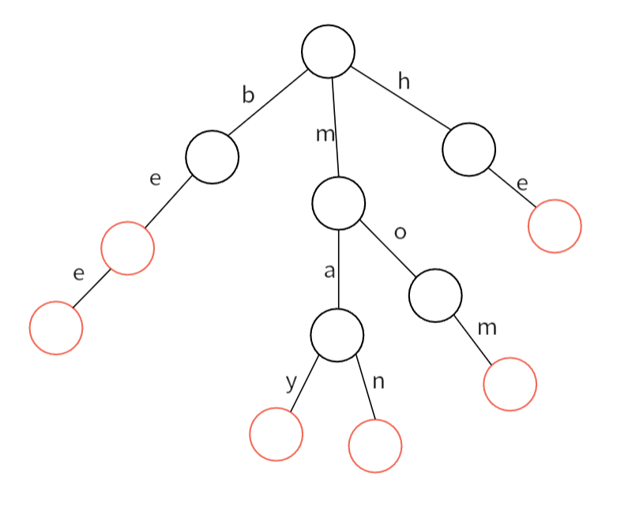
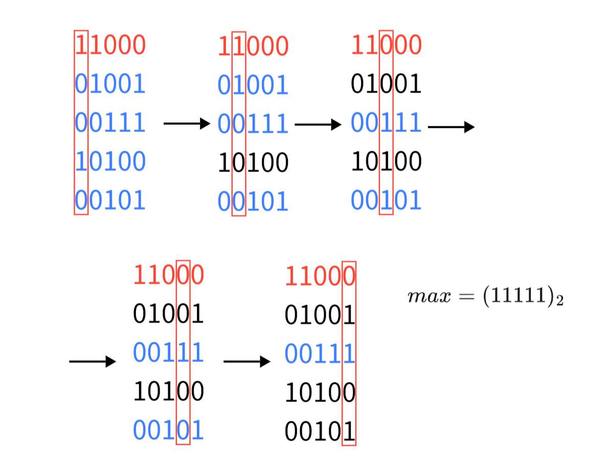
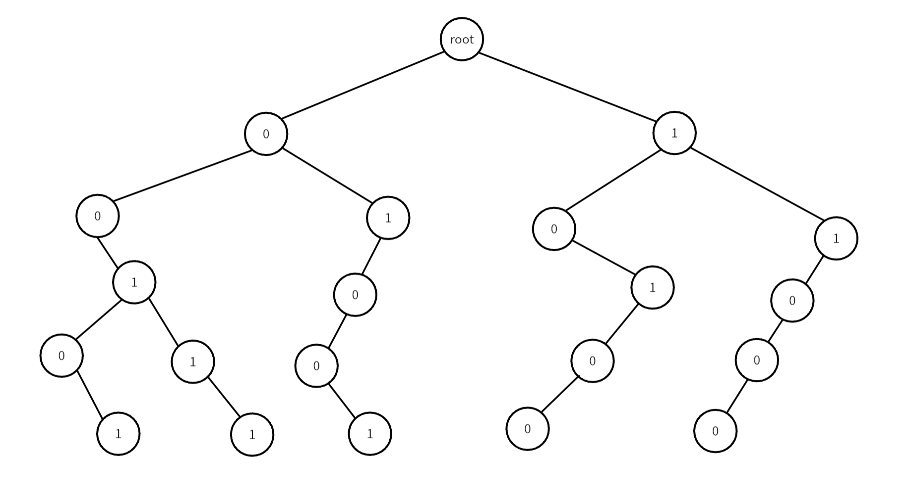

# 字典树

## 引入
有这样的问题，要求我们求以 $t_i$ 为前缀的 $s_i$ 的数量。

如果用暴力的做法就是，遍历每个字符串，进行匹配，复杂度是 $O(nm)$ ，这个操作十分低效。

大家都有查英语字典的经验，查找某个单词，其实就是匹配其前缀的过程，由此查找任意的单词，查找的次数最多是这个单词的长度。

而字典树就是模拟这个过程的数据结构。如下图：

<div align=center> </div>

边代表字符，从根节点出发到树上某一点代表一个字符串。如果某个节点是字符串的结尾，我们就对其进行标记。上图就是由$be,bee,may,man,mom,he$组成的字典树。


## 基础字典树

基础的字典树支持**插入**和**查询**操作。


字典树用数组来实现，类似动态开点线段树，定义如下：

```cpp
//节点大小与字符集大小有关，这里只存储小写字母，所以只有26个
int tr[MAX][26];    // 每个节点存储下一个字符的位置
bool exist[MAX];      // 该结点结尾的字符串是否存在
int cnt;            // 最新分配的存储位置
```
### 插入
该操作可以将某个字符串插入到字典树中：
```cpp
void insert(string& s)
{
    int p = 0;
    //遍历整个字符串
    for(int i = 0;i < s.size();++i)
    {
        int ch = s[i] - 'a';
        if(!tr[p][ch])
            tr[p][ch] = ++cnt;//如果节点还没有值，就先分配存储位置
        p = tr[p][ch];//移动到下一个节点
    }
    exist[p] = true;
}
```

### 查询
查询字典树中是否有串$s$。
```cpp
bool ask(string& s)
{
    int p = 0;
    for(int i = 0;i < s.size();++i)
    {
        int ch = s[i] - 'a';
        if(!tr[p][ch])
            return false;//如果没有对应节点，说明字典树中没有串s
        p = tr[p][ch];
    }
    return true;
}
```
### 基础字典树的应用

- 字符串检索。查询字符串是字典树的基本功能
- 词频统计。统计某个字符串出现了多少次
- 字符串排序。在插入的时候，在树的同一级按字母表顺序插入，自带树建好后，用先序遍历即可得到按字典序的排序。
- 前缀匹配。字典树是按公共前缀来建树的，非常适合搜索提示。

## $01-Trie$

$01$ 字典树就是字符集为 $\{0,1\}$ 的字典树，相当于一棵二叉树。支持**插入**、**查询异或和极值**操作。

### 异或和极值

$01$字典树的主要功能是处理异或和极值问题。

以[LC.421](https://leetcode.cn/problems/maximum-xor-of-two-numbers-in-an-array/description/)为例。

题目让我们求 $nums$ 数组中 $nums[i]\oplus nums[j]$ 的最大值。

我们考虑最终的答案的第 $i$ 个二进制位是否可以是 $1$，我们从高位开始考虑，因为只有尽可能高位取 $1$ ，才能使最终答案最大。

那么答案的第 $i$ 位为 $1$ ，说明答案一定是由 $nums$ 数组中的两个第 $i$ 为不同的数异或得来的。

所以我们可以先固定一个数，对其进行二进制枚举，看看它能异或得到的最大值。具体就是枚举 $nums$ 中的每个数，进行上述操作，取所有结果的最大值就是答案。

举个例子，下面是固定一个数后的操作过程，红色是确定的数：

<div align=center> </div>

我们发现每一轮都可以删掉几个异或后第 $i$ 位不为  $1$ 的数。如果对于某一位， $nums$ 中不存在使其异或后使该位为 $1$ 的数，说明这一位只能为 $0$ ，就不用删除任何数。上面的例子恰好能使每一位都为 $1$ 。

我们会发现上面确定最大值的过程，很像字典树中查找字符串的过程，即通过前缀逐步确定一个数（确定一个字符串）。

将上面数的二进制形式插入到字典树后形成的二叉树。枚举二进制位，确定最大值的过程就是从 $01$ 字典树的根节点开始，尽可能走与确定数当前位不同的路径。

<div align=center> </div>

那么我们就可以用字典树高效的完成上述过程。


### 插入

我们可以将数组中每个数二进制位当作一个串，插入到字典树中。

```cpp
// 将数的二进制位插入到字典树中
void insert(int x)
{
	int p = 0;
        // 从高位到低位
	for(int i = 30;i >= 0;--i)
	{
		int c = (x >> i) & 1;   //取该数的第i位
		if(!tr[p][c])
			tr[p][c] = ++tot;
		p = tr[p][c];
	}
}
```

### 查询异或最大值

查询当前确定的数 $x$ 异或可以得到的最大值，从高到低依次取 $x$ 的二进制位，判断是否存在与当前为不同的数。

```cpp
// 询问最大异或和
int max_xor(int x)
{
	int res = 0,p = 0;
	for(int i = 30;i >= 0;--i)
	{
		int now = (x >> i) & 1;

		// 判断第i位是否能位1
		// 想要第i位为1，就要异或一个与该位不同的数，1 ^ 0 或 0 ^ 1 
		// 如果另一边存在数，就移动到另一个子树上
		// 不存在则这一位只能是0，就继续向下
		if(tr[p][now ^ 1])	
		{
			p = tr[p][now ^ 1];
			res |= (1 << i);
		}
		else    p = tr[p][now];
	}
	return res;
}
```

### 带删除的$01-Trie$

从字典树中删除某个数，其实不必要把其对应的节点都删除。我用一个数组 $cnt[]$ 记录以当前节点为根的子树的节点个数，删除一个数时就将其对应路径上的 $cnt[]$ 都减 $1$ 即可。

```cpp
// 删除数
void erase(int x)
{
	int p = 0;
	for(int i = 30;i >= 0;--i)
	{
		int now = (x >> i) & 1;
		p = tr[p][now];
		cnt[p]--;
	}
}
```

### 时空复杂度

字典树的插入、删除和查询操作都只需要枚举一个数的二进制位，时间复杂度为 $O(\log n)$

字典树是一种很典型的空间换时间的数据结构，一般空间要开到 $O(20n)$ 才不会越界。


-------------------------

参考文章：<br>

《算法竞赛》

[Oi Wiki-字典树](https://oi-wiki.org/string/trie/#01-trie-%E5%90%88%E5%B9%B6)

[GitHub-灵茶山艾府](https://github.com/EndlessCheng/codeforces-go/blob/master/copypasta/trie01.go)

