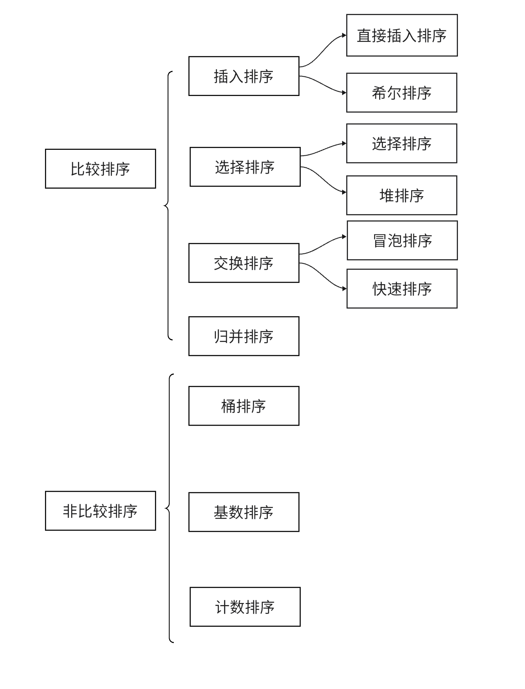

## **定义**

所谓排序就是将一个序列的元素，按照某种偏序关系，递增或递减的排列起来。

[排序可视化网站](https://www.toptal.com/developers/sorting-algorithms)

## **排序算法的分类**

### **按排序方式**

<figure markdown="span">
  { width="550" }
</figure>

本章会将上述排序算法进行一一的介绍。

### **按数据存放位置**

- 内排序：数据元素放在内存中的排序。
- 外排序：数据元素太多不能同时放在内存中，根据排序过程的要求不能再内外存之间移动数据的排序。

## **排序性能**

### **比较排序**

||时间复杂度|空间复杂度|稳定性|
|:-:|:-:|:-:|:-:|
|插入排序|$O(n^2)$|$O(1)$|稳定|
|希尔排序|$O(n\log^2{n})$|$O(1)$|不稳定|
|选择排序|$O(n^2)$|$O(1)$|不稳定|
|堆排序|$O(n\log{n})$|$O(1)$|不稳定|
|冒泡排序|$O(n^2)$|$O(1)$|稳定|
|快速排序|$O(n\log{n})$|$O(n\log{n})$|不稳定|
|归并排序|$O(n\log{n})$|$O(n)$|稳定|

### **非比较排序**

||时间复杂度|空间复杂度|稳定性|
|:-:|:-:|:-:|:-:|
|计数排序|$O(n)$|$O(n)$|稳定
|桶排序|$O(n)\sim O(n^2)$|$o(n)$|稳定
|基数排序|$O(n\log{n})$|$O(n)$|稳定