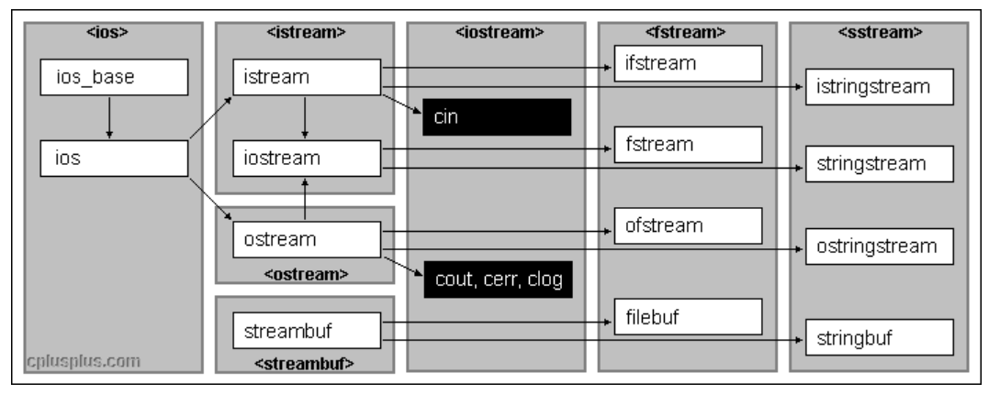

## **流**

流”即是流动的意思，是物质从一处向另一处流动的过程，是对一种有序连续且具有方向性的数据（其单位可以是bit,byte,packet）的抽象描述。

它的特性是：有序连续、具有方向性。

为了实现这种流动，C++定义了I/O标准类库，这些每个类都称为流/流类，用以完成某方面的功能。

## **C++ IO流**

C++系统实现了一个庞大的类库，其中ios为基类，其他类都是直接或间接派生自 ios 类：

<figure markdown="span">
  { width="750" }
</figure>

