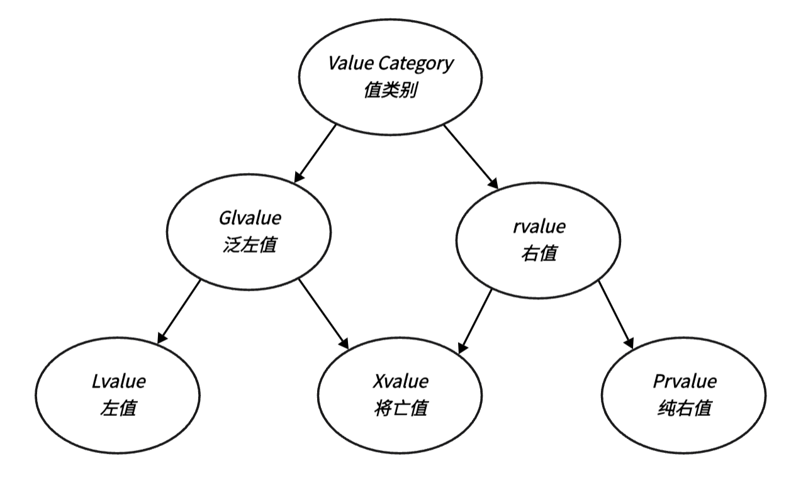
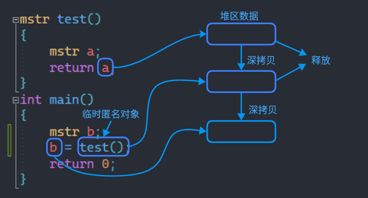

## **右值引用**

左值右值的概念在很早就以及提出了，但传统 C++98 中的引用都是左值引用，在 C++11 中才提出了右值引用的概念。但无论是左值引用还是右值引用，都是给对象起别名，底层都是指针。

### **左值和右值**

在理解右值引用前，我们先要搞懂左值和右值的是什么。

**左值 (lvalue)** 和 **右值 (rvalue)** 是表达式的值类别。

- 左值：我们定义的所有具名变量通常都是一个左值，它通常是有一块固定的内存空间具名对象，我们可以通过它的名称访问这块内存地址，所以它相比右值也往往有更长的生命周期。

- 右值：右值通常是字面常量 ( C 风格字符串除外，它表示地址 ) 、表达式返回值或是函数的返回值 ( 前提是返回值不是引用 )，它往往是代码区上的一个字面常量或是一块即将被释放空间的对象，生命周期很短，且通常不具名。

C++11 对值类别做出了精细的划分：

<figure markdown="span">
  { width="450" }
</figure>

- **将亡值 （xvalue）**：生命周期即将结束的变量对象，或由右值引用强制转换产生的对象，这样的变量虽然具名，但它也是右值的一种。

- **纯右值 （prvalue）**：传统意义上的右值，如匿名对象、函数返回值以及表达式返回值等，纯右值通常用来初始化左值。

- **右值 （rvalue）**：通常我们所说的右值是包括 **将亡值** 和 **纯右值** 的。

- **泛左值 （gvalue）**：是指可以通过名字确定一块具体地址的表达式。**将亡值** 也是泛左值的一种，因为它具名，可以确定一块具体的地址空间。

- **左值 （lvalue）** ： 并非 **将亡值** 的 **泛左值**，可以理解为生命周期暂时不会结束的具名变量。

```cpp
// 左值
int a = 3;
int* pa = new int(2);
const int b = 1;


int sum(int a,int b) { return a + b; }
// 纯右值
11.678          // 字面常量
nullptr         // 字面常量
10 * a          // 表达式返回值
sum(a,b)        // 函数返回值


// 将亡值
int test()
{
    int a;    // 此时生命周期暂时不会结束，还是左值
    return a; // 这里的 a 生命周期即将结束，变为将亡值
}
```

### **左值引用和右值引用**

左值引用是对左值的引用，对左值取别名，当然也可也通过将引用类型加上常属性 (`const`) 来引用右值。在类型后加 `&` 可以定义一个左值引用：

```cpp
int& lf_a = a;
int*& lf_pa = pa;
const int& lf_b = b; 
const int& lf_rval = 10;    // 常属性左值引用 引用右值
```

右值引用是对右值的引用，对右值取别名，当然也可也通过 `std::move()` 函数，将一个左值强转为右值，从而进行右值引用，这样做的意义在后文介绍，在类型后加 `&&` 可以定义一个右值引用：

```cpp
double&& rf_d = 11.678;
int&& rf_exp = 10 * a;
int&& rf_fun = sum(a,b);
int a = 0;
int&& rf_lval = std::move(a);   // 右值引用 引用强转后的左值
```

引用的底层是指针，不管是左值引用还是右值引用本质都是一个指针常量，它们都记录引用对象的地址。但是对于字面常量，它只是代码区的一段数据，它的地址是什么？难道是代码区的一个地址吗？显然不可能是，我们看一下汇编就会发现：

<figure markdown="span">
  { width="750" }
</figure>

对于一个字面常量进行引用时，会先将其在栈区创建一个匿名变量，来存放这个值，右值引用事实上引用的是这个匿名变量。对于表达式运算结果和函数返回值 ( 返回值不能是左值引用 )，右值引用也是引用的返回结果的临时匿名对象。这事实上和**常属性左值引用**引用匿名对象是相同的，只不过左值引用是不可以修改匿名对象的，而右值引用可以。


## **移动语义**

### **数据拷贝和数据移动**

**移动语义** 是为了降低对象在函数间传递过程中拷贝时的资源消耗。那么什么是移动语义呢？我们先来看一个初学 C++ 时一定会遇到的问题：深拷贝。以下面的类为例：

```cpp
class mstr
{
public:
    char* p;
    int sz;
    mstr()
    {
        p = new char[1] {'\0'};
        sz = 1;
    }
    // 字符串构造
    mstr(const char* str)
    {
        sz = strlen(str) + 1;
        p = new char[sz];
        memcpy(p, str, sizeof(char) * sz);
    }

    // 拷贝构造
    mstr(const mstr& ot)
    {
        std::cout << "mstr(const mstr& ot) 深拷贝" << std::endl;
        p = new char[ot.sz];
        sz = ot.sz;
        memcpy(p, ot.p, ot.sz);
    }
    // 复制拷贝
    mstr& operator=(const mstr& ot)
    {
        std::cout << "mstr& operator=(const mstr& ot) 深拷贝" << std::endl;
        if (p) delete[] p;
        p = new char[ot.sz];
        sz = ot.sz;
        memcpy(p, ot.p, ot.sz);
        return *this;
    }
    ~mstr()
    {delete[] p;}

    /* 其他功能实现省略 */
};
```

我们提供了复制拷贝和拷贝构造，来防止 Double Delete ，但是在一些场景下事实上并不需要深拷贝，例如：我们想返回一个函数对象时了，会创建两次 临时变量 ，都会进行深拷贝：


```cpp
mstr test()
{
    mstr a;
    return a; // 此时 a 为右值
}
int main()
{
    mstr b;
    b = test(); // 函数返回值为右值
    return 0;
}
/*
运行结果：
mstr(const mstr& ot) 深拷贝
mstr& operator=(const mstr& ot) 深拷贝

要注意不能写成：
mstr b = test();
连续的构造会被编译器优化，变为一次构造。
所以想要看到完整构造和赋值操作，要先创建 b，再进行赋值 
*/

```

首先对象要从 `test()` 函数的栈帧拷贝一份数据到 `main()` 函数函数栈帧中，此时会生成一份临时匿名变量，来存储这份数据，然后这份临时变量再将数据拷贝给我们要赋值的对象 `b`。

<figure markdown="span">
  { width="450" }
</figure>

我们发现两次拷贝，都是拷贝一个 **右值** 的堆区数据，这好像根本没必要，我们为什么要重新申请空间拷贝数据，而不是继续维护原先的 **右值对象** 在堆区的空间呢。后者效率明显是更高的，因此我们只需要将那块堆区空间的地址移动到新对象中就可以了，而这就是**移动语义**，只做数据的转移而非数据的拷贝，这样避免的原始数据的拷贝。

要想实现移动语义，就需要采用某种方式，让编译器知道什么时候要进行深拷贝，什么时候就只需要进行数据的转移。这时右值就排上用场了。我们除了一般的拷贝构造和拷贝赋值外，再提供 **移动构造、移动赋值**，一般的拷贝以 `const` 左值引用为参数，移动语义以 右值引用 做参数，前者接收左值参数，后者接收右值参数，因为通常情况下，右值都是一个生命即将结束的对象，所以编译器会调用移动语义，将右值的的数据移动到当前对象中：

```cpp
// 移动构造
mstr(mstr&& ot)
{
    cout << "mstr(mstr&& ot) 移动构造" << endl;
    p = new char[1] {'\0'};
    sz = 1;
    std::swap(ot.sz, this->sz);
    std::swap(ot.p, this->p);
}
// 移动赋值
mstr& operator=(mstr&& ot)
{
    cout << "mstr& operator=(mstr&& ot) 移动赋值" << endl;
    std::swap(ot.sz, this->sz);
    std::swap(ot.p, this->p);
    return *this;
}

/*
添加移动语义后，上述例子运行结果为:
mstr(mstr&& ot) 移动构造
mstr& operator=(mstr&& ot) 移动赋值
*/
```
我们可以看到，只进行了移动构造和移动赋值，对于一个长字符串来说，相比直接拷贝，效率会大幅提高。

### **类中新的默认函数**

C++11 中添加了 **移动构造** 和 **移动拷贝** 的作为类的默认函数，当我们没有提供移动构造和移动拷贝，并且没有提供析构函数、拷贝构造和拷贝赋值的任意一个实现时，编译器会默认生成一份移动构造和移动拷贝。默认生成的移动构造和移动拷贝，对于内置类型成员会执行**逐成员按字节拷贝**，自定义类型成员，则需要看这个成员是否实现移动构造，如果实现了就调用移动构造，没有实现就调用拷贝构造。


### **`std::move`**

`std::move` 可以以将一个左值强制转换为一个**将亡值表达式**。当类有移动语义的实现，它可以帮助我们将一个左值的数据移动到一个新的变量中：

```cpp
int mina()
{
    mstr b("cyb");
    mstr c("C++11");
    std::cout << b.p << '\n';
    std::cout << c.p << '\n';
    b = std::move(c);
    std::cout << b.p << '\n';
    std::cout << c.p << '\n';
    return 0;
}

/*
输出结果：
cyb
C++11
mstr& operator=(mstr&& ot) 移动赋值
C++11
cyb
*/
```
在一些场景下，使用 `std::move` 可以提高我们代码的效率，例如：在 STL 容器 `push_back()`，时使用：

```cpp
int main()
{
    std::vector<mstr> a;
    mstr s;
    a.push_back(std::move(s));
    return 0;
}
```
C++11 中 STL 库中的容器会提供 右值引用 版本的 `push_back` 函数，它与 左值引用 版本不太的地方在于，会调用移动构造，将 `s` 中的数据转移至容器中，而左值版本是拷贝构造，将一块拷贝出的新数据加入容器中。

要注意的是，我们要尽量避免使用被 `std::move` 后的左值对象，因为各个类的移动语义实现是不同的，它的数据可能已经被转移，再去使用可能会有引发一些错误。

并且我们要避免滥用 `std::move`，如下：

```cpp
mstr test()
{
    mstr a("a");
    return std::move(a);
}
```

这就是一个无意义的 `std::move` ，因为这里 `a` 是隐式可以移动是实体，所以这里会默认就调用移动构造，上文已经介绍过。而对于一个类的成员函数返回类数据成员时：

```cpp
struct A
{ 
    mstr x;
    mstr test()
    {
        return x;
    }
    mstr test2()
    {
        return std::move(x);
    }
};
int main()
{
    A a;
    a.test();
    a.test2();
    return 0;
}
/*
运行结果:
mstr(const mstr& ot) 深拷贝
mstr(mstr&& ot) 移动构造
*/
```
我们发现不使用 `std::move` 的函数是调用了拷贝，这是因为这里 `x` 不是隐式可移动实体，如果不 `std::move` ，直接 `return` 会进行拷贝。为什么会这样也很好理解，因为数据成员在成员函数结束时，生命周期还不会结束，所以不会因为变为 将亡值，而改变值类别。


## **完美转发**

### **万能引用**

C++11 提供了万能引用 ( 通用引用 )，它既可以接受左值引用，也能接受右值引用，但是要满足一下两个条件：

- 必须满足 `T&&` 的形式
- 类型 `T` 要是由推导的来的。

下面就是一个模板函数万能引用的例子：

```cpp
template<class T>
void f(T&& a){ }
```

如果 `T` 的推导结果是左值的话， `a` 的类型就是左值引用，如果 `T` 推导结果是右值的话， `a` 的类型就是右值引用。 

常见可以形成万能引用的情况如下：

- 函数模板
- `auto` 声明
- `decltype` 声明

有一种情况需要注意，下面这种情况是万能引用吗？

```cpp
template<class T>
class A
{
    void fun(T&& ot);
};
```

它不是，因为当类创建对象时， `T` 的类型就已经确定了，在调用函数 `fun()` 时，不存在类型 `T` 的推导，所以不能形成万能引用。
  
### **完美转发**

当我们在一个函数中想输出一个参数的之类型时，就需要进行变量转发，但是一般的参数类型，当我们将参数传入以后，参数的值类别就已经变为了左值：


```cpp
// 针对不同的之类别输出对应类型
void show_type(mstr& a){ cout << "左值" << endl; }
void show_type(const mstr& a){cout << "const 左值" <<endl;}
void show_type(mstr&& a){cout << "右值" <<endl;}
void show_type(const mstr&& a){cout << "const 右值" <<endl;}

// 1. 直接传递对象
void fun(mstr a) { show_type(a); }
// 2. 传递左值引用
void fun(mstr& a) { show_type(a); }
// 3. 传递常属性左值引用
void fun(const mstr& a) { show_type(a); }
```

但是这些实现都不是完美的转发的，第一个会调用拷贝构造，得到一个新对象，值类别变为左值，第二个不能传递右值，第三次个改变了对象常属性，都不是对 `a` 的完美转发。这时我们就需要一种即可以接收右值也可以就收左值的形参，没错就是万能引用：

```cpp
template<class T>
void perfect_forward(T&& x)
{
    show_type(x); 
}
int main()
{
    mstr a;
    perfect_forward(a);
    perfect_forward(std::move(a));
    const mstr b;
    perfect_forward(b);
    perfect_forward(std::move(b));
    return 0;
}
/*
运行结果：
左值
左值
const 左值
const 左值
*/
```

为什么输出的都是左值，这时因为在 `perfect_forward` 内的 `x` 是一个左值，我们想要获取 `x` 对象原生值类别时就需要调用函数 `std::forward<>`：

```cpp
template<class T>
void perfect_forward(T&& x)
{
    show_type(std::forward<T>(x));
}
/*
运行结果：
左值
右值
const 左值
const 右值
*/
```

当我们想保持实参的属性时，就可以使用模板函数 `std::forward<>`。而 `std::forward<>` 就是为了防止右值在函数传参后退化为左值，导致参数匹配时出现错误。
