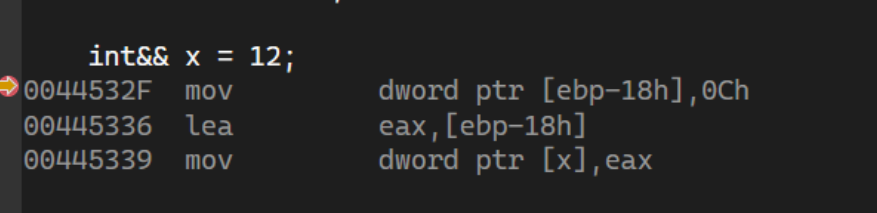

## **右值引用**

左值右值的概念在很早就以及提出了，但传统 C++98 中的引用都是左值引用，在 C++11 中才提出了右值引用的概念。但无论是左值引用还是右值引用，都是给对象起别名，底层都是指针。

### **左值和右值**

在理解右值引用前，我们先要搞懂左值和右值的是什么。

**左值 (lvalue)** 和 **右值 (rvalue)** 都是是表达式的属性。判断一个表达式是左值还是右值只要看它是否可以被取地址即可。

我们声明和定义的所有具名变量都是一个左值，它通常是有一块固定的内存空间具名对象，我们可以通过它的名称访问这块内存地址，所以它相比右值也往往有更长的生命周期。

而右值是字面常量 ( C 风格字符串除外，它表示地址 ) 、表达式返回值或是函数的返回值 ( 前提是返回值不是引用 )，它往往是代码区上的一个字面常量或是一块即将被释放空间的匿名变量对象，生命周期很短，且不具名。

```cpp
// 左值
int a = 3;
int* pa = new int(2);
const int b = 1;


int sum(int a,int b) { return a + b; }
// 常见右值
11.678          // 字面常量
nullptr         // 字面常量
10 * a          // 表达式返回值
sum(a,b)        // 函数返回值
```

### **左值引用和右值引用**

左值引用是对左值的引用，对左值取别名，当然也可也通过将引用类型加上常属性 (`const`) 来引用右值。在类型后加 `&` 就可以定义一个左值引用：

```cpp
int& lf_a = a;
int*& lf_pa = pa;
const int& lf_b = b; 
const int& lf_rval = 10;    // 常属性左值引用 引用右值
```

右值引用是对右值的引用，对右值取别名，当然也可也通过 `std::move()` 函数，将一个左值强转为右值，从而进行右值引用，这样做的意义在后文介绍，在类型后加 `&&` 就可以定义一个右值引用：

```cpp
double&& rf_d = 11.678;
int&& rf_exp = 10 * a;
int&& rf_fun = sum(a,b);
int a = 0;
int&& rf_lval = std::move(a);   // 右值引用 引用强转后的左值
```

引用的底层是指针，不管是左值引用还是右值引用本质都是一个指针常量，取地址和解引用的工作都由编译器帮我们做了，我们只需要当作变量使用就好了。但是对于字面常量，它只是代码区的一段数据，它的地址是什么？难道是代码区的一个地址吗？显然不可能是，我们看一下汇编就会发现：

<figure markdown="span">
  { width="750" }
</figure>

对于一个字面常量进行引用时，会先将其在栈区创建一个匿名变量，来存放这个值，右值引用事实上引用的是这个匿名变量。对于表达式运算结果和函数返回值 ( 返回值不能是左值引用 )，右值引用也是引用的返回结果的临时匿名对象。这事实上和**常属性左值引用**引用匿名对象是相同的，只不过左值引用是不可以修改匿名对象的，而右值引用可以。

**那么右值引用其实只做了一件事，就是提供对匿名对象的修改权限**，这样做的意义就是为了移动语义。


## **移动语义**


**移动语义**都是为了降低对象在函数间传递过程中拷贝和销毁时的资源消耗。那么什么是移动语义呢？我们先来看一个初学 C++ 时一定会遇到的问题：深拷贝。以下面的类为例：

```cpp
class mstr
{
    char* p;
    int sz;
public:
    mstr()
    {
        p = new char[1] {'\0'};
        sz = 1;
    }
    // 字符串构造
    mstr(const char* str)
    {
        sz = strlen(str) + 1;
        p = new char[sz];
        memcpy(p, str, sizeof str);
    }
    // 拷贝构造
    mstr(const mstr& ot)
    {
        cout << "mstr(const mstr& ot) 深拷贝" << endl;
        p = new char[ot.sz];
        sz = ot.sz;
        memcpy(p, ot.p, ot.sz);
    }
    // 复制拷贝
    mstr& operator=(const mstr& ot)
    {
        cout << "mstr& operator=(const mstr& ot) 深拷贝" << endl;
        if (p) delete[] p;
        p = new char[ot.sz];
        sz = ot.sz;
        memcpy(p, ot.p, ot.sz);
        return *this;
    }

    ~mstr()
    {
        delete[] p;
    }

    /* 其他功能实现省略 */
};
```

在没有右值引用以前，当我们的函数想返回一个 `mstr` 对象时，就会很苦恼，因为我们不论怎么选择都不是很完美：

```cpp
mstr test();        // 会发生拷贝，效率低下
mstr& test();       // 只能返回堆区上的类对象
```

如果我们直接返回对象，会发生拷贝，效率低下，返回对象的引用又需要返回对象不能在栈区，只能在堆区，而这又要考虑到内存释放的问题，非常不完美。C++11 就此提出了移动语义。我们先来看看当我们返回一个函数对象时，拷贝都发生在什么地方。我们以下面函数为例：

```cpp
mstr test()
{
    mstr a;
    return a;
}
int main()
{
    mstr a;
    a = test();
    return 0;
}
```

首先对象要从 `test()` 函数的栈帧拷贝一份到 `main()` 函数函数栈帧中，此时会生成一份临时匿名变量，然后这份临时变量再将数据深拷贝给我们要赋值的对象 `b`。

<figure markdown="span">
  { width="450" }
</figure>

我们发现两次拷贝，将堆区数据拷给了一个即将释放空间的匿名对象中，这好像根本没必要，我们为什么不直接把 `a` 在堆区申请的空间拿来呢，而不是重新申请空间再拷贝数据。前者效率一定是更高的，因为仅仅是对指针值的拷贝，而这就是**移动语义**所做的事，将 `a` 的成员直接给匿名对象 (移动构造) ，再将临时变量和 `b` 的成员直接交换 (引动拷贝)。

要修改一个匿名对象，这正好要用到右值引用，所以我们可以重载构造和赋值拷贝函数：

```cpp
// 移动构造
mstr::mstr(mstr&& ot)
{
    std::swap(ot.sz,this->sz);
    std::swap(ot.p,this->p);
}
// 移动赋值
mstr& mstr::operator=(mstr&& ot)
{
    std::swap(ot.sz,this->sz);
    std::swap(ot.p,this->p);
}
```

移动语义说的不准确点就是浅拷贝，之不够移动语义是交换数据，然后让将亡对象和匿名对象去释放一块不需要的空间，保留下我们需要的数据。


### **类中新的默认函数**

C++11 中添加了移动构造和移动拷贝的作为类的默认函数，但是


## **完美转发**

### **万能引用**

C++11 提供了万能引用 ( 通用引用 )，它既可以接受左值引用，也能接受右值引用，但是要满足一下两个条件：

- 必须满足 `T&&` 的形式
- 类型 `T` 要是由推导的来的。

下面就是一个模板函数万能引用的例子：

```cpp
template<class T>
void f(T&& a){ }
```

如果 `T` 的推导结果是左值的话， `a` 的类型就是左值引用，如果 `T` 推导结果是右值的话， `a` 的类型就是右值引用。 

常见可以形成万能引用的情况如下：

- 函数模板
- `auto` 声明
- `decltype` 声明
 
### **变量转发**

当我们想辨别一个传入参数的值类型时，一般的传值，在给参数接收后，都会变为左值，这时就要用到完美转发：


```cpp
void show_type(mstr& a)
{ cout << "左值引用" << endl; }

void show_type(const mstr& a)
{cout << "const 左值引用" <<endl;}

void show_type(mstr&& a)
{cout << "右值引用" <<endl;}

void show_type(const mstr&& a)
{cout << "const 右值引用" <<endl;}


// 1. 直接传递对象
void fun(mstr a) {}

// 2. 传递对象引用
void fun(mstr& a) {}

// 3. 传递常属性对象引用
void fun(const mstr& a) {}
```

但是这些实现都不是完美的转发的，第一个会调用拷贝构造，进行深拷贝，效率低，第二个不能传递右值，第三次个改变了对象常属性。C++11 以后，有了右值引用，我可以提供多个版本的函数重载：

```cpp
void fun(mstr& a) {}    
void fun(mstr&& a) {}
void fun(const mstr& a) {}
```

这样就实现了及不改变对象常属性，也不需要调用拷贝构造的较优解，

