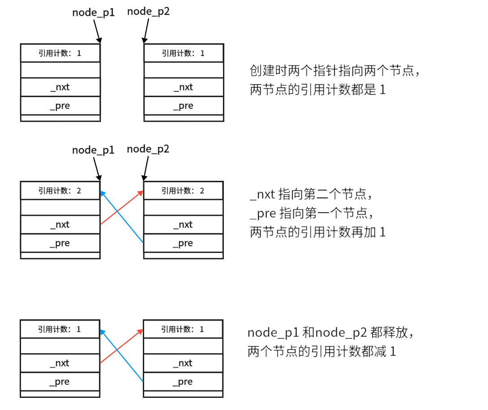

## **RAII**

C++ 中在堆区申请的空间是需要程序员自行进行释放的，但是需要程序员自行约束的事情，总是会出错的，为了更好的管理堆区的内存，C++ 引入了智能指针。

智能指针是对 **RAII (Resource Acquisition Is Initialization)** 技术的实现，RAII 是一种利用对象生命周期来控制程序资源（如内存、文件句柄、网络连接、互斥量等等）的简单技术。在对象构造时获取资源，接着控制对资源的访问使之在对象的生命周期内始终保持有效，最后在对象析构的时候释放资源。

我们可以根据 RAII 实现一个最简单的智能指针：

```cpp
template<class Tp>
class smart_ptr
{
    Tp* _ptr;
public:
    // 实现 RAII
    smart_ptr(Tp p = nullptr)
        :_ptr(p)
    {}

    ~smart_ptr()
    { delete _ptr;}

    // 指针操作
    Tp& operator*()
    { return *_ptr;}

    Tp* operator->()
    { return _ptr;}
};
```

但只是这样还是不够的，对于指针的拷贝，还需要做很多特殊处理，如：多个智能指针指向一块空间时，应该如何避免 Double delete 等等。我们来看看 C++ 库中是如何如理的。

C++ 中提供了三种智能指针:`auto_ptr` （已弃用）、`unique_ptr`、`shared_ptr`，和一个 `weak_ptr` 来解决`shared_ptr` 循环引用的问题，后文将详细介绍。

## **`auto_ptr`**

`auto_ptr` 是在 C++98 就已经加入到标准中的，`auto_ptr` 对于指针拷贝的处理是：管理权转移，下面是 `auto_ptr` 在库中拷贝相关的实现：

```cpp
template <typename _Tp>
class auto_ptr
{
    _Tp *_M_ptr;
public:
    typedef _Tp element_type;

    /*.......*/

    // 两个拷贝都是将 __a 维护的地址交给当前的 auto_ptr并置空
    // 拷贝赋值
    auto_ptr & operator=(auto_ptr &__a) throw()
    {
        reset(__a.release());
        return *this;
    }

    // 拷贝构造
    auto_ptr(auto_ptr &__a) throw() 
        : _M_ptr(__a.release()) 
    {}

    void reset(element_type *__p = 0) throw()
    {
        // 避免自己给自己赋值导致的 double delete
        if (__p != _M_ptr)
        {
            delete _M_ptr;
            _M_ptr = __p;
        }
    }

    element_type * release() throw()
    {
        element_type *__tmp = _M_ptr;
        _M_ptr = 0;
        return __tmp;
    }

    /*.......*/

};
```

我们从这个 C++98 风格的写法就可也看出，C++11 以后库就已经弃用了 `auto_ptr` ，留下源码只是为了向前兼容。为什么会弃用呢？因为这种所有权转移的处理方式会造成指针悬空：

```cpp
int main()
{
    std::auto_ptr<int> a(new int);
    std::auto_ptr<int> b (a);   // a 对数据的管理权被转移给了 b

    (*b)++;
    (*a)++; // 访问非法空间

    return 0;
}
```

这样的实现导致在 `auto_ptr` 的生命周期内，其内部数据不一定是始终有效的，很容易造成非法访问。C++11 向 `boost` 库学习，向库中加入了 `unique_ptr`、`shared_ptr`，来解决这个问题。

## **`unique_ptr`**

`unique_ptr` 的解决方案很简单，那就是禁止拷贝，我可以在库中看到：

```cpp
    // Disable copy from lvalue.
    unique_ptr(const unique_ptr&) = delete;
    unique_ptr& operator=(const unique_ptr&) = delete;
```

删除了拷贝构造和拷贝赋值。但是 `unique_ptr` 实现了移动语义，我们可以使用 `move()` 来将一个数据管理权交给另一个 `unique_ptr`，这与 `auto_ptr` 的管理权转移的处理方法类似，但更为严格，并且使用被 `move()` 过的变量，一般的编译器都会报警告，比起 `auto_ptr` 更为安全。

并且 `unique_ptr` 对数组进行了偏特化，重载了 `operator[]` 操作：

```cpp
std::unique_ptr<int []> p2(new int[10]);
p2[1] = 10；
```

### **`release` VS `reset`**

`unique_ptr` 中 `release` 只会释放所有权，并将资源的原始指针返回，资源的释放需要我们手动 delete。

```cpp
auto v = make_unique<int>(12);  // manages the object
int * raw = v.release();        // pointer to no-longer-managed object
delete raw;                     // needs manual deletion
```

通常 `release` 会用来初始化另一个智能指针。除非有必要，否则非常不推荐使用 `release` 初始化一个原始指针。

而 `unique_ptr` 中 `reset` 会释放资源，并将 `unique_ptr` 置空。如果你提供一个新的非空资源原始指针做参数，`unique_ptr` 会维护这个新指针。

```cpp
auto v = make_unique<int>(12);  // manages the object
v.reset();                      // delete the object, leaving v empty
```

> 参考自：[Does unique_ptr::release() call the destructor?](https://stackoverflow.com/questions/25609457/does-unique-ptrrelease-call-the-destructor){target="_blank"}

## **`shared_ptr`**

`shared_ptr` 允许拷贝，它内部实现了引用计数，赋值时引用加一，指针过期时引用减一，只有到引用计数减为零时，才释放资源，这就很好的解决了指针拷贝的问题。

```cpp
class A
{
public:
    ~A() { std::cout << "~A()" << std::endl; }
};

int main()
{
    std::shared_ptr<A> a(new A);
    // use_count() 返回当前引用该数据的指针个数，get() 返回维护的原生指针
    std::cout << "ptr count:" <<  a.use_count() 
              << " ,address:" << a.get() << std::endl;
    {
        // b 也引用 a 指向的空间，引用计数 +1
        std::shared_ptr<A> b(a);
        std::cout << "ptr count:" <<  b.use_count() 
                << " ,address:" << b.get() << std::endl;
        // b 生命周期结束，引用计数 -1
    }
    std::cout << "ptr count:" <<  a.use_count() 
              << " ,address:" << a.get() << std::endl;
    // a 生命周期结束，引用计数 -1 ，引用计数为 0 ，释放空间。
    return 0;
}
/*
输出结果：
ptr count:1 ,address:0x6f4ad0
ptr count:2 ,address:0x6f4ad0
ptr count:1 ,address:0x6f4ad0
~A()
*/
```

有了引用计数，就不需要在担心 double delete 的问题了，很好的解决了指针拷贝的问题。但是这又引出了另一个问题，**循环引用**。

### **循环引用**

什么是循环引用呢？我们拿一个例子来看：

```cpp
struct list_node
{
    int _d;
    std::shared_ptr<list_node> _nxt;
    std::shared_ptr<list_node> _pre;
public:
    
    ~list_node(){ std::cout << "~list_node()" << std::endl; }
};

int main()
{
    std::shared_ptr<list_node> node_p1(new list_node);
    std::shared_ptr<list_node> node_p2(new list_node);

    node_p1->_nxt = node_p2;
    node_p2->_pre = node_p1;

    return 0;
}
```

运行上面的代码，你会发现它是没有输出的，也就是说 `new` 来的 `list_node` 最后没有释放，内存泄漏了。那只能说明代码结束时，申请来的两个节点的引用计数还是大于 0 的。而错误就发生在两个赋值语句。

<figure markdown="span">
  { width="750" }
</figure>

这样的两个节点就构成了循环引用，这样也会导致内存泄漏，所以 C++11 还加入了 `weak_ptr` ，来解决这个问题，`weak_ptr` 是不满足 RAII 的，所以严格来说不是智能指针，他指向一个对象时，并不会增加其 `shared_ptr` 维护的引用计数，所以这里我们将节点结构体中的 `shared_ptr` 换成 `weak_ptr` 就可以避免这样的情况：

```cpp
struct list_node
{
    int _d;
    std::weak_ptr<list_node> _nxt;
    std::weak_ptr<list_node> _pre;
public:
    ~list_node(){ std::cout << "~list_node()" << std::endl; }
};
/*
输出结果：
~list_node()
~list_node()
*/
```

再运行程序，就可也正常析构节点，释放内存了。

### **`weak_ptr`**

`weak_ptr` 是一种弱引用的智能指针，它的实现只是为了协助 `shared_ptr` 实现功能，它只能由 `shared_ptr` 或其他 `weak_ptr` 构造而来，并且它没有重载指针操作，但我们可以通过 `lock` 成员函数获得一个 `shared_ptr` 来访问它指向的资源，当然此方式得到的 `shared_ptr` 也不会增加引用计数。

这样的行为使得 `weak_ptr` 像一个观察者，只对资源进行读写操作，而不做资源的释放操作，这样在它的生命周期内资源可能会被释放，所以库中提供了 `expired` 成员函数，判断它观察的资源是否还有效。在使用 `weak_ptr` 时是需要进行合法性检查的：

```cpp
int main()
{
    std::weak_ptr<int> wp;

    auto f = [](std::weak_ptr<int>& wp) 
    {
        // 如果没有失效就输出观察资源的值
        if(!wp.expired())
            std::cout << *wp.lock() << std::endl;
        else std::cout << "wp 失效" << std::endl;
    };

    {
        std::shared_ptr<int> sp(new int(1));
        wp = sp;    // 观察 sp 维护的资源
        f(wp);      
    }
    f(wp);          // 此时 wp 观察的资源已经失效
    return 0;   
}
/*
输出结果：
1
wp 失效
*/
```

`weak_ptr` 也可以通过成员函数 `use_count` 查看资源的引用计数。

- **弱引用计数**

`std::shared_ptr `管理两个成员：

- 控制块：存储引用计数，删除器等

- 被管理对象的指针

在控制块中还有一个弱引用计数，每当有一个 `weak_ptr` 指向被管理对象，弱引用计数加 1。

当引用计数减为 0 时，`shared_ptr` 会为我们释放被管理对象。因为 `weak_ptr` 通过控制块判断资源是否有效，所以只有当弱引用计数减和引用计数都减为 0 时，才会释放控制块（这也导致一些问题，后文会介绍）。

### **make_shared**


我们在创建一个 `shared_ptr` 时，更推荐使用 `make_shared` 来构建，它是更高效的，并且是异常安全的。

#### **高效**

如上文提到的，`make_shared` 内部维护的是两个成员控制块和被管理对象的指针。`make_shared` 只会执行一次堆申请，一并计算我们给的数据和控制块的大小，并申请空间。而如果使用构造函数，类似下面这样:

```cpp
std::shared_ptr<Object> p2(new Object("foo"));
```

会执行两次堆申请，一次 `new Object("foo")` ，一次申请控制块空间。

#### **异常安全**

对于异常安全考虑下述例子：

```cpp
void F(const std::shared_ptr<Lhs> &lhs, const std::shared_ptr<Rhs> &rhs) { /* ... */ }

F(std::shared_ptr<Lhs>(new Lhs("foo")),
  std::shared_ptr<Rhs>(new Rhs("bar")));
```

由于 C++ 允许对子表达式进行任意顺序的求值，因此一种可能的顺序是：

1. `new Lhs("foo")` 
2. `new Rhs("bar")`
3. `std::shared_ptr<Lhs>`
4. `std::shared_ptr<Rhs>`

当 `new Rhs("bar")` 出现异常时，会打断后续 `std::shared_ptr` 的构造，这样会导致 `new Lhs("foo")` 还未交给`std::shared_ptr<Lhs>` 管理，就被跳过了，最终导致内存泄漏。

而 `std::make_shared` 就不会有这样的问题：

```cpp
F(std::make_shared<Lhs>("foo"), std::make_shared<Rhs>("bar"));
```

但自 C++17 以后， `std::shared_ptr` 构造不再会出现这样的问题了，因为 C++17 以后要求，函数的每个参数的表达式必须完整执行完，才可以执行其他参数的表达式。

#### **缺点**

因为 `std::make_shared` 会一并申请数据和控制块的空间，所以无法单独的释放被管理对象，当有 `weak_ptr` 指向这块数据时，因为要维护控制块，所以导致被管理对象也不能释放。只有引用计数和弱引用计数都减为 0 ，才能释放整块的空间。

> 参考自：[Difference in make_shared and normal shared_ptr in C++](https://stackoverflow.com/questions/20895648/difference-in-make-shared-and-normal-shared-ptr-in-c){target="_blank"}


### **线程安全**

`shared_ptr` 引用计数在地层是实现了原子性操作的，所以指针本身是线程安全的，但是它维护的数据不是，需要我们自己保证数据的线程安全。

## **其他注意事项**

- `make_shared`

- **lmabda 函数捕获智能指针**

lmabda 捕获 `unique_ptr` 时，要使用引用捕获，因为 `unique_ptr` 不能进行拷贝。

lmabda 捕获 `shared_ptr` 时，要使用值捕获，防止调用时空间已经释放。

- **`shared_ptr` 的大小**

`shared_ptr` 内部有两个指针 32 位下 8 Byte ，64 位下 16 Byte。一个指针，一个 `__shared_count` 类，类里封装了一个指针，用于记录引用计数和删除器。

```cpp
element_type*	   _M_ptr;         // Contained pointer.
__shared_count<_Lp>  _M_refcount;    // Reference counter.
```


