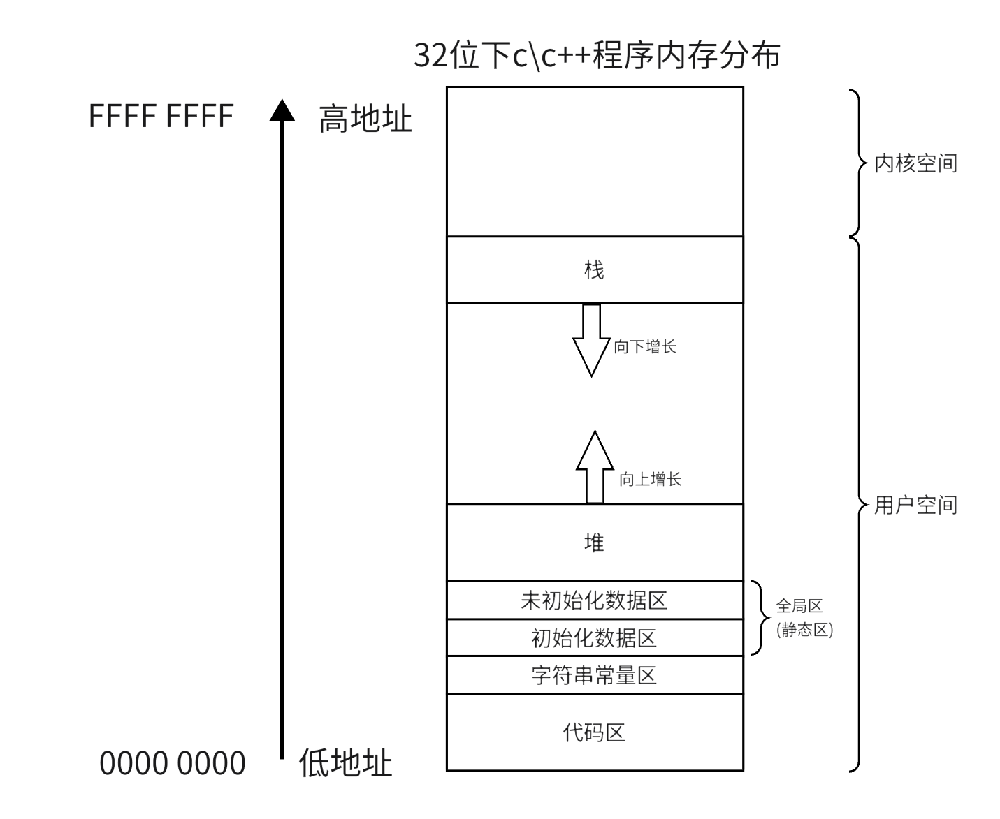

# 内存管理

## **C/C++内存分布**

对于C/C++程序，我们可以将内存分为一下几个区：

- 静态区（数据段）：存放全局变量和静态数据
- 常量区（代码段）：存放只读常量/可执行代码
- 堆区：用于程序运行时动态分配内存。
- 栈区：存放临时变量。

<figure markdown="span">
  { width="550" }
</figure>

## **C++中的内存管理**

在C语言中我们使用malloc / realloc / calloc来在堆区申请空间。使用free来释放堆区内存。malloc是只申请空间，calloc是申请空间并且赋初始值，realloc是更改申请的空间大小。


这样进行申请空间的弊端是操作繁琐，并且在为类申请内存时，使用上面的函数开辟内存，还需要使用 placement new(后文会介绍) 去手动调用构造函数，非常麻烦。

为了解决这个问题，C++提供了new和delete操作符。

申请和释放单个元素的空间，使用new和delete操作符，申请和释放连续的空间，使用new[]和delete[]。


### **operator new 和operator delete函数**

new 和 delete 是用户进行动态内存申请和释放的操作符，operator new 和 operator delete 是系统提供的全局函数，new 在底层调用 operator new 全局函数来申请空间，delete 在底层通过 operator delete 全局函数来释放空间。

```cpp
/*
operator new：该函数实际通过malloc来申请空间，当malloc申请空间成功时直接返回；
申请空间失败，尝试执行空间不足应对措施，如果应对措施用户设置了，则继续申请，否则抛异常。
*/
void* __CRTDECL operator new(size_t size) _THROW1(_STD bad_alloc)
{
    // try to allocate size bytes
    void* p;
    while ((p = malloc(size)) == 0)
        if (_callnewh(size) == 0)
        {
            // report no memory
            // 如果申请内存失败了，这里会抛出bad_alloc 类型异常
            static const std::bad_alloc nomem;
            _RAISE(nomem);
        }
    return (p);
}
/*
operator delete: 该函数最终是通过free来释放空间的
*/

/*
free的实现
*/
#define free(p) _free_dbg(p, _NORMAL_BLOCK)
void operator delete(void* pUserData)
{
    _CrtMemBlockHeader* pHead;
    RTCCALLBACK(_RTC_Free_hook, (pUserData, 0));
    if (pUserData == NULL)
        return;
    _mlock(_HEAP_LOCK); /* block other threads */
    __TRY
        /* get a pointer to memory block header */
        pHead = pHdr(pUserData);
    /* verify block type */
    _ASSERTE(_BLOCK_TYPE_IS_VALID(pHead->nBlockUse));
    _free_dbg(pUserData, pHead->nBlockUse);
    __FINALLY
        _munlock(_HEAP_LOCK); /* release other threads */
    __END_TRY_FINALLY
        return;
}
```

看了上面的代码我们知道 operator new 和 operator delete 就是对 malloc 和 free 的封装，这样的目的是为了更好的适应在 C++ 代码中进行异常处理。


#### **new[] 和 delete[] 、new 和 delete 为什么要匹配使用？**

delete[] 和delete 都是调用 free 进行内存释放，唯一的区别是 delete[] 会调用多次析构函数， delete 只会调用一次。当类中申请过堆区内存时，如果不使用 delete[] 就会出现内存泄漏的问题，但是如果类中没有申请过堆区内存，构造函数没有进行任何操作时，那调用这个两个不是就没区别了嘛？

这肯定是不对的。

**原因出在 new 和 new[] 的区别上。**

我们在 new[] 的时候，会给操作符输入一个元素个数，这样 new 操作符就能知道要调用几次构造函数；但是 delete[] 在使用时并不需要我们输入具体的数组大小，它时怎么知道要调用几次析构函数的？

原因是 new[] 操作符在申请空间时，会额外申请一个元素大小的空间，这个额外的空间会存储这个数组的大小。而这多的空间是在new给我们返回的指针的前面。

<figure markdown="span">
  { width="500" }
</figure>

<!-- <div align="center"></div> -->

在调用 delete[] 时会向前偏移指针，找到正确的动态内存的开始位置，来调用 free，而 delete 不会这样做，就会出现报错。

但是有时编译器会做一些优化，就又会引发一些问题。

我们再看下面这个例子

```cpp
// 在Windows下VS2022环境下和Linux下g++ 4.8.5结果相同
#include <iostream>
// 使用默认析构函数的类
class A
{
public:
};

// 自定义析构函数的类
class B
{
public:
    ~B(){}
};

int main()
{
    // 猜猜哪段代码会引起报错？
    A* a = new A[10];
    delete a;


    B* b = new B[10];
    delete b;


    return 0;
}
```

答案是B类会引起报错。这是编译器优化的结果，因为A类中使用的是C++默认的析构函数，这是编译器已经知道析构函数什么都不会做，也就不需要记录具体的元素个数，所以编译器就没有额外申请空间，返回的指针就是动态内存正确的开始位置，所以可以正常运行。

但是B就不一样了，我们提供了具体的析构函数，编译器就不敢擅作主张的不去调用析构函数。就会出现我们上面介绍的问题。

但是这样的优化并不是c++标准强制的，一些老的编译器可能不会进行这样的优化，这样A类这样写也会报错，所以结果是未定义的。

所以我们一定要匹配使用，避免不必要的麻烦。

### **定位new表达式(placement-new)**

定位new表达式是在已分配的原始内存空间中调用构造函数初始化一个对象。

语法：
```cpp
new (place_address) type
new (place_address) type(initializer-list)
//place_address必须是一个指针，initializer-list是类型的初始化列表
```

定位new表达式在实际中一般是配合内存池使用。因为内存池分配出的内存没有初始化，所以如果是自定义类型的对象，需要使用new的定义表达式进行显示调构造函数进行初始化。

## **new/delete和malloc/free的区别**

说了这么多终于到了喜闻乐见的八股环节。

malloc/free和new/delete的共同点是：

- 都是从堆上申请空间，并且需要用户手动释放。

不同点：

- malloc和free是函数，new和delete是操作符
- malloc函数申请的空间不会进行初始化，new可以进行初始化
- malloc申请空间时，需要手动计算空间大小并传递，new只需在其后跟上空间的类型即可，如果是多个对象，[]中指定对象个数即可
- malloc的返回值为void*, 在使用时必须强转，new不需要，因为new后跟的是空间的类型
- malloc申请空间失败时，返回的是NULL，因此使用时必须判空，new不需要，但是new需要捕获异常
- 申请自定义类型对象时，malloc/free只会开辟空间，不会调用构造函数与析构函数，而new在申请空间后会调用构造函数完成对象的初始化，delete在释放空间前会调用析构函数完成空间中资源的清理。


