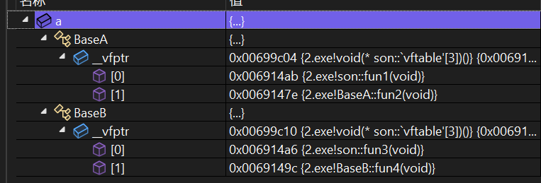
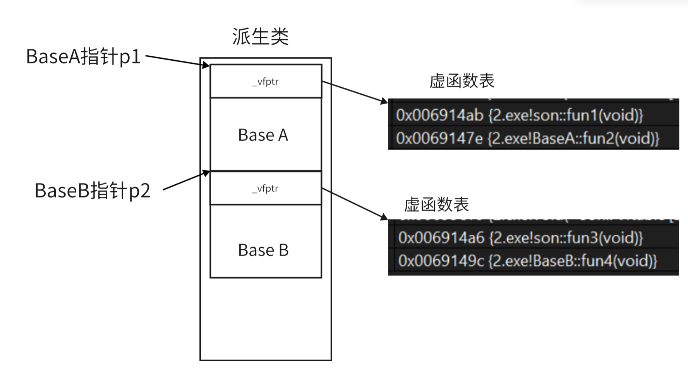

## **基础**

### **关键字**

被 `virtual` 修饰的类成员函数称为虚函数，可以由子类重写。

虚函数后加 `= 0` ，就成了纯虚函数，包含纯虚函数的类被称作抽象类，抽象类不能实例化对象，继承抽象类的派生类只有重写纯虚函数后才能进行实例化。

C++11 中还给出两个与多态相关的关键字：

- `final`：修饰虚函数，表示该虚函数不能再被重写
- `override`: 检查派生类虚函数是否重写了基类某个虚函数，如果没有重写编译报错。

### **多态构成条件**

多态构成的条件有以下两点：

- 必须通过基类的指针或者引用调用虚函数
- 被调用的函数必须是虚函数，且派生类必须对基类的虚函数进行重写

在派生类中重写基类中的虚函数需要保证函数名字（虚析构不需要名字相同）、参数列表完全相同。

我们要明确的是派生类继承的是基类虚函数的声明，重写的是实现。

判断下面程序的输出：

```cpp
struct A
{
    virtual void fun(int val = 1){cout << "A" << val << endl;}
    void test(){fun();}
};

struct B:public A
{
    virtual void fun(int val = 0){cout << "B" << val << endl;}
};

int main()
{
    B* p = new B;
    p->test();
    return 0;
}
```

先说答案，输出B1。

这里 `B` 的指针调用继承自 `A` 的函数 `test`，在 `test` 中的 `this` 的类型是 `A*` ，使用基类指针调用派生类对象中重写的虚函数，所以构成多态。

但是我们刚说过派生类继承的是基类虚函数的声明，重写的是实现，所以 `val` 的值是 1，但是实现是派生类的，所以会输出 `B1`。


## **多态原理**

### **虚函数表**

每个带有虚函数的类都会被加入一个 **虚函数表指针** ，他指向一个虚函数表，表中的函数都是当前类下的虚函数地址。该表被存储在**静态区**中。当实例对象调用虚函数时，就要通过虚函数表去查找虚函数的地址。

我们可以通过观察 VS 下监视窗口看到：

```cpp
#include<iostream>
using namespace std;
class BsaeA
{
public:
	virtual void fun1() { cout << "f1" << endl; }
	virtual void fun2() { cout << "f2" << endl; }
};

int main()
{
	BaseA a;
	return 0;
}
```

<figure markdown="span">
  { width="600" }
</figure>


当派生类重写这些虚函数时，在派生类中的虚函数表对应的函数地址会被覆盖为派生类中重写的函数地址。

我们知道当基类指针或引用指向派生类时，会进行切片，去维护派生类对象属于基类的部分。所以当我们拿指向派生类的基类指针调用重写的虚函数时，他就会在从该派生类对象所指向的虚函数表中找该函数地址，所以最后调用的函数就是派生类重写的函数。

当然没有在派生类重写的虚函数，在虚函数表中的函数地址是与基类中的相同的。

```cpp
#include<iostream>
using namespace std;
class BaseA
{
public:
	virtual void fun1() { cout << "f1" << endl; }
	virtual void fun2() { cout << "f2" << endl; }
};

class B :public BaseA
{
public:
	virtual void fun1() { cout << "B::f1" << endl; }
};

int main()
{
	BaseA a; 
	B b;
	return 0;
}
```

<figure markdown="span">
  { width="600" }
</figure>

我们可以看到被重写的函数 `fun1` 地址变成了 `0x00be1488` ，没有被重写的 `fun2` 地址与基类相同。

要注意的是，当有多个基类时，每个基类的虚函数表指针是分开的。这也是可以理解的，因为不同的基类指针指向派生类时，所切片的内容肯定是对应基类的内容，那么想要实现不同类的多态，就必须要将不同类的虚函数表指针分开。


```cpp
#include<iostream>
using namespace std;
class BaseA
{
public:
	virtual void fun1() { cout << "f1" << endl; }
	virtual void fun2() { cout << "f2" << endl; }
};
class BaseB
{
public:
	virtual void fun3() { cout << "f1" << endl; }
	virtual void fun4() { cout << "f2" << endl; }
};
class son:public BaseA ,public BaseB
{
public:
	virtual void fun1() { cout << "son::f1" << endl; }
	virtual void fun3() { cout << "son::f3" << endl; }
};

int main()
{
	son a;
	return 0;
}
```

<figure markdown="span">
  { width="600" }
</figure>

他们的逻辑关系就如下图：

<figure markdown="span">
  { width="700" }
</figure>


### **`this` 指针的修正**


### **虚继承和多态**

