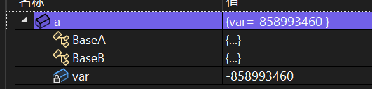
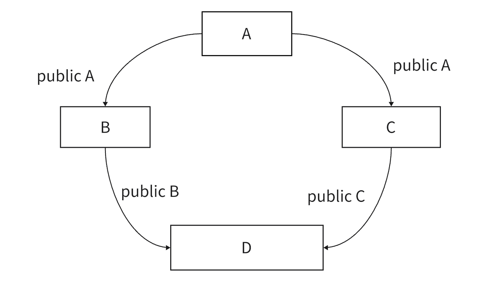
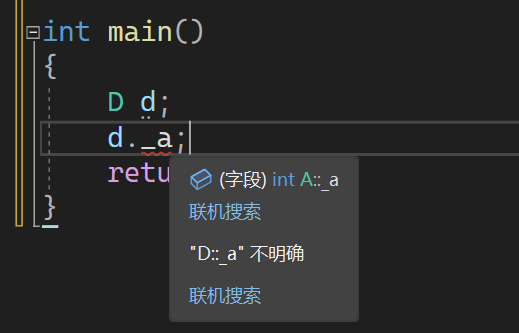
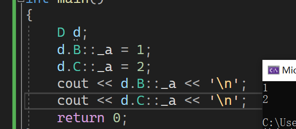
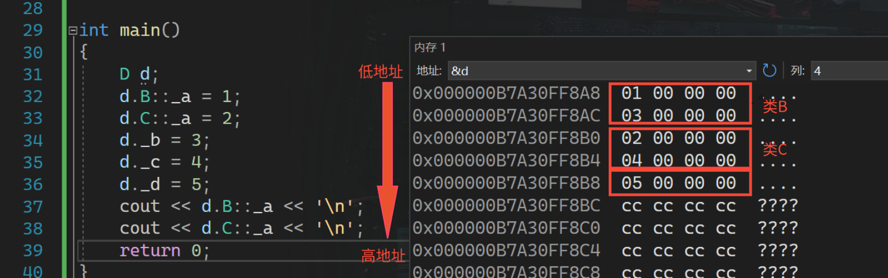
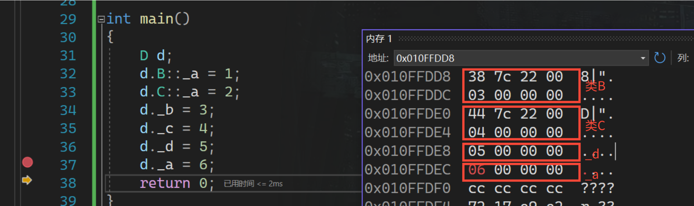
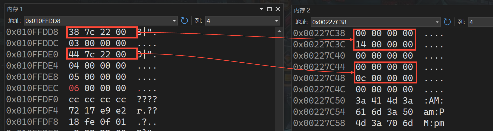
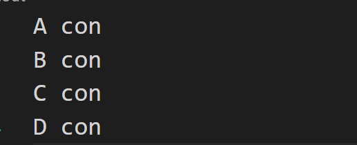

## **构造顺序**

初学 C++ 时，你一定记过派生类和子类的构造顺序，但是没想过为什么是这样的顺序。

学习初始化列表时，我们了解到编译器在构造成员变量时，不会按照我们在初始化列表的顺序进行构造，而是声明顺序进行构造。我们通过 VS 监视窗口可以看到，基类会按照继承顺被编译器声明在整个派生类的开头，如下：

```cpp
#include<iostream>
using namespace std;
class BaseA{};
class BaseB{};
class son:public BaseA ,public BaseB
{
	int var;
};

int main()
{
	son a;
	return 0;
}
```
<figure markdown="span">
  { width="500" }
</figure>

那么按照上述类构造原则，很容易就能想到为什么会先构造父类，为什么多继承时会按照从左向右的顺序一一构造。本质上就是成员变量的构造。

## **基类和派生类对象赋值转换**

子类对象可以赋值给父类的对象、父类的指针、父类的引用，这些变量会维护子类对象中父类的那部分成员。

注意这个过程中并不会像其他变量转化那样产生临时变量。

```cpp
double a;
// 这样会报错
int& pa = a;

// A为子类 B为父类
A x;
// 这样写不会报错
B& px = A
```

一般情况下，不同类型间的赋值会产生一个临时变量，然后将这个临时变量赋值给目标类型，但是临时变量具有常性，如果直接拿 `int&` 来引用就会报错，要换成 `const int&` 。

但是对于子类对象对父类的赋值就不会产生临时变量，而是父类对象直接维护子类中从父类继承来的那部分成员。

但是在私有继承和保护继承时父类指针(引用)无法指向子类。

## **继承中的作用域**

在继承体系中，父类和子类都有独立的作用域。所以对于父类和子类中的同名函数并不会构成函数重载，而是构成隐藏关系。

所谓隐藏就是在子类中会默认调用子类中的同名函数，而屏蔽父类中的同名函数。当需要调用父类的同名函数时，就要加上作用域限定符。

## **继承静态成员**

基类定义了static静态成员，则整个继承体系里面只有一个这样的成员。无论派生出多少个子类，都只有一个static成员实例 。

## **继承与友元**

友元关系不能被继承，也就是说基类友元不能访问子类私有和保护成员。


## **菱形继承和虚继承**

### **虚继承原理**

菱形继承是多继承的一种特殊情况：

<figure markdown="span">
  { width="500" }
</figure>

<!-- <div align="center"></div> -->

菱形继承会导致数据冗余和二义性的问题，即在类 D 中有两份类 A 的数据，一份由 B 继承而来，一份由 C 继承而来。以下就是一个菱形继承的例子：

```cpp
class A
{
public:
	int _a;
};

class B: public A
{
public:
	int _b;
};

class C: public A
{
public:
	int _c;
};

class D: public B,public C
{
public: 
	int _d;
};
```

当我们像下面这样直接访问时就会出现二义性：

<figure markdown="span">
  { width="500" }
</figure>

<!-- <div align="center"></div> -->

需要我们用作用域限定符来指定访问哪个_a

<figure markdown="span">
  { width="500" }
</figure>
<!-- 
<div align="center"></div> -->

我们通过观察 d 内存可以发现，类 A 中的 _a 的确继承了两份。

<figure markdown="span">
  { width="700" }
</figure>

<!-- <div align="center"></div> -->

那么想要解决这样的问题就要用到虚继承，用到关键字 virtual，如果子类采用虚继承的方式继承父类，那么该父类被称作**虚基类**，且继承后会在子类中多加入一个指针，指向一个虚基类表，该表中记录了本类地址到虚基类地址的偏移量。

下面采用虚继承的方式，再次观察一下 d 的内存分布

```cpp
class A
{
public:
	int _a;
};

class B : virtual public A
{
public:
	int _b;
};

class C : virtual public A
{
public:
	int _c;
};

class D : public B, public C
{
public:
	int _d;
};
```

<figure markdown="span">
  { width="700" }
</figure>

<!-- <div align="center"></div> -->

这时来自类 A 的 _a 就只有一份了，但是类 B 和类 C 中多了两个变量，这两个就是虚基类表指针，指向各自的虚表，表中就记录了本类到虚继承基类的偏移量。

我们用可以查看一下其指向的内存位置：

<figure markdown="span">
  { width="700" }
</figure>

<!-- <div align="center"></div> -->

这是小端机，所以可以看到内存中存有 `0x00 00 00 14` 即 20，我们将类 B 的开始地址加上 20 正好是类 A 部分的开始地址。对于类 C 部分也是相同的 加上 `0x00 00 00 0c` 即 12 也能得到类 A 部分的开始地址。这样就解决了数据冗余和二义性的问题。

### **虚基类的初始化**

在虚继承中，虚基类是在最后一个派生类中构造的，也就是说如果虚基类中没有默认构造函数，那么就要在最后的派生类中的初始化列表显示的调用虚基类的构造函数，所以在虚基类中任何一个需要实例化的派生类中都需要将虚基类的构造函数显示的调用出来。

```cpp
class A
{
public:
	A(int a){}
};

class B: virtual public A
{
public:
	B(int a):
		A(a)
    {}
};

class C: virtual public A
{
public:
	C(int a):
		A(a)
	{}
};

class D: public B,public C
{
public: 
	D(int a):
		A(a),
		B(a),
		C(a)
	{}
};

void solve()
{
	D d(1);
}
```

这也很好理解，因为实现虚继承，是通过虚基类表记录偏移量得到的，我一定希望偏移量都是正数，方便记录，所以就要将虚基类声明在所有继承类的后面，所以一定是最后构造虚基类。

### **虚继承构造函数的调用**

首先我们要知道，每个虚基类都只会调用一次构造函数，因为C++编译系统只执行最后的派生类对虚基类的构造函数调用，而忽略其他派生类对虚基类的构造函数调用。从而避免对基类数据成员重复初始化。

并且调用顺序服从以下原则：

1. 虚基类的构造函数在非虚基类之前调用。
2. 若同一层次中包含多个虚基类，这些虚基类的构造函数按它们声明的顺序调用。
3. 若虚基类由非虚基类派生而来，则仍然按照先调用基类的构造函数，再调用派生类的构造函数的执行顺序。　

以下面代码为例

```cpp
class A
{
public:
	A()
	{cout << "A con\n";}
};

class B: virtual public A
{
public:
	B()
	{cout << "B con\n";}
};

class C: virtual public A
{
public:
	C()
	{cout << "C con\n";}
};

class D: public B,public C
{
public: 
	D()
	{cout << "D con\n";}
};

void solve()
{
	D d;
}
```

输出结果为：

<figure markdown="span">
  { width="300" }
</figure>

<!-- <div align="center"></div> -->

析构函数的调用顺序和构造函数的调用顺序是相反的。

## 组合和继承

继承和组合都能实现代码的复用，但是又有一些不同。

1.继承和组合时类间的逻辑关系不同：

- public 继承是一种 is-a 的关系，即每个派生类对象都是一个基类对象。　
- 组合是一种 has-a 的关系。即当 B 组合 A 后，每个 B 类对象中都包含 A 类对象。

2.继承和组合时对类的访问权限不同：

- 继承时，派生类中可以访问基类中的保护成员。
- 当 B 组合 A 后，B类只能访问 A 类中的公共成员。