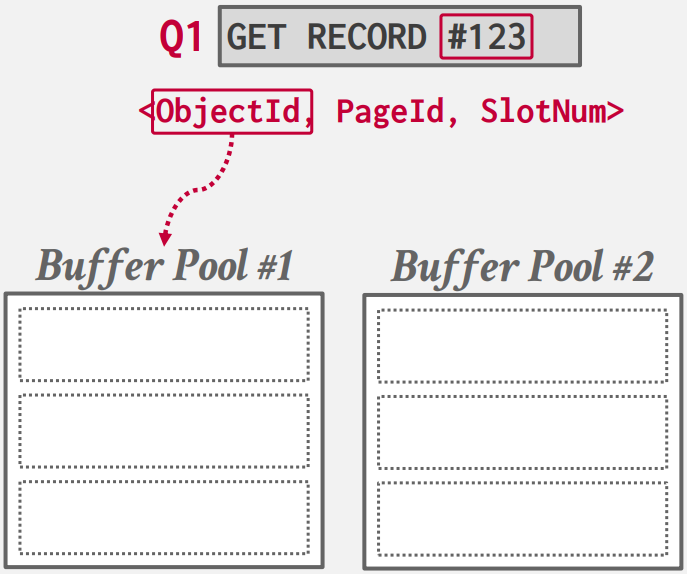

如何从磁盘获取所需数据页，将其载入内存，并在需要引入新数据时，如何做出移除决策以节省空间和时间。

要考虑两个方面：

- 空间控制：要考虑将数据写到磁盘的哪个位置，目标就是将可能会一起用到的数据，尽量在磁盘上也排列在一起，因为磁盘的顺序 IO 效率是高于随机 IO 的，这里就是要尽量增加顺序 IO 概率。

- 时序控制：何时将页面读入内存，何时写回磁盘。目标是减少读取磁盘的停顿。

虽然 OS 提供系统调用 `mmap` 来进行页面的映射，但是有很多问题，所以大部分数据库系统都会添加一层缓存池管理器来对页面的调度和使用进行管理。

## **缓存池管理器**

缓冲池通常是一块静态的内存空间，在数据库启动时就确定的，要改变缓存池大小就要重新启动数据库。这块内存空间被分隔为若干个大小相等的帧（frame），帧可以理解为存放页面的容器，当数据库需要一个新页面时，就会将磁盘上对应的数据拷贝到一个空的帧当中：


<figure markdown="span">
  { width="350" }
</figure>


并且管理器会维护一个页表，这个页表与 OS 中的不同，它记录此时在内存中的页面，以及页面所在位置的指针。

<figure markdown="span">
  { width="350" }
</figure>

除此之外每个页面都要维护一些元数据，如：脏标记、引用计数以及一些访问信息。在并发环境下，我们要记录引用对应页面的 worker 数量，只有数量为 0 的页面才能被剔除，并且在调入新页面时，要对页表加锁，来防止并发错误。


### **优化**

当并发量较大时，锁的申请和释放就成为了性能瓶颈。就需要一些优化：

- 多缓存池

- 预取策略

- 扫描共享

- 缓存池旁路

#### **multiple buffer pools**

很多数据库在整个系统中不会仅拥有一个缓存池，每个缓存池有独立的锁，这显而易见可以提高并发效率。Mysql、DB2、ORACLE、SQL Server，都采用了此策略。

甚至在 DB2 针对不同的访问情况，可以指定不同的缓冲策略，如：一些专门用于随机 IO 的表，可以使用一些针对随机访问优化的替换策略，对该表的查询都使用该缓冲池。

那如何确定所需数据在哪个缓冲池中呢？

- 对象 ID：在每条记录的 ID 中加入一个对象 ID，根据对象 ID 找到所在的缓冲池：

<figure markdown="span">
  { width="250" }
</figure>

- 哈希函数：对页面 ID 进行哈希，映射到对应缓冲池中：

<figure markdown="span">
  { width="250" }
</figure>

#### **pre-fetching**

DBMS 会将之后可能用到的页面提前加载到缓存池中，减少了访问磁盘的停顿。

对于顺序读取，在引擎处理 page1 的时候，就会预先将需要 page2 和 page3 加载到缓存池中：

<figure markdown="span">
  { width="350" }
</figure>

对于索引读取，就要考虑具体的数据结构，针对数据结构进行预加载。在 B+ 树的结构中，对于如下查询：

```sql
select * from A 
    where val between 100 and 250;
```

就要针对数据所在的节点进行预加载：

<figure markdown="span">
  { width="450" }
</figure>

#### **scan sharing**

如果两次查询所需的页面是有重叠的，我们或许不需要重复访问这些重叠的页面。如果两次查询有重叠的数据，DBMS 会将后到的查询指针并到已经存在的指针中，读取两个查询的重叠部分，读取完重叠部分后，再读取剩余内容。

DB2、SQL Server、PostgreSQL 完全支持扫描共享的优化。

在 ORACLE 中只有两个查询完全一样才会执行该优化。


#### **buffer pool bypass**

在一些顺序查询中，我们要将顺序读取的数据都加载到磁盘中，但是如果只是扫描一遍表的话，前面读的数据后续也不会用到，但是我们还是要为其维护一系列的元数据，这些开销是可以避免的。

在并发环境下，与其让每个执行流不断调入页面，污染页表，不如在每个执行流中分配一块内存，专门将顺序读取到的数据放在里面，而不放在缓存池中。但在这个本地缓存区中，只能读数据，不能写数据。

ORACLE、SQL Server、PostgreSQL 支持该优化。

## **缓存替换策略**

当 DBMS 需要清空一个 frame 来为新页面腾出空间时，就必须决定替换出哪个页面，能最小化磁盘 IO 的次数，不同的替换策略适用于不同的场景，但总归来说，我们使用替换策略的目标是：

- 缓存的命中率尽可能的高

- 替换策略的决策速度尽可能快

- 维护元数据的开销要尽可能的少

下面介绍以几种替换策略：

### **LRU**

Least-Recently Used，该策略很简单：替换最久没有使用的页面。我们需要维护一个链表，对每个页面我们维护一个时间戳：


<figure markdown="span">
  { width="250" }
</figure>

每次访问一个页面后就将其移动到列表开头。通常还会维护一个哈希表（page table），记录 page_id 到对应页所在的内存地址。

该策略比较简单，没有考虑到 page 使用频率的影响，所以会有一些问题。

### **LRU-K**

LRU 只记录一个页面最近一次的访问，但不考虑页面被访问的频率，在一些周期性的顺序读取时，LRU 的命中率会大幅度下降，例如：我们的程序经常使用页面 4、5、6、7，但会每隔一段时间读取页面 1、2、3，每次顺序读取时，都会将页面 4、5、6、7 中的几个替换出去，1、2、3 会占用我们的 frame，但是我们只读取一次就不再使用它们了，而经常使用的 4、5、6、7 却被替换了出去。

LRU-k 会记录最近的 k 次访问。它的替换策略如下：

- 优先替换页面访问次数不到 k 次的页面，当有多个这样的页面使用 FIFO 策略

- 当没有次数不到 k 次的页面时，替换第 k 次访问最久远的页面。

事实上 LRU 就是 LRU-k，其中 k 等于 1。

SQL Server 和 PostgreSQL 完整实现了 LRU-K。SQL Server 和 PostgreSQL 不同的是，如果在一个事务中，对同一个页面进行了两次读取，SQL Server 只会记录为一次访问，而 PostgreSQL 会记录为两次访问。


### **MySQL 替换策略**

MySQL 实现了一种类似 LRU-K 的缓存策略：它将 LRU 的链表分为了两个部分，old region 和 young region。

<figure markdown="span">
  { width="450" }
</figure>

新的页会被加入到 old list 中，并且替换掉 old list 的末尾位置的页面。

当页面被再次访问时，会被插入到 young list 的链头，young list 的末尾被挤到 old list 的链头。


### **background writing**

我们设计替换策略的目的是尽可能快的拿到我们想要的数据。考虑这样的场景：我们要替换一个页面，根据我们的替换策略，我们要踢出的页面是一个脏页，而我们的磁盘效率又很低，如果我们要写入数据再加载数据，比直接替换一个未被修改的页慢的多，那此时该怎么办，是违反我们的替换策略选择一个未被修改的页？还是继续遵循替换策略花大量时间进行 IO？

这个问题关键在于在读之前有一个写操作，我们要做的就是让写操作不在事务的关键路径上，我们能想到专门开一个线程，周期的将脏页写回磁盘，也就是后台写入。大部分系统都会实现这样的后台写入。

## **磁盘 IO 调度**

操作系统的 IO 调度会尽量最大化带宽通过重排并且批处理 IO 请求，如：OS 会将相邻的 IO 请求合并为一个请求，以减少磁盘寻道和旋转的延迟，。但 OS 不知道这些 IO 请求的优先级，有些时候一些更紧急的 IO 请求可能会被 OS 延后，从而影响速率。

Linux 可以做一些操作，来设置 IO 优先级，但这是针对一个进程的，而这里我们想要的是对单个请求的 IO 优先级。

很多 DBMS 都建议不使用 Linux 的 IO 调度而是使用 deadline 或 FIFO 调度器。例如：MySQL、Oracle 等。因为它们不希望 OS 做太多 DBMS 无法掌控的操作。


### **OS 页面缓存**

我们使用的磁盘操作都要用到系统调用，但是操作系统会维护页面缓存，当我进行写时，为了提高 IO 响应速率，OS 会先将数据保存在它的页面缓存中，等到 OS 的后台进程将其刷新到磁盘上，但 DBMS 并不希望这样，我们要保证数据及时且正确的刷新在磁盘上，而且我们也不想数据多拷贝一份占用内存。

<figure markdown="span">
  { width="250" }
</figure>

所以我们要使用直接 IO（`O_DIRECT`），每次写操作直接将数据刷新在磁盘上。

大部分 DBMS 默认都这样做，除了 PostgreSQL，所以在 PostgreSQL 会使用系统的 40% 的内存作为数据库的缓存池，而其他数据都建议使用 80%，这是因为 PostgreSQL 会一半用作数据库缓存池，一半用作操作系统的页面缓存。

### **fsync 错误**

如果你在数据库中没有使用直接 IO，那么当你调用 `fwrite` 时，那么你的数据并没有被立即保存到磁盘上，而是拷贝到了内核的页面缓存中，这时就要调用 `fsync` 函数来同步数据到磁盘上。

但如果 `fsync` 返回一个错误时，会发生什么？你的数据没有被刷新到磁盘上，但当你再次调用 `fsync` 时，Linux 会告诉你，脏页已经被清理，没什么需要写入磁盘的，并且返回刷新成功，你的数据库系统就会以为数据已经持久化，但事实上并没有。

OS 这样做是考虑到 U 盘被拔掉的可能，你可能永远不会把 U 盘再插回去，就会导致一些脏页永远无法清理。


