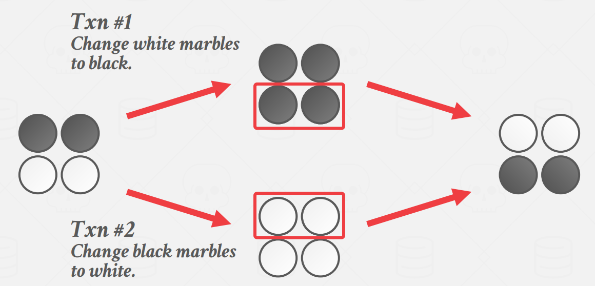
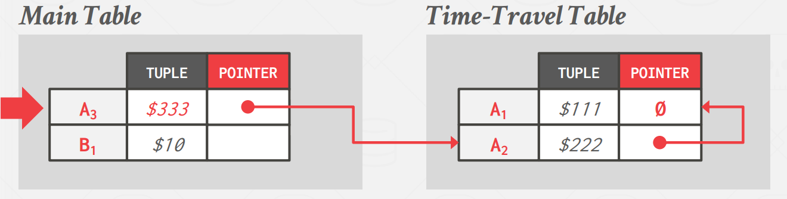
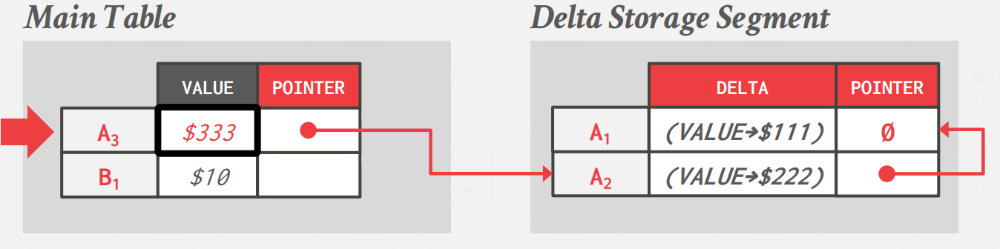
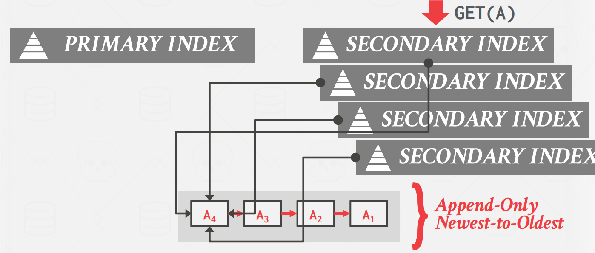
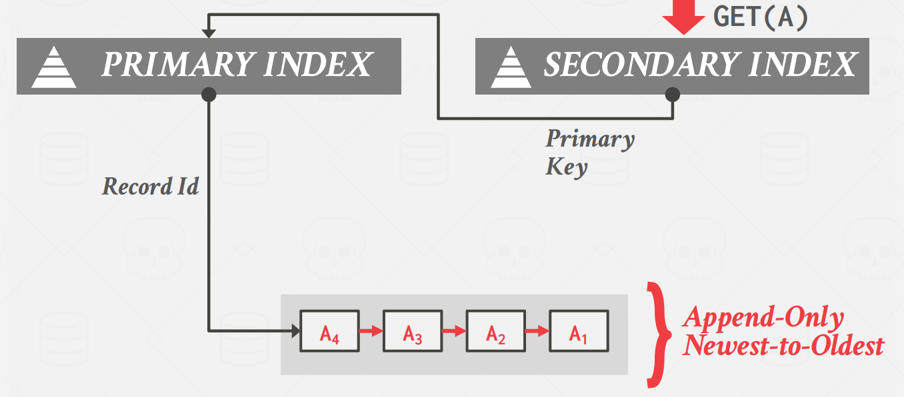
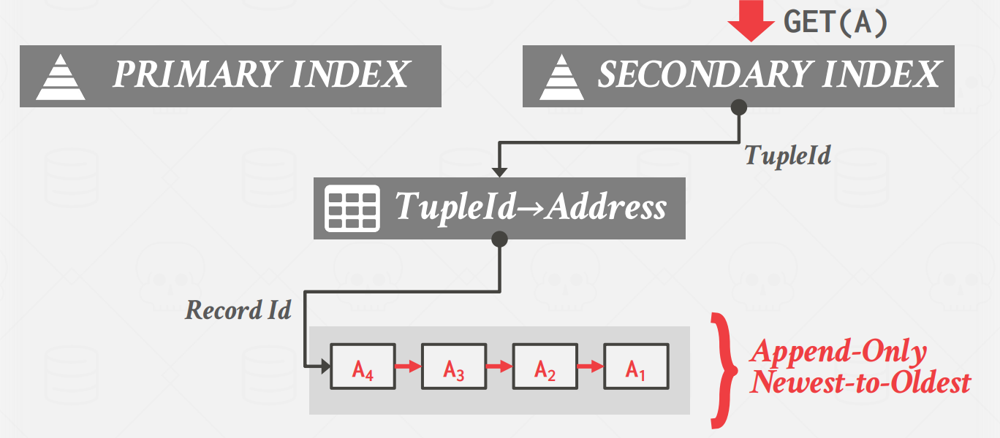
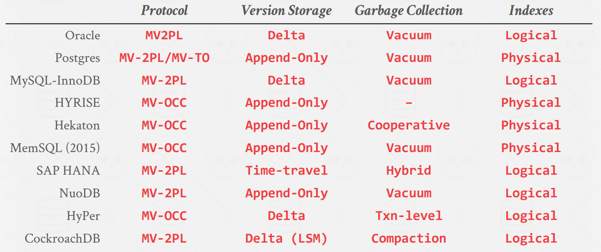

MVCC 首次被提出是在 1978 年的一篇  [MIT 的博士论文](https://web.archive.org/web/20051025124412/http://www.lcs.mit.edu/publications/specpub.php?id=773){target=blank_} 中。在 80 年代早期，DEC 的 Rdb/VMS 和 InterBase 首次真正实现了 MVCC，其作者是 Jim Starkey，NuoDB 的联合创始人。如今，Rdb/VMS 成了 Oracle Rdb，InterBase 成为开源项目 Firebird。

多版本并发控制 (MVCC) 是一个比并发控制协议更大的概念。它涉及DBMS设计和实现的各个方面。如今 MVCC 是 DBMS 中使用最广泛的方案。过去 10 年中，几乎所有新实现的 DBMS 中都使用了它，甚至一些不支持多语句事务的系统（例如NoSQL）也使用它。

通过 MVCC，DBMS 可以维护数据库中单个逻辑对象的多个物理版本。当事务写入对象时，DBMS 会创建该对象的新版本。当事务读取对象时，它会读取事务启动时存在的最新版本。

MVCC 核心优势就是 **写不阻塞读，读不阻塞写**。这意味着一个事务可以修改对象，而其他事务则读取旧版本。如果多个写者正在写入同一对象，则写者仍可能会阻塞其他写者。只读事务读取数据库的快照，而无需使用任何类型的锁。此外，多版本 DBMS 可以轻松支持 time-travel 查询，这是基于数据库在其他某个时间点的状态的查询（例如，对 3 小时前的数据库执行查询）。典型的基于 MVCC 的数据库逻辑是：

1. 多版本存储，存储同一逻辑对象的不同版本。

2. 当事务开始时，DBMS 会截取数据库快照。

3. DBMS 使用快照和时间戳来确定哪些版本的对象对事务可见。

有五个重要的 MVCC 设计决策：

- 并发控制协议（Concurrency Control Protocol）

- 版本存储（Version Storage）

- 垃圾收集（Garbage Collection）

- 索引管理（ndex Management）

- 删除（Deletes）

并发协议的选择是在前面博客中讨论的方法之间（两阶段锁定（2PL）、时间戳排序（T/O）、乐观并发控制（OCC））。

### **Snapshot Isolation**

课程项目的 P4 要求我们实现 Snapshot 的事务隔离级别，所以这里介绍一下。

快照隔离涉及在事务启动时为事务提供一致的数据库快照。快照中的数据值仅包含已提交事务的值，并且事务在完成之前与其他事务完全隔离。这对于只读事务来说是理想的选择，因为它们不需要等待其他事务的写入。写入操作保存在事务的私有工作区中，或者使用事务元数据写入存储，并且只有在事务成功提交后才对数据库可见。SI 需要考虑两个问题：

- Write Conflicts：如果两个事务更新同一个对象，则只保留一个写入

- Write Skew Anomaly：当两个并发事务修改不同的对象导致 non-serializable schedules。例如：

<figure markdown="span">
  { width="600" }
</figure>

## **Version Storage**

这关于 DBMS 如何存储逻辑对象的不同物理版本以及事务如何找到对它们可见的最新版本。

DBMS 使用元组的指针字段为每个逻辑元组创建一个版本链，它本质上是按时间戳排序的版本链表。这允许 DBMS 找到运行时特定事务可见的版本。索引始终指向链的“头”，它是最新的或最旧的版本，具体取决于实现。线程遍历链，直到找到正确的版本。不同的存储方案决定每个版本的存储位置/内容。

### **Append-Only Storage**

逻辑元组的所有物理版本都存储在同一个表空间中。版本在表中混合在一起，每次更新只是将元组的新版本附加到表中并更新版本链。

该链可以按从旧到新（O2N）排序，这需要在查找时进行链遍历；也可以按从最新到旧（N2O）排序，这需要为每个新版本更新索引指针。

### **Time-Travel Storage**

DBMS 维护一个称为 Time-Travel 表的单独表，用于存储旧版本的元组。每次更新时，DBMS 都会将旧版本的元组复制到 Time-Travel 表，并用新数据覆盖主表中的元组。主表中的元组指针指向 Time-Travel 中的过去版本。

<figure markdown="span">
  { width="600" }
</figure>

### **Delta Storage**

与 Time-Travel Storage 类似，但 DBMS 不存储整个过去的元组，而是仅存储增量或元组之间的更改，即所谓的增量存储段。然后，事务可以通过以相反的顺序迭代增量并应用它们来重新创建旧版本。这导致写入速度比 Time-Travel Storage 更快，但读取速度较慢。

<figure markdown="span">
  { width="600" }
</figure>

## **Garbage Collection**

随着时间的推移，DBMS 需要从数据库中删除可回收的物理版本。如果没有活动事务可以“看到”该版本，或者该版本是由已终止的事务创建的，则该版本是可回收的。

### **Tuple-level GC**

通过元组级垃圾回收，DBMS 通过直接检查元组来查找旧版本。有两种方法可以实现此目的：

- Background Vacuuming：单独的线程定期扫描表并查找可回收的版本。这适用于任何版本存储方案。一个简单的优化是维护一个“脏页位图”，它跟踪自上次扫描以来哪些页面已被修改。这允许线程跳过未更改的页面。

- Cooperative Cleaning：工作线程在遍历版本链时识别可回收版本。这仅适用于 O2N 链。如果不被访问，数据将永远不会被清除。

### **Transaction-level GC**

在事务级垃圾回收下，每个事务负责跟踪自己的旧版本，因此 DBMS 不必扫描元组。每个事务维护自己的读/写集。当事务完成时，垃圾收集器可以使用它来识别要回收的元组。DBMS 确定完成事务创建的所有版本何时不再可见。

## **Index Management**

所有主键（pkey）索引始终指向版本链头。 DBMS 更新 pkey 索引的频率取决于更新元组时系统是否创建新版本。

对于 MVCC，维护二级索引更为困难，这里有两种方式。

### **Physical Pointers**

二级索引和主键索引一样指向版本链头的物理地址。这需要在更新版本链头时更新每个索引，这可能非常昂贵。MVCC DBMS 索引（通常）不存储有关元组及其键的版本信息。相反，每个索引必须支持来自不同快照的重复键，因为相同的键可能指向不同快照中的不同逻辑元组。

<figure markdown="span">
  { width="600" }
</figure>

### **Logical Pointers**

DBMS 对每个元组使用一个不会改变的固定标识符，可以是主键，或是一张额外的映射表。这需要一个额外的间接层，将逻辑 id 映射到元组的物理位置。然后，对元组的更新只能更新间接层中的映射。

<figure markdown="span">
  { width="600" }
</figure>

<figure markdown="span">
  { width="600" }
</figure>

## **Deletes**

仅当逻辑删除元组的所有版本都不可见时，DBMS 才会从数据库中物理删除元组。如果一个元组被删除，那么在最新版本之后就不能再有该元组的新版本。这意味着不存在写入冲突，并且第一个写入者获胜。
我们需要一种方法来表示元组在某个时间点已被逻辑删除。有两种方法可以实现这一点。

### **Deleted Flag**

维护一个标志来指示该逻辑元组在最新的物理版本之后已被删除。它可以位于元组标题中，也可以位于单独的列中。

### **Tombstone Tuple**

创建一个空的物理版本来指示逻辑元组被删除。对逻辑删除元组使用单独的池，在版本链指针中仅使用特殊的位模式，以减少存储开销。

## **MVCC Implementations**

市面上 MVCC 的实现所做的设计决定如下表所示：

<figure markdown="span">
  { width="600" }
</figure>