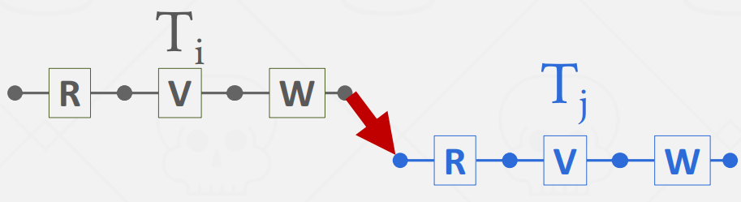
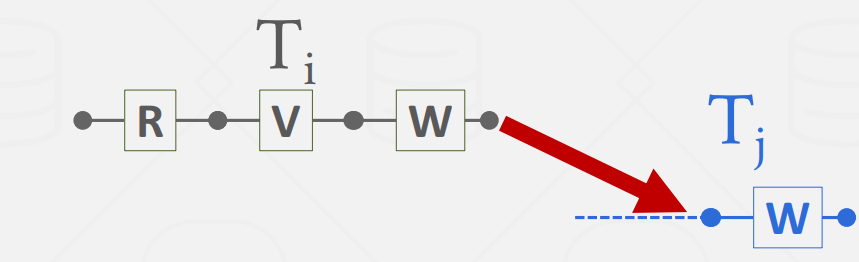
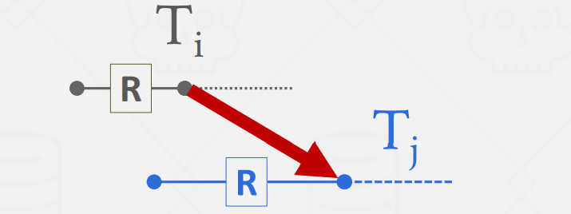
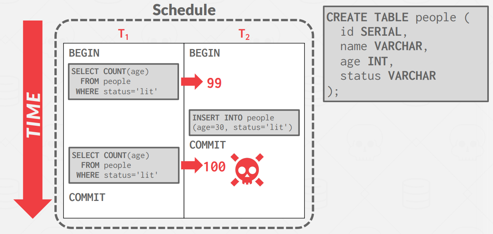
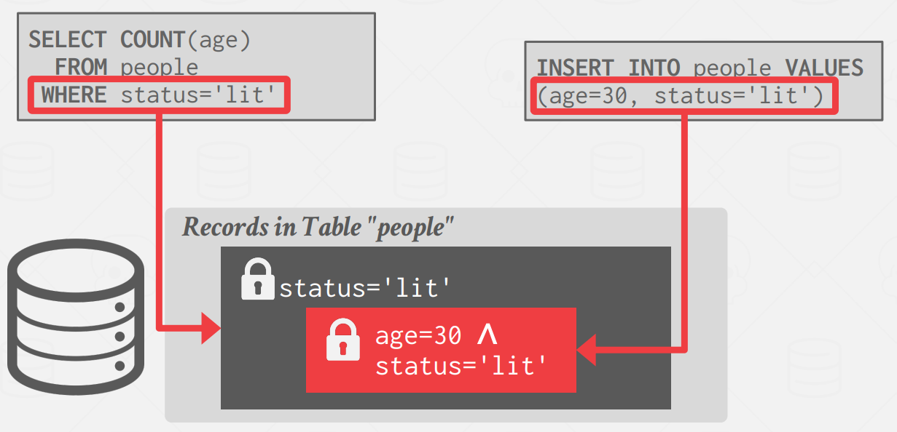
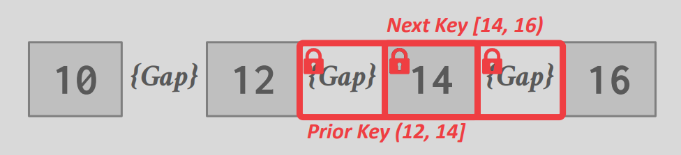
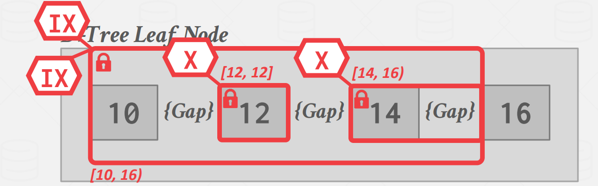
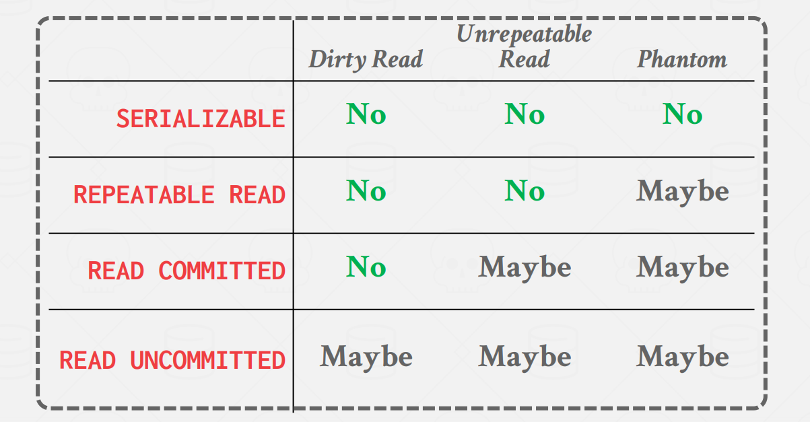
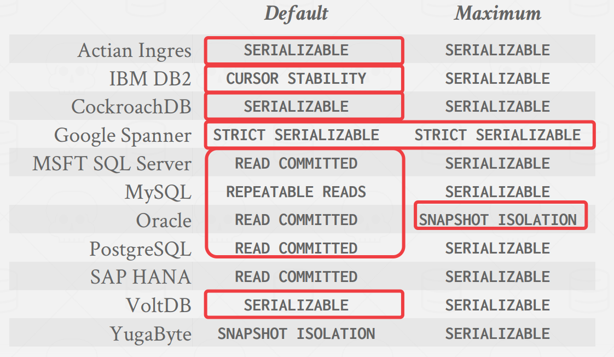

## **Timestamp Ordering Concurrency Control**

时间戳排序 (T/O) 是一类乐观的并发控制协议，其中 DBMS 假定事务冲突很少发生。 DBMS 不要求事务在允许读/写数据库对象之前获取锁，而是使用时间戳来确定事务的可串行化顺序。

每个事务 $T_i$ 都分配有一个单调递增的唯一固定时间戳 $TS(T)$ 。不同的方案在交易期间的不同时间分配时间戳。一些高级方案甚至为每个事务分配多个时间戳。

如果 $TS(T_i) < TS(T_j)$，则 DBMS 必须确保执行调度等于 $T_i$ 出现在 $T_j$ 之前的串行调度。

时间戳分配实现策略有多种。 DBMS 可以使用系统时钟作为时间戳，但夏令时等边缘情况会出现问题。另一种选择是使用逻辑计数器。然而，这存在溢出以及在具有多台机器的分布式系统维护计数器的问题。还有结合使用这两种方法的混合方法。

这里我们不详细讨论时间戳的获取方式，后文假设我们可以通过某种方式获取正确的时间戳。

## **Basic Timestamp Ordering (BASIC T/O)**

基本时间戳排序协议 (BASIC T/O) 允许在不使用锁的情况下读取和写入数据库对象。相反，每个数据库对象 X 都标有在该对象上成功执行读取（表示为 $R-TS(X)$）或写入（表示为 $W-TS(X)$）的最后一个事务的时间戳。然后，DBMS 检查每个操作的这些时间戳。如果事务尝试以违反时间戳顺序的方式访问对象，则事务将中止并重新启动。基本假设是违规行为很少见，因此重新启动也很少见。

### **Read Operations**

对于读取操作，如果 $TS(T_i) < W-TS(X)$，则这违反了 $T_i$ 相对于 X 的前一个写入者的时间戳顺序（do not want to read something that is written in the 'future'）。因此，$T_i$ 中止并使用新时间戳重新启动。否则，读取有效并且允许读取 X。然后 DBMS 将 $R-TS(X)$ 更新为 $R-TS(X)$ 和 $TS(T_i)$ 中的最大值。它还必须在私有工作区中制作 X 的本地副本，以确保 $T_i$ 的可重复读取。

```go
func read(X) val {
    if TS(T_i) < W_TS(X) {
        abort_and_restart(T_i)
    } else {
        val := read_data(X)
        R_TS(X) = max(R_TS(X), TS(T_i))
        // make a local copy of X to ensure repeatable reads for T_i
        return val
    }
}
```

### **Write Operations**

对于写操作，如果 $TS(T_i) < R-TS(X)$ 或 $TS(T_i) < W-TS(X)$，则必须重新启动 $T_i$（do not want to
overwrite “future” chang）。否则，DBMS允许 $T_i$ 写入X并更新 $W-TS(X)$ 。同样，它需要制作 X 的本地副本以确保 $T_i$ 的可重复读取。

```go
func write(X, val) {
    if TS(T_i) < R_TS(X) || TS(T_i) < W_TS(X) {
        abort_and_restart(T_i)        
    } else {
        X = val
        W_TS(X) = max(W_TS(X), TS(T_i))
        // make a local copy of X to ensure repeatable reads for T_i
    }
}
```

### **Optimization: Thomas Write Rule**

写入的优化是，如果 $TS(T_i) < W-TS(X)$，则 DBMS 可以忽略写入并允许事务继续，而不是中止并重新启动它。这称为托马斯写入规则。请注意，这违反了 $T_i$ 的时间戳顺序，但这没关系，因为没有其他事务会读取 $T_i$ 对对象 X 的写入。如果事务 $T_i$ 对对象 X 进行后续读取，则它可以读取自己的 X 本地副本。

### **Summary**

如果基本 T/O 协议不使用 Thomas Write 规则，则它会生成可冲突序列化的调度。Basic T/O 的优势在于：

- 它不会出现死锁，因为没有事务会等待。

- 如果单个事务涉及的数据不多、不同事务涉及的数据基本不相同 (OLTP)，可以节省 2PL 中控制锁的额外成本，提高事务并发度

其缺点在于：

- 每次读取对象都需要一个时间戳写入。

- 将数据复制到事务工作区以及更新时间戳的开销很高。

- 长事务容易因为与短事务冲突而饿死

- 复制数据，维护、更新时间戳存在额外成本

- 在高并发系统上遇到时间戳分配瓶颈。  

- 允许不可恢复的计划。

它还允许不可恢复的计划。如果事务仅在它们读取其更改的所有事务提交之后才提交，则调度是可恢复的。否则，DBMS 无法保证事务读取的数据将从崩溃中恢复后恢复。


## **Optimistic Concurrency Control (OCC)**

乐观并发控制（OCC）是另一种乐观并发控制协议，它也使用时间戳来验证事务。当冲突数量较少时，OCC 效果最佳。这是当所有事务都是只读的或者当事务访问不相交的数据子集时。如果数据库很大并且工作负载不偏斜，那么发生冲突的可能性就很低，这使得 OCC 成为一个不错的选择。

在 OCC 中，DBMS 为每个事务创建一个私有工作区。事务的所有修改都会应用于此工作区。读取的任何对象都会复制到工作区，写入的任何对象都会复制到工作区并在其中进行修改。任何其他事务都无法读取另一个事务在其私有工作区中所做的更改。

当事务提交时，DBMS 会比较该事务的工作区写入集，以查看它是否与其他事务冲突。如果没有冲突，写入集将安装到“全局”中。

OCC 包含三个步骤：

- Read Phase：在此阶段，DBMS 跟踪事务的读/写集，并将需要的数据存储在私有工作区中，整个 SQL 逻辑在此过程中进行。

- Validation Phase：当事务提交时，DBMS 检查它是否与其他事务冲突。

- Write Phase：如果验证成功，DBMS 将私有工作区的更改应用到数据库。否则，它将中止并重新启动事务。

### **Validation Phase**

在进入 Validation Phase 后，每个事务都会被赋予一个时间戳，然后与其它正在运行的事务执行 Timestamp Ordering 检查，检查的方式有两种：

- Backward Validation：检查小于当前时间戳的事务

- Forward Validation：检查大于当前时间戳的事务

这里我们以 Forward Validation 为例，DBMS 检查提交事务与所有其他正在运行的事务的时间戳顺序。尚未进入验证阶段的交易被分配时间戳为 $\infty$。

Forward Validation，对于 $T_i$，我们只检查 $TS(T_i) < TS(T_j)$ 的事务，那么就要考虑以下三种情况：

- $T_i$ 在 $T_j$ 开始执行之前完成所有三个阶段（串行排序）。

<figure markdown="span">
  { width="650" }
</figure>

这相当于两个事务串行执行，不需要检查。

- 在 $T_j$ 开始写入阶段之前，$T_i$ 就完成了写入阶段。

<figure markdown="span">
  { width="650" }
</figure>

这是就需要检查 $T_i$ 的写集合 和 $T_j$ 的读集合是否有交集，要保证 

$WriteSet(T_i) \cap ReadSet(T_j) = \phi$

- 在 $T_j$ 完成其读取阶段之前，$T_i$ 就完成了其读取阶段。

<figure markdown="span">
  { width="650" }
</figure>

在这种情况下，两个事务的 写阶段 会有交集，这时我们不仅要检查 $T_i$ 的写集合 和 $T_j$ 的读集合是否有交集，还要检查两个事务的写集合是由有交集，要保证 

$WriteSet(T_i) \cap ReadSet(T_j) = \phi$ 且 

$WriteSet(T_i) \cap WriteSet(T_j) = \phi$

### **Write Phase**

在写阶段，通常 DBMS 实现时都是一把大锁将整个表锁上，再写入数据。

一些数据库可能会使用一些细粒度的锁来实现并行的写入，然后按照逐渐的顺序请求锁，以此来避免死锁。

### **Summary**

OCC 与 Basic T/O 的思路类似，都是在检查事务之间的 WW、WR 冲突。当冲突发生的频率很低时，即：

- 大部分事务都是读事务时

- 大部分事务之间访问的数据间没有交集时

OCC 的表现很好，如在数据库体量较大， workload 比较均衡的场景下。但依然存在一些问题：

- 将数据本地复制到事务的私有工作区的开销很高。

- 验证 和 写入阶段可能出现性能瓶颈，并发数量大的情况下，可能任意两个事务之间都要进行验证。写入时还有锁的开销。

- 中止可能比其他协议更浪费时间，因为它们仅在事务已经执行之后发生。

- 时间戳分配瓶颈。

<hr>

## **Dynamic Databases and The Phantom Problem**

在之前的讨论中，我们考虑了对数据库中的一组静态对象进行操作的事务。然而，当事务执行插入、更新和删除时，我们会遇到一系列新的复杂情况。当事务仅锁定现有记录而忽略正在创建的记录时，就会出现幻读（Phantom Read）问题。这种疏忽可能会导致 non-serializable Schedule 的执行。

<figure markdown="span">
  { width="750" }
</figure>

> 幻读和不可重复读不同，不可重复读是对同一个记录，多次读读到不同的值，而幻读是多次读读到的数据数量不同。

解决这个问题的方法：

- 重新执行扫描（Re-Execute Scans）：事务可能会在提交时重新运行查询以检查不同的结果，指示由于新记录或删除记录而错过的更改。

- 谓词锁定（Predicate Locking）: 这涉及根据查询的谓词获取锁，确保满足谓词的任何数据都不能被其他事务修改。

- 索引锁定（Index Locking）：利用索引键来保护数据范围，通过确保没有新数据落入锁定范围内来防止幻象。

### **Re-Execute Scans**

DBMS 跟踪事务执行的所有查询的 WHERE 子句。在提交时，它重新执行读的过程，然后检查是否产生相同的数据集合。

例如，对于一个 `UPDATE` 查询，在 commit 时，会重新执行查询的 scan 过程，检查是否和第一次执行读到的数据相同，但是不再执行修改过程。

### **Predicate Locking**

predicate locking 指的是通过一个逻辑表达式来为潜在的记录加锁，如：`status = 'lit'` 。然而，predicate locking 的成本很高，对每条新插入的数据都需要做校验。基本没有 DBMS 用这种方式实现，一种更高效的做法是 index locking。

<figure markdown="span">
  { width="750" }
</figure>

该方案最初是在 System R 中提出的，但并未得到广泛实施。

### **Index Locking**

我们假设这样的常见，一个查询会读取 $[14,16)$ 范围的数据，另一个查询要插入一个 key 为 $15$ 的元素。最开始 B+ 树的叶节点为：

<figure markdown="span">
  { width="750" }
</figure>

对于最简单的 **Key-Value Locks**，我们只获得 $14$ 的锁，插入 $15$ 会造成幻读。这时候对于不存在的值，我们也要加上锁，避免其他插入，于是就有了 gap lock。在读的时候，我们获取 $[14,16)$ 这个范围的锁，就能避免数据的插入：

<figure markdown="span">
  { width="750" }
</figure>

我们可以使用 range lock，每个锁会锁定一个范围内的值，每个范围都是从关系中出现的一个键到出现的下一个键。

<figure markdown="span">
  { width="750" }
</figure>

当记录数量庞大时，为了减少锁的数量，也可以配合 2pl 那里提到的 Hierarchical lock：

<figure markdown="span">
  { width="750" }
</figure>

### **Lock Without An Index**

如果没有合适的索引在查询的字段中，例如我们的查询中有 `where status = 'lit'`，但 `status` 字段并没有索引，我们要加如下的锁来避免幻读：

- 获取 table 的每个 page 上的锁，防止其它记录的 `status` 被修改成 `'lit'`。

- 获取 table 本身的锁，防止满足 `status = 'lit'` 的记录被插入或删除

<hr>

## **Isolation Levels**

Serializability 很有用，因为它允许程序员忽略并发问题，但强制执行它可能会导致并行性过低并限制性能。我们可能希望使用较弱的一致性级别来提高可扩展性。

隔离级别控制事务暴露给其他并发事务的操作的程度。首先看我们可能遇到的异常情况：

- 脏读：如果一个事务「读到」了另一个「未提交事务修改过的数据」，就意味着发生了「脏读」现象。

- 不可重复读：在一个事务内多次读取同一个数据，如果出现前后两次读到的数据不一样的情况，就意味着发生了「不可重复读」现象。

- 幻读：在一个事务内多次查询某个符合查询条件的「记录数量」，如果出现前后两次查询到的记录数量不一样的情况，就意味着发生了「幻读」现象。

要解决就涉及到事务的隔离级别，SQL 标准提出了四种隔离级别来规避这些现象，隔离级别越高，性能效率就越低，这四个隔离级别如下：


- 读未提交（read uncommitted），指一个事务还没提交时，它做的变更就能被其他事务看到；

- 读提交（read committed），指一个事务提交之后，它做的变更才能被其他事务看到；

- 可重复读（repeatable read），指一个事务执行过程中看到的数据，一直跟这个事务启动时看到的数据是一致的，MySQL InnoDB 引擎的默认隔离级别； 

- 串行化（serializable ），会对记录加上读写锁，在多个事务对这条记录进行读写操作时，如果发生了读写冲突的时候，后访问的事务必须等前一个事务执行完成，才能继续执行；

总结如下表：

<figure markdown="span">
  { width="750" }
</figure>

SQL-92 中定义了数据库设置隔离级别的命令：

```sql
SET TRANSACTION ISOLATION LEVEL <isolation-level>;   // 全局设定
BEGIN TRANSACTION ISOLATION LEVEL <isolation-level>; // 单事务设定
```

但并非所有数据库在所有运行环境中都能支持所有隔离级别，且数据库的默认隔离级别取决于它的实现。一些数据库的默认隔离级别和最高隔离级别：

<figure markdown="span">
  { width="750" }
</figure>

SQL-92 中也允许用户提示数据库自己的事务是否会修改数据：

```sql
SET TRANSACTION <access-mode>;   // 全局设置
BEGIN TRANSACTION <access-mode>; // 单个事务设置
```

其中 access-mode 有两种模式：READ WRITE 和 READ ONLY。当然，即便在 SQL 语句中添加了这种提示，也不是所有数据库都会利用它来优化 SQL 语句的执行。