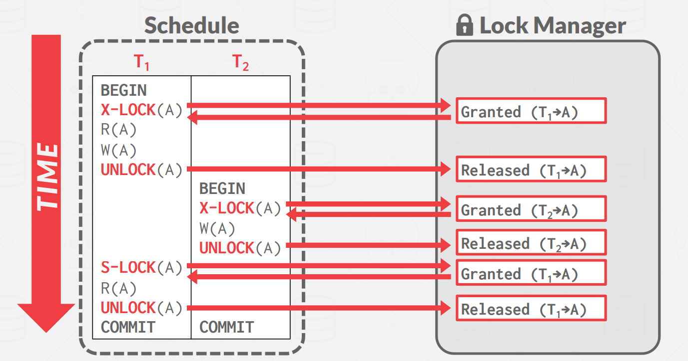
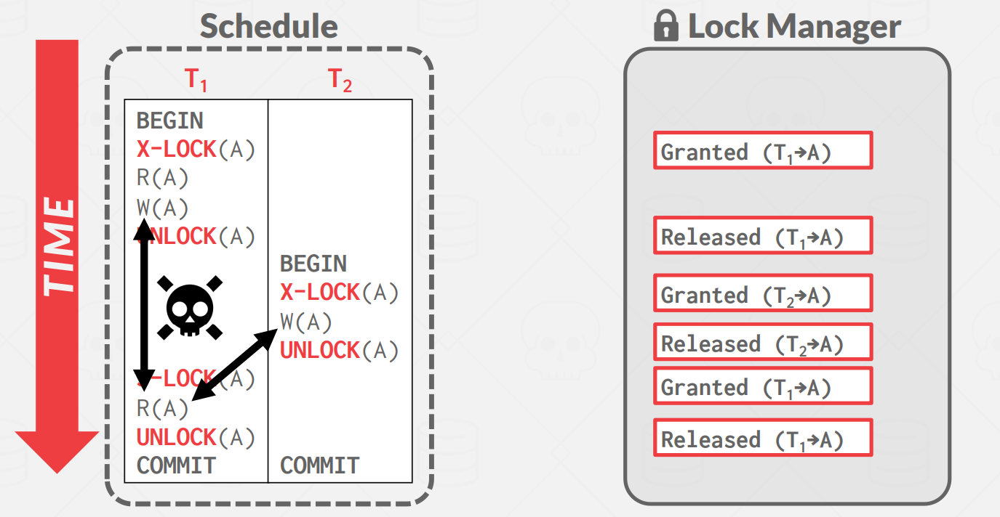
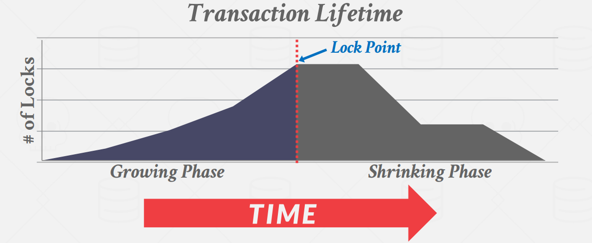
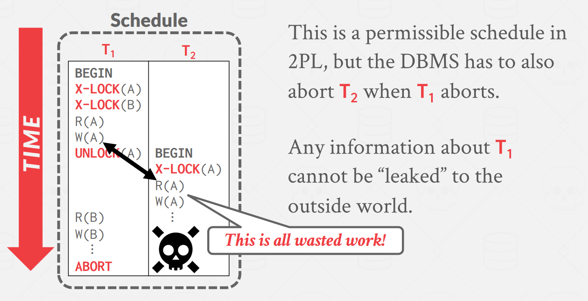
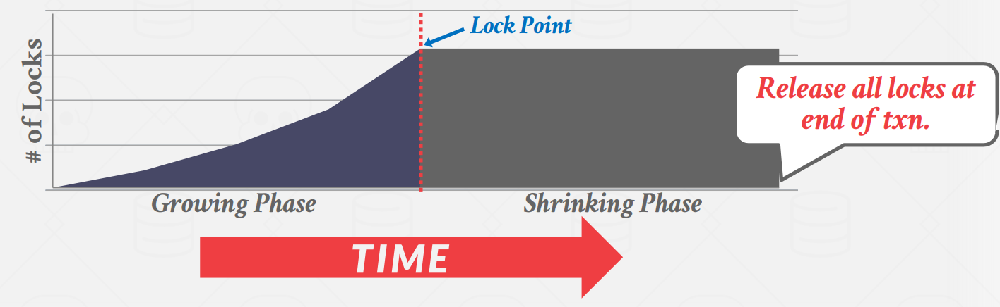
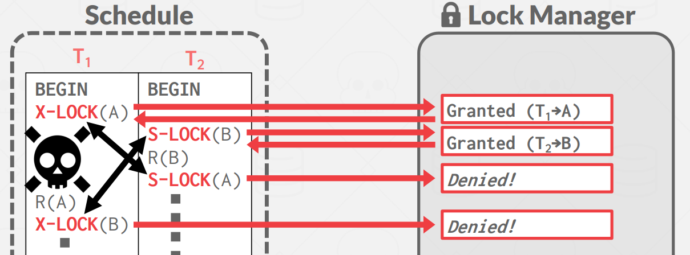
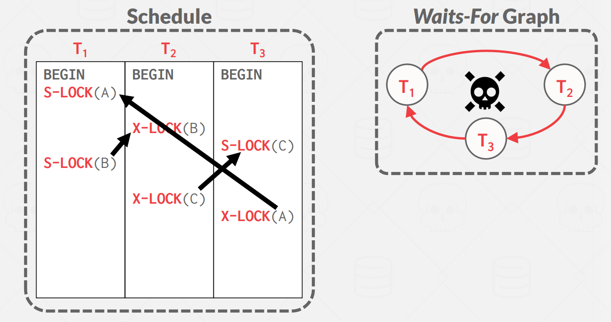
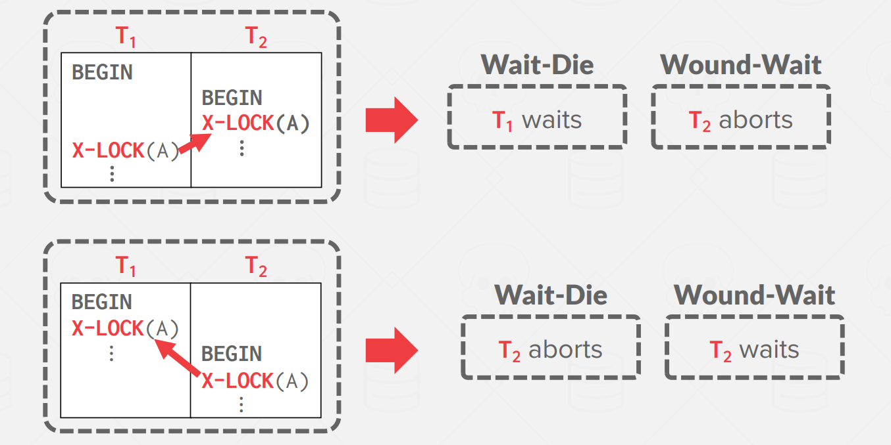
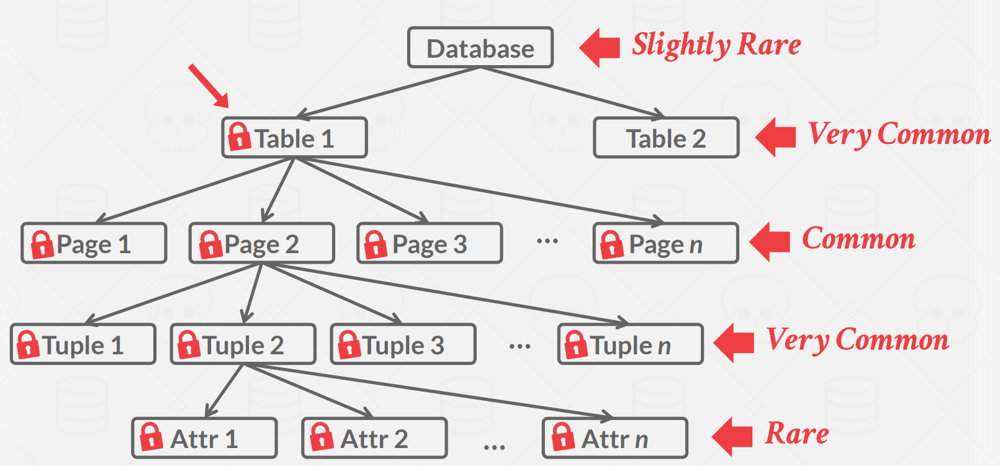
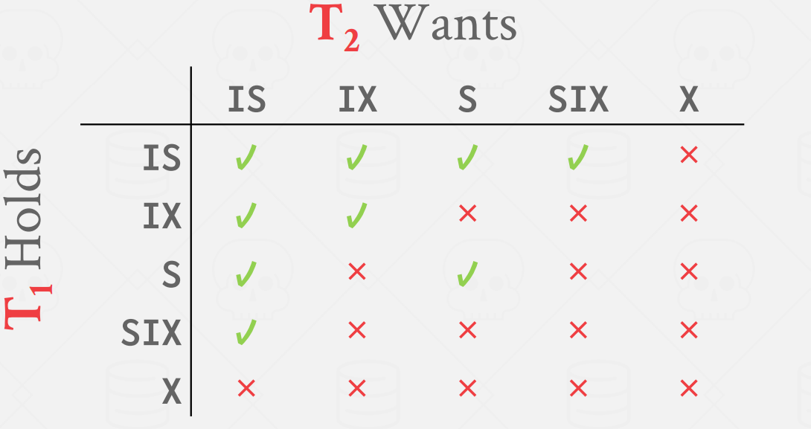

## **Transaction Locks**

到目前为止，我们的 serializability 概念假设我们在构建调度时知道所有的读取和写入，但我们需要一种方法来保证运行中的正确性。DBMS 使用锁来动态生成 serializable 事务的执行计划。当存在多个读取器和写入器时，这些锁可以在并发访问期间保护数据库对象。 DBMS 包含一个集中式锁管理器，用于决定事务是否可以获得锁。

重要的是，locks 与 B+ 树抓取算法中使用的 latches 不同。latches 保护 DBMS 的内部数据结构免受并发线程的影响，而 locks 则保护数据库中的值免受并发事务的影响。例如，在 B+ 树中，您只需在扫描中对各个叶节点持有 latches，因为这就是确保正确性所需要做的全部操作，但如果一个事务尝试叶扫描，而另一个事务尝试写入两个任意值，则叶节点扫描需要锁定整个表，而不仅仅是当前的叶子，以避免看到这两个写入。

有两种基本类型的 locks，与之前介绍的 Read/Write 类似，但 locks 和 latches 是不同的两个东西

-  Shared Lock (S-LOCK)

- Exclusive Lock (X-LOCK)

??? tip "locks vs latches"

    **Lock**

      1. 对象是事务。
   
      2. 它保护的是数据库中一些逻辑对象，如：表，页等等。
   
      3. 事务会持有 lock 在整个事务过程中。
   
      4. 它会有一些死锁的保护机制。
      
      5. 保存在 Lock Manager 中。
   
    **Latches**

      1. 对象是工作线程/进程。
   
      2. 它保护的是数据库中的内部数据结构。
   
      3. 线程会在访问临界资源的时候持有 Latches。
   
      4. 它没有死锁保护机制，需要程序员保证无死锁的出现。
      
      5. 保存在数据结构中。

事务必须向锁管理器请求锁（或升级）。锁管理器根据其他事务当前持有的锁来授予或阻止请求。当事务不再需要锁来释放对象时，必须释放锁。锁管理器使用有关哪些事务持有哪些锁以及哪些事务正在等待获取锁的信息来更新其内部锁表。

DBMS 的锁表不需要持久，因为当 DBMS 崩溃时任何活动的（即仍在运行的）事务都会自动中止。然而，仅靠锁是不够的，可以看下面这个例子：

<figure markdown="span">
  { width="650" }
</figure>

<figure markdown="span">
  { width="650" }
</figure>
有锁的保护，看起来运行的很顺利。但是 $T_2$ 修改了 $T_1$ 的数据，导致 $T_1$ 出现了不可重复读，于是我们需要更强的加锁策略，来保证 schedule 的正确性。

## **Two-Phase Locking**

两阶段锁定 (2PL) 是一种悲观并发控制协议，它使用锁来确定是否允许事务动态访问数据库中的对象。协议不需要提前知道事务将执行的所有查询。

2PL，顾名思义，有两个阶段：growing 和 shrinking：

- Growing：在增长阶段，事务向 DBMS 的锁管理器请求所需的锁。锁管理器授予/拒绝这些锁请求。

- Shrinking：事务在释放第一个锁后立即进入收缩阶段。在收缩阶段，只允许事务释放锁。他们不允许申请新的锁。

<figure markdown="span">
  { width="650" }
</figure>

每个资源的锁事务会一直保留，知道该事务后续不会再使用该资源。由此产生的 schedule 可以保证是 serializable，但可能导致级联终止（cascading aborts）

<figure markdown="span">
  { width="650" }
</figure>

$T_1$ 中止了，而 $T_2$ 读到了 $T_1$ 之前写的数据，所以 DBMS 不得不把 $T_2$ 也终止，也就是说所有读到 $T_1$ 数据的事务都会被终止，这个过程就是所谓的级联中止。

事实上 2PL 还有一个增强版变种，Rigorous 2PL，后者每个事务在结束之前，其写过的数据不能被其它事务读取或者重写，如下图所示：

<figure markdown="span">
  { width="650" }
</figure>

## **Deadlock Handling**

<figure markdown="span">
  { width="650" }
</figure>

死锁是事务等待彼此释放锁的循环，如上。处理 2PL 中的死锁有两种方法：检测和预防。

### **Deadlock Detection**

为了检测死锁，DBMS 创建一个等待图，其中事务是节点，如果事务 $T_i$ 正在等待事务 $T_j$ 释放锁，则存在从 $T_i$ 到 $T_j$ 的一条有向边。系统将定期检查等待图中的循环（通常使用后台线程），然后决定如何打破它。这里死锁检查的频率（使用 CPU 周期）和死锁被打破的等待时间之间存在权衡。

<figure markdown="span">
  { width="650" }
</figure>

当 DBMS 检测到死锁时，它将选择一个 “受害者” 事务来中止以打破循环。受害者事务将重新启动或中止，具体取决于应用程序调用它的方式。 DBMS 在选择受害者打破死锁时可以考虑多个事务属性：

- 按年龄（最新或最旧的时间戳）；

- 按进度（执行的最少/最多查询）；

- 按已锁定的项目数量；

- 根据需要回滚的事务数量；

- 过去重新启动事务的次数（以避免饥饿）；

选择要中止的受害者事务后，DBMS 还可以决定回滚事务更改的程度。它可以回滚整个事务，也可以回滚足够的查询来打破死锁。

### **Deadlock Prevention**

死锁预防 2PL 不是让事务尝试获取所需的任何锁，然后再处理死锁，而是在事务发生之前阻止事务导致死锁。当一个事务尝试获取另一个事务持有的锁（这可能导致死锁）时，DBMS 可以杀死其中一个事务。为了实现这一点，事务被分配优先级（可能基于时间戳，较旧的事务具有更高的优先级）。这些方案保证不会出现死锁，因为等待锁时只允许一种方向的依赖边。

在预防死锁的情况下，有两种方法可以杀死事务：

- Wait-Die（“Old Waits for Young”）：如果请求交易的优先级高于持有交易，则等待。否则，它会中止（死亡）。

- Wound-Wait（“Young Waits for Old”）：如果请求事务的优先级高于持有事务，则持有事务将中止（受伤）并释放锁。否则，请求事务将等待。

<figure markdown="span">
  { width="650" }
</figure>

## **Lock Granularities**

上面的例子中所有的锁都是针对单条数据 (database object)，如果一个事务需要更新十亿条数据，那么 lock manager 中的 lock table 就要撑爆了。因此需要有一些手段能够将锁组织成树状/层级结构，减少一个事务运行过程中需要记录的锁的数量。

<figure markdown="span">
  { width="650" }
</figure>

但如果事务在只需要读取一个值时锁定整个表，则并行性的机会就会减少。为了处理这种权衡，DBMS 使用锁层次结构来同时处理不同粒度级别的锁。例如，它可以获取具有十亿个元组的表上的单个锁，而不是十亿个单独的锁。

重要的是，如果事务使用元组级锁，则它需要传达其他事务无法获取页级锁（或任何更高级别的锁）的信息，因为这会发生冲突。为了实现这一点，提出了意向锁，它是一种隐式的锁，它发出信号表明当前事务可能会获取底层某个数据显示锁：

- Intention-Shared (IS)：它表示一个事务打算在某些数据项上申请共享锁（S 锁）；

- Intention-Exclusive (IX)：它表示一个事务打算对某些数据项申请排他锁（X 锁）；

- Shared+Intention-Exclusive (SIX)：它表示一个事务打算对某些数据项申请排他锁（X 锁）或共享锁（S 锁）；

他们的冲突关系如下：

<figure markdown="span">
  { width="450" }
</figure>

