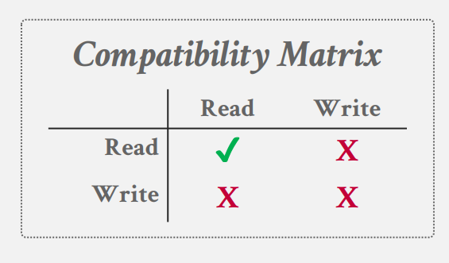

## **并发控制**

前面介绍哈希表和 B+ 树的设计时，都是只考虑了单线程，但是 DBMS 需要允许多个线程安全高效的地访问数据结构。

一些系统使用了单线程/进程模型，如：redis、VOLTDB。当然我们也可以很简单，将一个单线程的数据结构改造为多线程的，在每个临界资源上加一把大锁，但这并不高效。

这就要设计一些并发控制协议（concurrency control protocol），并发控制协议是DBMS用来确保共享对象上并发操作的 “正确” 结果的方法。

协议的正确性标准可能不同：

- 逻辑正确：这意味着线程能够读取它应该读取的值。例如：当我们的线程从数据结构删除了一个 a 后，我们之后再次查找时，应该读取不到它，但它可能依旧在内存中。

- 物理正确：这意味着对象的内部表示是健全的，例如，数据结构中不存在会导致线程读取无效内存位置的指针。

!!! question "Lock VS. Latches"
    在讨论DBMS如何保护其内部元素时，锁和锁之间有一个重要的区别

    **Lock（锁）**

      1. 对象是事务。
   
      2. 它保护的是数据库中一些逻辑对象，如：表，页等等。
   
      3. 事务会持有 lock 在整个事务过程中。
   
      4. 它会有一些死锁的保护机制。
      
      5. 保存在 Lock Manager 中。
   
    **Latches（闩锁）**

      1. 对象是工作线程/进程。
   
      2. 它保护的是数据库中的内部数据结构。
   
      3. 线程会在访问临界资源的时候持有 Latches。
   
      4. 它没有死锁保护机制，需要程序员保证无死锁的出现。
      
      5. 保存在数据结构中。
    


Latches 有两种模式，读和写，就和 `std::shared_mutex` 的机制相同，可以有很多读者持有 Latches，但只能由一个写者持有 Latches：

<figure markdown="span">
    { width="350" }
</figure>


## **Latches 的实现**

Latches 的实现应该具有较小的内存占用，并且在没有争用时可以有快速获取锁存器的路径。我们不希望 Latches 的获取成为数据结构性能的瓶颈。

用于实现锁存的底层原理是通过现代CPU提供的原子指令 [CAS（Compare And Swap）操作](http://127.0.0.1:8000/Linux/Thread/Sync/?h=swap#lock-free){target=_blank}，。通过这种方式，线程可以检查内存位置的内容，以查看它是否具有特定值。

在 DBMS 中实现 Latches 有几种方法。每种方法在工程复杂性和运行时性能方面都有不同的权衡。

### **Test-and-Set Spin Latch (TAS)**

自旋锁，我们可以通过基础的 CAS 操作实现自旋锁，实现如下：

```cpp
std::atomic<bool> latch;
⋮
while (latch.test_and_set(…)) {
 // Retry? Yield? Abort?
}
```

DBMS 可以控制如果无法获取 Latch 会发生什么。它可以选择重试（例如，使用 `while` 循环）或允许操作系统不再执行该线程。因此，这种方法赋予 DBMS 比 OS mutex 更多的控制权，在操作系统互斥中，未能获取锁存将控制权交给操作系统。

- 优点：解锁加锁很高效，只需要一条 CPU 指令即可。

- 缺点：会浪费 CPU 资源在询问（循环的执行 CAS 操作）上。


### **Blocking OS Mutex**

这是操作系统内建锁的实现方式，如：`std::mutex`，`pthread_mutex`。这些底层都用到了 Linux 提供的 `futex`(fast user-space mutex)，它由两部分组成：（1）用户空间的自旋锁，（2）内核空间的互斥锁。如果 DBMS 无法获取用户空间的自旋锁，那么它会进入内核并尝试获取更昂贵的互斥锁。如果 DBMS 未能获取第二个互斥体，则线程会通知操作系统它在互斥体上被阻止，然后取消调度。这会有内核态到用户态的转换，所以消耗很大。

- 优点：使用简单，不需要额外的编码。

- 缺点：开销大（加锁/解锁大约要 25 ns）且不可扩展

### **Reader-Writer Latches**

DBMS需要一种允许并发读取的方法，因此如果应用程序有大量读取，它将具有更好的性能，因为读取器可以共享资源而不是等待。但它需要记录一个有多少线程正持有锁，有多少线程正在等待。
