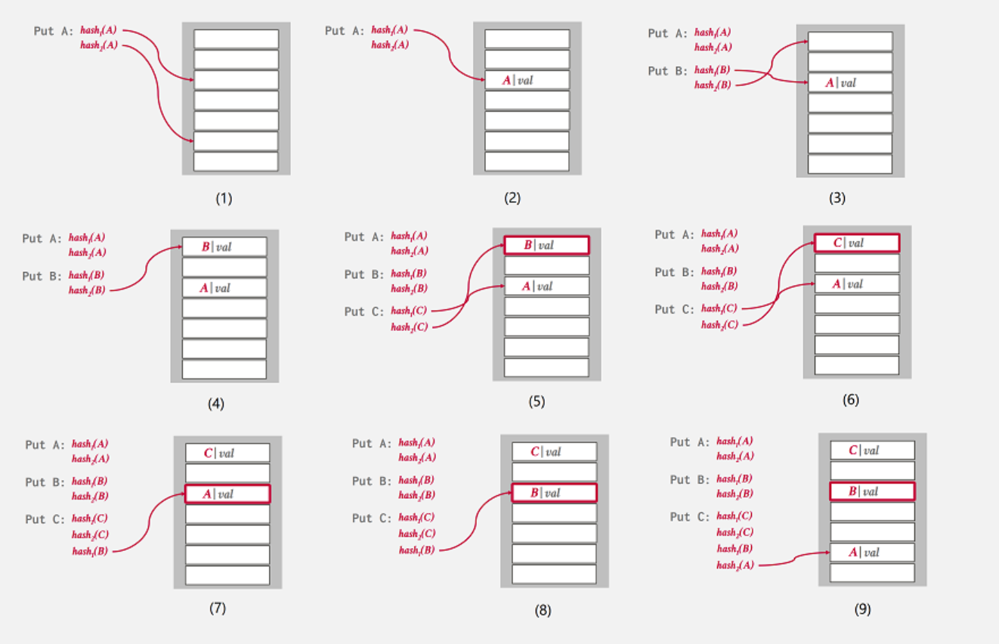
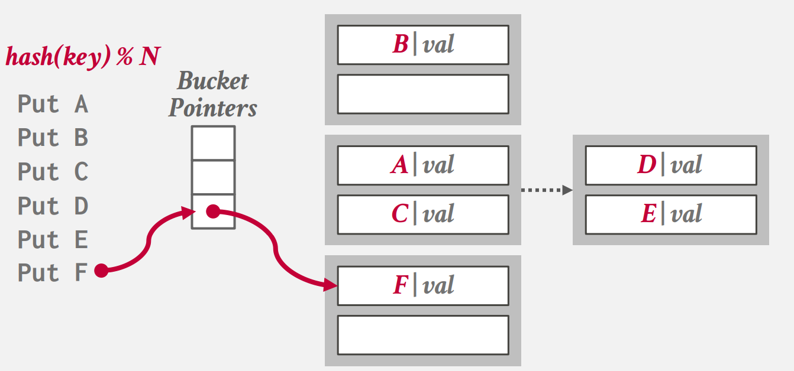
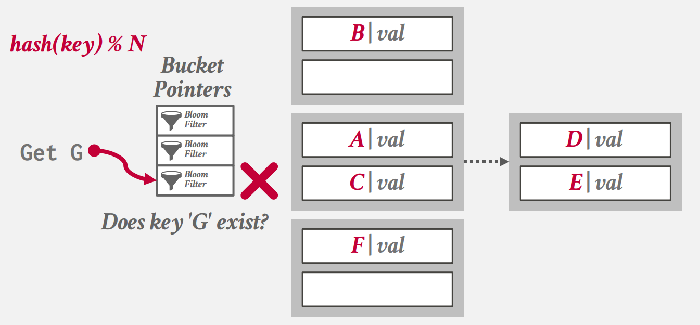
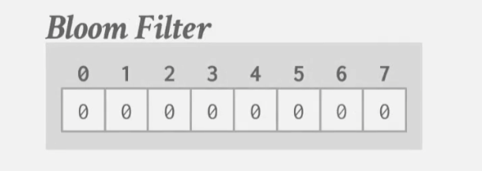
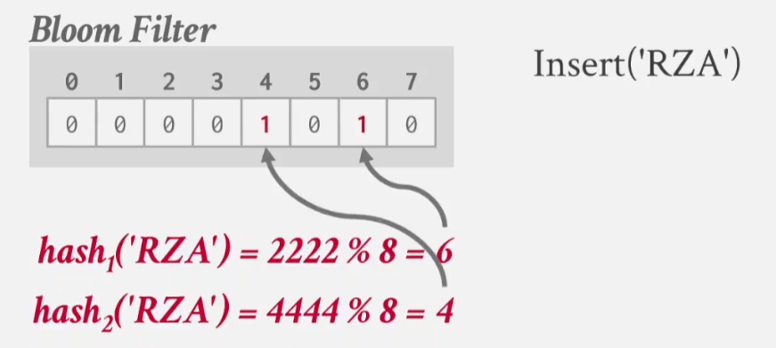
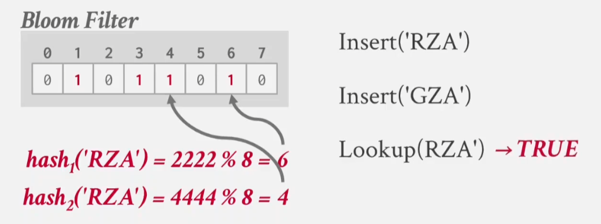
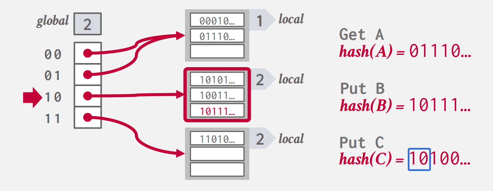
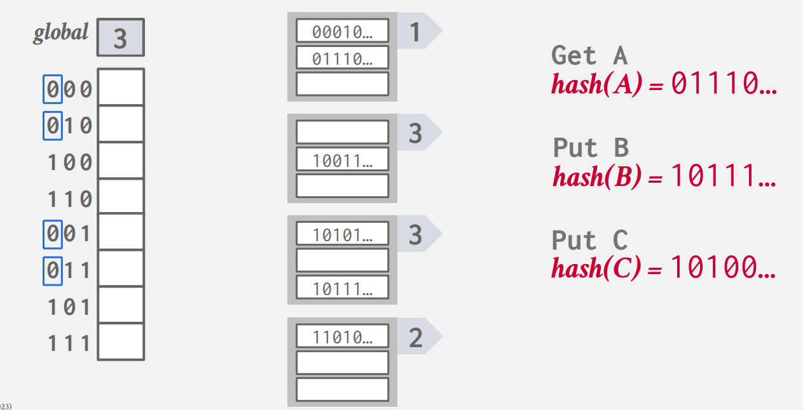
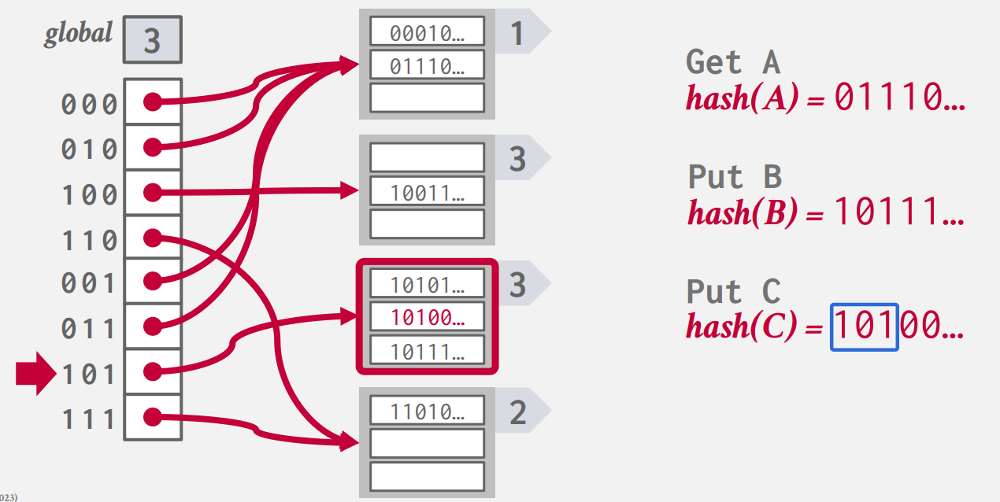

## **数据结构**

在数据库内部，会有很多不同的地方会用到各种各样的数据结构，一些可能的例子如下：

- 内部元数据：这些是记录数据库和操作系统的相关信息的。例如：page table 和 page directories。

- 数据存储：数据结构作为数据库中元组存储从基础。

- 临时数据结构：一些临时的数据结构用于加速数据库的查询，如：为 join 创建的哈希表。

- 表索引：用于快速找到特定信息的辅助数据结构。

在使用和实现一些数据结构时，要考虑两方面：

1. 数据的组织：我们得决定如何表示数据和存储哪些信息，可以帮助我们高效的访问数据。

2. 并发：要保证在多线程环境下不造成问题，并且确保数据保持正确和健全。

在数据库中常用的数据结构有两种：

- 哈希表（无序的）

- B+ 树（有序的）

本文将介绍在 DBMS 中，这些数据结构的一些实现思路。

## **哈希表**

如果你完全没听说过哈希表，可以阅读博客 [哈希表](http://127.0.0.1:8000/DS/HTable/HTable/){target=_blank}

哈希表，平均的时间复杂度为 $O(1)$，最坏 $O(n)$，空间复杂度为 $O(n)$ 。

但这不是算法竞赛，即使是常数 $O(1)$ 的复杂度，我们也要关系这个常数的大小，常数要尽可能的小。因为不管是 $O(1)$ 还是 $O(n)$，都是大量数据时的时间量级的估计，小范围数据可能 $O(n)$ 会优于你的常数。

实现哈希表包含两部分：

- 哈希函数：将我们给定的值，映射到一个 key 值上，我们通过这个 key 可以找到 value 具体的物理地址。运用在数据库中的哈希函数，既要速度快，冲突率也要低。

- 哈希结构：告诉我们如何处理冲突。对此，我们的设计要在开大空间降低冲突率和执行额外操作处理冲突间做出取舍。

## **哈希函数**

对于 DBMS，我们不关心哈希函数的加密功能，因为哈希表都是内部使用的，外部看不到，我们只关系哈希函数的速度和冲突率。对于数据库工作者，不必要太关心哈希函数的实现方法，我们通常会采用一些现成的哈希函数，如：FaceBook XXHash（2012），Google FarmHash（2014），wyHash。

一些比较优秀的哈希函数，如： XXHash3、 rapidHsah等等。其他可以参考 [smhash](https://github.com/rurban/smhasher/blob/master/README.md#summary){target=_blank} 。

## **哈希结构**

有两种哈希结构：

- 静态哈希结构（Static Hashing Schemes）：这种结构哈希表的大小是固定的，这意味着此结构的哈希表满了以后，要重新申请空间，并重建整张表。

- 动态哈希结构（Dynamic Hashing Schemes）：动态结构可以在不重建的前提下，扩展空间。

### **静态哈希**

#### **线性探测**

就是闭散列，当映射到的位置有其他值的时候，就向下遍历，直到找到一个空着的位置，当所有位置都被填满后，就会重新申请空间，并将表中所有值重新哈希。

#### **Cuckoo哈希**

IBM 的 DB2 使用了这种哈希方式。

Cuckoo 译为布谷鸟，也就是杜鹃，杜鹃会占据其他鸟类的巢穴，这与该哈希的思路相同。

对于一个 key，它会使用多个哈希函数，会映射到不同的位置上，它会选择一个空的位置，将 value 插入。当没有空的位置的时候，我们会选择踢出一个旧的的键值对，然后我们重新哈希这个旧键值对，并为其安排其他位置。重复上述过程，直到将键值对填入一个空的位置上。

<figure markdown="span">
  { width="1050" }
</figure>

在一些特殊的情况下，我们可能会进入一个循环，一直循环的修改几个键值。这时我们就会重建整张表，重新哈希所有值。

### **动态哈希**

#### **链式哈希**

我们比较熟知的做法是开散列，就是每个位置维护一个链表，链表每个节点是一个桶（bucket），一个桶中可以存放若干元素：

<figure markdown="span">
  { width="450" }
</figure>

对于有哈希冲突的 key，我们都放在同一个桶里，当桶满了，就链一个新的空桶在后面。

对于每个查询，我们可以使用布隆过滤器（Bloom Filter）进行优化。先使用布隆过滤器判断，要查找的元素，是否在对应 key 值的桶中，通过过滤的元素，才会到链中遍历，寻找需要的 value。

<figure markdown="span">
  { width="450" }
</figure>

??? note "Bloom Filter"
    布隆过滤器可以快速告诉你一个元素是否存在于集合当中，但判断可能会出现假阳性的错误（将一个不再集合中的元素判断为在）。

    对于布隆过滤器，你只能做插入和查找操作，不能进行删除操作（为了避免假阴性的误判）。

    布隆过滤器就是一个位图：

    <figure markdown="span">
        { width="350" }
    </figure>

    对于插入操作，它会通过哈希函数，将 key 映射到不同的位置上，并将这些位置都置为 1

    <figure markdown="span">
        { width="350" }
    </figure>

    对于查询操作，它会查看 key 映射到的这些位置上是否都为 1，如果都为 1，那么就返回该值存在：

    <figure markdown="span">
        { width="350" }
    </figure>

#### **可扩展哈希**

在 lab 的 project 2，就要求我们实现一个可扩展哈希。p2 中的可扩展哈希，与课上讲解的有所不同，大题思路是相同的，这里以实验为准。实验中可扩展哈希由三部分组成：

- 哈希表头（Hash Table Header）：它存储字典页（directory pages）的指针（这里是页 id）。你可以把它当作一个静态的一级目录页。

- 哈希表目录（Hash Table Directories）：它存储桶页（bucket pages）的指针（这里也是页 id）。目录中。

- 桶（Hash Table Buckets）：桶存放具体的数据。

<figure markdown="span">
    { width="450" }
</figure>

每个可以扩展哈希表头/目录/桶的大小都不能超过一个页（在 p2 中要我们实现的三种页，就对应这三部分），这也是方便我们实现，不然横跨多页的结构，要多做很多工作。

在 Header Page 中，有两个字段：

- `directory_page_ids_`：记录所有目录的页 id。

- `max_depth_`：Header Page 是对 hash 的 MSB 进行索引，所以这里 `max_depth_` 是处理高位的最大数量。`1 << max_depth_` 就是可以记录的最大目录数。

在 Directory Page 有如下字段：

- `max_depth_`：Directory Page 是对 hash 的 LSB 进行索引，这里的 `max_depth_` 是能处理的最低为的最大数量。`1 << max_depth_` 是可以记录的最大桶数量。

- `global_depth_`：当前目录处理 hash 的 LSB 数量。

- `local_depths_`：每个桶处理 hash 的 LSB 数量。

- `bucket_page_ids_`：每个桶对应的页 id。

在 Bucket Page 有如下字段：

- `size_`：当前桶中键值对个数。

- `max_size_`：当前桶能放的最多键值对个数。

- `array_`：存放键值对的数组。

我们通过 hash 值索引到对应的桶中，将数据插入。当桶满了以后，就要将桶的 `local_depth_` 加一，表示该桶要多考虑一位，这个操作会将桶分裂为两部分。

如果 `local_depth_` 超过了 `global_depth_`，就要将目录的 `global_depth_` 也加一，存放目录的数量扩大一倍。

<figure markdown="span">
    { width="550" }
</figure>

<figure markdown="span">
    { width="550" }
</figure>

<figure markdown="span">
    { width="550" }
</figure>