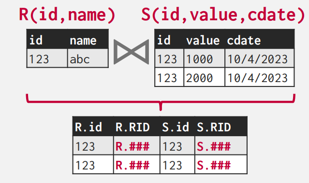
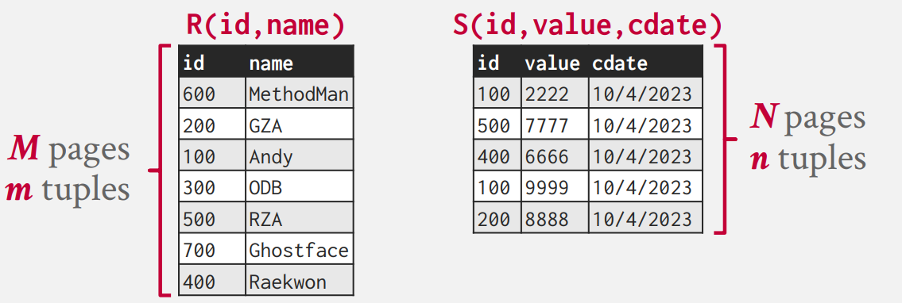
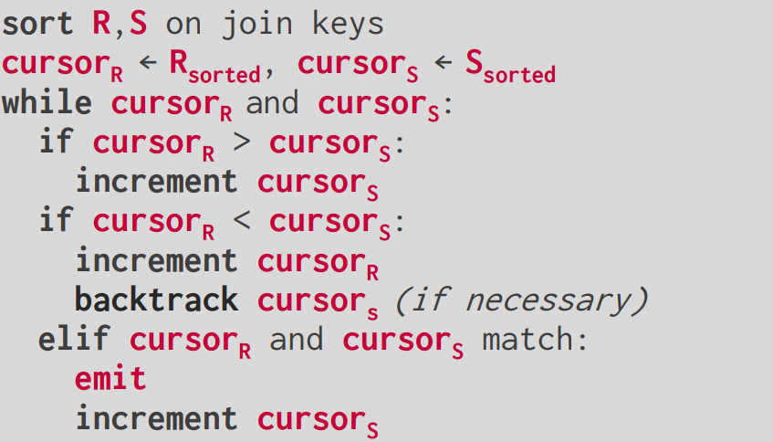
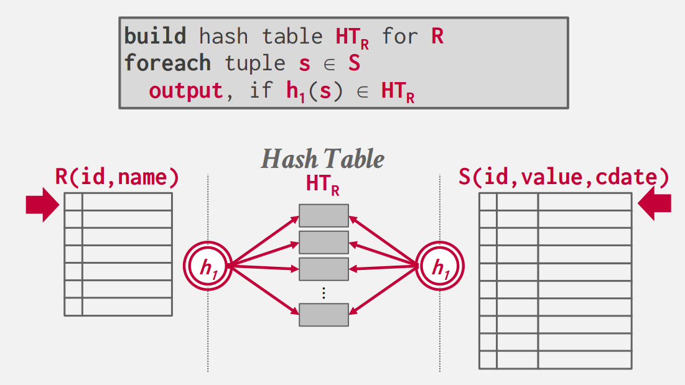
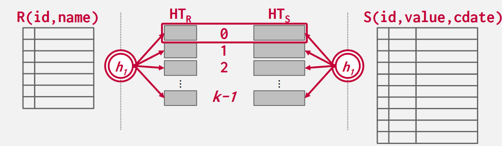
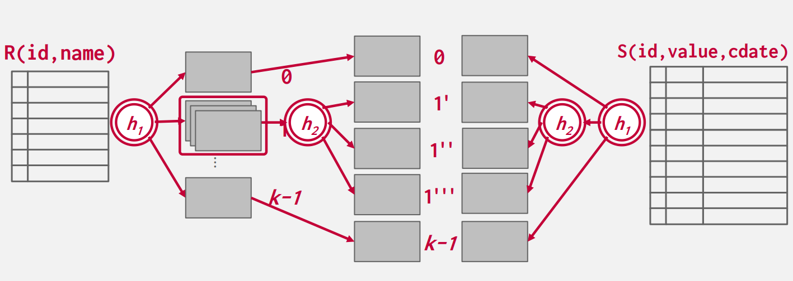

## **Joins**

在关系型数据库中，我们规范化表，来避免不必要的重复数据。这也使得，我们在一些情况下，需要通过以有的表创建新的表。于是就有了 `join` 操作，来将两张表合并成一张新的表。

我们从两方面来介绍 `join` 操作：

- 操作的输出

- 操作的花费分析

### **Operator Output**


对于 `join` 操作的输出，对于每个元组 $r\in R$，每个元组 $s\in S$，如果满足 `on` 给出的条件，就连接形成一个新的元组，作为新表的一部分。

处理 `join` 属性，输出的结果也于很多因素有关：

- 查询的处理模型

- 存储模型：NSM（行存储） 或 DSM（列存储）

- 查询本身

 `join` 运算符输出的内容有多种表示方法：

- **Early Materialization**：操作时，DBMS 直接将数据拷贝到新元组中，该方法的有点是，后续的所有操作都不需要回到初始表中取数据。缺点就是需要消耗更多的空间来存储整个元组。

<figure markdown="span">
  { width="450" }
</figure>

DBMS 也会进行一些额外的计算，省略一些后续不需要的属性，来优化这个方法。

- **Late Materialization**：操作时，DBMS 将需要 `join` 的 key 拷贝下来，并记录满足条件元组的 record id，到最后输出结果时，再根据 record id 取出具体的数据。对于列存储数据库，这个方法是理想的，因为不会拷贝不需要的数据。

<figure markdown="span">  
  { width="450" }
</figure>

### **Cost Analysis**

在 `join` 操作中，我们不关心计算的复杂度，因为结果集的大小是一定的，我们考虑的是 `join` 算法的 I/O 消耗，假设：

- 表 $R$ 有 $M$ 页，$m$ 条记录在表中。

- 表 $S$ 有 $N$ 页，$n$ 条记录在表中。

操作 $R \Join S$ 是很常见的操作，我们有必要仔细优化。但对于单纯的 $R \times S$ 这样的消耗很大，现实中的用途也比较少见，除非你需要进行某种特定的操作，比如需要用到数据集的笛卡尔积。

有很多算法和优化来降低 `join` 操作的消耗，但任意单个算法都无法在所有情况下表现的很好。之后我们会介绍如下的 `join` 算法：

- Nested Loop Join

- Sort-Merge Join

- Hash Join

Hash Join 算法在通常情况下是最快的，尤其适用于 OLAP 系统。而对于 OLTP 系统，通常不会进行大规模的 `join` 操作，所有通常会使用简单的 Nested Loop Join。像 MySQL，直到 2019 年才支持了 Hash Join。如果你希望最后输出的数据是排好序的，那么 DBMS 可能会倾向于选择 Sort-Merge Join。

<hr>

## **Nested Loop Join**

最简单的想法，我们嵌套两层循环，一个个的遍历元组，如果它们满足 `join` 的条件，我们则输出它们。在循环中，处于外层循环的，我们称作为外表，处于内层循环的，称作内表。

```Python
for r in R:   # Outer table
  for s in S:   # Inner table
    if match(r,s):print(r,s)
```

<figure markdown="span">  
  { width="550" }
</figure>

这是最简单的方法，I/O 消耗为 $M + m\cdot N$，对于每个元组，我们都要重新取出 $S$ 表中的所有页。一个简单的优化是，我们让较小的表做外表，I/O 消耗就变成了 $N+n\cdot M$。

如果每页可以容纳 $k$ 个元组，那么：

$$
\begin{matrix}
M + m\cdot N = M + kNM \\
N + n\cdot M = N + kNM
\end{matrix}
$$

显然后者是更优的。但这还远远不够。

### **Block Nested Loop Join**

既然我们读入了内表的一个页，我们为什么不计算完当前在内存中的所有元组 `join` 后的结果，再放回页呢。

```py
for PageR in R:
  for PageS in S:
    for r in BlockR:
      for s in BlockS:
        if match(r,s):print(r,s)
```

此时的 I/O 消耗为：$M + NM$，我们依旧可以让较小的表放做外表，但优化很有限。

如果我们可以有 $B$ 个页面。可以用 $B-2$ 个页面来存放外表数据，$1$ 个页面存内表数据，一个页面存输出数据。

我们每次取出 $B-2$ 个页面和这一个内表页面进行 `join` 操作，这样可以有效的减少循环次数

```Python
for i in range(0,M,B):
  Pages = M[i:min(i + B,M)]
  for PageS in S:
    for PageR in Pages:
      for r in PageR:
        for s in PageS:
          if match(r,s):print(r,s)
```

此时 I/O 消耗为 $M + \left \lceil \frac{M}{B - 2} \right \rceil \cdot N$

### **Index Nested Loop Join**

上面的 Loop Join 算法，DBMS 都必须扫描表，来找到一个匹配值进行 `join`。但如果对于我们 `join` 的 key 我们事先有一个索引或者我们可以创建一个临时索引，使用它来加速我们的计算。

```Python
for r in R:
  for s in Index(r.id == s.id):
    if match(r,s):print(r,s)
```

这个代码中，我们事先有 id 这个属性的索引，我们利用索引可以直接查询所有满足 `r.id == s.id` 的元组，再判断其他 key 是否匹配，匹配就输出。

此时 I/O 消耗为 $M + m\cdot C$，这里 $C$ 表示索引的复杂度，这与创建的索引类型有关。

### **Summary**

对于 Loop Join 的关键点：

- 尽量选择小表作 Outer table

- 尽可能多的将 Outer table 缓存到内存中

- 扫描 Inner table 时，可以创建临时索引，加速计算。

<hr>

## **Sort-Merge Join**

顾名思义，这种方法要先根据 `join` 的 key 将两张表进行排序，然后在通过类似归并排序的过程，将 key 值相等的元组连接，并输出。

<figure markdown="span">  
  { width="550" }
</figure>

如果一个或两个表已经根据 join 属性排序，或输出结果仍需要根据 join key 排序，那么此算法将非常有用。

此时 I/O 消耗为：

- Sort R Cost：$2M\cdot (1 + \left \lceil \log_{B-1}{\left \lceil \frac{M}{B}\right \rceil} \right \rceil)$

- Sort S Cost：$2N\cdot (1 + \left \lceil \log_{B-1}{\left \lceil \frac{N}{B}\right \rceil} \right \rceil)$

- Average Merge Cost：$M + N$

总花费就是 Sort + Mege。

回溯内表指针，只会出现在外表遇到重复值的情况，所以当两张表中重复元素过多时，merge 的花费可能会退化为 $NM$。

<hr>

## **Hash Join**

Hash Join 算法的思想是使用哈希表根据元组的 join 属性将元组拆分为更小的块。这将减少 DBMS 在每个元组上的比较次数。但 Hash Join 只能用于判等条件的 `join` 操作。

一个正常的哈希函数，对于相同的 key，总是能得到相同哈希值。那么对于处于 $R$ 和 $S$ 表，需要连接的元组的 join 属性也一定相等，它们哈希后的哈希值就相等。因此 Join 的时候，我们只需要对两个表中 hash 到同样值的 tuples 分别执行 Join 操作即可。

### **Basic Hash Join**

算法有两步：

- Build：扫描外表，将它的元组都放入到一张临时哈希表中。

- Probe：扫描内表，在哈希表中找到 `join` 属性匹配的元组，连接并输出。

<figure markdown="span">  
  { width="550" }
</figure>


对于哈希表中的内容，会存储所有的 `join` 属性，以及数据，数据的存储方式有两种：Early or Late materialization，这就不多赘述了。

一个简单的优化是使用布隆过滤器，我们在遍历外表时初始化布隆过滤器，我们在遍历内表查询哈希表时，每次查询都先询问 布隆过滤器相对应的 `join` 属性是否存在。它通过组织不必要的查询来减少磁盘 I/O。

### **Grace Hash Join**

当内存中放不下表中的数据，DBMS 不得不使用面向磁盘的哈希表，哈希表的页面会完全随机的写入写出，会导致很差的性能。Grace Hash Join 的思路是对表进行分块。算法有两步：

- Partition：将两张表关于 `join` 属性进行哈希分块，分成若干个桶，每个桶的数据都可以放入到内存中，在需要的时候一个桶的数据可以写出到磁盘。

- Probe：比较两张在相同块中的元组，并将比配的元组连接，然后输出。

<figure markdown="span">  
  { width="650" }
</figure>

如果分块后还是放不进内存，就要进行递归分块，使用与之前不同的哈希函数，对溢出的桶再重复 Partition 的操作。

<figure markdown="span">  
  { width="650" }
</figure>

现在假设我们不需要递归分块，我们的 I/O 消耗为：

- Partition Cost：$2(M + N)$，每页都要读入和写出隔一次。

- Probe Cost：$M + N$

总花费就是 $3(M + N)$。

## **Conclusion**

我们在 $M = 1000,m = 1000,000,N = 500,n = 40,000$ 数据均匀分布的情况下，假设一次 I/O 花费的时间为 $0.1ms$，计算上述介绍的所有 `join` 算法的消耗：

|Algorithm|IO Cost |Result|
|:-:|:-:|:-:|
Nested Loop Join|$M + m\cdot N$|$1.3h$
Block Nested Loop Join|$M + \left \lceil \frac{M}{B - 2} \right \rceil \cdot N$|$0.55s$
Index Nested Loop Join|$M + m\cdot C$|Variable
Sort-Merge Join|$M + N + (sort\space cost)$|$0.75$
Hash Join|$3(M + n)$|$0.45$

Hash Join 在大多数情况都是更优的选择，但是当数据为不均数据或最后结果需要排序时，Sort-Merge Join 表现会更好。