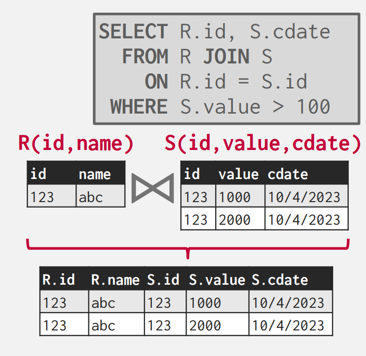

## **Joins**

在关系型数据库中，我们规范化表，来避免不必要的重复数据。这也使得，我们在一些情况下，需要通过以有的表创建新的表。于是就有了 `join` 操作，来将两张表合并成一张新的表。

我们从两方面来介绍 `join` 操作：

- 操作的输出

- 操作的花费分析

### **Operator Output**

对于 `join` 操作的输出，对于每个元组 $r\in R$，每个元组 $s\in S$，如果满足 `on` 给出的条件，就连接形成一个新的元组，作为新表的一部分。

处理 `join` 属性，输出的结果也于很多因素有关：

- 查询的处理模型

- 存储模型：NSM（行存储） 或 DSM（列存储）

- 查询本身

 `join` 运算符输出的内容有多种表示方法：

- **Early Materialization**：操作时，DBMS 直接将数据拷贝到新元组中，该方法的有点是，后续的所有操作都不需要回到初始表中取数据。缺点就是需要消耗更多的空间来存储整个元组。

<figure markdown="span">
  { width="450" }
</figure>

DBMS 也会进行一些额外的计算，省略一些后续不需要的属性，来优化这个方法。

- **Late Materialization**：操作时，DBMS 将需要 `join` 的 key 拷贝下来，并记录满足条件元组的 record id。对于列存储数据库，这个方法是理想的，因为不会拷贝不需要的数据。
