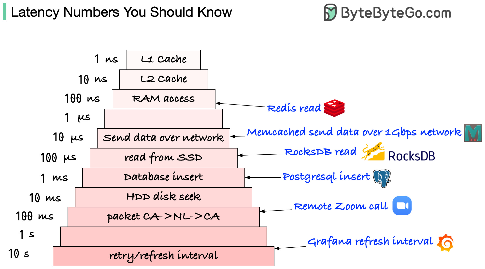
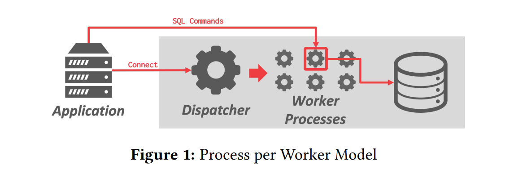
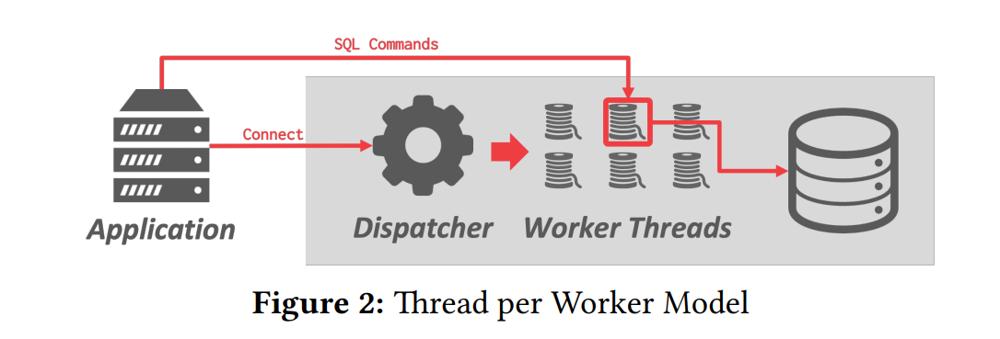
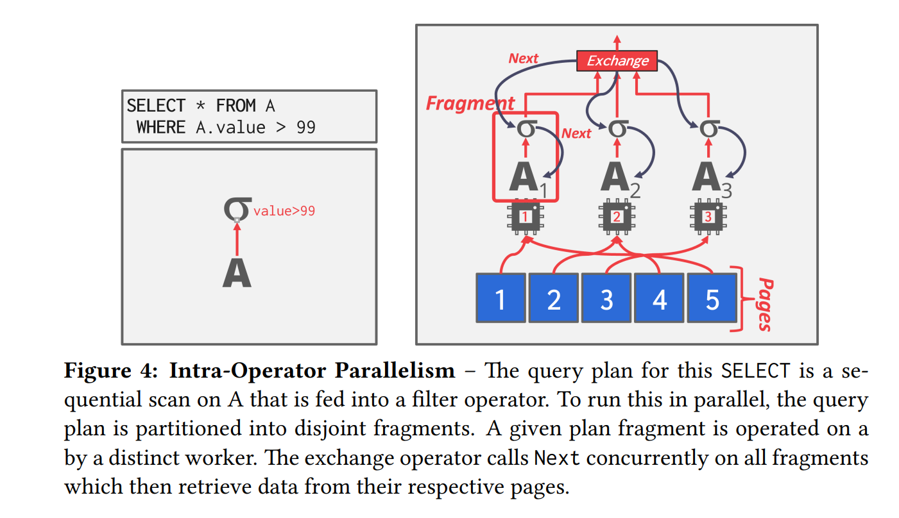
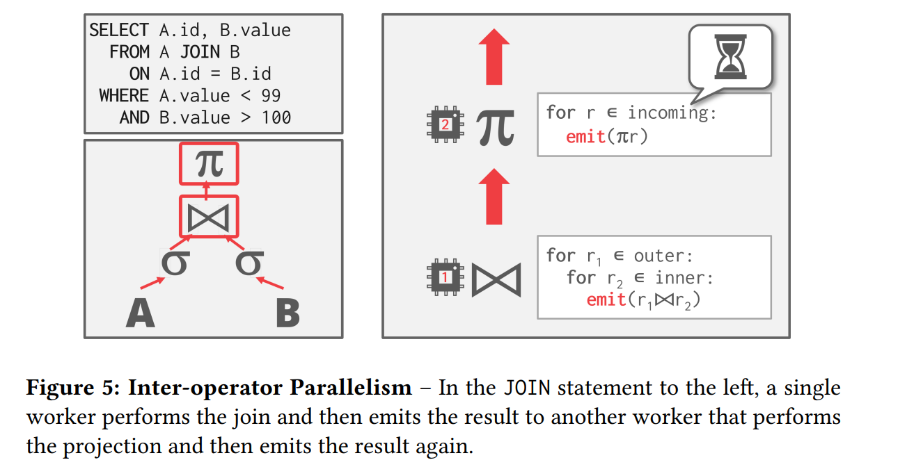
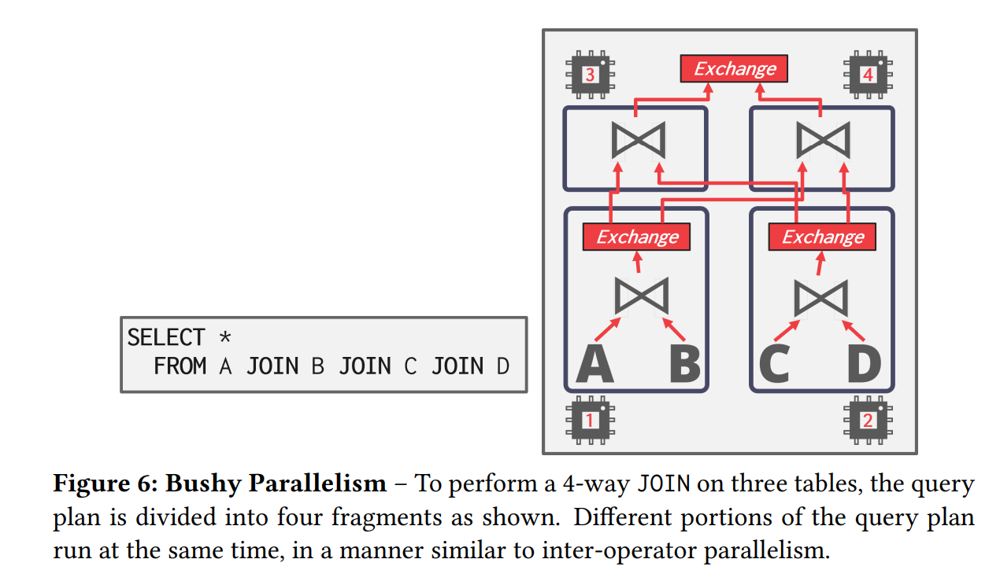
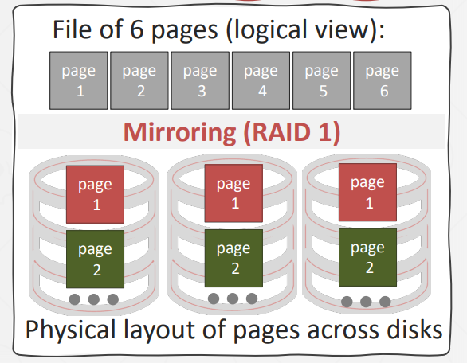

## **Background**

随着单核性能提高逐渐的平缓，处理器只能通过增加核心数，来进一步提高性能：

<figure markdown="span">
  { width="550" }
</figure>

这意味着系统可用通过并行执行计算，来提高系统整体性能。先前讨论的查询执行，都假设只有一个工作流，但在实际操作中，查询都是在多执行流的并发环境下执行的。

并发执行为 DBMS 提高很多关键的优势：

- 提高吞吐量（more queries per second）和降低延迟（less time per query）。

- 从 DBMS 外部用户的角度来看，提高了响应速度和可用性。

- 能降低总体成本（total cost of ownership，TCO）

BDMS 支持两次并行方式：查询间并行和查询内并行。

??? tip "Latency numbers you should know."

    <figure markdown="span">
      { width="550" }
    </figure>

    [Latency numbers you should know.](https://blog.bytebytego.com/p/ep22-latency-numbers-you-should-know){target=_blank}

## **Parallel vs Distributed Databases**

在并行数据库和分布式数据库中，数据库被分散到多个 "资源 "中，以提高并行性。这个资源可能是计算资源（e.g. CPU cores，CPU sockets，GPU）或者存储资源（e.g. 磁盘，内存）。

并行和分布式的不同在于：

- 并行数据库，资源或者说节点，在物理空间上彼此相距很近，节点间的通信通常很 cheap，并且高效可靠。

- 分布式数据，资源相距很远，可能两个节点间横跨国家甚至大陆，这就导致节点间的通信代价很大，而且缓慢，容易失败。

尽管数据库被分散到多个节点上，但对于应用来说，逻辑上只有一个数据库实例。因此在单机数据库执行的操作，在并行数据库上获得的结果应该相同。

## **Process Models**

一个数据库的执行模型定义了系统如何支持从多用户环境来的并发请求，DBMS 包含一个或多个执行流，负责执行用户请求的任务并返回结果。一个应用可能发送一个很大的请求，或同时发很多请求，这就要将其分给不同的执行流。

<figure markdown="span">
  { width="550" }
</figure>

这里的执行流有两张类型：进程或线程。

### **Process per Worker**

这个情况下，每个执行流是一个 OS 进程。当客户发送一个请求，dispatcher 将选择一个进程去处理这个连接，之后这个应用直接和这个进程进行通信。

- 当一个进程崩溃不会引起整个系统的崩溃。

- 这种方式进程间使用共享内存维护公共的数据结构，进程间使用 message 进行通信。

- 这种模型下由 OS 决定，哪个执行流执行。

右侧是应用 Process per Worker 的系统，在这些系统开发时，pthreads 这样的线程库还没有成为线程模型的标准，不同 OS 线程定义各不相同，但 `fork()` 的定义更为一致。 

### **Thread per Worker**

如今更为流行的模型是，Thread per Worker，一个进程带多个线程。

线程的好处不言而喻，更小的切换开销，不需要自己实现资源的共享。但一个线程崩溃，可能导致整个系统的崩溃。

<figure markdown="span">
  { width="550" }
</figure>

近 20 年开发的 DBMS 几乎都使用了这种方式， SQL Server，MySQL. IBM DB2 和 Oracle 也已经更新为这样的方式。但 Postgres 仍是使用 process-based 的方法。

在这种模型下可以由 DBMS 来决定何时，何地，如何执行一个查询计划：

- 查询计划需要多少执行多少任务；

- 使用多少 CPU 时间；

- 在哪个 CPU 核心上执行；

- 在什么地方存放任务的输出。

DBMS 一定比 OS 更了解每个执行计划优先需要的资源。在 SQL Server 中实现了一个用户级的操作系统层：SQLOS，运行在 DBMS 内，分配硬件资源。

- 它决定哪个任务应该分配给哪个进程。

- 它也管理 IO 调度和高层次的原语，如：锁。

### **Embedded DBMS**

嵌入式数据库与前两种模型非常不同，它与应用共用一个地址空间，而不是以 C-S 的形式独立于应用。在这种模式下，应用会专门设置一个线程去执行数据库系统。

你可以把嵌入式数据库当作一个库，它会直接编译进你的应用代码中，你可以调用这个库，来实现数据库的增删查改。

由测是嵌入式数据库的一些例子。最著名的就是 SQLite，他被广泛嵌入在各种应用程序中（e.g. 微信），大多数程序当需要数据库时，就会将其嵌入， 只需要链接一个 SQL 库，然后调用就可以。在 SQLite 的官网，它提供了一个 C 的头文件，在这个文件中包含整个数据库的实现。

## **Inter-Query Parallelism**

查询间并行，顾名思义，多个查询通过多个线程并行的执行，这样提高了吞吐量并且降低的延迟。

当查询是只读的，多查询并行不会有问题，但是当有写操作时，就会导致数据竞争。这个问题将在 lecture 15 讨论。

## **Intra-Query parallelism**

查询内并行，即 DBMS 并行执行一个查询的多个操作。这降低了长查询的延迟。

这样的执行方式，可以从生产者消费者模型的角度来考虑。每个算子都是其父算子的生产者，是其子算子的消费者。

在查询内并行的方式中，有三种类型的并行：算子间并行(intra-operator)，算子内并行(inter-operator)，丛生(bushy)。

### **Intra-Operator Parallelism（Horizontal）**

在算子内并行中，DBMS 将 data 拆解成多个子集，然后对这些子集并行地执行相应的 operator，DBMS 通过将 exchange operator 引入查询计划，来合并子集处理的结果。exchange operator 会阻塞它之上的算子，直到它读取到所有的结果。

<figure markdown="span">
  { width="550" }
</figure>

通常，有三种类型的算子：

- Gather：合并来自多个执行流的结果到一个输出流中。这是最常见应用在 DBMS 中的类型。

- Distribute：将单个输入流分发到多个输出流中。

- Repartition：将多个输入流重新划分到多个输出流中。

### **Inter-Operator Parallelism (Vertical)**

算子间并行，DBMS 将算子串联成 pipeline，数据自下而上流动，执行流同时执行多个算子，每一个算子都不会阻塞整个过程，它每计算过一个记录，就将结果交给下一个算子，也称为 pipelined parallelism：

<figure markdown="span">
  { width="550" }
</figure>

这种方式在流式 DBMS 中非常流行，数据不间断的流入系统，系统不断计算出新的结果。但在一般的 DBMS 中，这中方法并不适用，因为传统数据库的聚合操作，需要整个数据集，才能得出结果，这就导致了数据流的阻塞，不能很好的发挥多核性能。

而且在流式系统中，聚合操作有所不同，它计算的是输入流当前输入的所有数据的聚合值，对于传统 DBMS 每次有输入，都要重新计算一次，对于流式数据库，一次查询会一直执行，每次有新的数据输入，就将其值聚合进之前的结果中，然后输出，避免了多次的重复计算。右侧是一些常见的流式系统：Flink，Kafka 等等，国内有 Timeplus 等等。

 
 

### **Bushy Parallelism**

这种并行方式，就是上面两张的混合，执行流即同时执行多个算子，每个算子内也有多个执行流来加速单个算子，使用 exchange 算子合并多个执行流输出的答案。

<figure markdown="span">
  { width="650" }
</figure>

  

## **I/O Parallelism**

如果磁盘 IO 是性能瓶颈，那么使用额外的线程执行算子也无法提高效率。这就要用到 IO 并行，有两种办法：多磁盘并行、数据库分块。它们的主要想法都是将数据库分布到多个存储设备上。举个例子，当我们有四个磁盘时，我们可以将数据分布在不同的磁盘上，多个线程执行不同的数据集时，可以实现同时向磁盘写入。

许多不同的选择都需要权衡利弊：

- Multiple Disks per Database

- One Database per Disk

- One Relation per Disk

- Split Relation across Multiple Disks

### **Multi-Disk Parallelism**

通过 OS 或硬件配置将 DBMS 的数据文件存储到多个存储设备上。这可以通过 RAID（redundant array of inexpensive disks， 廉价磁盘冗余阵列） 实现，对于 RAID0 ，每个 page 在磁盘中有一份，DBMS 访问不同部分时，可以并行的进行 IO 处理，但是如果数据页出现错误，那么这页的数据就完全丢失了。对于 RAID1 ，每份数据有多份备份，也就是下图所示，DBMS 依然可以并行的访问，当有数据出现错误，也可以使用备份，但是空间占用很大。

<figure markdown="span">
  { width="450" }
</figure>

备份的数量，取决于对磁盘容量和安全性的权衡。多磁盘的并行对于上层的 DBMS 来说是透明的。

### **Database Partitioning**

数据库分区，它是将数据库分为几个不相交的子集，不同子集分配个离散的磁盘。在分布式系统中，不同的磁盘可能相距甚远，运行在一个节点上的 DBMS 如果可以指定数据的流向，这就会很舒服，它可以把常用数据分配到距自己近一点的存储节点中，这会大大降低 IO 的消耗。

一些数据库允许指定 database 所在的磁盘位置，如果 DBMS 将每个 database 存储在单独的目录中，则在文件系统级别很容易做到这一点，例如一些嵌入式的数据库，不同的 database 对应不同目录位置，单节点环境下这很简单，对于对节点有更复杂的机制。

如果没有这样的机制，但是有 buffer pool 的存在，这会减轻数据分布的痛苦，因为常用的数据页会被缓存在 buffer pool 中。

数据库的分区对上层的应用要是透明的。

## **Conclusion**

并发执行很重要，几乎所有 DBMS 都需要它，但要将这件事做对很难，体现在

- Coordination Overhead

- Scheduling

- Concurrency Issues

- Resource Contention