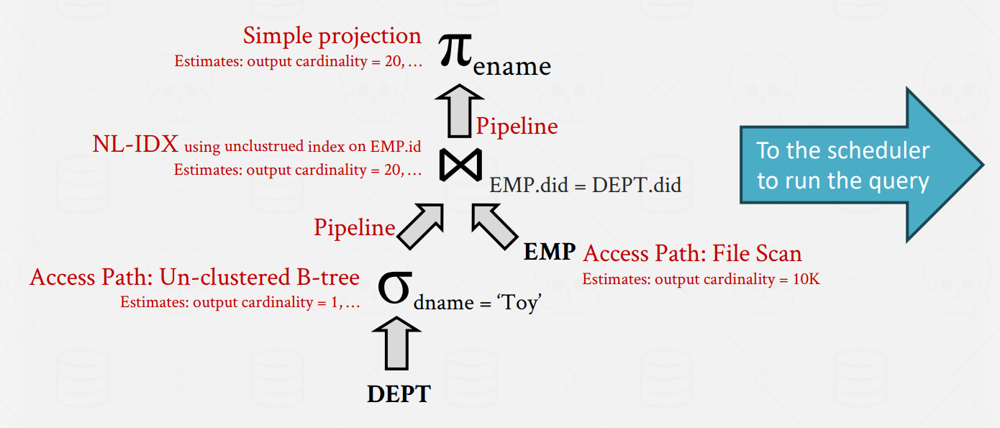
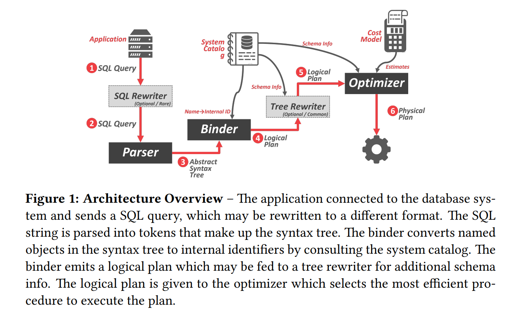
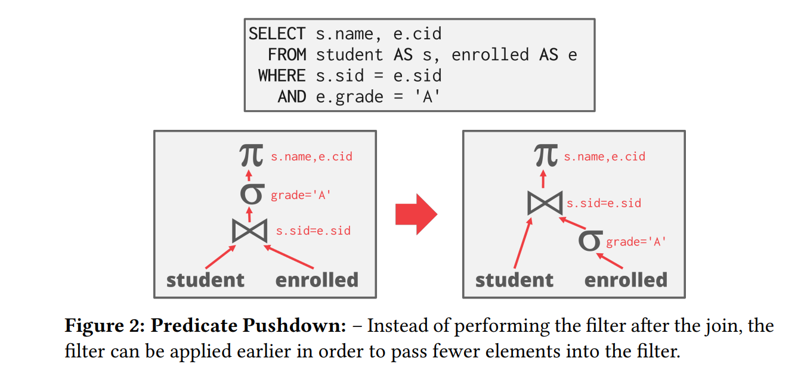

## **Overview**

SQL 语句只告诉 DBMS 要计算什么，而不是怎么去计算它。和先前提到的一样，DBMS 会将 SQL 转化为执行计划，但是有很多方法去执行查询计划的算子，不同的执行方式有不同的性能。DBMS 优化器的任务就是优化给定的执行计划，以得到更优的性能。

Query Optimizer 第一次出现在 IBM System R，那时人们认为 DBMS 指定的查询计划永远无法比人类指定的更好。System R 的 optimizer 中的一些理念至今仍在使用。通常有两种优化策略：

- heuristics rules：启发式方法将查询的部分与已知策略相匹配，然后重组计划。如：Predicate Pushdown，Replace Cartesian Product 等操作。

- cost-based search：这个方法会检查数据，然后评估执行计划的消耗，最后选择消耗最小的查询计划。

查询优化是创建数据库最难的一部分。一些系统期望将机器学习应用到查询优化中，来提高优化的效果和准确率，但还没有系统正真实现。

### **Logical vs. Physical Plans**

优化器生成逻辑代数表达式到最佳等效物理代数表达式的映射。逻辑计划大致相当于查询中的关系代数表达式。

物理查询不仅要有逻辑查询的代数表达式，还要知道执行每个代数运算时的具体算子（e.g. Join 运算有 hash-join 算子、Sort-Merge 算子等等），也要知道执行计算时的一些上下文（e.g. 表所在文件路径，表的索引等等）。

<figure markdown="span">
  { width="650" }
</figure>

## **Logical Query Optimization**

<figure markdown="span">
  { width="650" }
</figure>

一些选择优化如下：

- 将 filter 尽可能早的执行（predicate pushdown）

<figure markdown="span">
  { width="650" }
</figure>

- 重新排序谓词，以便DBMS首先应用最具选择性的谓词

- 分解复杂的谓词，并且下传它（split conjunctive predicates）

一些映射优化如下：

- 尽可能早点执行映射，这样我们可以得到更小的中间结果

- 只要使用过的属性都要映射