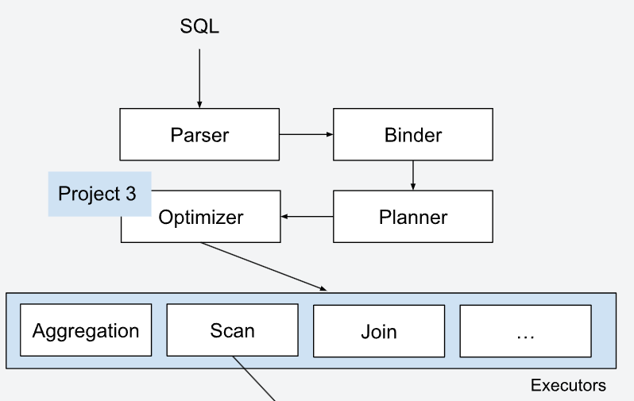
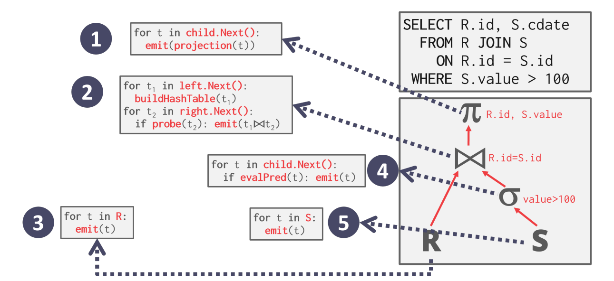
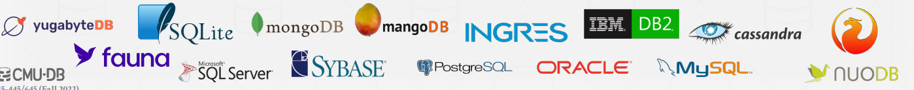
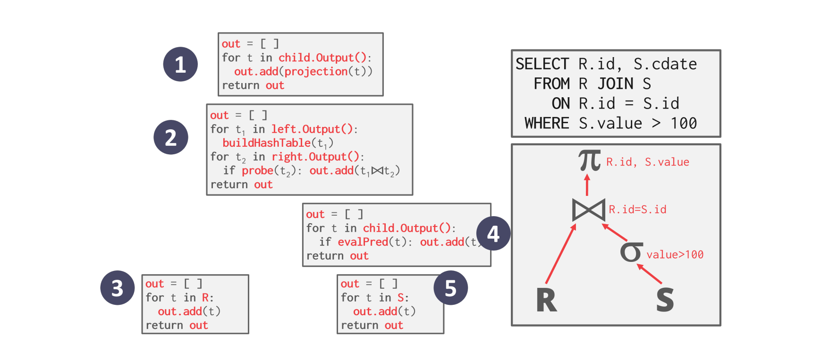
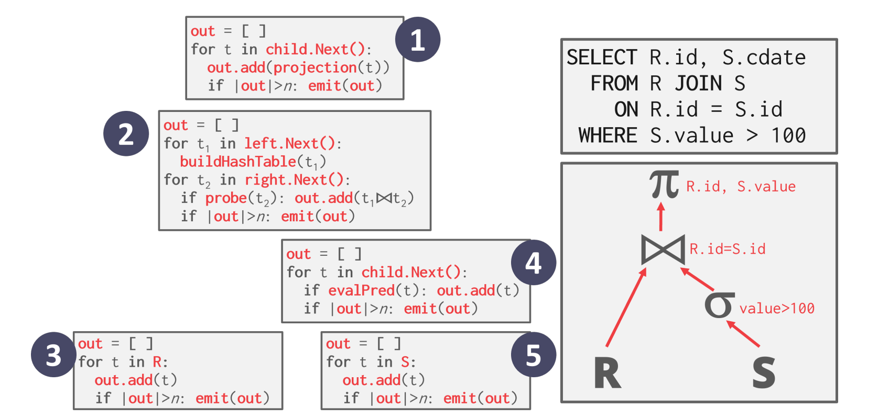
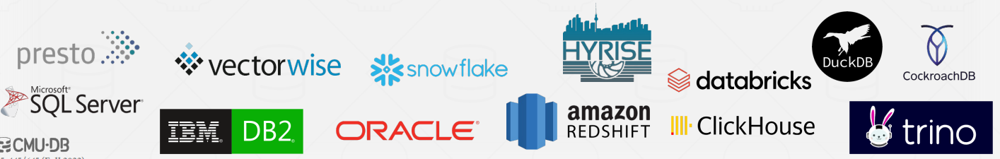
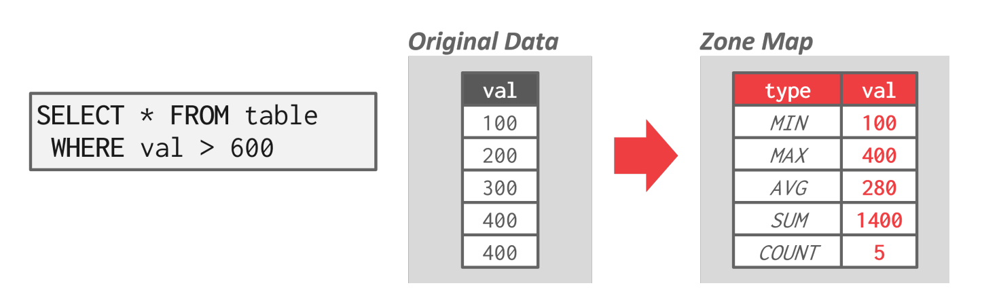
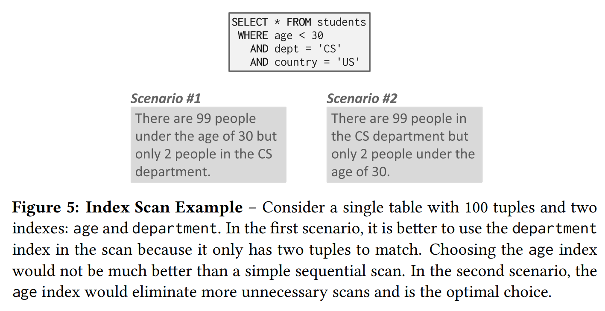
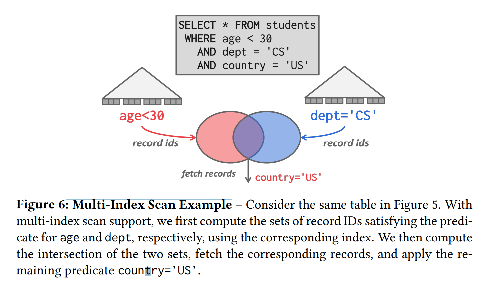
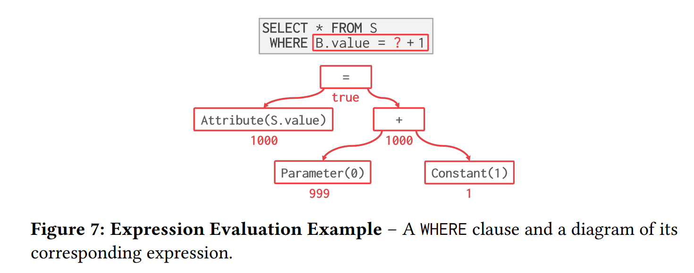

## **Query Plan**

DBMS 会将 SQL 语句转化为插叙计划，过程如下：

<figure markdown="span">
  { width="500" }
</figure>

SQL 语句经过 Parser 进行语法解析，随后生成一棵抽象语法树，然后经过 Binder 将算子 bind 到相应的运算节点上，随后由 Planner 生成一个初步的查询计划，最后 Optimizer 优化查询，得到最终的查询计划。

在算子执行计划时，数据从树的叶子节点流向根节点，最后根节点输出的就是整个查询的结果。


<hr>

## **Processing Models**

一个 DBMS 的执行模型（Processing Models）定义为如何执行查询计划。目前主要有三种模型:

- Iterator Model

- Materialization Model

- Vectorized/Batch Model

### **Iterator Model**

Iterator Model 也被称作火山模型（Volcano or Pipeline model），这是最常见的执行模型，几乎所有的行存储 DBMS 都使用它。

模型中，查询计划的每一个算子都实现一个 `Next()` 方法，该方法会返回一个 tuple 或是 eof，返回 eof 代表已经遍历完成。每一个算子在执行一次运算时，都调用其子算子来获取相应的数据：

<figure markdown="span">
  { width="700" }
</figure>

一些算子可能需要等其 children 所有数据返回完之后才执行，如：Join、Aggregates、Order By 等等。

如下数据库都使用了该模型：

<figure markdown="span">
  { width="800" }
</figure>

### **Materialization Model**

在该模型中，每次调用 `Next()`，children 会一次性返回所有的数据：

<figure markdown="span">
  { width="800" }
</figure>

在这个过程中，DBMS 会下方一些关于结果中元组数量的信息，来避免扫描过多的无用信息（如：`LIMIT`）。


这个思路更适合 OLTP 的系统，因为每次事务之后涉及到少量的 tuple，可以减少一些函数调用的成本。但不太适合 OLAP 的系统，这回导致产生多余的中间结果。

右侧是一些使用该模型的数据库系统。

PS：Andy 之前在 VOLTDB 上班...

<br>

### **Vectorization Model**

这种模型是 Iterator Model 和 Materialization Model 的一种折中方法，每次调用 `Next()`，它每次返回一批数据，每个算子内部也是一批一批的处理数据的，每个批次中 tuple 的数量可以根据需要改变（hardware、query properties）：

<figure markdown="span">
  { width="800" }
</figure>

该方法对于需要扫描大量 tuples 的 OLAP 查询是理想的，因为只需要少量的调用 `Next()` 函数。

并且这样的范围操作，算子可以使用向量指令（SIMD）来优化查询效率。如下的数据库系统使用了该模型：

<figure markdown="span">
  { width="650" }
</figure>

### **Processing Direction**


Iterator Model 和 Vectorization Model 都是自上而下的执行方向，当根节点需要数据时，才会从子树中 pull 数据上来。

Materialization Model 是一种自下而上的方法，当叶子完成读取数据后，才会将数据 push 到父节点中。允许算子更准确控制的缓存 / 寄存器，利用局部原理，提高效率。

<hr>

## **Access Methods**

Access Methods 指的是 DBMS 从数据表中获取数据的方式，它并没有在 relational algebra 中定义。主要有两种方法：

- Sequential Scan

- Index Scan

### **Sequential Scan**

Sequential Scan 就是扫描所有的页，找到需要的 tuple，DBMS 维护一个指针（cursor）记录最后访问的元组的 page/slot id。

```Python
for page in table.pages:
    for t in page.tuples:
        if evalPred(t):
            // Do Something!
```

顺序扫描几乎是 DBMS 执行查询时效率最低的方法。这里有很多方法使 Sequential Scan 更快：

- Prefetching：预取

- Buffer Pool Bypass：缓存池旁路

- Parallelization：并发

- Late Materialization：后期物化，这是一种对列存储系统的优化。将元组拼接延迟到要将结果 push 到父节点。

- Heap Clustering：聚簇索引，元组被聚簇索引指针按顺序存储在页面中。一般是 B+ 树的叶子节点。

- Approximate Queries（有损数据跳过）：我们只在整张表的一个样本子集中运行查询，并计算结果，这通常被用于允许一些误差的聚合操作上。

- Zone Map（无损数据跳过）：对于每一页中的各个列数据，提前计算一些聚合数据，如：MIN、MAX 值，这样 DBMS 在访问该页前，先查看 Zone Map，再决定是否要访问该页，就可以避免调入一些无用的页面。


<figure markdown="span">
  { width="650" }
</figure>


<br>
Zone Map 是一种非常聪明的想法，我们只需要用几个变量，就可以判断是否需要访问该页，这不仅是在顺序扫描上的优化，我们可以对所有的数据页维护 Zone Map，每次修改都同步更新 Zone Map，可以避免很多无用页面调入内存。右侧是一些使用该技术的系统。

### **Index Scan**

DBMS 通过 index 快速找到查询需要的 tuple。如果有多个表属性都已经创建索引，那么索引的选择堆查询效率的影响也很大，可以思考下图的例子：

<figure markdown="span">
  { width="650" }
</figure>

有很多因素都会影响 DBMS 对 index 的选择：

- index 包含了哪些属性

- 查询引用了哪些属性

- 属性的定义域

- 谓词的构成

- 索引是否是唯一键

更高级的 DBMS 支持 multi-index scans 的技术，它的思路计算出符合每个 index 的 tuple id 子集，最后再按照谓词对所有子集求交集或并集（union or intersection），最后根据结果集中的 id 取到最后的结果。

<figure markdown="span">
  { width="650" }
</figure>

取交集时，可以用 bitmaps、hash tables 等数据结构提高效率。

现实中实现该技术的系统：

- [MySQL -- Index Merge Optimization](https://dev.mysql.com/doc/refman/8.0/en/index-merge-optimization.html){target=_blank}

- [PostgreSQL -- Bitmap indexes ](https://www.postgresql.org/message-id/12553.1135634231@sss.pgh.pa.us){target=_blank}

- [DB2 -- Multiple index scans](https://www.ibm.com/docs/en/dspafz/5.1.0?topic=report-multiple-index-scans){target=_blank}

<hr>

## **Expression Evaluation**

DBMS 会将 `WHERE` 子句表示为一棵表达式树，每个节点代码不同的表达式类型。

<figure markdown="span">
  { width="650" }
</figure>

为了在运行时计算表达式树，DBMS 维护一个上下文句柄，其中包含执行的元数据，如当前元组、参数和表模式。然后 DBMS 遍历整棵树来计算结果。

用这种方式来计算谓词是很慢的，现代 DBMS 会采用 JIT Compilation （即使编译技术）它会将查询进行编译，之后的判断都是直接执行编译后的机器码，这将大大提高效率。

PostgreSQL 支持这一特性：[PREPARE](https://www.postgresql.org/docs/current/sql-prepare.html){target=_blank}。


