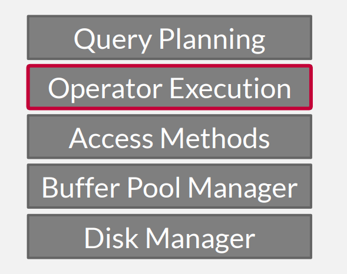
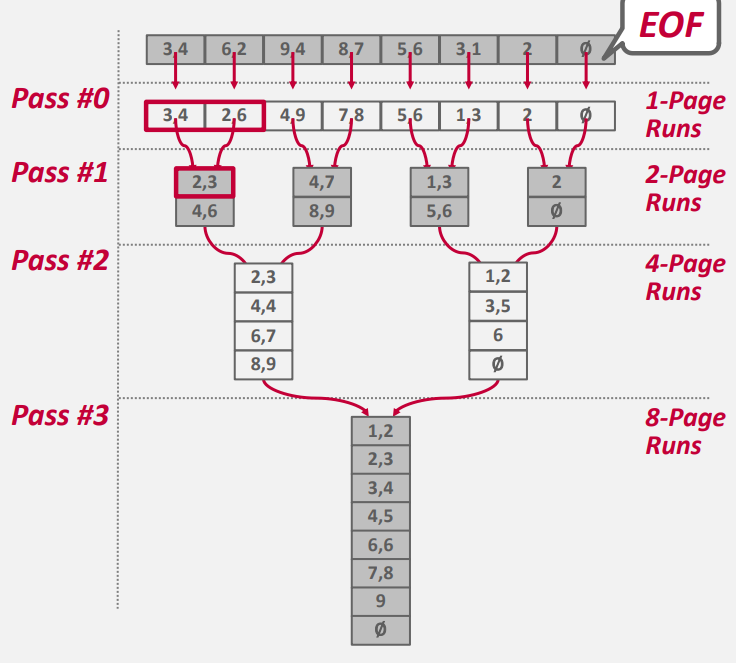
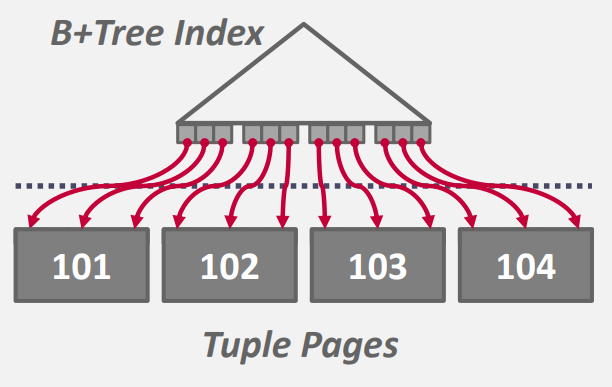
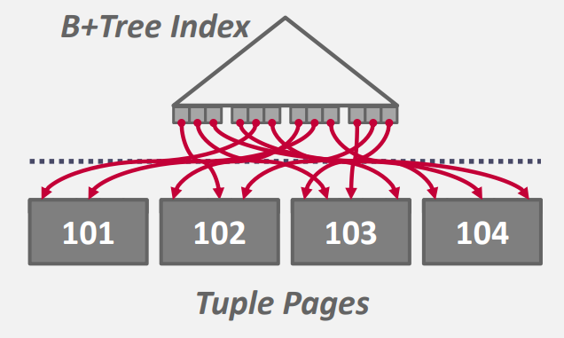
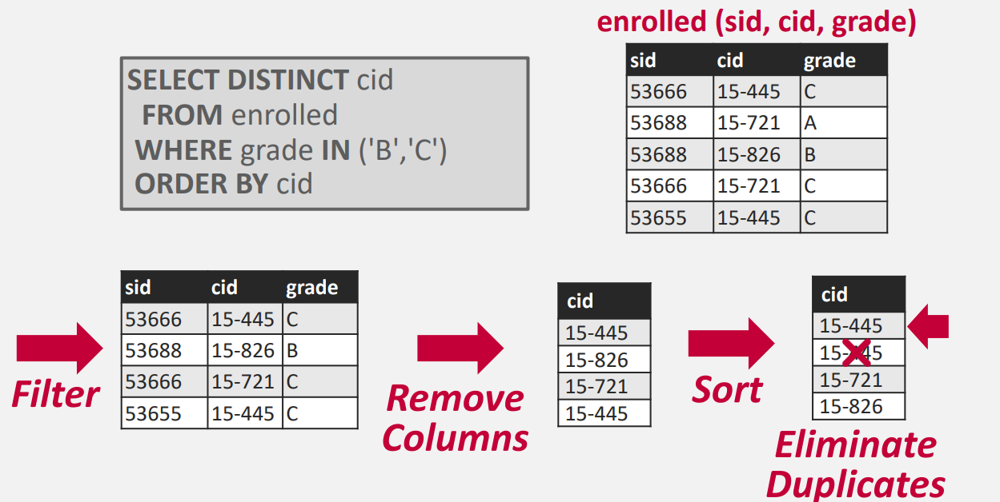
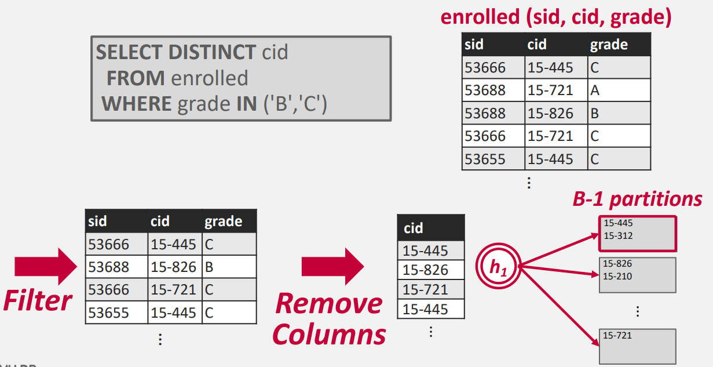
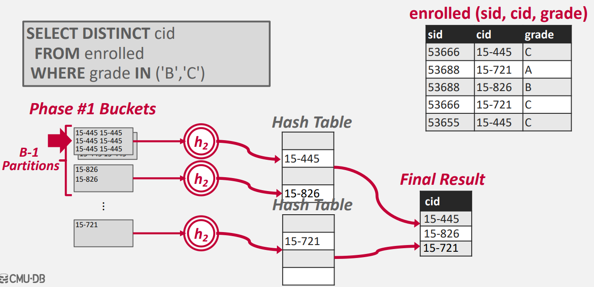
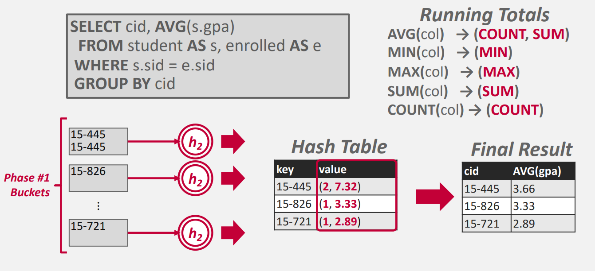

## **Query Plan**

之前我们讲的哈希表和 B+ 树是关于访问方法（access methods），即如何找到一个数据。现在我们要介绍数据库如何执行一个 SQL 查询。

<figure markdown="span">
  { width="250" }
</figure>

 

DBMS 会把许多 SQL 语句编译成查询执行计划，查询计划是一个操作树，这会在之后介绍。而数据库就是通过这个这个操作树，来决定执行什么操作。

从操作树的叶子节点开始执行，数据从下到上流动，最后根节点的输出就是查询的结果。

  

对于面向磁盘的数据库系统，我们将使用缓冲池来实现需要溢出到磁盘的算法。我们希望最小化算法的 I/O、也希望最大化算法的顺序 I/O 数量（对于磁盘顺序 I/O 效率是更高的）。

## **Sort**

因为关系模型下，表中的元组没有特定的顺序关系，所以 DBMS 需要进行排序。通常排序操作在 `ORDER BY`、`GROUP BY`、`DISTINCT` 和 `JOIN` 操作符。如果要排序的内容内存可以放的下，那么 DBMS 会使用**内排序（in-memory sorting）**完成任务。如果数据内存放不下，DBMS 就需要使用可以将数据溢出到磁盘上的**外排序（external sorting）**来完成任务，这样的外排序都希望是最小化 I/O 最大化顺序 I/O。

如果查询包含 带有 `LIMIT` 的 `ORDER BY` ，那么我们只需要找到 top-N 的元素即可。使用堆，在 $n\log{k}$ 的复杂度解决。但这是在内存中可以放的下 $k$ 个元素。

对于内存放不下的数据，标准解法是**外归并排序（external merge sort）**。该算法利用分治的思想，将磁盘上所有的数据分为若干个部分（runs），单独排序，然后合并为更大的部分。该算法被分为两部分：

- 排序：首先对能放进内存的小块数据进行排序，然后将排序后的页面写回磁盘。

- 归并：然后将若干排序后子文件（sub-runs）的合并为一个更大的文件（runs）。

对于每个部分，他内部都是一系列的 key-value 对。Key 就是排序要比较的属性值；

value：有两种表示方式：

1. （early materialization）直接存 key 对应的整个元组
   
2. （late materialization）存元组的 Record ID

对于 early materialization 在排序时的 I/O 花费可能会很大，late materialization 只会存 4/8 字节的 Record ID 所以写入磁盘的字节数会减少，但是在排序完成后，取元组时会导致大量的随机 I/O，从而影响性能。

通常行存储会使用 early materialization，列存储使用 late materialization，因为列存储每个 Record 本身就不是顺序的存在一起的，总要进行大量的随机 I/O 来拼接所有的 Record。

### **Two-way Merge Sort**

我们以最简单的 2 路归并为例，这里的 2 是我们要归并的 runs 的数量。

首先数据被分为 $N$ 页，在 DBMS 中运行我们使用 $B$ 个 frame 来存放输入和输出数据。$N$ 是远大于 $B$ 的。在 2 路归并中 $B=3$ 就足够。

<figure markdown="span">
  { width="550" }
</figure>

- 排序：在第一次遍历，我们每次读一页数据进内存，然后对页内数据进行排序，然后将数据作为一个部分（run）再写回磁盘

- 归并：我们每次分别读取两个 run 的两页作为输入，一个额外的页作为输出，输出到一个新的更大的 run 中。所以对于 2 路归并，我们只需要三给页面就能完成排序。

它要遍历的次数是：$1 + \left \lceil \log{N} \right \rceil$

每次遍历的 I/O 花费是：$2N$，每个页面都要有一次读入，一次额写出。

### **K-way Merge Sort**

2 路归并要形成的归并树高度会比较高，遍历次数就会多，I/O 花费就会大，我们可以通过增加归并的路数，来降低树高度，这就要增加我们使用的页面数。

现在的数据库服务器上能被我们使用的页面数可不止 3 个，有些服务器内存大小可能是 TB 为单位的，所以内存不愁。

如果我们可以使用 $B$ 给页面，那么我们就能进行 $B-1$ 路归并，1 个页面用作输出，其他用作输入。而且我们最开始排序时，我们直接读入 $B$ 个页面，然后将 $B$ 个页面完整排好序，将 $B$ 给页面作为一个 run 写回磁盘，这样在最开始就能减少要归并 runs 的数量。

应用此优化后，遍历次数变为了：$1 + \left \lceil \log_{B-1}{\left \lceil \frac{N}{B}\right \rceil} \right \rceil$

每遍的花费还是：$2N$。

### **Double Buffering Optimization**

我们可用发现当正在进行归并时 CPU 是在忙碌的，而 I/O 总线是空闲的，当我们读取页面时，I/O 总线忙碌起来了，但 CPU 又空闲了，不能充分的利用硬件资源。

双缓存的优化思路是：我们将我们可用的 buffer pool 分为两部分，当我们正在进行归并操作时，我们异步的从磁盘读取下一次归并操作所需要的页面，并将其存储到第二部分的 buffer pool 中。

比如：原先我们有 $B$ 个可用页面，我们划分为两个 $B/2$ 的 buffer pool，这样我们只能进行 $\frac{B}{2} - 1$ 路归并。但是我们减少了 CPU 等待磁盘 I/O 请求的时间。

因为遍历次数是 $1 + \left \lceil \log_{B-1}{\left \lceil \frac{N}{B}\right \rceil} \right \rceil$，所以有些时候 $B$ 减少一半并不会减少遍历次数。

### **Using B+ Trees**

当 B+ 树是聚簇索引时，数据以正确的顺序被存储在 B+ 树的叶子节点，我们直接遍历 B+ 树就能得到排序的结果，且是顺序 I/O。

<figure markdown="span">
  { width="350" }
</figure>

但当 B+ 树是非聚簇索引时，我们遍历叶子节点，访问每个记录，可能都要进行一次磁盘 I/O，因为这是完全的随机访问，最坏可能每个数据进行一次 I/O，效率及其低下。

<figure markdown="span">
  { width="350" }
</figure>

## **Aggregations**

聚合操作就是讲一个或多个值，通过计算得到一个单一值的过程，如：求平均、求和、求最值。

有两种方式来实现聚合操作：1）排序和2）哈希。

### **Sorting**

排序方式很简单，先根据 `GROUP BY key(s)` 为键值进行排序，排序后，顺序扫描一遍，在扫描的过程中计算聚合操作的结果。最后算子的输出将按键值排序。

<figure markdown="span">
  { width="550" }
</figure>

在执行排序聚合时，调整操作执行的顺序以最大限度地提高效率非常重要。例如，如果查询需要筛选条件，则最好先执行筛选条件，然后对筛选后的数据进行排序，以减少需要排序的数据量。

但很多时候我们并不需要排好序的数据，如：

- Forming groups in `GROUP BY`

- Removing duplicates in `DISTINCT`

在这样的场景下 hashing 是更好的选择，它能有效减少排序所需的额外工作。

### **Hashing**

当 DBMS 扫描一个一张表时，将数据插入一个临时的哈希表中，对于每个记录，查看是否已经在哈希表中，如果已经在，就执行相应的聚合操作：

- `GROUP BY`：求和、求最大等操作。

- `DISTINCT`：去重。

如果所有数据可以放入内存，这样就足够了。如果不能，就要进行额外的操作：分块。

假设我们可用的页面有 $B$ 个，我们使用 $h_1$ 哈希函数扫描表一遍，将表划分为 $B-1$ 个块，一个页面用作输入，剩下 $B-1$ 个页面分别输出到 $B-1$ 个文件中：

<figure markdown="span">
  { width="550" }
</figure>

经过这次划分后，相同元素的值一定在同一个块内。如果一个块内的元素聚合后还是不能放入内存中，就再进行一次分块，直到可用放入内存为止，或者对于这个不能放入内存的块，我们采用排序方式处理也可以。

第二步，我们使用 $h_2$ 哈希函数扫描一个块中的元素，相同的值的元素进行聚合操作，就能得到最后的结果：

<figure markdown="span">
  { width="550" }
</figure>

在 DBMS 存储 GroupByKey → RunningValue 这样的 pair 来计算聚合，RunningValue 取决于聚合函数，对于这个例子中，聚合函数就是去重。

当在哈希表中遇到相同元素时，就执行聚合运算，并将运算结果存储到 RunningValue 中：

<figure markdown="span">
  { width="550" }
</figure>

