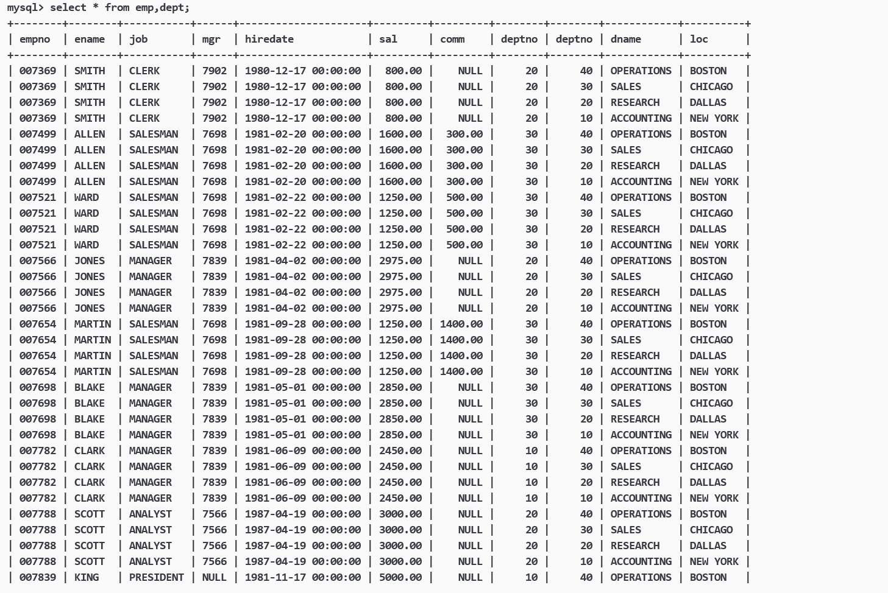
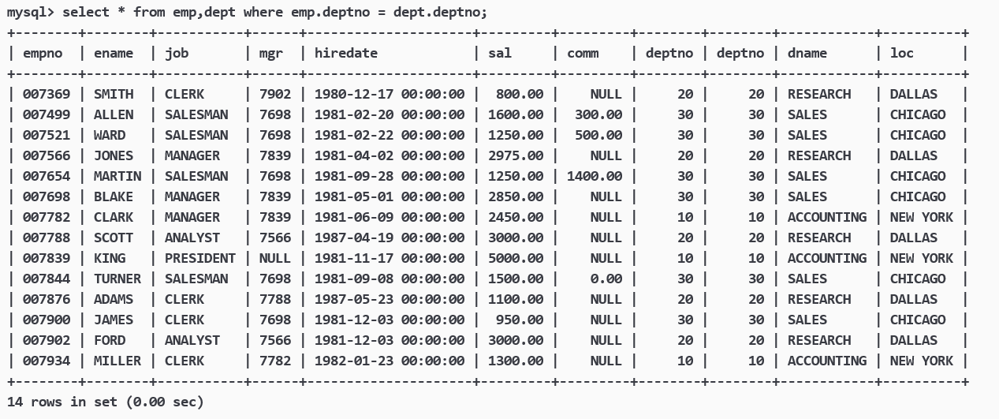
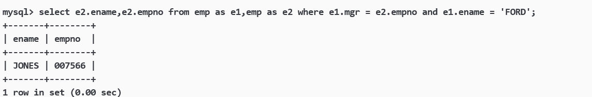
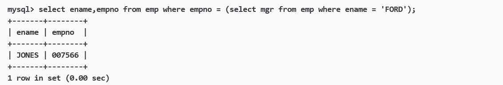
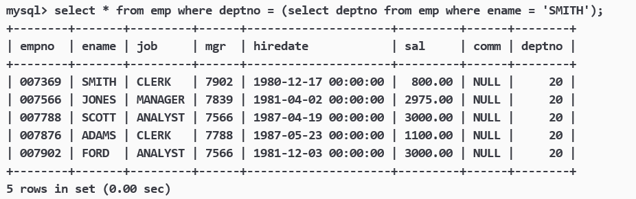

## **多表查询**


实际开发中往往数据来自不同的表，所以需要多表查询。我们用oracle 9i的 scott 测试表来演示如何进行多表查询。


??? note "oracle 9i的 scott 测试表数据"
    ```sql
    DROP database IF EXISTS `scott`;
    CREATE database IF NOT EXISTS `scott` DEFAULT CHARACTER SET utf8mb4;

    USE `scott`;

    DROP TABLE IF EXISTS `dept`;
    CREATE TABLE `dept` (
    `deptno` int(2) unsigned zerofill NOT NULL COMMENT '部门编号',
    `dname` varchar(14) DEFAULT NULL COMMENT '部门名称',
    `loc` varchar(13) DEFAULT NULL COMMENT '部门所在地点'
    );


    DROP TABLE IF EXISTS `emp`;
    CREATE TABLE `emp` (
    `empno` int(6) unsigned zerofill NOT NULL COMMENT '雇员编号',
    `ename` varchar(10) DEFAULT NULL COMMENT '雇员姓名',
    `job` varchar(9) DEFAULT NULL COMMENT '雇员职位',
    `mgr` int(4) unsigned zerofill DEFAULT NULL COMMENT '雇员领导编号',
    `hiredate` datetime DEFAULT NULL COMMENT '雇佣时间',
    `sal` decimal(7,2) DEFAULT NULL COMMENT '工资月薪',
    `comm` decimal(7,2) DEFAULT NULL COMMENT '奖金',
    `deptno` int(2) unsigned zerofill DEFAULT NULL COMMENT '部门编号'
    );

    DROP TABLE IF EXISTS `salgrade`;
    CREATE TABLE `salgrade` (
    `grade` int(11) DEFAULT NULL COMMENT '等级',
    `losal` int(11) DEFAULT NULL COMMENT '此等级最低工资',
    `hisal` int(11) DEFAULT NULL COMMENT '此等级最高工资'
    );

    insert into dept (deptno, dname, loc)
    values (10, 'ACCOUNTING', 'NEW YORK');
    insert into dept (deptno, dname, loc)
    values (20, 'RESEARCH', 'DALLAS');
    insert into dept (deptno, dname, loc)
    values (30, 'SALES', 'CHICAGO');
    insert into dept (deptno, dname, loc)
    values (40, 'OPERATIONS', 'BOSTON');

    insert into emp (empno, ename, job, mgr, hiredate, sal, comm, deptno)
    values (7369, 'SMITH', 'CLERK', 7902, '1980-12-17', 800, null, 20);

    insert into emp (empno, ename, job, mgr, hiredate, sal, comm, deptno)
    values (7499, 'ALLEN', 'SALESMAN', 7698, '1981-02-20', 1600, 300, 30);

    insert into emp (empno, ename, job, mgr, hiredate, sal, comm, deptno)
    values (7521, 'WARD', 'SALESMAN', 7698, '1981-02-22', 1250, 500, 30);

    insert into emp (empno, ename, job, mgr, hiredate, sal, comm, deptno)
    values (7566, 'JONES', 'MANAGER', 7839, '1981-04-02', 2975, null, 20);

    insert into emp (empno, ename, job, mgr, hiredate, sal, comm, deptno)
    values (7654, 'MARTIN', 'SALESMAN', 7698, '1981-09-28', 1250, 1400, 30);

    insert into emp (empno, ename, job, mgr, hiredate, sal, comm, deptno)
    values (7698, 'BLAKE', 'MANAGER', 7839, '1981-05-01', 2850, null, 30);

    insert into emp (empno, ename, job, mgr, hiredate, sal, comm, deptno)
    values (7782, 'CLARK', 'MANAGER', 7839, '1981-06-09', 2450, null, 10);

    insert into emp (empno, ename, job, mgr, hiredate, sal, comm, deptno)
    values (7788, 'SCOTT', 'ANALYST', 7566, '1987-04-19', 3000, null, 20);

    insert into emp (empno, ename, job, mgr, hiredate, sal, comm, deptno)
    values (7839, 'KING', 'PRESIDENT', null, '1981-11-17', 5000, null, 10);

    insert into emp (empno, ename, job, mgr, hiredate, sal, comm, deptno)
    values (7844, 'TURNER', 'SALESMAN', 7698,'1981-09-08', 1500, 0, 30);

    insert into emp (empno, ename, job, mgr, hiredate, sal, comm, deptno)
    values (7876, 'ADAMS', 'CLERK', 7788, '1987-05-23', 1100, null, 20);

    insert into emp (empno, ename, job, mgr, hiredate, sal, comm, deptno)
    values (7900, 'JAMES', 'CLERK', 7698, '1981-12-03', 950, null, 30);

    insert into emp (empno, ename, job, mgr, hiredate, sal, comm, deptno)
    values (7902, 'FORD', 'ANALYST', 7566, '1981-12-03', 3000, null, 20);

    insert into emp (empno, ename, job, mgr, hiredate, sal, comm, deptno)
    values (7934, 'MILLER', 'CLERK', 7782, '1982-01-23', 1300, null, 10);

    insert into salgrade (grade, losal, hisal) values (1, 700, 1200);
    insert into salgrade (grade, losal, hisal) values (2, 1201, 1400);
    insert into salgrade (grade, losal, hisal) values (3, 1401, 2000);
    insert into salgrade (grade, losal, hisal) values (4, 2001, 3000);
    insert into salgrade (grade, losal, hisal) values (5, 3001, 9999);
    ```

当我们想显示雇员名、雇员工资以及所在部门的名字因为上面的数据来自 emp 和 dept 表，因此要联合查询:

```sql
select * from emp,dept;
```

会生成一个新表：

<figure markdown="span">
  { width="850" }
</figure>

这张表就是将两个表中的行数据进行穷举组合得到的，也就是两张表做**笛卡尔积**。我们想要保证员工的部门和部门号正确对应就要使用以下命令：

```sql
select * from emp,dept where emp.deptno = dept.deptno;
```
<figure markdown="span">
  { width="850" }
</figure>

## **自连接**

自连接是指在同一张表连接查询。

案例：显示员工 FORD 的上级领导的编号和姓名（mgr是员工领导的编号--empno）

- **自连接多表查询**

```sql
select e2.ename,e2.empno 
from emp as e1,emp as e2 
where e1.mgr = e2.empno and e1.ename = 'FORD';
```

<figure markdown="span">
  { width="850" }
</figure>

- **子查询**

当然我们也可使用子查询的方式：

```sql
select ename,empno 
from emp 
where empno = (
    select mgr 
    from emp 
    where ename = 'FORD'
);
```
<figure markdown="span">
  { width="850" }
</figure>

## **子查询**

子查询是指嵌入在其他sql语句中的select语句，也叫嵌套查询

### **单行子查询**

返回一行记录的子查询。

案例：显示SMITH同一部门的员工

```sql
select * 
from emp 
where deptno = (
    select deptno 
    from emp 
    where ename = 'SMITH'
);
```

<figure markdown="span">
  { width="850" }
</figure>


### **多行子查询**

返回多行记录的子查询。

- in关键字；用于判断一个列值是否在一个集合当中。
  
查询和10号部门的工作岗位相同的雇员的名字，岗位，工资，部门号，但是不包含10自己的

```sql
select ename,job,sal,deptno 
from emp 
where job in (
    select distinct job 
    from emp 
    where deptno = 10
) and deptno != 10;
```

??? note "扩展"
    不显示部门号，而是显示部门名称。
    ```sql
    select ename,job,sal,dname 
    from (
        select ename,job,sal,deptno 
        from emp 
        where job in (
            select distinct job 
            from emp 
            where deptno = 10
        ) and deptno != 10
    ) as tmp, dept 
    where tmp.deptno = dept.deptno;
    ```

- all关键字；它用于将某个值与子查询返回的所有值进行比较。只有当比较条件对所有返回值都成立时，条件才为真。
  
显示工资比部门 30 的所有员工的工资高的员工的姓名、工资和部门号

```sql
select ename,sal,deptno 
from emp 
where sal > all(
    select sal 
    from emp 
    where deptno = 30
);
```

- any关键字；它与 SOME 关键字效果相同，用于将某个值与子查询返回的任何一个值进行比较。只要比较条件对返回的任何一个值成立，条件就为真。
  
显示工资比部门 30 其中一名员工的工资高的员工的姓名、工资和部门号（包含自己部门的员工）

```sql
select ename,sal,deptno 
from emp 
where sal > any(
    select sal 
    from emp 
    where deptno = 30
);
```

### **多列子查询**

上面介绍的单行还是多行，都是只返回一列数据。而多列子查询则是指查询返回多个列数据的子查询语句。

案例：查询和SMITH的部门和岗位完全相同的所有雇员，不含SMITH本人。

```sql
select * 
from emp 
where (deptno,job) = (
    select deptno,job 
    from emp 
    where ename = 'SMITH' 
) and ename != 'SMITH';
```

多列子查询就是将多列的数据合并为一个数据去进行比较。

### **在from子句中使用子查询**

子查询语句出现在from子句中。这里要用到数据查询的技巧，把一个子查询当做一个临时表使用。

案例：

显示每个高于自己部门平均工资的员工的姓名、部门、工资、平均工资

```sql
select emp.ename,emp.deptno,emp.sal,tmp.avg_sal 
from emp,(
    select deptno,avg(sal) as avg_sal 
    from emp group by deptno
) as tmp 
where emp.sal > tmp.avg_sal and emp.deptno = tmp.deptno;
```

## **合并查询**

在实际应用中，为了合并多个select的执行结果，可以使用集合操作符 union，union all

### **union**

该操作符用于取得两个结果集的并集。当使用该操作符时，会自动去掉结果集中的重复行。

案例：将工资大于2500或职位是MANAGER的人找出来。

```sql
select * 
from emp 
where sal > 2500 
union 
select * 
from emp 
where job='MANAGER';
```


### **union all**

该操作符用于取得两个结果集的并集。当使用该操作符时，不会去掉结果集中的重复行。


```sql
select * 
from emp 
where sal > 2500 
union all
select * 
from emp 
where job='MANAGER';
```

union，union all 取并集时列必须都相同。


## **表的内连和外连**

表的连接就是两张表做笛卡尔积，但是根据不同应用场景，表的连接分为内连和外连。

### **内连接**

内连接实际上就是利用 where 子句对两种表形成的笛卡儿积进行筛选，前面的多表查询和自连接都是内连接。而内连接的完整语法是下面这样的：

```sql
select {* | column [,column...]} 
from table_name1 inner join table_name2 on [连接条件...];
```

案例：显示SMITH的名字和部门名称。

```sql
select ename,emp.deptno 
from emp inner join dept on emp.deptno = dept.deptno 
where emp.ename = 'SMITH';
```

### **外连接**

外连接分为左外连接和右外连接，如果联合查询，左侧的表完全显示我们就说是左外连接。如果联合查询，右侧的表完全显示我们就说是右外连接。

```sql
-- 左外连接
select {* | column [,column...]} 
from table_name1 left join table_name2 on [连接条件...];

-- 右外连接
select {* | column [,column...]} 
from table_name1 right join table_name2 on [连接条件...];
```

