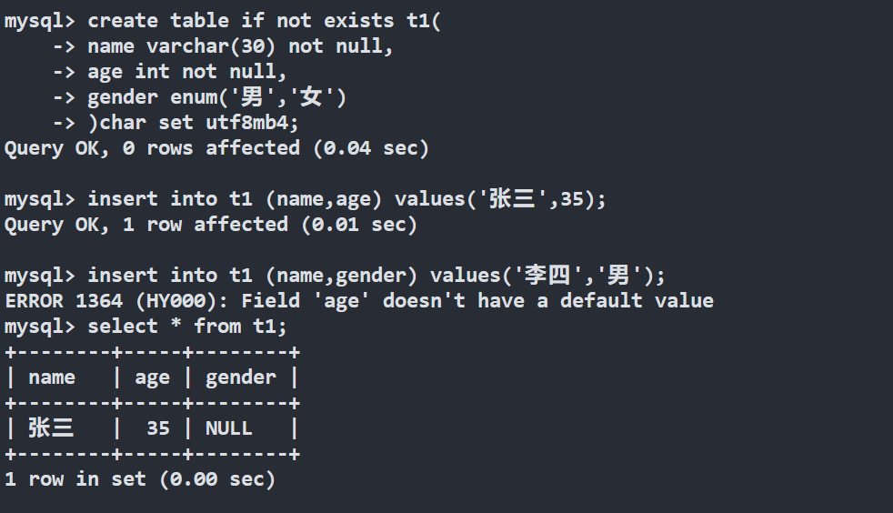
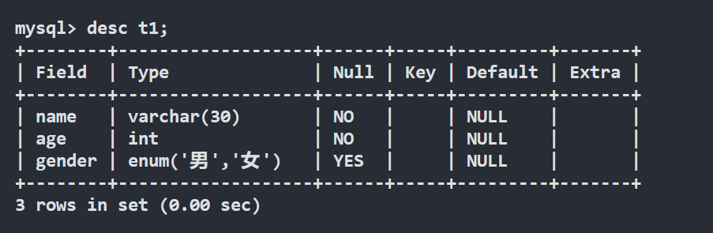
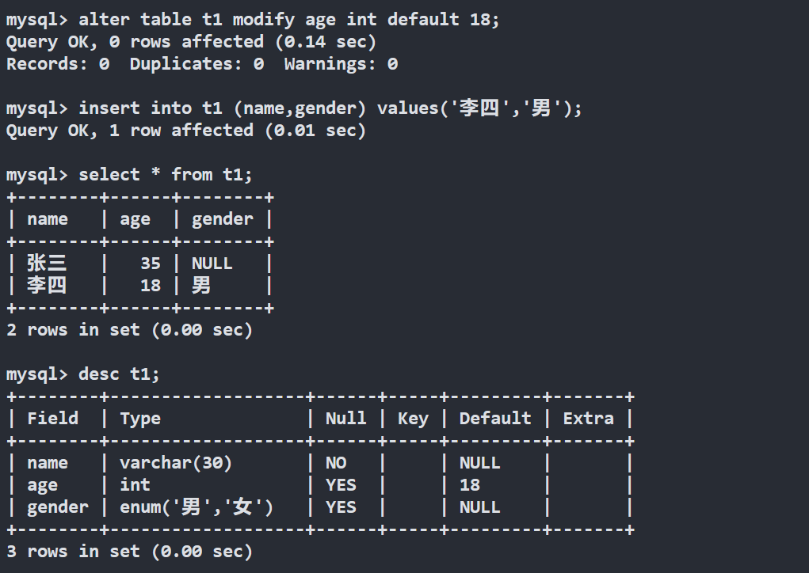
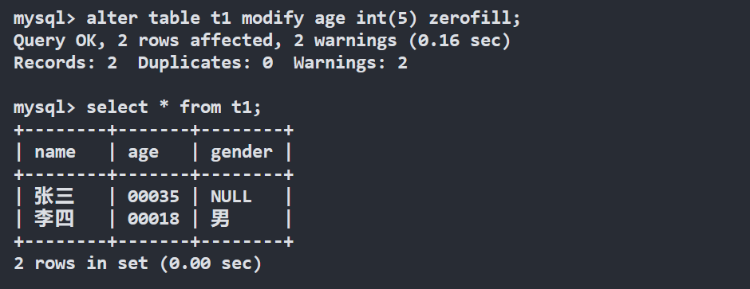
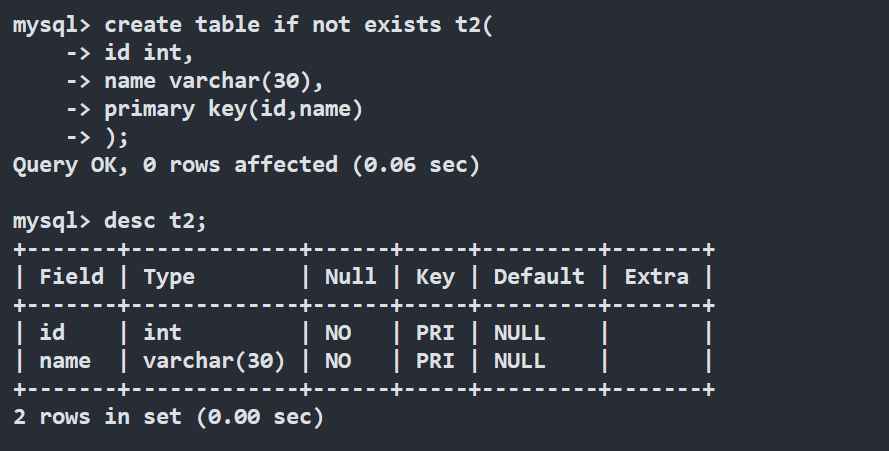
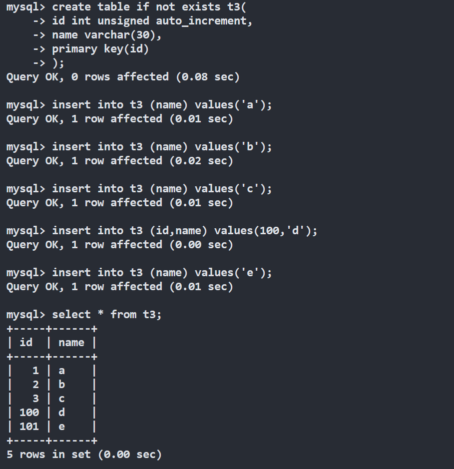
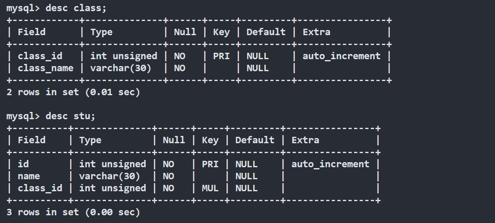
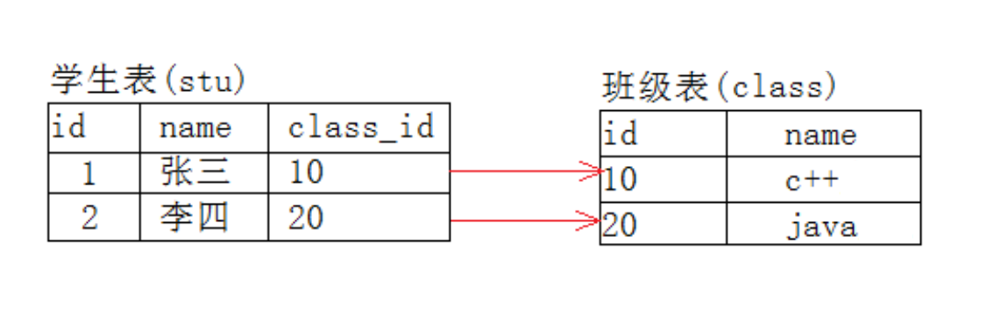
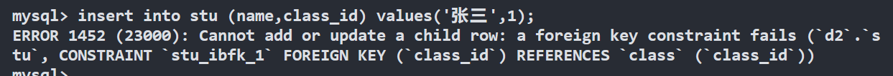
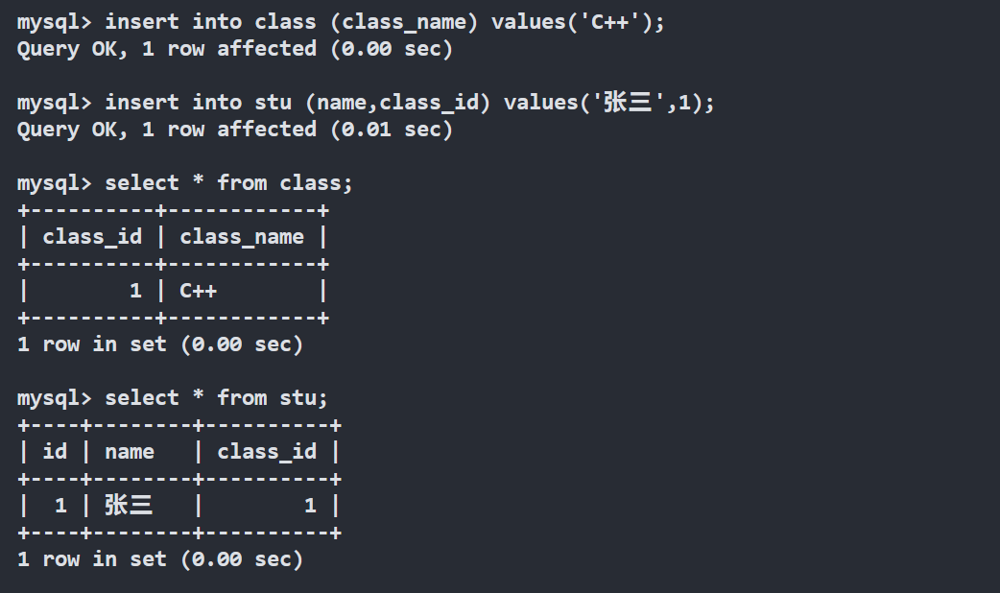

## **表的约束**

表中一定有各种各样的约束，通过约束，让我们未来插入数据库表中的数据是符合预期的。所以约束的本质就是用技术手段，强迫用户在数据库表中插入正确的数据，保证数据的完整性和可预期性。


## **约束**

表的约束很多，这里主要介绍如下几个： null/not null,default, comment, zerofill，primary key，auto_increment，unique key 。

### **空属性**

有两个取值：null 和 not null。

在设置列的时候，数据库的默认字段是允许值为空的，但是在开发中我们可能会要求某些值不能为空，这是就要设置 not null 属性。

<figure markdown="span">
  { width="550" }
</figure>

可以看到设置 not null 属性的列，不允许省略，除非设置默认值，默认值也是一种约束，后文会介绍。

<figure markdown="span">
  { width="550" }
</figure>

这里 null 列说明的就是改属性是否可以为空。no 说明不允许为空。

### **默认值**

默认值：某一种数据会经常性的出现某个具体的值，可以在一开始就指定好，在需要真实数据的时候，用户可以选择性的使用默认值。

<figure markdown="span">
  { width="550" }
</figure>

我们可以看到当设置了默认值，约束为 not null 的列，也可也省略了，并且自动使用了设定的默认值。

这里我可以看出 default 和 not null 是不冲突的，而是相互补充的，当用户想插入 null 时，如果没有设置 not null ，就不会使用 default 设置的默认值，而使用用户提供的 null。

而如果设置了 not null，这样的做法是不被允许的，用户要么给定一个正确的值，要么忽略这一列，使用默认值。


### **列描述**

列描述：comment，没有实际含义，专门用来描述字段，会根据表创建语句保存，用来给程序员或DBA来进行了解。

### **zerofill**

在前面数据类型的学习时，整形后面可能待一个括号包起来的数字，这个数字其实时显示整形的最大位数，我们是可以自己指定的。而 zerofill 这个约束就与显示数字有关，它可以用 0 来填充不够的位。

??? tip "版本差异"

    mysql8.0 下整形的默认显示长度会被省略。5.7 默认长度是会显示的。


<figure markdown="span">
  { width="550" }
</figure>

但是当我们设置的值长度超过我们指定的长度时，值是多少就显示多少。而且 zerofill 属性只是显示上的约束，在数据库内部存储的还是真实的值。


### **主键**

主键：primary key 用来唯一的标识表中行，不能重复，不能为空，一张表中最多只能有一个主键；主键所在的列通常是整数类型。

主键约束：主键对应的字段中不能重复，一旦重复，操作失败。

设置主键只要在建表时在对应列后面加上 primary key 约束即可，当表创建好以后但是没有主键的时候，可以再次追加主键，语法如下：

```sql
alter table [表名] add primary key(字段列表);
alter table [表名] modify [成为主键的列名] [该列类型] primary key [其他约束];
```

主键也是可以删除的：

```sql
alter table [表名] drop primary key;
```

**复合主键**

在创建表的时候，在所有字段之后，使用primary key(主键字段列表)来创建主键，如果有多个字段作为主键，可以使用复合主键。

<figure markdown="span">
  { width="550" }
</figure>


### **自增长**

auto_increment：当对应的字段，不给值，会自动的被系统触发，系统会从当前字段中已经有的最大值 +1 操作，得到一个新的不同的值。通常和主键搭配使用，作为逻辑主键。

自增长的特点:

- 任何一个字段要做自增长，前提是本身是一个索引（key一栏有值）

- 自增长字段必须是整数

- 一张表最多只能有一个自增长

<figure markdown="span">
  { width="550" }
</figure>

我们可以看到每次插入时，有 auto_increment 属性的主键都会从最大值开始自增 1。

### **唯一键**

一张表中有往往有很多字段需要唯一性，数据不能重复，但是一张表中只能有一个主键：唯一键就可以解决表中有多个字段需要唯一性约束的问题。

唯一键的本质和主键差不多，唯一键允许为空，而且可以多个为空，空字段不做唯一性比较。我们可以简单理解成，主键更多的是标识行的唯一性的。而唯一键更多的是保证一列中的信息不出现重复值的。一般而言，建议将主键设计成为和当前业务无关的字段，这样当业务调整的时候，可以尽量不会对主键做过大的调整。

设置唯一键的语法就是在对应列加上 `unique` 约束即可。


### **外键**

外键用于定义主表和从表之间的关系：外键约束主要定义在从表上，主表则必须是有主键约束或 unique 约束，外键列数据必须在主表的主键列存在或值为 null（前提是没有 not null 约束）。

语法如下：

```sql
foreign key (字段名) references 主表(列)
```

我们通过下面的例子理解外键，我们先创建下面结构的两张表：

```sql
CREATE TABLE `class` (
  `class_id` int unsigned NOT NULL AUTO_INCREMENT,
  `class_name` varchar(30) NOT NULL,
  PRIMARY KEY (`class_id`)
) ENGINE=InnoDB AUTO_INCREMENT=1 DEFAULT CHARSET=gbk;

CREATE TABLE `stu` (
  `id` int unsigned NOT NULL AUTO_INCREMENT,
  `name` varchar(30) NOT NULL,
  `class_id` int unsigned NOT NULL,
  PRIMARY KEY (`id`),
  KEY `class_id` (`class_id`),
  CONSTRAINT `stu_ibfk_1` FOREIGN KEY (`class_id`) REFERENCES `class` (`class_id`)
) ENGINE=InnoDB AUTO_INCREMENT=1 DEFAULT CHARSET=gbk;
```


<figure markdown="span">
  { width="550" }
</figure>

这里学生表依赖于课程表，学生表就是从表，课程表是主表。而学生表中的 class_id 列就是外键。


<figure markdown="span">
  { width="550" }
</figure>

当设置这一个主从关系后，想插入一个学生时，设置的 class_id 必须是主表中存在的 id，当想要删除一个班级的时候，必须保证该课程中没有学生。

我们在课程为空时插入学生，会插入失败，并告诉我们没有满足外键约束。

<figure markdown="span">
  { width="550" }
</figure>

所以我们要先插入一个课程，让 1 号课程存在，然后再插入学生，才能正确插入：

<figure markdown="span">
  { width="550" }
</figure>

此时如果我们想要删除课程，直接删除是会失败的，因为还有学生在这个班级，即还有从表元素依赖于该主表元素，想要删除只能先把从表里在该班级的学生删掉，再删除该班级。这样的外键约束可以保证表与表之间数据的完整性。
