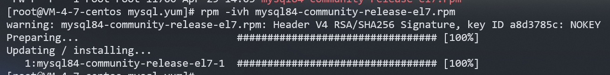

## **简介**

数据库（Database）是按照数据结构来组织、存储和管理数据的仓库。

??? info "为什么要有数据库"
    文件也可以存数据，为什么需要数据库？

    一般文件确实提供了数据的存储功能，但是没有很好的数据管理能力，操作系统对文件数据的管理仅限于能让我们找到数据，对于数据内容的增、删、查、改等更具体的操作，还需数据库来处理。

而 MySQL 是最流行的关系型数据库管理系统，在 WEB 应用方面 MySQL 是最好的 RDBMS（Relational Database Management System  关系数据库管理系统）应用软件之一。


## **MySQL8 安装**

### **CentOS 7**

#### **卸载 MySQL**、

为了确保下载正确版本的 MySQL ，我们先要将原系统中的 MySQL 卸载，不确定是由有 MySQL，可以使用下面的指令来查看

```shell
ps -ajx | grep mysql | grep -v grep
ps -ajx | grep mariadb | grep -v grep
# 这两个命令是查看系统中正在运行的 mysql 程序

rpm -qa | grep mysql 
# 这个命令是查看系统安装 mysql 时使用到的安装包
```

如果都没有就不需要这步。

我们要关掉运行中的 mysql 进程，将头两个查到的进程关掉

```shell
systemctl stop mysql
systemctl stop mariadb
```

我们要做的就是将 mysql 用到的安装包都卸载，使用如下命令：

```shell
rpm -qa | grep mysql | xargs yum remove -y
```

#### **配置 yum 源**

先配置Mysql8 的 yum 源，[官方yum源](https://repo.mysql.com/){target="_blank"}，可以找自己需要的版本，这里以 MySQL8 和 CentOS（el7） 版本为例：

```shell
mkdir mysql.yum && cd mysql.yum && wget https://repo.mysql.com/mysql80-community-release-el7.rpm
```

获取到 yum 后，就要将源配置到系统中。

```shell
rpm -ivh mysql80-community-release-el7.rpm
```

<figure markdown="span">
  { width="750" }
</figure>

如上图源就配置好了。


#### **安装**

很简单了，使用 yum 安装即可

```shell
yum install -y mysql-community-server
```

??? warning "可能的问题"
    您可能会遇到 GPG 密钥过期的问题，报错如下：
    ```shell
    GPG keys are configured as:file:///etc/pki/rpm-gpg/RPM-GPG-KEY-mysql
    ```
    我们就要导入新的 rpm 的 GPG key，也就是使用下述命令：
    ```shell
    rpm --import https://repo.mysql.com/RPM-GPG-KEY-mysql-2022
    ```
    或者跳过 gpg 检查
    ```shell
    yum install mysql-community-server --nogpgcheck -y
    ```

安装完成后可以使用 which 查看 mysql 是否安装成功

```shell
which mysql
# /usr/bin/mysql
which mysqld
# /usr/sbin/mysqld
```

#### **登录设置**

登录以前，我们先要启动 mysql 服务

```shell
systemctl start mysqld
```

- **方法一：**

使用如下命令，查看生成的临时密码

```shell
grep "temporary password" /var/log/mysqld.log
# 2024-05-17T16:16:49.598437Z 1 [Note] A temporary password is generated for root@localhost: k:5oy/qtBk2l
```

我这里是 k:5oy/qtBk2l ，使用这个密码进行登录即可。

```shell

```