<!-- 一些基本概念：

### **索引** 

索引提高数据库的性能，索引是物美价廉的东西了。不用加内存，不用改程序，不用调sql，只要执行正确的 create index ，查询速度就可能提高成百上千倍。但是天下没有免费的午餐，查询速度的提高是以插入、更新、删除的速度为代价的，这些写操作，增加了大量的IO。所以它的价值，在于提高一个海量数据的检索速度。 -->

数据库如何标识磁盘文件？

## **page**

MySQL 中的数据文件，是以 page 为单位保存在磁盘当中的。这里的 page 和操作系统的 page 类似，一般磁盘系统和 OS page 都是 4KB，而数据库取决于具体实现，SQLite、ORACLE 实现为 4KB，SQL Serve 实现为 8KB，Mysql 实现为 16KB。

一个 page 可以包含：元数据、索引、日志，或者具体的表数据（元组），但一般来讲，为了方便组织一个 page 中只会包含一个类型的数据。

在一些 DBMS 中，可能还会要求 page 是**“self-contained”**（自包含）的，即每个页应该包含所有必要的信息，以便在不依赖其他页或外部资源的情况下，能够独立地进行处理和解析。这要求每个 page 都要包含解析表数据的信息，如表头。

### **文件存储**

数据库以 page 为基本单位来组织磁盘文件，不同数据库以不同的数据结构来组织：

- Heap File Organization。

- Tree File Organization

- Sequential / Sorted File Organization

- Hashing File Organization

Heap file（堆文件）是一种简单且常见的数据库文件组织方式，用于存储无特定顺序的记录。它是数据库中最基本的数据存储结构之一，通常用于存放表的数据。

Heap file 将文件划分为若干个 page，并用一定的数据结构来存储，如链表、字典。通常字典是更高效的组织方式，DBMS 会维护一个字典页，来记录数据页的存储位置，字典页也会记录一些元数据，如：每页的空闲位置的位图 slots（后面介绍），空闲页的列表。

### **页布局**

每个 page 由两个部分组成，表头和数据：

<figure markdown="span">
  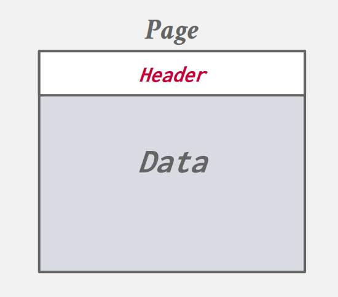{ width="350" }
</figure>

通常表头会包含：Page Size、Checksum、DBMS Version 等信息，如果要求是 self-contained 的还会由额外的信息。

page 的数据部分有很多组织方法：

#### **面向 tuple**

在此方法中，会在 header 中维护一个 `slot array`，标识元组起始位置的偏移量。MySQL 默认并没有采用此种组织方式。 

<figure markdown="span">
  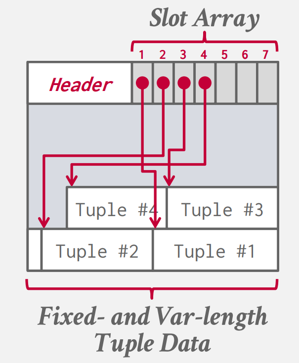{ width="350"}
</figure>

当我们要定位一个 tuple 时，只要拿到对应的 `file_id`、`page_id` 和 `slot_offset` 就可以很快的定位，他们共同组成一个元组的 ID，SQLite 会为它创建一个隐藏的独立的列，它占据 8Byte 的大小，当然不同数据库实现也不同，PostgreSQL 是 6Byte、SQL Server 是 8Byte。

我们可以通过一些方式来获取到这个 ID， 但是我们不应该在应用中使用它，因为这个 ID 标识的是元组的物理位置，DBMS 可能会对 page 进行重排，对应的物理位置也会改变。这个重排的过程可能会发生在一次插入后（SQL Server），或一次垃圾回收后（SQLite vacuum），这取决于数据库的实现。

这样的组织方法有一些缺点：

- **page 的空间可能不会完全的利用**，在插入删除后可能会留下一些内存碎片（所以DBMS 都会在不定时的对 page 进行重拍，但这又会降低效率），在 page header 和 page data 之间可能会存在一些小的内存空间，放不下任何 tuple。

- 这样还会造成一些**无用的磁盘 IO**，当我们访问一个元组是，我们就不得不读取一整个 page，page 中其他的元组可能我们并不需要，写的时候也需要将整个 page 写回磁盘，这被称作读写放大。

- **随机 IO 效率低**，如果我们要修改 20 个元组，而这 20 个元组又分布在不同的 20 个 page 中，这会导致大量的磁盘 IO，效率很低。

- 一些不允许原地更新，只能创建新 page 的场景，该方式就不能胜任了。

#### **日志结构**

在日志结构中，我们在 page 中不在记录具体的 tuple，而是维护这些元组的变更日志。

<figure markdown="span">
  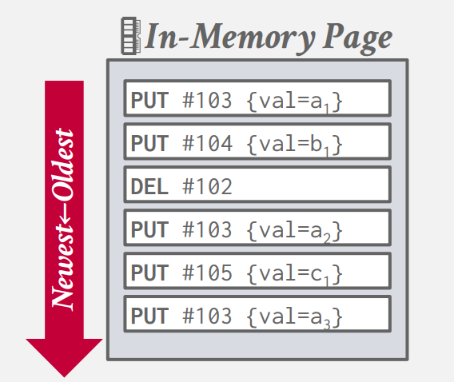{ width="350"}
</figure>

对元组的修改会按照时间顺序一次放入 page 中。每条日志都记录有元组的唯一标识。对于添加和删除，这样的操作很快，只要将日志加到文件末尾即可。每当一个 page 被写满了，就写入磁盘，在该架构中，被写入磁盘的日志都是不可修改的，这意味着我们不能回滚到某个版本后，对该版本进行修改，只能创建一份新的版本。

查询怎么办？遍历记录找到对应元组的最新修改？这样效率太低了。这里的做法是维护每条元组最新修改的索引，索引中记录该修改的位置。

<figure markdown="span">
  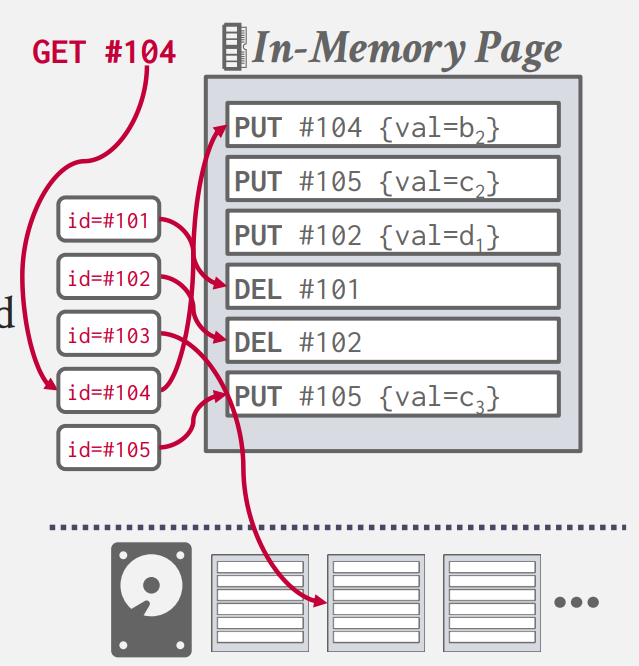{ width="350"}
</figure>

维护索引可以使用 B+树、哈希表等等，都可以。

我们发现在更新是会有一些冗余操作，DBMS 会定期允许一些后台任务，来压缩 page ，合并一些冗余操作，减少空间浪费。

<figure markdown="span">
  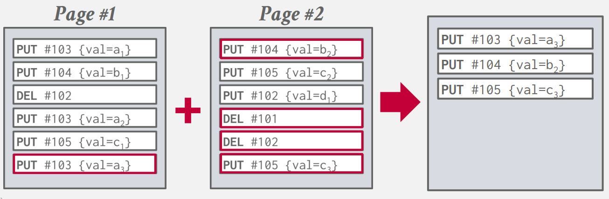{ width="550"}
</figure>

在压缩过后，数据库会按照元组 id 重排原先的记录，并且保证每个元组 id 只在一个 page 中出现一次，还可以使用一些类似字典树的方式，快速定位元组，就不需要在 page 上进行二分查找了。

RocksDB 和 LevelDB 使用了日志结构存储。

该方法最大的问题就是压缩的消耗很大，他需要读取很多 page 回内存中，压缩后再写回磁盘。

#### **组织索引**

在组织索引架构中，元组会以他们的键值排序，而这个键值就作为索引记录元组在 page 中的偏移量，而维护这个索引方式很多，下面是一个 B+ 树的形式：

<figure markdown="span">
  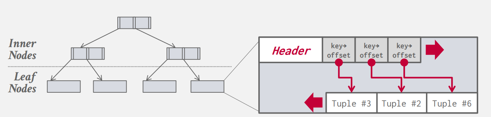{ width="750"}
</figure>

这里每个节点就是一个 page，只有叶子节点会记录具体的值。这个形式很类似于上文的面向元组的组织方式。

这种方法也会有 **随机 IO** 和 **内存碎片** 的问题。

MySQL InnoDB 就采用该种方法。

## **元组**

一个 tuple 就是表中的一行。在磁盘上，一个 tuple 就是一系列的字节，数据库的工作就是解释这些字节实际代表什么并且决定如何执行你想要对这些数据进行的操作。

与 page 类似，元组也分为 header 和 data 两部分。

<figure markdown="span">
  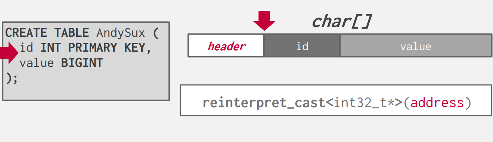{ width="650"}
</figure>

这里再定义列时，要考虑到内存对齐的问题。对于横跨两个字的数据，在读取时可能会有一些问题：

<figure markdown="span">
  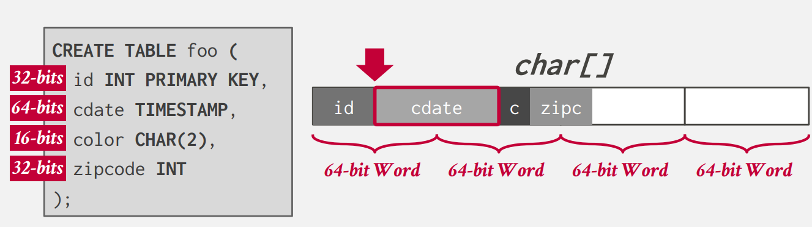{ width="650"}
</figure>

对应 Intelx86 机器和新一点的 ARM 机器，通常会分两次来读取数据，这样会使你的速度降低。

对于旧的 ARM 机器，可能会报异常。在其他一些机器上甚至会给你一个奇怪的字节组合，从而导致一些错。所以现在 C/C++ 程序都会自动进行内存对齐。

### **浮点数**

decimal 这类定点小数，数据库在实现时都会定义一个结构体，来实现其逻辑。在进行定点小数计算时，这通常到导致更多的时间消耗，因为操作符重载事实上是函数调用，有函数调用的消耗，内部实现逻辑还要对各种情况进行判断（如：NaN）。

但 decimal 通常可以支持更高的精度。 

### **空值**

最常见标识空值的做法就是使用一个位图，来标识某个位置的值是否为空。在 MySQL InnoDB 中就采用了此方法。

还有一些使用一个特殊值来标识，例如：INT32_MIN。但这会使可以标识的数字少一个。

### **大数据**

大多数数据库不允许一个元组的大小超过一个 page 的大小。为了存储一些大于单个 page 的数据，DBMS 使用单独的 page 存储数据：

<figure markdown="span">
  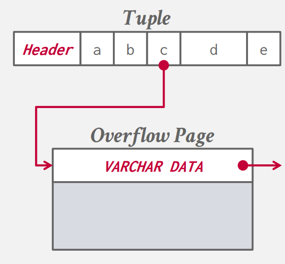{ width="350"}
</figure>

这时元组中记录的就是溢出页的索引。读取元组时，识别到它指向溢出页，进而获取该页数据，加载到缓冲区，并最终为你输出结果。

不同的数据库溢出页大小不同：

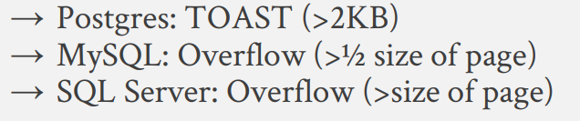{ width="350"}

但一些过于大的文件，如：音频、视频，直接存储在数据库中不是一个很好的选择，会导致数据库效率减低（大量的读入写出 page，导致大量的磁盘 IO），所以更好的方法是将这些文件存储在文件系统或对象存储服务，一些系统也允许存储一些大的值在一个外部的文件中。

在 Oracle 中有一个单独类型 BFILE。在 SQL Server 中这个类型是 FILESTEAM。只有这两个数据库直接实现了这点。其他数据库可以使用一些额外的机制，实现这一点。

这里 DBMS 不能直接使用这些文件中的数据，而需要向文件系统或对象存储去

<figure markdown="span">
  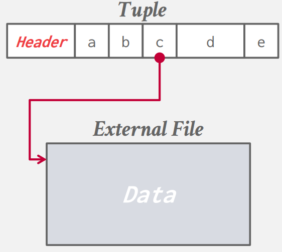{ width="350"}
</figure>

这里元组记录的是这个数据 URI 或者 URL。

这里 Andy 课上的建议是大概 50MB 以上的数据采用外部存储比较好。但 SQLite 创始人的建议是直接只在 SQLite 中存储数据更为合适，因为当你的 APP 中包含大量缩略图、图片时，直接从数据库读比在 OS 上进行大量的 `fopen` 和 `fread` 效率更高。

## **存储模型**

数据库的操作可以分为以下三类：

- On-Line Transaction Processing (OLTP)：每次操作都只 读/更新 一小部分的数据。

例子：你在购物平台修改了你的购物车，这个操作就需要从数据库读取你的账户对应的那个元组，然后修改这个元组。

- On-Line Analytical Processing (OLAP)：该操作读取大量的数据进行计算。

例子：要查询数据库中所有生日在

