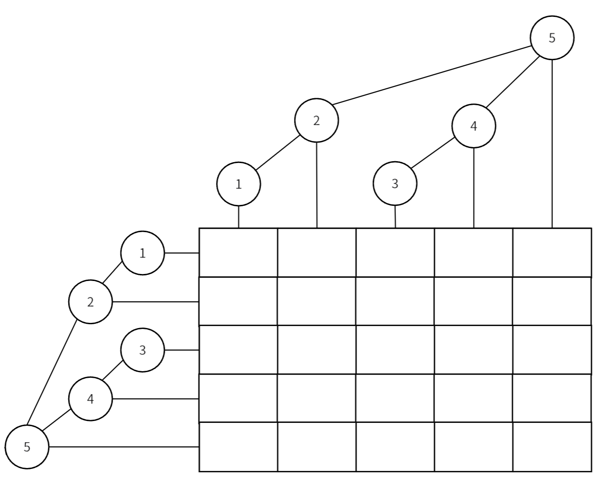

二维树状数组，也被称作**树状数组套树状数组**，用来维护二维数组上的单点修改和前缀信息问题。其实就是一维树状数组上的每个节点变成了一个一维树状数组：

<figure markdown="span">
  { width="550" }
</figure>


二维树状数组可以实现单点修改，子矩阵查询，也可以通过维护多个差分数组来实现子矩阵的修改和查询。

## **单点修改**

修改一个矩阵的值后，我们要将其父节点都修改，例如我们要修改上图的 $f[2][2]$ 元素，那么我们同时也要修改 $f[2][5]、f[5][2]、f[5][5]$ ，这些节点，实现如下：

```cpp
void update(int x, int y, int d)
{
	for (int i = x; i <= n; i += lowbit(i))
		for (int j = y; j <= m; j += lowbit(j))
			f[i][j] += d;
}
```

时间复杂度为 $O(\log n\log m)$

## **子矩阵查询**

现在我们可以求 $\sum_{i=1}^{n}\sum_{j=1}^{m}a[i][j]$ 的值，要我们计算下图中黑色矩阵的值

<figure markdown="span">
  { width="550" }
</figure>


很明显，计算黑色矩阵的面积有下面的公式：

$$
\sum_{i=x_2}^{x_1}\sum_{j=y_2}^{y_1}a[i][j]=\sum_{i=1}^{x_1}\sum_{j=1}^{y_1}a[i][j]-\sum_{i=1}^{x_2-1}\sum_{j=1}^{y_1}a[i][j]-\sum_{i=1}^{x_1}\sum_{j=1}^{y_2-1}a[i][j]+\sum_{i=1}^{x_2}\sum_{j=1}^{y_2}a[i][j]
$$

有了公式代码也就很容易写了：

```cpp
int ask(int x, int y)
{
	int sum = 0;
	for (int i = x; i > 0; i -= lowbit(i))
		for (int j = y; j > 0; j -= lowbit(j))
			sum += f[i][j];
	return sum;
}
int ask(int x1, int y1, int x2, int y2)
{
	return ask(x1, y1) - ask(x1, y2 - 1) - ask(x2 - 1, y1) + ask(x2, y2);
}
```

时间复杂度为$O(\log n\log m)$

## **二维树状数组进阶**

[上帝造题的七分钟](https://www.luogu.com.cn/problem/P4514){target="_blank"}
该题要我们实现二维树状数组的子矩阵修改和子矩阵查询

## **子矩阵修改**

和一维类似的，这里也要用到差分的思想，使用二维差分，我们定义一个二维差分数组 $d[i][j]$，它与原矩阵元素 $a[i][j]$ 的关系如下：

$$
d[i][j]=a[i][j]-a[i][j-1]-a[i-1][j]+a[i-1][j-1]\\
$$

$$
a[x][y]=\sum_{i=1}^{x}\sum_{j=1}^{y}d[i][j]
$$

现在，假设我们要在顶点为 $(a,b)、(c,d)$ 的矩阵内的每个元素加上 $k$ ，如下图

<figure markdown="span">
  { width="550" }
</figure>


因为我们维护的是差分数组，所以我分别修改四个顶点即可完成对区间的修改，实现如下：

```cpp
void update(int x, int y, int d)
{
	for (int i = x; i <= n; i += lowbit(i))
		for (int j = y; j <= m; j += lowbit(j))
			f[i][j] += d;
}
void update(int x1, int y1, int x2, int y2, int k)
{
	update(x1, y1, k), update(x1, y2 + 1, -k),
		update(x2 + 1, y1, -k), update(x2 + 1, y2 + 1, k);
}
```

## **子矩阵查询**

与一维数组类似的，我们求一个子矩阵的和有下面的式子：

$$
\sum_{i=x_2}^{x_1}\sum_{j=y_2}^{y_1}a[i][j]=\sum_{i=1}^{x_1}\sum_{j=1}^{y_1}a[i][j]-\sum_{i=1}^{x_2-1}\sum_{j=1}^{y_1}a[i][j]-\sum_{i=1}^{x_1}\sum_{j=1}^{y_2-1}a[i][j]+\sum_{i=1}^{x_2}\sum_{j=1}^{y_2}a[i][j]
$$

问题就转换为计算 $\sum_{i=1}^{n}\sum_{j=1}^{m}a[i][j]$ ，与推一维数组区间查询类似，我们利用原数组的与差分数组之间的关系进行变换，下面是推导过程：

$$
\begin{align*}
 &\sum_{i=1}^{n}\sum_{j=1}^{m}a[i][j]\\
= &\sum_{i=1}^{n}\sum_{j=1}^{m}\sum_{k=1}^{i}\sum_{l=1}^{j}d[k][l]\\
 =&\sum_{i=1}^{n}\sum_{j=1}^{m}d[i][j]\times (n-i+1)\times (m-j+1)\\
=&(n+1)(m+1)\sum_{i=1}^{n}\sum_{j=1}^{m}d[i][j]-(m+1)\sum_{i=1}^{n}\sum_{j=1}^{m}d[i][j]\times i\\
&(n+1)\sum_{i=1}^{n}\sum_{j=1}^{m}d[i][j]\times j+\sum_{i=1}^{n}\sum_{j=1}^{m}d[i][j]\times i\times j
\end{align*}
$$

我们可以用四个二维树状数组来分别维护上面四个二维前缀和，下面是实现：

```cpp
int ask(int x, int y)
{
	int sum = 0;
	for (int i = x; i > 0; i -= lowbit(i))
		for (int j = y; j > 0; j -= lowbit(j))
        {
			sum += (x + 1) * (y + 1) * f[0][i][j] - 
                (y + 1) * f[1][i][j] - (x + 1) * f[2][i][j] + f[3][i][j];
        }
	return sum;
}

int ask(int x1, int y1, int x2, int y2)
{
	return ask(x2, y2) - ask(x1 - 1, y2) - ask(x2, y1 - 1) + ask(x1 - 1, y1 - 1);
}
```

??? code "2_BIT"
    ```cpp
    #include <bits/stdc++.h>
    using namespace std;
    const int MAX = 1e3 + 100;

    inline int lowbit(int x) { return x & -x; }

    // n代表二维数组的行，m代表二维树状数组的列
    // f[]数组代表维护的数组
    int n, m;
    int f[MAX][MAX];

    // 基础二维树状数组
    // 支持单点修改，子矩阵查询
    void update(int x, int y, int d)
    {
        for (int i = x; i <= n; i += lowbit(i))
            for (int j = y; j <= m; j += lowbit(j))
                f[i][j] += d;
    }

    // 二维前缀和查询
    int ask(int x, int y)
    {
        int sum = 0;
        for (int i = x; i > 0; i -= lowbit(i))
            for (int j = y; j > 0; j -= lowbit(j))
                sum += f[i][j];
        return sum;
    }
    // 子矩阵查询
    int ask(int x1, int y1, int x2, int y2)
    {
        return ask(x1, y1) - ask(x1, y2 - 1) - ask(x2 - 1, y1) + ask(x2, y2);
    }

    // 4*差分数组+二维树状数组
    // 支持子矩阵修改，子矩阵查询
    int f2[4][MAX][MAX];
    // 子矩阵修改
    void update(int x, int y, int d)
    {
        for (int i = x; i <= n; i += lowbit(i))
            for (int j = y; j <= m; j += lowbit(j))
                f2[0][i][j] += d, f2[1][i][j] += d * x,
                    f2[2][i][j] += y * d, f2[3][i][j] += x * y * d;
    }
    // 维护子矩阵和
    void update(int x1, int y1, int x2, int y2, int k)
    {
        update(x1, y1, k), update(x1, y2 + 1, -k),
            update(x2 + 1, y1, -k), update(x2 + 1, y2 + 1, k);
    }

    // 前缀和查询
    int ask(int x, int y)
    {
        int sum = 0;
        for (int i = x; i > 0; i -= lowbit(i))
            for (int j = y; j > 0; j -= lowbit(j))
                sum += (x + 1) * (y + 1) * f2[0][i][j] - (y + 1) * f2[1][i][j] - (x + 1) * f2[2][i][j] + f2[3][i][j];
        return sum;
    }
    // 查询子矩阵和
    int ask(int x1, int y1, int x2, int y2)
    {
        return ask(x2, y2) - ask(x1 - 1, y2) - ask(x2, y1 - 1) + ask(x1 - 1, y1 - 1);
    }
    ```