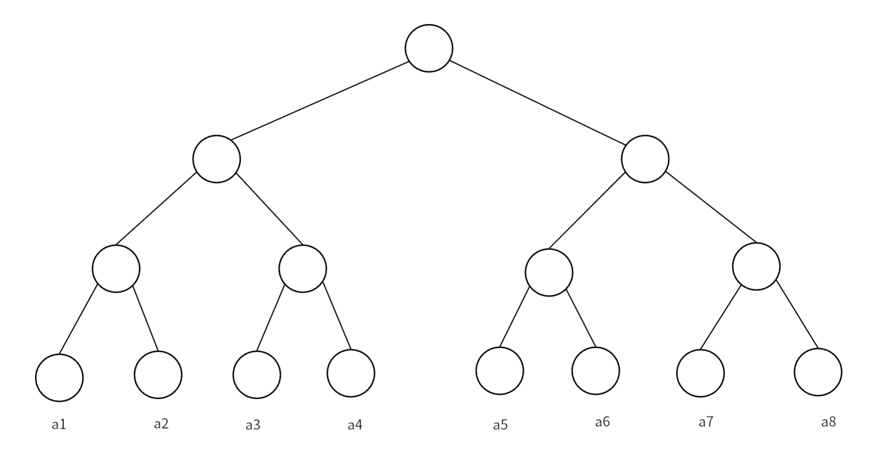

# 树状数组

## **定义**

树状数组是利用数的二进制特征进行检索的一种树状的结构。它用于维护前缀和的数据结构，支持单点修改、区间查询；区间修改、区间查询等一系列操作。
树状数组维护的元素要满足**结合律**和**可差分**的性质。

## **原理**

给定一个数组 $\{a_1,a_2\dots ,a_8 \}$ ，我们如何快速的求其前缀和呢？
一般我们求前缀和就是累加，时间复杂度是$O(n)$，一种容易想到的分治的优化策略是，对数组中的元素两两求和并且存到新的数组中，一直这样计算下去直到新数组中只有一个元素，如下：

<figure markdown="span">
  { width="750" }
</figure>

 <!-- <div align=center></div> -->

这样就优化成线段树了，求前缀和、修改元素值的复杂度就都是$O(\log n)$了，但是对于求前缀和有很多元素是多余的，如：我们要求$a_1$到$a_4$的前缀和，只需要用到$a_4$的父节点，并不需要`$a_4$其本身。我们将类似的节点都删掉，就得到树状数组：

<figure markdown="span">
  { width="750" }
</figure>


 <!-- <div align=center></div> -->

图中黑色节点都是被删除的节点，这样空间复杂度就优化为$O(n)$了，我们可以直接将节点值存到一个数组中。但是问题来了，我们该怎么在数组中正确快速的求前缀和呢？这就要用到大名鼎鼎的$lowbit$函数了

## **lowbit 函数**

我们将每个节点下标对应的二进制形式写出来，就能看出一些规律：

<figure markdown="span">
  { width="750" }
</figure>


 <!-- <div align=center></div> -->

- 每个节点覆盖的长度是其二进制表示下的最低位 $1$ 及其后面的 $0$ 构成的数值
- 每个节点的父节点的下标就是在其二进制的最低位 $1$ 加上 $1$ 。

那么实现树状数组的就归结到一个关键问题：如何快速找到一个数二进制表示下最低位$1$及其后面的$0$构成的数值。这也就是$lowbit$函数的功能。

<br>
<br>

我们举个例子：求 $lowbit(10)$

我们先将 $10$ 的二进制位写出来 $(1010)_2$ ，在对其按位取反得到 $(0101)_2$ ，再加上 $1$ ，就得到 $(0110)_2$ ，我们对比两个二进制数，发现除了最低位 $1$ 及其后面的 $0$ ，两个数字其他位上的数完全不同，我将两个数进行按位与&运算，就得到 $lowbit$ 值了。

我们再思考，按位取反再加 $1$ ，这不就是负数补码的运算过程吗，所以我们直接将该数取负再按位与即可得到 $lowbit$ 的值，下面是代码：

```cpp
inline int lowbit(int x) 
{
    return x & -x;
}
```

所以节点 $x$ 覆盖的长度就是其 $lowbit(x)$ 的值，其父节点下标就是 $x+lowbit(x)$ 。

## **实现**

### **单点修改，区间查询**

[【模板】树状数组 1](https://www.luogu.com.cn/problem/P3374){target="_blank"}

最简单的树状数组可以在$O(\log n)$的复杂度实现这两种操作

#### **单点修改**

我们修改某一位置的值，就将覆盖其的父节点的值都进行修改，将节点$x$加上$d$的实现如下：

```cpp
inline void update(int x, int d) 
{
    for (; x <= n; x += lowbit(x))
        f[x] += d;
}
```

#### **区间查询**

我们要求区间$[l,r]$的和，其实就是$sum(r)-sum(l-1)$，$sum(x)$代表下标从$1$到$x$的前缀和，查询某个点的前缀和就是树状数组擅长的，就是从这个节点开始，向坐上找到上一个节点，并加上其节点的值，可以发现向左上找上一个节点，只需要将下标减去当前下标的$lowbit$值，下面是实现代码：

```cpp
inline int ask(int x) 
{
    int sum = 0;
    for (; x >= 1; x -= lowbit(x))
        sum += f[x];
    return sum;
}
//求区间[l,r]的和
//ask(r)-ask(l-1);
```

### **区间修改，单点查询**

[【模板】树状数组 2](https://www.luogu.com.cn/problem/P3368){target="_blank"}

#### **区间修改**

我们只需一个简单而巧妙的操作，就能利用树状数组高效的实现区间修改，这个操作就是差分数组，我们用树状数组维护原数组的差分数组，这样我当我们要修改某个区间的值时，只需要修改两个端点即可。

```cpp
void update(int x,int d)
{
    for(int i=x;i<=n;i+=lowbit(i))
        f[i]+=d;
}
void change(int x,int y,int k)
{
    update(x,k);
    update(y+1,-k);
}
```

#### **单点查询**

众所周知，差分的逆运算是求前缀和，树状数组计算的就是前缀和，用树状数组维护差分数组，那么树状数组计算得到就是单点的元素值，即 $ask(x)=a[x]$ ，所以单点查询和上面的查询实现相同：

```cpp
int ask(int x)
{
    int sum=0;
    for(int i=x;i>=1;i-=lowbit(i))
        sum+=f[i];
    return sum;
}
```

### **区间修改，区间查询**

[【模板】线段树 1](https://www.luogu.com.cn/problem/P3372){target="_blank"}

#### **区间查询**

我们要利用树状数组求区间和，首先要求前缀和$sum(k)$，这里我们定义差分数组$d$，它和原数组的关系是$a[k]=d[1]+d[2]+\cdots+d[k]$，$d[k]=a[k]-a[k-1]$，下面推导前缀和与差分数组的关系：

$$
\begin{align*}
&a_1+a_2+\cdots + a_k\\
~\\
=&d_1+(d_1+d_2)+\cdots +(d_1+d_2+\cdots +d_k)\\
~\\
=&kd_1+(k-1)d_2+\cdots +(k-(k-1))d_k\\
~\\
=&k(d_1+d_2+\cdots +d_l)-(d_2+2d_3+\cdots +(k-1)d_k)\\
~\\
=&k\sum_{i=1}^{k} d_i-\sum_{i=1}^{k}(i-1)d_i
\end{align*}
$$

公式最后一行是求两个前缀和，可以用两个树状数组分别来维护，这样就可计算出前缀和$sum(x)$，区间和也就很好计算了，下面是实现：

```cpp
int ask1(int x)
{ 
    int sum = 0; 
    for (; x > 0; x -= lowbit(x))
        sum += f1[x];
    return sum; 
}
int ask2(int x)
{ 
    int sum = 0; 
    for (; x > 0; x -= lowbit(x))
        sum += f2[x]; 
    return sum; 
}
int ask(int l, int r) 
{
    return r * ask1(r) - ask2(r) - (l - 1) * ask1(l - 1) + ask2(l - 1);
}
```

#### **区间修改**

区间修改时，两个数组要同时修改，实现方式和上面相同。

维护$\sum_{i=1}^{k}(i-1)d_i$时，对$k$位置增加$d$时，$f[k]$变为$(k - 1)(d_k+d)$，将其拆开得到，$(k-1)d_k+(k-1)d$，所以在修改后者时，我们要修改的值变为$(i-1)d$，下面时具体实现:

```cpp
void update1(int x, int d) 
{ 
    for (; x <= n; x += lowbit(x))
        f1[x] += d; 
}
void update2(int x, int d) 
{ 
    for (; x <= n; x += lowbit(x))
        f2[x] += d; 
}
void change(int l, int r, int d)
{
    update1(l, d), update1(r + 1, -d);
    update2(l, (l - 1) * d), update2(r + 1, -r * d);
}
```

??? code "BIT"
    ```cpp
    #include <bits/stdc++.h>
    using namespace std;
    const int MAX = 1e6 + 100;

    inline int lowbit(int x)
    {
        return x & -x;
    }

    // n代表维护的数组长度
    // f[]数组代表维护的数组
    int n;
    int f[MAX];

    // =====================================================================
    // 基础树状数组
    // 支持单点修改，区间查询

    // 单点修改
    inline void update(int x, int d)
    {
        for (; x <= n; x += lowbit(x))
            f[x] += d;
    }

    // 查询前缀[1,x]的和
    inline int ask(int x)
    {
        int sum = 0;
        for (; x > 0; x -= lowbit(x))
            sum += f[x];
        return sum;
    }

    // 求区间[l,r]的和
    inline int ask(int l, int r)
    {
        return ask(r) - ask(l - 1);
    }

    // =====================================================================
    // 差分+树状数组
    // 支持区间修改，单点查询

    // 对差分数组单点修改
    inline void update(int x, int d)
    {
        for (; x <= n; x += lowbit(x))
            f[x] += d;
    }

    // 区间修改，即修改差分数组的两个端点
    // 在区间[l,r]上加上k
    inline void change(int l, int r, int k)
    {
        update(l, k);
        update(r + 1, -k);
    }

    // 单点查询，即求差分数组前缀和
    inline int ask(int x)
    {
        int sum = 0;
        for (int i = x; i > 0; i -= lowbit(i))
            sum += f[i];
        return sum;
    }

    // =====================================================================
    // 2*差分数组+数组数组
    // 支持区间修改，区间查询

    // 维护两个差分数组
    int f1[MAX], f2[MAX];

    // 区间查询
    //  对两个差分数组求前缀和
    inline int ask1(int x)
    {
        int sum = 0;
        for (; x > 0; x -= lowbit(x))
            sum += f1[x];
        return sum;
    }
    inline int ask2(int x)
    {
        int sum = 0;
        for (; x > 0; x -= lowbit(x))
            sum += f2[x];
        return sum;
    }

    // 区间查询
    //ask(l,r) = sum(r) - sum(l-1)
    inline int ask(int l, int r)
    {
        return r * ask1(r) - ask2(r) - ((l - 1) * ask1(l - 1) - ask2(l - 1));
    }

    // 区间修改
    // 对两个差分数组做修改
    void update1(int x, int d)
    {
        for (; x <= n; x += lowbit(x))
            f1[x] += d;
    }
    void update2(int x, int d)
    {
        for (; x <= n; x += lowbit(x))
            f2[x] += d;
    }
    //修改区间[l,r]
    void change(int l, int r, int d)
    {
        update1(l, d), update1(r + 1, -d);
        update2(l, (l - 1) * d), update2(r + 1, -r * d);
    }


    ```

## **树状数组维护区间最值**

以前树状数组节点值是$[x-lowbit(x)+1,x]$区间的元素和，这里树状数组节点值就改为存放$[x-lowbit(x)+1,x]$区间的最大值。
在修改区间最值时，要更新树状数组上所有被其影响的节点，即所有与其直接相连的节点，其父节点和子节点。

在查询时分两种情况，如果当前节点覆盖的范围，超过了我们的查询范围，就用原数组对应下标的值去更新答案，并且向前递推；如果没有超过我们的查询范围，就直接用当前节点的值去更新答案。

??? code "RMQ"
    ```cpp
    /*
    以题目I Hate It为例给出树状数组如理RMQ问题的模板
    https://acm.hdu.edu.cn/showproblem.php?pid=1754
    */

    #include <bits/stdc++.h>
    using namespace std;
    #define MAX int(2e5+7)
    typedef long long ll;

    int f[MAX],a[MAX], n, m;
    inline int lowbit(int x) {return x & -x;}

    // 单点修改
    void update(int x, int d) { 
        while (x <= n) {
            f[x] = max(d,a[x]);
            // 用当前节点的子节点更新当前节点
            for (int i = 1; i < lowbit(x); i <<= 1)
                f[x] = max(f[x], f[x - i]);
            x += lowbit(x);
        }
    }

    // 查询区间最值
    int ask(int l,int r) {
        int res = 0;
        while (l <= r) {
            // 如果当前节点维护的区间超过查询区间，就用原数组该位置的值修改答案
            if (lowbit(r) > r - l + 1)
                res = max(res, a[r]),--r;
            // 没超过就直接用当前节点的区间修改答案
            else 
                res = max(res, f[r]),r -= lowbit(r);
        }
        return res;
    }


    void solve() {
        while (cin >> n >> m) {
            for (int i = 1; i <= n; ++i) {
                cin >> a[i];
                update(i, a[i]);
            }
            for (int i = 0; i < m; ++i) {
                char op;
                int x, y;
                cin >> op >> x >> y;
                if (op == 'Q')cout << ask(x, y) << '\n';
                else a[x] = y, update(x, y);
            }
        }
    }

    int main() {
        ios::sync_with_stdio(false); //int T;
        //for (cin >> T; T--;) 
        solve();
        return 0;
    }
    ```


## **习题**

|题目 | 难度|知识|
|:-:|:-:|:-:|
|[P1908](https://www.luogu.com.cn/problem/P1908){target="_blank"}|普及/提高-|逆序对模板|
|[P1774](https://www.luogu.com.cn/problem/P1774){target="_blank"}| 普及/提高-|逆序对|
|[P4479](https://www.luogu.com.cn/problem/P4479){target="_blank"}|省选/NOI- |离散化+树状数组|
|[No Pain No Game](https://acm.hdu.edu.cn/showproblem.php?pid=4630){target="_blank"}||离线+树状数组|
|[I Hate It](https://acm.hdu.edu.cn/showproblem.php?pid=1754){target="_blank"}||树状数组维护RMQ|
|[P1966](https://www.luogu.com.cn/problem/P1966){target="_blank"}|提高+/省选-|排序+树状数组|
|[P3605](https://www.luogu.com.cn/problem/P3605){target="_blank"}|提高+/省选-|DFS+树状数组|
|[LC.100112](https://leetcode.cn/problems/maximum-balanced-subsequence-sum/description/){target="_blank"}|困难|树状数组优化DP|
|[LC.2736](https://leetcode.cn/problems/maximum-sum-queries/description/){target="_blank"}|困难|二维偏序问题|


-------
参考文章：<br>
[OI Wiki](https://oi-wiki.org/ds/fenwick/)<br>
《算法竞赛-上册》-罗永军<br>
[B站〔manim | 算法 | 数据结构〕 完全理解并深入应用树状数组](https://www.bilibili.com/video/BV1pE41197Qj/?spm_id_from=333.337.search-card.all.click&vd_source=0de771c86d90f02a6cab8152f6aa173f)
