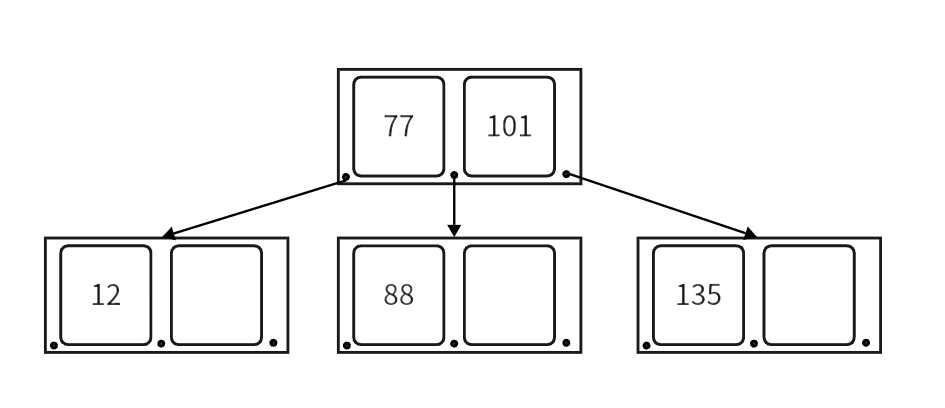

## **概念**

一般的二叉查找树每个节点只能容纳一个数据，导致树的高度很高，逻辑上挨着的节点数据可能离得很远。

考虑在磁盘中存储数据的情况，与内存相比，读写磁盘有以下不同点：

1. 读写磁盘的速度相比内存读写慢很多。
2. 每次读写磁盘的单位要比读写内存的最小单位大很多。

由于读写磁盘的这个特点，因此对应的数据结构应该尽量的满足「局部性原理」：「当一个数据被用到时，其附近的数据也通常会马上被使用」，为了满足局部性原理， 所以应该将逻辑上相邻的数据在物理上也尽量存储在一起。这样才能减少读写磁盘的数量。

所以，对比起一个节点只能存储一个数据的 BST 类数据结构来，要求这种数据结构在形状上更「胖」、更加「扁平」，即：每个节点能容纳更多的数据， 这样就能降低树的高度，同时让逻辑上相邻的数据都能尽量存储在物理上也相邻的硬盘空间上，减少磁盘读写。

$B-Tree$ 是一种多路查找的平衡树。一个 $m$ 阶的 $B-Tree$ 他的一个节点中由 $m$ 个子节点和 $m - 1$ 个数据组成，且每个节点中数据有序排列，如下图是一个 $3$ 阶的 $B-Tree$：

<figure markdown="span">
  { width="550" }
</figure>

一棵 $B-Tree$ 要满足以下条件：

- 每个节点最多有 $m$ 个子节点。
- 每个非叶子节点（除根节点外），至少要有 $\left \lfloor \frac{m}{2}  \right \rfloor$ 个数据。
- 有 $k$ 个子节点的节点，有 $k-1$ 个数据元素，且元素有序排列。
- 所有的叶子节点都在同一层。


## **实现**

### **成员变量**

先来看树节点的成员变量。一个 $m$ 阶的 $B$ 树的节点中最多有 $m$ 个儿子，最多有 $m - 1$ 个数据，这里我们将存关键字的数组多开一个空间，方便后面做节点分裂。

```cpp
// Tp 数据类型，Ord B树的阶数
template<class Tp,int Ord>
struct _b_tree_node
{
    using node = _b_tree_node<Tp,Ord>;
    
    Tp      _keys[Ord];                 // 存放节点数据。
    node*   _son[Ord + 1] = { 0 };      // 存放子节点地址。
    // _keys 和 _son 都有多开一个空间，后面介绍插入时解释原因。
    node*   _fa = nullptr;              // 记录父节点
    int     _sz = 0;                    // 当前节点数据个数

    /* 其他实现 */
};
```

$B$ 树的成员变量很简单，根节点 `_m_root`，这里写了一个简单的内存池，提高点效率：

```cpp
template<class Tp,int Ord>
class B_Tree
{
private:
    using node = _b_tree_node<Tp,Ord>;

    node* _m_root = nullptr;    // B-Tree 的根节点
    // 简单实现一个内存池，提高效率。
    node* mem_pool;
    int cnt = 0;    // 记录已分配的内存块个数

    /* 其他实现 */

};
```


### **查找**

每层数据都是有序的，我们可以在每一层都进行二分查找，如果没找到就递归进行下一层查找，直到找到或无法递归位置。函数的返回值就是查找到的节点和元素在节点中的下标。

```cpp
// 找到 key 对应的节点和对应位置
std::pair<node*,int> B_Tree::_m_find(const Tp& __k) noexcept
{
    node* fa = nullptr;
    node* cur = _m_root;
    while(cur)
    {
        // 二分
        int __p;    
        __p = std::lower_bound(cur->_keys,cur->_keys + cur->_sz,__k) - cur->_keys;
        // 找到就直接返回
        if(cur->_keys[__p] == __k)return std::make_pair(cur,__p);
        
        // 否则进入下一层，直到到了叶子节点。
        fa = cur;
        cur = cur->_son[__p];
    }
    // 搜完叶子节点以后还没找到，就返回叶子节点和 -1
    return std::make_pair(fa,-1);
}
```

这里未找到就返回叶子节点，是为了方便插入。

### **插入**

为了维护树的平衡，我们只能在 $B$ 树的叶子节点进行插入，所以向一棵 $B$ 树插入的时候会有以下三种情况：

1. 树为空。
2. 要插入的叶子节点没有满。
3. 要插入的叶子节点满了。

<div></div>

- **树为空：**

当我们向一棵空树插入时，就要新建根节点，将数据插入即可。

- **要插入的叶子节点没有满：**

直接将数据插入即可，为了维护节点中数据的有序性，所以我们会移动数据元素。

```cpp
// 向当前节点中插入数据 __k 和 __s
void _m_insert(const Tp& __k,node* __s)
{
    int i;
    for(i = _sz - 1;i >= 0;--i)
    {
        if(__k < _keys[i])
        {
            std::swap(_keys[i],_keys[i + 1]);
            // 对应子节点也要移动
            std::swap(_son[i + 1],_son[i + 2]);
        }
        else break;
    }
    _keys[i + 1] = __k;
    _son[i + 2] = __s;
    // 将子节点 __s 的父改为调用节点
    if(__s) __s->_fa = this;
    _sz++;
}
```

- **要插入的叶子节点满了：**

当我们向一个已经满的节点插入时，就要进行节点分裂。节点分裂的思路就是找到节点原数据和新数据的中位数，将中位数移到父节点中，让小于中位数的数据留在原节点，大于中位数的数据移到新节点中。我们在定义时，给 `_keys` 数组多开了一个空间，就是为了在插入完数据后，再确定中位数和移动数据，这样实现起来比较方便。

```cpp
// 将当前节点的数据分裂一半到 _bro_node 中
Tp _m_split(node*& _bro_node)
{
    // 找到中位数
    int _mid = _sz >> 1;

    // 大于中位数的移动到新的节点中
    // 移动时注意要将子节点也移动走
    _bro_node->_son[0] = _son[_mid + 1];
    if(_son[_mid + 1])
        _son[_mid + 1]->_fa = _bro_node;
    _son[_mid + 1] = nullptr;
    for(int i = _mid + 1;i < _sz;++i)
    {
        _bro_node->_m_insert(_keys[i],_son[i + 1]);
        _son[i + 1] = nullptr;
    }
    // 节点数据数量减少一半
    _sz >>= 1; 
    return std::move(_keys[_sz]);
}
```

移动时要将子节点也一起移动，

将中位数插入到父节点后，可能会引起父节点的分裂，父节点分裂又会引起它的父节点分裂，以此类推，如果到根节点，没有父节点了，就要创建新的根作为分裂出的两个节点的父节点。下面是插入的实现：

```cpp
// 向树中插入数据 __k
void _m_insert_key(const Tp& __k)
{
    // 空树创建根节点
    if(_m_root == nullptr)
    {
        _m_root = &mem_pool[cnt++];
        _m_root->_keys[0] = __k;
        _m_root->_sz = 1;
        return;
    }
    
    // 查找树中是否已经存在该数据
    std::pair<node*,int> ret = _m_find(__k);
    if(ret.second >= 0) // 已经有就不再插入
        return;

    // 如果 ret.second == -1，_m_find 会返回找到的叶子节点。
    // 插入
    node* cur = ret.first;  // 从叶子节点开始
    node* bro = nullptr;    // 记录分裂出的兄弟节点
    Tp n_val = __k;         // 当前要插入的数据
    while(true)
    {
        // 向 cur 中插入 n_val 和上一层分裂出的节点 bro
        cur->_m_insert(n_val,bro);

        // 节点没有满，直接结束
        if(!cur->_is_full())return;

        // 节点满了，分裂兄弟节点 bro
        bro = &mem_pool[cnt++];
        n_val = cur->_m_split(bro);

        // cur 没有父，说明根节点满了，创建新根
        if(!cur->_fa)   
        {
            _m_root = &mem_pool[cnt++];
            cur->_fa = _m_root;
            bro->_fa = _m_root;
            _m_root->_keys[0] = std::move(n_val);
            _m_root->_son[0] = cur;
            _m_root->_son[1] = bro;
            _m_root->_sz = 1;
            return;
        }
        // 跳到上一层，将中位数插入到父节点中
        cur = cur->_fa;
    }
}
```

### **删除**

删除的思路是要尽量借元素，当节点中元素的个数少于 $\left \lfloor \frac{m}{2}  \right \rfloor$ 时，要向父节点借数据，父节点数据不够就要向兄弟节点借数据，直到整棵树都借不到时，才开始删除节点，这里删除节点类似创建节点的逆过程，就是将根节点和根的左右子节点合并。

??? code "B-Tree"
    ```cpp
    template<class Tp,int Ord>
    struct _b_tree_node
    {
        using node = _b_tree_node<Tp,Ord>;
        // 多开一个空间，方便插入后进行分裂
        Tp _keys[Ord];
        node* _son[Ord + 1] = { 0 };
        node* _fa = nullptr;
        int _sz = 0;    // key 的个数


        // 返回插入后是否满了
        bool _is_full() const noexcept
        { return _sz == Ord;}
        
        // 向节点中插入
        void _m_insert(const Tp& __k,node* __s)
        {
            int i;
            for(i = _sz - 1;i >= 0;--i)
            {
                if(__k < _keys[i])
                {
                    std::swap(_keys[i],_keys[i + 1]);
                    std::swap(_son[i + 1],_son[i + 2]);
                }
                else break;
            }
            _keys[i + 1] = __k;
            _son[i + 2] = __s;
            if(__s) __s->_fa = this;
            _sz++;
        }

        // 分裂节点
        Tp _m_split(node*& _bro_node) 
        {
            int _mid = _sz >> 1;
            _bro_node->_son[0] = _son[_mid + 1];
            if(_son[_mid + 1])
                _son[_mid + 1]->_fa = _bro_node;
            _son[_mid + 1] = nullptr;
            for(int i = _mid + 1;i < _sz;++i)
            {
                _bro_node->_m_insert(_keys[i],_son[i + 1]);
                _son[i + 1] = nullptr;
            }
            _sz >>= 1; 
            return std::move(_keys[_sz]);
        }
    };

    const int MAX = 200000;

    /**
     * @brief B-树
     * @tparam Tp 元素类型
     * @tparam Ord B-树的阶，阶至少为 3。
     */
    template<class Tp,int Ord>
    class B_Tree
    {
    private:
        static_assert(Ord > 2," B-Tree's Order must greater than 2. ");

        using node = _b_tree_node<Tp,Ord>;
        using self = B_Tree<Tp,Ord>;

        node* _m_root = nullptr;
        // 简单实现一个内存池，提高效率。
        node* mem_pool;
        int cnt = 0;

        // 找到 key 对应的节点和对应位置
        std::pair<node*,int> _m_find(const Tp& __k) noexcept
        {
            node* fa = nullptr;
            node* cur = _m_root;
            while(cur)
            {
                int __p;
                __p = std::lower_bound(cur->_keys,cur->_keys + cur->_sz,__k) - cur->_keys;
                if(cur->_keys[__p] == __k)return std::make_pair(cur,__p);
                // for(__p =  0;__p < cur->_sz ;++__p)
                // {
                //     if(__k < cur->_keys[__p])break;
                //     if(__k == cur->_keys[__p])return std::make_pair(cur,__p);
                // }
                fa = cur;
                cur = cur->_son[__p];
            }
            // 到叶子节点返回 叶子 和 -1
            return std::make_pair(fa,-1);
        }


        void _m_insert_key(const Tp& __k)
        {
            // 空树创建根节点
            if(_m_root == nullptr)
            {
                _m_root = &mem_pool[cnt++];
                _m_root->_keys[0] = __k;
                _m_root->_sz = 1;
                return;
            }
            
            std::pair<node*,int> ret = _m_find(__k);
            if(ret.second >= 0) // 已经有就不再插入
            {
                std::cerr << "B tree already has this keyword!" << std::endl;
                return;
            }

            // 插入
            node* cur = ret.first;
            node* bro = nullptr;
            Tp n_val = __k;
            while(true)
            {
                cur->_m_insert(n_val,bro);

                // 节点没有满，直接结束
                if(!cur->_is_full())return;

                // 分裂兄弟节点
                bro = &mem_pool[cnt++];
                n_val = cur->_m_split(bro);
                if(!cur->_fa)   // 根节点满了，创建新根
                {
                    _m_root = &mem_pool[cnt++];
                    cur->_fa = _m_root;
                    bro->_fa = _m_root;
                    _m_root->_keys[0] = std::move(n_val);
                    _m_root->_son[0] = cur;
                    _m_root->_son[1] = bro;
                    _m_root->_sz = 1;
                    return;
                }
                // 跳到上一层，将中位数插入到父节点中
                cur = cur->_fa;
            }
        }

        // 中序的方式遍历整个数组
        template<class _Fun>
        void _m_dfs_(node* _it,_Fun _op) const
        {
            if(!_it) return;
            for(int i = 0;i <= _it->_sz;++i)
            {
                _m_dfs_(_it->_son[i],_op);
                if(i < _it->_sz) _op(_it->_keys[i]);
            }
        }
        

    public:
        B_Tree()
            :mem_pool(new node[MAX])
        { }

        B_Tree(const self& _ot)
            :mem_pool(new node[MAX])
        {
            _ot.for_each([this](const Tp& _ot_e) mutable {
                this->insert(_ot_e);
            });
        }

        B_Tree(self&& _ot)
        {
            this->_m_root = _ot._m_root;
            this->mem_pool = _ot.mem_pool;
            this->cnt = _ot.cnt;
            _ot._m_root = nullptr;
            _ot.mem_pool = nullptr;
            _ot.cnt = 0;
        }

        // 查找 key
        Tp* find(const Tp& key) noexcept
        {
            std::pair<node*,int> _ret = _m_find(key);
            return (_ret.second >= 0)?(_ret.first->_keys + _ret.second):nullptr; 
        }

        void insert(const Tp& key)
        { _m_insert_key(key); }


        template<class _Fun>
        void for_each(_Fun _op) const
        { _m_dfs_(_m_root,_op); }

        ~B_Tree()
        { delete[] mem_pool;}

    };
    ```
