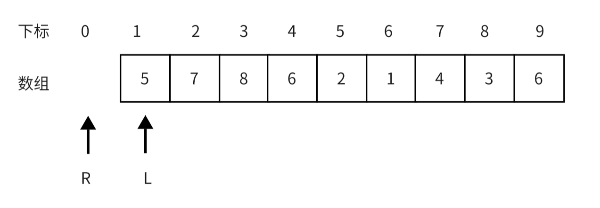
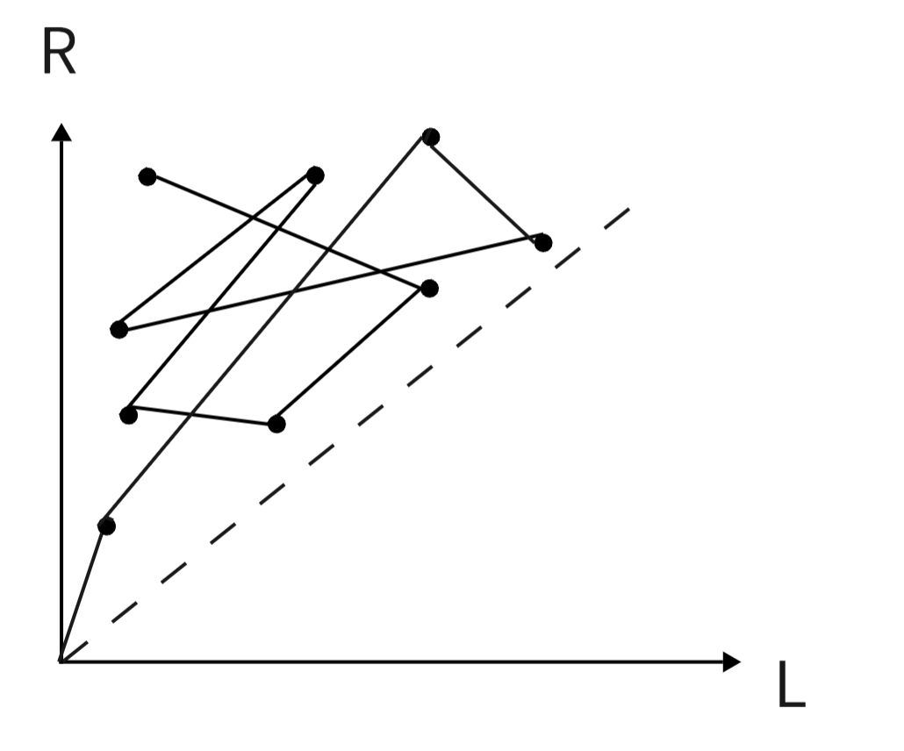
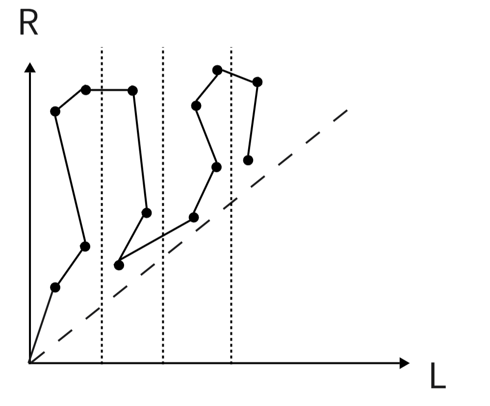

# 分块

## **引入**

>其实，分块是一种思想，而不是一种数据结构。
分块的基本思想是，通过对原数据的适当划分，并在划分后的每一个块上预处理部分信息，从而较一般的暴力算法取得更优的时间复杂度。                                           —— **OI Wiki**

面对区间问题，有树状数组，线段树等算法。给定一个长度为$n$的数组，做$m$次区间修改和区间查询。分块算法可以用$O(m\sqrt n)$的复杂度实现操作，比树状数组和线段树慢，但是容易理解。


## **分块算法思路**

我们都知道线段树是一颗高度为$\log n$的二叉树，而分块数组可以看作是一个高度为$3$的树：

<figure markdown="span">
  { width="750" }
</figure>


<!-- <div align=center></div> -->


我们以最典型的区间操作区间和为例：[P3372](https://www.luogu.com.cn/problem/P3372){target="_blank"}


我们将整个数组分为$t$块，每块长度为$block$，$st[i]$表示第$i$块的开始位置，$ed[i]$表示第$i$块的结束位置，$add[i]$表示对第$i$个块整个加的数，$pos[i]$表示第$i$个元素所在的块，$sun[i]$表示第$i$块的区间和。

$block$ 取 $\sqrt n$ 时有比较好的时间复杂度，之后会具体分析。我们对上述变量进行简单的初始化，即实现对数组的分块。

```cpp
void init()
{
    block = sqrt(n);                        //块大小
    t = (n + block - 1) / block;            //块的个数 
    for (int i = 1; i <= n; ++i)
    {
        pos[i] = (i + block - 1) / block;   //第i个元素所在块
        sum[pos[i]] += a[i];                //sum维护区间和
    }
    for (int i = 1; i <= t; ++i)
    {
        ed[i] = i * block;
        st[i] = (i - 1) * block + 1;
        add[i] = 0;
    }
    ed[t] = n;                              //最后一个块可能不是整块
}
```

分块的区间和，区间修改都非常简单，我们能操作的只有整块和块内的个别元素。对整块的修改直接修改$add$数组即可，对块内个别元素的修改暴力即可。

```cpp
// 区间修改
void update(int l, int r, ll d)
{
    int p = pos[l], q = pos[r];
    // 修改区间在同一个块内
    if (p == q)
    {
        sum[p] += (r - l + 1) * d;
        for (int i = l; i <= r; ++i)
            a[i] += d;
    }
    else
    {
        // 修改整块
        for (int i = p + 1; i <= q - 1; ++i)
            add[i] += d;  //整块增加了d
        // 修改左边多余部分
        for (int i = l; i <= ed[p]; ++i)
            a[i] += d,sum[p] += d;
        // 修改右边多余部分
        for (int i = st[q]; i <= r; ++i)
            a[i] += d,sum[q] += d;
    }
}
```
区间查询同理，操作整块和边界的块内元素即可。

### **时间复杂度分析**

线段树一次操作的复杂度是树的高度，而分块一次操作的复杂度取决于块的大小，我们可以写出一次操作进行的运算次数为 $n/block+\Theta(block)$ ，当 $block$ 取 $\sqrt n$ 是达到最小值。

??? code "Block"
    ```cpp
    // 以维护区间和为例，给出分块的基本代码
    #include <bits/stdc++.h>
    using namespace std;
    const int MAX = 5e5 + 100;
    typedef long long ll;

    ll a[MAX], b[MAX];
    int n, m;
    // st[i]代表第i个块开始的位置，ed[i]表示第i个块结束的位置
    int st[MAX], ed[MAX], pos[MAX];
    // add整块的增量，sum维护区间和
    ll add[MAX], sum[MAX];
    // block 块大小，t块个数
    int block, t;
    // 初始化分块
    void init()
    {
        //块大小
        block = sqrt(n);                      
        //块的个数 
        t = (n + block - 1) / block;            
        for (int i = 1; i <= n; ++i)
        {
            //第i个元素所在块
            pos[i] = (i + block - 1) / block;   
            //sum维护区间和
            sum[pos[i]] += a[i];                
        }
        for (int i = 1; i <= t; ++i)
        {
            ed[i] = i * block;
            st[i] = (i - 1) * block + 1;
            add[i] = 0;
        }
        //最后一个块可能不是整块
        ed[t] = n;                              
    }

    // 区间修改
    void update(int l, int r, ll d)
    {
        int p = pos[l], q = pos[r];
        // 修改区间在同一个块内
        if (p == q)
        {
            sum[p] += (r - l + 1) * d;
            for (int i = l; i <= r; ++i)
                a[i] += d;
        }
        else
        {
            // 修改整块
            for (int i = p + 1; i <= q - 1; ++i)
                add[i] += d;
            // 修改左边多余部分
            for (int i = l; i <= ed[p]; ++i)
                a[i] += d, sum[p] += d;
            // 修改右边多余部分
            for (int i = st[q]; i <= r; ++i)
                a[i] += d, sum[q] += d;
        }
    }

    // 区间查询
    ll ask(int l, int r)
    {
        int p = pos[l], q = pos[r];
        ll ans = 0;
        // 查询区间在同一个块内
        if (p == q)
        {
            for (int i = l; i <= r; ++i)
                ans += a[i] + add[p];
        }
        else
        {
            // 查询整块
            for (int i = p + 1; i <= q - 1; ++i)
                ans += sum[i] + add[i] * (ed[i] - st[i] + 1);

            // 查询两边多余部分
            for (int i = l; i <= ed[p]; ++i)
                ans += a[i] + add[p];

            for (int i = st[q]; i <= r; ++i)
                ans += a[i] + add[q];
        }
        return ans;
    }

    void solve()
    {
        cin >> n >> m;
        memset(add, 0, sizeof add);
        memset(sum, 0, sizeof sum);
        for (int i = 1; i <= n; ++i)
            cin >> a[i];

        init();

        for (int i = 0; i < m; ++i)
        {
            int op;
            int l, r, x;
            cin >> op >> l >> r;
            if (op == 1)
                cin >> x, update(l, r, x);
            else
                cout << ask(l, r) << '\n';
        }
    }

    int main()
    {
        ios::sync_with_stdio(false);
        cin.tie(0), cout.tie(0);
        solve();
        return 0;
    }
    ```

## **基础莫队**

**莫队算法 = 离线 + 分块 + 暴力**

在线算法是交互式的，一问一答，前面的答案会应用于后面的答案的询问的，被称作强制在线；离线算法则是一次读取所有的查询，然后一起回答。因为离线算法因为有条件考虑所有查询，所以能够得到效率更高的算法。

基础的莫队算法是一种离线算法，他常用于不修改只查询的区间问题。复杂度为 $O(n\sqrt{n})$ ，效率没有线段树，树状数组高，但是易于理解编码简单。

我们以一道区间不同值个数的题目为例：[P1972HH的项链](https://www.luogu.com.cn/problem/P1972){target="_blank"}

## **暴力法**

我们用滑动窗口的思想，来解决这个问题，把每个查询 $[l_i,r_i]$ 看作一个窗口，我们要做的就是对于每一次查询就将当前的窗口 $[L,R]$ 移动到对应查询的位置。

对于该题我们用 $cnt[]$ 数组记录当前窗口中每个数出现的个数。

在这个过程中当 $L$ 指针向右扫过的位置，就把他出现的次数 $cnt[x_L]-1$ ，$R$指针向右扫过的位置，就把他出现的次数 $cnt[x_R]+1$ ；向左扫过时，与上述情况相反。

当 $cnt[x]$ 从 $0$ 变为 $1$ 的时候说明滑动窗口多了一个新的数字，我们就要给答案 $ans$ 加 $1$ ，如果 $cnt[x]$ 从 $1$ 变为 $0$ 说明窗口内少了一个数字就要给答案 $ans$ 减 $1$ 。

### **过程**

初始时我们维护的滑动窗口没有元素

<figure markdown="span">
  { width="750" }
</figure>


<!-- <div align="center"></div> -->

如果我们下一个要查询寻的区间是$[4,7]$，我们这时就要移动滑动窗口的左右端点

#### **移动左端点**

<figure markdown="span">
  { width="750" }
</figure>


<!-- <div align="center"></div> -->

在这个过程中$cnt[5],cnt[7],cnt[8]$都对应减$1$

#### **移动右端点**

<figure markdown="span">
  { width="750" }
</figure>


<!-- <div align="center"></div> -->

在这个过程中$cnt[5],cnt[7],cnt[8],cnt[6],cnt[2],cnt[1],cnt[4]$都加$1$

在这两个过程中更新不断$ans$的值，移动完成值$ans$就是对应查询的答案。

### **统计多个区间**

按照上面的过程，我们可以在每次查询时，移动 $L,R$ 指针即可。

但是这样做，在一些情况下复杂度非常高，比如第一个查询的区间时 $[1,1]$ ，下一个查询是 $[n,n]$ ，这样左右指针都需要扫过整个数组，这样循环往复的询问，复杂度是 $O(n^2m)$ 。

莫队算法就是对暴力法的这个问题进行优化


## **莫队算法**

### **暴力法的几何解释**

我们将区间$[L,R]$的左右端点看成一个点的横纵坐标。

那么我们在从一个区间移动到另一个区间时，其实就是从一个点移动到另一个点，对应的花费就是两点间的曼哈顿距离

<figure markdown="span">
  { width="450" }
</figure>

<!-- 
<div align="center"></div> -->

我们将所以的查询都抽象成点，放到坐标轴里观察，上面的问题其实转化为我们从原点开始，我们要不重不漏的走完这些点，走到一个点就记录一个点的答案。

那么我对算法的优化就是，如何能用尽可能短的曼哈顿距离，去完成上述任务，即求哈密顿最短路径问题，这是$NP$问题，没有多项式复杂度的解法。

我们要做的就是找到一个较优解。

可以看出，这个问题如果是在线查询的话，访问每个节点的顺序是随机的

<figure markdown="span">
  { width="450" }
</figure>


<!-- <div align="center"></div> -->

访问时可能会一会儿上一会儿下，一会儿左一会儿右，走很多重复的路，导致时间复杂度很高。


所以我们要离线处理这些查询，离线时可以以一个更好的顺序去处理它们。


### **朴素优化**

我们对区间一般的排序方式就是按左端点进行排序，左端点相同就按右端点排。这样可以减少横坐标的重复移动

<figure markdown="span">
  { width="450" }
</figure>


<!-- <div align="center"></div> -->

但是这样从坐标的振荡幅度右很大，复杂度还是很离谱。

### **莫队算法**

莫队的排序方式是先把数组下标区间分块，左端点按其所在的块排，左端点所在块相同，按右端点排。

<figure markdown="span">
  { width="450" }
</figure>

<!-- <div align="center"></div> -->

这样虽然左右仍然有震荡，但是震荡幅度被保持再来 $\sqrt{n}$ 内，是可以接受的。

还有一点可以优化。我们很容易可以发现，在块间移动时，也有可能会有很大的震动，所以在排序时可以使用奇偶性排序，让奇数块和偶数块采用相反的对右端点的排序。

<figure markdown="span">
  { width="450" }
</figure>

<!-- <div align="center"></div> -->

莫队算法的核心思想就是分块，他把震荡限制在了 $\sqrt{n}$ ，缩短了路径长度，提高了效率。

### **块大小划分**

块的大小对莫队算法的效率有很大的影响，有些题目只有正确划分块的大小才能通过。

下面我们设数组长度为 $n$ ，查询 $m$ 次，块长为 $t$

那么总共块的个数就是 $\frac{n}{t}$ ，每个块都要遍历整个数组长度，移动次数为 $\frac{n^2}{t}$ ，每次移动有左右的震荡，但幅度不超过 $t$ ，所以移动距离再加上 $mt$ 。可以推出最后复杂度为:

$$
O(\frac{n^2}{t} + mt)
$$

这个函数形式很熟悉，对勾函数（形如：$f(x)=ax+\frac{b}{x}$ 的函数，当 $x=\sqrt{\frac{b}{a}}$ 时取极值），所以当 $t=\frac{n}{\sqrt{m}}$ 时时间复杂度是最优的，是 $O(n\sqrt{m})$ 。

??? code "莫队"
    ```cpp
    /*
    根据题目[P2709 小B的询问]给出莫队算法的模板
    https://www.luogu.com.cn/problem/P2709
    */

    #include <bits/stdc++.h>
    using namespace std;
    const int MAX = 5e4 + 100;
    typedef long long ll;
    const ll mod = 1e9 + 7;

    void solve();
    int main()
    {
      ios::sync_with_stdio(false);
      cin.tie(0), cout.tie(0);
      // clock_t c1 = clock();
    #ifdef LOCAL
      freopen("in.in", "r", stdin);
      freopen("out.out", "w", stdout);
    #endif
      solve();
      // cerr << "Time Used: " << clock() - c1 << " ms\n";
      return 0;
    }

    ll a[MAX];  
    int n, m, k;    
    ll ans[MAX];        // 记录对应编号的最终答案
    ll cnt[MAX];        // 记录对应数字出现个数
    ll res = 0;         // 当前区间的答案
    struct S            // 记录询问
    {
      int l, r, id;   // l询问左端点，r询问右端点，id询问编号
    } s[MAX];
    int pos[MAX];       // 记录下标为x所在的块

    // 将x位置对答案的影响加到当前区间内
    inline void add(int x){res += 2 * cnt[a[x]] + 1, cnt[a[x]]++;}

    // 将x位置对答案的影响从当前区间减去
    inline void sub(int x){res += 1 - 2 * cnt[a[x]], cnt[a[x]]--;}
    void solve()
    {
      cin >> n >> m >> k;
        // 对下标分块
      int block = sqrt(n);
      for (int i = 1; i <= n; ++i)
      {
        cin >> a[i];
        pos[i] = (i + block - 1) / block;
      }
        // 记录查询
      for (int i = 1; i <= m; ++i)
      {
        cin >> s[i].l >> s[i].r;
        s[i].id = i;
      }

        // 这是莫队算法与暴力法唯一不同的地方
        // 对查询按莫队算法排序
      sort(s + 1, s + 1 + m, [](S &a, S &b)
        { return pos[a.l] == pos[b.l] ? a.r < b.r : pos[a.l] < pos[b.l]; });


      int l = 1, r = 0;   // l,r维护当前所在区间
      for (int i = 1; i <= m; ++i)
      {
            // 移动区间完成查询
        while (s[i].l < l)add(--l);
        while (s[i].l > l)sub(l++);
        while (s[i].r > r)add(++r);
        while (s[i].r < r)sub(r--);
        ans[s[i].id] = res; //记录答案
      }
      for (int i = 1; i <= m; ++i)
        cout << ans[i] << '\n';
    }
    ```

## **习题**

|题目|难度|知识|
|:-:|:-:|:-:|
|[P2801](https://www.luogu.com.cn/problem/P2801){target="_blank"}|提高+/省选−|区间k大值|
|[P3203](https://www.luogu.com.cn/problem/P3203){target="_blank"}|省选/NOI−|分块单点修改，单点查询|
|[区间与绝对值](https://ac.nowcoder.com/acm/problem/260786){target="_blank"}||莫队+树状数组|


-----------------------
参考文章：

[Oi-Wiki 普通莫队算法](https://oi-wiki.org/misc/mo-algo/#%E6%99%AE%E9%80%9A%E8%8E%AB%E9%98%9F%E7%9A%84%E4%BC%98%E5%8C%96){target="_blank"}

[百度百科-对勾函数](https://baike.baidu.com/item/%E5%AF%B9%E5%8B%BE%E5%87%BD%E6%95%B0/92025){target="_blank"}

《算法竞赛》上册 - 罗永军