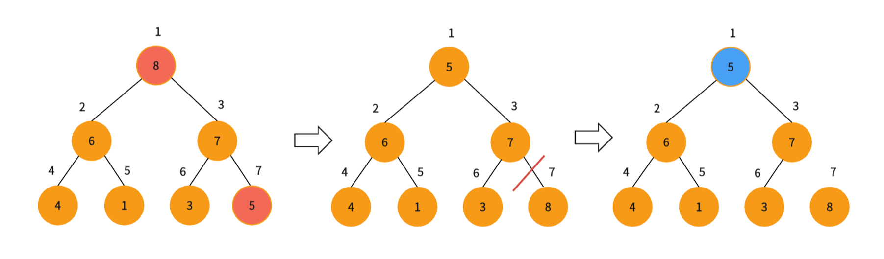

#  二叉堆

## **定义**
二叉堆是一个可以被看做一棵树（完全二叉树）的数组对象。并且堆总是满足下面两条性质：

- 堆中某个节点的值总是不大于或不小于其父节点的值
- 堆总是一棵完全二叉树


## **逻辑结构&物理结构**

<figure markdown="span">
  { width="750" }
</figure>


<!-- <div align="center"></div> -->

根据节点的标号和下标，我们可以看出一定的规律，这样给定一个数组的下标$i$，我们可以很容易的的计算得到它的父节点和左右孩子：

$$
left=2i\\
$$

$$
right=2i+1\\
$$

$$
parent=\left \lfloor \frac{i}{2} \right \rfloor
$$

本文实现的堆都是以下标从$1$开始来实现的，从$0$开始大同小异。

## **堆的分类**

根据堆不同的堆序性可以将堆分为大堆和小堆
在大堆中，堆满足最大堆性质，即除了根以外的所有节点$i$都要满足：

$$
a[parent(i)]\ge a[i]
$$

在小堆中，堆满足最小堆性质，即除了根以外的所有节点$i$都要满足：

$$
a[parent(i)]\le a[i]
$$

## **堆的实现**

### **建堆**

建堆需要依靠向下调整算法来实现

#### **向下调整算法**

向下调整算法成立的前提是，左右子树都满足大堆（小堆）的性质该算法的输入是数组$arr$和可能不满足大堆（小堆）性质的节点$i$，算法通过让$arr[i]$的值在大堆中逐级下降，从而使得以$i$为根节点的堆，重写遵循大堆的性质。下面是向下调整算法的运行过程：

<figure markdown="span">
  { width="750" }
</figure>


<!-- <div align="center"></div> -->

这里以实现大堆为例，通过与左右子节点中的较大值值进行比较，来判断是否满足堆序性，不满足对序性就将根节点的值与子节点进行交换。重复此过程，直到满足对序性或到达叶子节点就停止算法。

=== "cpp"

    ``` cpp
    void Heap::AdjustDown(int* arr,int i,int n) {
        int maxc = i << 1;//找到子节点
        while (maxc <= n) {
            //选出两个子节点中大的那一个
            if ((maxc | 1) <= n && arr[maxc] < arr[maxc | 1])
                maxc |= 1;
            //不满足大堆性质，就将二者交换
            if (arr[i] < arr[maxc]) {
                swap(arr[i], arr[maxc]);
                i = maxc, maxc = i << 1;
            }
            else break;
        }
    }
    ```

=== "python"

    ``` python
    def adjust_down(arr: List[int], i:int, n:int) -> None:
    	 maxc = i << 1 # 找到左子女节点
    	 while maxc <= n:
    	 	if (maxc | 1) <= n and arr[maxc] < arr[maxc | c]: 
    	 		maxc = maxc | 1
    	 	if arr[i] < arr[maxc]: 
    	 			arr[i],arr[maxc] = arr[maxc], arr[i]
    	 			i, maxc = maxc, maxc << 1
    	 	else: break
    ```

时间复杂度为 $O(\log n)$。

#### **建堆思路**

明白的向下调整算法我们就可以进行建堆了。

具体思路是用自底向上的方法，利用向下调整算法，把一个无序的满二叉树转化为大堆（小堆）。

树中每一个叶节点都可以看成只包含一个元素的大堆（小堆），我们只需要从最后一个非叶子节点开始到根节点都调用一次向下调整算法，即可。

下面是建堆的过程：

<figure markdown="span">
  { width="750" }
</figure>


<!-- <div align="center"></div> -->


=== "cpp"

    ``` cpp
    void Heap::BuildHeap(int* arr,int n){
        for(int i=n>>1;i>=1;--i)
            AdjustDown(arr,i,n);
    }
    ```

=== "python"

    ``` python
    def build_heap(arr: List[int], int n):
    	for i in range(n>>1,0,-1):
    		adjust_down(arr, i, n)
    ```

建堆的时间复杂度为$O(n)$，证明见算法导论第三版$P88$

### **插入**

实现插入操作需要向下调整算法。

#### **向下调整算法**

和向下调整算法一样，向上调整算法成立的前提是左右子树都满足大堆（小堆）的性质，算法的输入同样是数组  $arr$ 和下标$i$，与向下调整算法不同的是，向上调整算法是通过让$arr[i]$的值在大堆中“逐级上升”，从而使得以$i$为根节点的子树重新遵循大堆的性质。

因为与向上调整算法类似，这里直接给出实现：

=== "cpp"

    ``` cpp
    void PriorityQueue::AdjustUp(int i) {
        //找父节点
        int p = i >> 1;
        //运行到根节点为止
        while (i > 1) {
            //不满足大堆性质就就换其值
            if (arr[i] > arr[p]) {
                swap(arr[p], arr[i]);
                i = p, p = i >> 1;
            }
            else break;
        }
    }
    ```

=== "python"

    ``` python
    def adjust_up(self, i:int):
    	 p = i >> 1 # 找到双亲节点
    	 while i > 1:
    	 	if self.arr[i] > self.arr[p]: 
    	 			self.arr[i], self.arr[p] = arr[p], arr[i]
    	 			i, p = p, p >> 1
    	 	else: break
    ```

时间复杂度为 $O(\log n)$。

了解了向上调整算法插入就非常简单了，就是在堆的末尾加上要插入的数字，然后对其调用向上调整算法，找到其满足堆性质的位置。

=== "cpp"

    ``` cpp
    void PriorityQueue::push(int x) {
        arr.push_back(x);
        n++;
        AdjustUp(n);
    }
    ```

=== "python"

    ``` python
    def push(self, x: int):
    	self.arr.append(x)
    	self.n += 1
    	self.adjust_up(self.n)
    ```

时间复杂度$O(\log n)$

### **删除**

堆只能删除堆顶元素。

删除的过程是，先将根节点与末尾元素位置交换，然后删除末尾元素，在对根节点调用向下调整算法即可。

=== "cpp"

    ``` cpp
    int PriorityQueue::pop() {
        if (n == 0) {
            cout << "heap underflow\n";
            exit(-1);
        }
        int maxres = arr[1];
        swap(arr[1], arr[n]);
        arr.pop_back();
        n--;
        AdjustDown(1);
        return maxres;
    }
    ```

=== "python"

    ``` python
    def pop(self):
    	if self.n == 0:
    		raise IndexError("top from empty PriorityQueue")
      maxres = arr[1]
      arr[1], arr[n] = arr[n], arr[1]
      self.arr.pop()
      self.n -= 1
      self.adjust_down(1)
      return maxres
    ```

时间复杂度$O(\log n)$


## **堆的应用**

### **堆排序**

排序开始前，我们首先要将输入的数组 $arr$ 根据要排的顺序建立堆，这里以升序为例，建大堆。

堆中的数据起初有 $n$ 个元素（即数组元素个数），每次我们将根节点 $arr[n]$ 与 $arr[1]$ 交换，然后去掉节点 $n$ ，再对根节点调用向下调整算法，这样就在 $[1,n-1]$ 的范围内右构造了一个新的大堆，同时完成了一个元素的排序。堆排序就是不断重复这个过程，直到堆中只剩一个元素时，就将整个数组排好序了。

下面是排序一个元素的过程：

<figure markdown="span">
  { width="750" }
</figure>


<!-- <div align="center"></div> -->

=== "cpp"

    ``` cpp
    void Heap::HeapSort(int* arr,int n){
        //建堆
        //时间复杂度O(n)
        BuildHeap(arr,n);
        //排序
        //时间复杂度O(nlogn)
        for(int i=n;i>1;--i){
            swap(arr[1],arr[i]);
            AdjustDown(arr,1,i-1);
        }
    }
    ```

=== "python"

    ``` python
    def heap_sort(arr: List[int], n: int):
    	build_heap(arr, n)
    	for i in range(n, 1, -1):
    		arr[1], arr[i] = arr[i], arr[1]
    		adjust_down(arr, 1, i-1)
    ```

时间复杂度为: $O(n\log n)$

### **优先队列**
这里对堆进行简单的实现，在解题时不需要自己手写，直接调用$STL$库中的优先队列 $priority\_queue<typename>$ 即可。

> python可以参考[heapq库](https://docs.python.org/zh-cn/3/library/heapq.html)

和堆一样，优先队列也有两种形式：最大优先队列和最小优先队列。这里我们先关注如何基于大堆实现最大优先队列。最大优先队列支持以下操作：

=== "cpp"

    ``` cpp
    class PriorityQueue {
        vector<int> arr{ 0 };
        int n = 0;//元素个数
        void AdjustDown(int i);//向下调整算法
        void AdjustUp(int i);//向上调整算法
    public:
        void push(int x);//插入值x
        int pop();//删除并返回最大值
        int top();//返回最大值，即堆顶元素
        int size() { return n; }//返回元素个数
        void clear() { n = 0; arr.resize(1); }//清空队列
    };
    ```

=== "python"

    ``` python
    class PriorityQueue:
        def __init__(self):
            self.arr = [0]
            self.n = 0
    
        def adjust_down(self, i):
            # 向下调整算法的实现
    
        def adjust_up(self, i):
            # 向上调整算法的实现
    
        def push(self, x):
            self.arr.append(x)
            self.n += 1
            self.adjust_up(self.n)
    
        def pop(self):
            if self.n == 0:
                raise IndexError("pop from empty PriorityQueue")
            max_res = self.arr[1]
            self.arr[1], self.arr[self.n] = self.arr[self.n], self.arr[1]
            self.arr.pop()
            self.n -= 1
            self.adjust_down(1)
            return max_res
    
        def top(self):
            if self.n == 0:
                raise IndexError("top from empty PriorityQueue")
            return self.arr[1]
    
        def size(self):
            return self.n
    
        def clear(self):
            self.n = 0
            self.arr = [0]
    
    ```


## 题单

### Leetcode[最小K个数](https://leetcode.cn/problems/smallest-k-lcci/)

#### 手搓一个heap

> 需要注意的是，它下标是从0开始的，所以一开始要先在首部加一个[0]

```python
class Solution:
    def smallestK(self, input: List[int], k: int) -> List[int]:
        n = len(input)
        input = [0] + input
        def adjust_down(arr, i, k):
            minc = i << 1
            while minc <= k:
                if minc + 1 <= k and arr[minc] > arr[minc + 1]:
                    minc = minc + 1
                if arr[i] > arr[minc]:
                    arr[i], arr[minc] = arr[minc], arr[i]
                    i, minc = minc, minc << 1
                else: break
        def build_heap(arr, k):
            for i in range(k >> 1, 0, -1):
                adjust_down(arr, i, k)
                
        if len(input) >= k and k != 0:
            build_heap(input, n)
        ans = []
        for i in range(k):
            ans.append(input[1])
            input[1],input[n - i] = input[n - i], input[1]
            adjust_down(input, 1, n - i - 1)
        return ans
```

#### 运用heap库

> python的heapq库是小根堆，即双亲节点比孩子节点小

主要的几个方法介绍

##### 创建堆

```python
import heapq
arr = [1,5,6,3,7]
hp = []
# 方法1 遍历建立
for num in arr:
    heapq.heappush(hp, num)
# 方法2 一次性建立
heapq.heapify(arr)
```

##### 堆排序

```python
arr = [1,5,6,3,7]
hp = []
for num in arr:
    heapq.heappush(hp, num)
print(heap[0])
heap_sort = [heapq.heappop(hp) for _ in range(len(heap))]	
```

##### 最大/最小k个

最小k个

```python
class Solution:
    def smallestK(self, arr: List[int], k: int) -> List[int]:
        hp = []
        ans = []
        n = len(arr)
        for x in arr:
            heapq.heappush(hp, x)
            while len(hp) > n-k:
                ans.append(heapq.heappop(hp))
        return ans
```

最小/最大k个

```python
arr = [1,5,6,3,7]
heapq.heapify(arr)
return heapq.nsmallest(k, arr)
return heapq.nlargest(k, arr)
```


