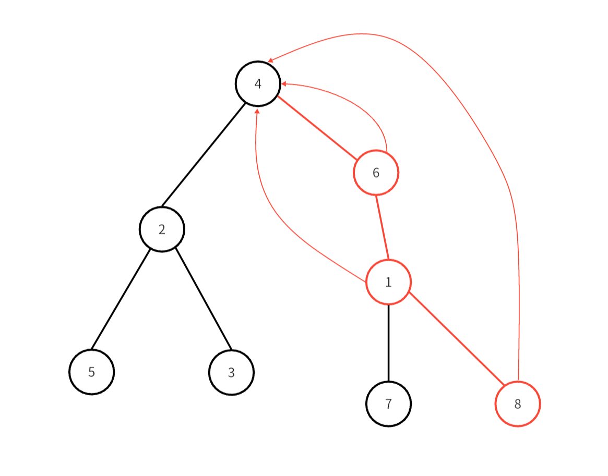

# 并查集

## **定义**
并查集是一种用来维护元素所属的数据结构，是通过森林实现的，所属相同的元素在同一颗树上，通常元素的所属指的就是它所属树的根节点。

如下图就是一个并查集的结构图：

<figure markdown="span">
  { width="500" }
</figure>

<!-- <div align="center"></div> -->

并查集支持两种操作：

- 并：合并，将两个元素所属的集合合并
- 查：查询，查询两个元素是否是在同一集合中


## **实现**

并查集关心就是一个元素的所属，也就是它所在树的根节点，那么我们就可以用一个数组 $fa[]$ 来存储一个元素的父节点，我们通过 $fa[]$ 数组不断向上查找，来寻找一个节点所在树的根节点。

### **初始化**

初始时，我们让每一个元素都单独的一棵树，即只有一个元素的集合。我们将每个元素的父亲节点设为它自己。

=== "cpp"

    ``` cpp
    //初始时将节点的根节点设为自己
    void init(int n){
        for(int i=1;i<=n;++i)
            fa[i]=i;
    }
    ```

=== "python"

    ``` python
    # 初始时将节点的根节点设为自己
    def init(n: int):
    	for i in range(1, n + 1):
    		fa[i] = i
    ```


时间复杂度：$O(n)$

### **查询**

我们只需要沿着树向上查找**根节点**即可

但是当树深度过深时，多次查询的时间复杂度会很高，所以我们要进行**路径压缩**。

#### **路径压缩**

我们使用并查集关心的只是**元素与根节点**之间的关系，那么其他元素之间的关系对我们来说，就没什么用了，我们只要知道某个节点的根节点是什么。所以在查询的时候，我们将查询路径上的节点都的父节点都改成其根节点就行了。

<figure markdown="span">
  { width="500" }
</figure>

<!-- <div align="center"></div> -->

如上图是查询 $8$ 节点时进行的路径压缩，把红色路径上的节点的父节点都改成根节点。

=== "c++"

    ``` cpp
    int ask(int x){
        //如果节点的父节点是其本身，说明已经到根节点了
        if(fa[x]==x)return x;
        //将路径上节点的父节点都改该树的根节点
        return fa[x] = ask(fa[x]);
    }
    ```

=== "python"

    ``` python
    def ask(x: int) -> int:
    	# 如果节点的父节点是其本身，说明已经到根节点了
    	if fa[x] == x:
    		return x
    	# 将路径上节点的父节点都改该树的根节点
    	fa[x] = ask(fa[x])
    	return fa[x]
    ```

### **合并**

我们只需要将一棵树的**根节点的父节点改成另一棵树的根节点**即可

=== "c++"

    ``` cpp
    void merge(int x,int y){
        fa[ask(x)]=ask(y);
    }
    ```

=== "python"

    ``` python
    def merge(x: int, y: int):
    	fa[ask(x)] = ask(y)
    ```
合并时也可也进行一定的优化

#### **启发式合并**

我们选择将节点较少或深度较浅的树连接到另一颗树上，但优化的效果有限。

=== "c++"

    ``` cpp
    void merge(int x,int y){
        int i=ask(x),j=ask(y);
        if(rak[i]>rak[j])		// rak记录当前树结点个数
            fa[j]=i;
        else fa[i]=j;
        if(rak[i]==rak[j]&&i!=j)
            rak[i]++;
    }
    ```

=== "python"

    ``` python
    def merge(x: int, y: int):
    	i = ask(x)
    	j = ask(y)
    	if rak[i] > rak[j]:
    		fa[j] = i
    	else: fa[i] = j
    	if rak[i] == rak[j] && i != j:
    		rak[i] += 1
    ```
## **带权并查集**

在带权并查集中，两个元素建立联系时，不是简单的把它们所在的集合合并，还要给它们之间赋一权值，来表示它们之间的关系。实现时我们要再开一个数组，来存储每个元素何其父节点或根节点的权值关系。


## **并查集的其他应用**

### **并查集找环**

我们可以使用并查集来判断一个**无向图**中是否有环的存在，思路也很简单。

当我们建图时，连接 $u,v$ 这两节点的时候，先判断它们是否已经连通，即判断它们是否在同一组内，如果不在，就将它们加到同一组中；如果已经在同一组中，说明连接此边后图中就会出现环。

### **并查集实现最小生成树**

通过并查集实现最小生成树的算法是 $Kruskal$ 算法。

这是一种贪心的求最小生成树方法，在保证不出现环的情况下，每次都将边权值最小的边加入到当前生成树中，直到所有节点都连通为止。

在这个过程中，并查集就起到判断是否会出现环的角色。

具体见图论的最小生成树内容。

----------------


## 题单

[100244. 带权图里旅途的最小代价](https://leetcode.cn/problems/minimum-cost-walk-in-weighted-graph/)

```python
class Solution:
    def minimumCost(self, n: int, edges: List[List[int]], query: List[List[int]]) -> List[int]:
        f = [i for i in range(n)]
        rnk = [ -1 for _ in range(n)]

        def ask(x: int) -> int:
            if f[x] != x:
                f[x] = ask(f[x])
            return f[x]
        
        def merge(x: int, y: int, w: int):
            i = ask(x)
            j = ask(y)
            f[j] = i
            rnk[i] = (rnk[i] & rnk[j] & w)
        
        for u, v, w in edges:
            merge(u,v,w)
        ans = []
        for u,v in query:
            if u == v:
                ans.append(0)
            elif ask(u) == ask(v):
                ans.append(rnk[ask(u)])
            else:ans.append(-1)
        return ans
```


参考文章：

[Oi Wiki-并查集](https://oi-wiki.org/ds/dsu/#%E5%85%B6%E4%BB%96%E5%BA%94%E7%94%A8)

[并查集判环](https://blog.csdn.net/cosx_/article/details/121213550)

[算法笔记-并查集](https://zhuanlan.zhihu.com/p/93647900)

