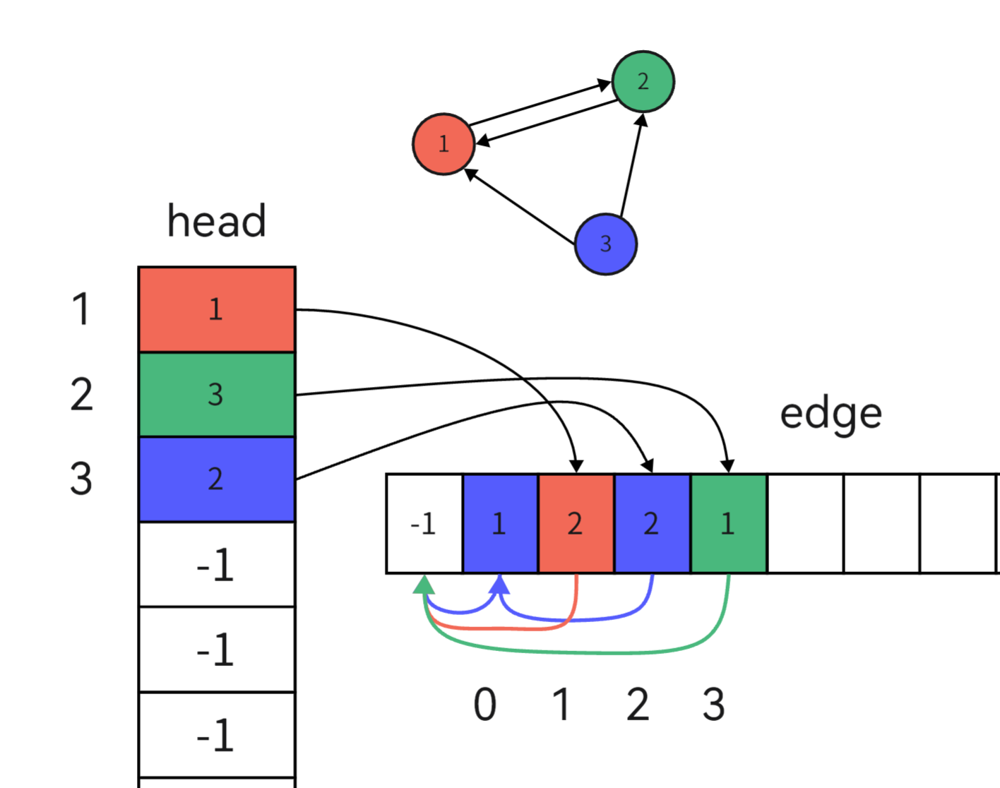

想要对一个图进行操作，首先要将其按照一定的形式存储起来，不同的存储方式有不同特点，适用于不同的场景

## **直接存边**

使用一个数组直接来存储边的信息，即起点、终点和边权

```cpp
struct edge {
    int u;//起点
    int v;//终点
    int w;//边权
}edge[MAX];
```
遍历的太低效，一般用来辅助其他算法

## **邻接矩阵**

用一个二维数组$edge$来存边，$edge[u][v]$表示为从节点$u$到节点$v$的边权
```cpp
int edge[MAX][MAX];
```
优点：查询边的时间复杂度为$O(1)$
缺点：空间复杂度太高了$O(n^2)$，比较适用于稠密图或节点较少的图

## **邻接表**

一般的定义邻接表是用链表实现的，但是链表实现起来比较复杂，也没有动态数组效率，所以这里就直接用动态数组来实现了

使用动态二维数组来存储每个节点的邻接点
```cpp
vector<int> edge[MAX];
```
存各种图都很适合，除非有特殊需求（如需要快速查询一条边是否存在，且点数较少，可以使用邻接矩阵）

尤其适用于需要对一个点的所有出边进行排序的场合

## **链式前向星**

与邻接表类似，但是是用两个数组实现的。

```cpp
//邻接边信息
struct ed {
    int to;         //边的终点
    int next;       //下一个邻接边在边数组的下标
    int w;          //边的权值
}edge[MAX];         //存储边的数组

int head[MAX];      //存储节点头
int tot = 0;        //标识一个新的边节点

//插入新边
void addEdge(int u, int v,int w) {
    edge[tot].to = v;           //记录边的终点
    edge[tot].next = head[u];   //相当于链表头插
    edge[tot].w = w;            //记录边的权值
    head[u] = tot++;            //更新节点头
}
```
#### 思路
与邻接表不同的是，**链式前向星**是存储邻接边的。

如下图，就是一个有向图转化为链式前向星的大致结构图。我用不同颜色表示的不同节点的邻接边。

<figure markdown="span">
  { width="500" }
</figure>

<!-- <div align="center"></div> -->

所有的边都存储在一个数组中，并且可以通过结构体的$next$属性索引到同一个节点的所有邻接边，所以我们只需要记录一个邻接边的下标即可。

$head[u]$就表示编号为$u$的节点的一个邻接边（其实是最后一个插入的邻接边，因为只有最后以邻接边才能索引前面所有的邻接边），我们可以把它就看成链表的头，每次插入边就相当于链表的头插。初始时，我们将$head$的所有值都赋值为$-1$，表示还没有邻接边。每次插入时都更新$head[u]$的值，使它始终记录着最后插入的边的下标。
