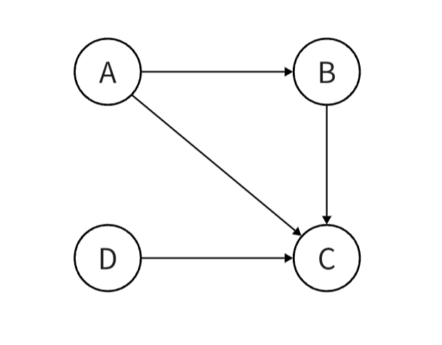
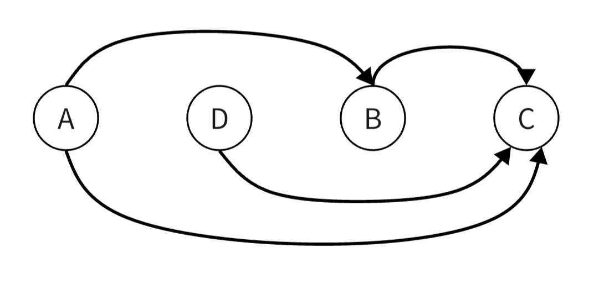
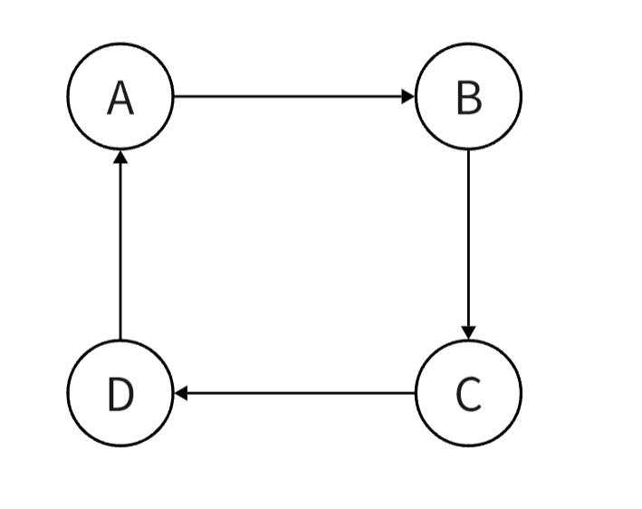

## **引入**

在生活中，我们在完成一个工作可能需要按一定顺序完成若干个任务。例如在完成 $B$ 前必须先完成 $A$ ，那么我们就说 $B$ 与 $A$ 存在偏序关系。我们用工作中任务之间的偏序关系建一个有向图，如下：


<figure markdown="span">
  { width="250" }
</figure>

<!-- <div align="center"></div> -->

**拓扑排序**其实就是找到一个执行任务的顺序，使这个顺序满足上述的偏序条件。如上图的的一个拓扑序就是 $A\rightarrow D\rightarrow B\rightarrow C$。

## **定义**

对于一个有向无环图$G=(V,E)$来说，其拓扑排序是$G$中所有节点的一种线性次序。即将图的所有节点在一条水平线上排开，图的所有有向边都从左指向右。

上图的一种拓扑序：

<figure markdown="span">
  { width="500" }
</figure>

<!-- <div align="center"></div> -->

但是对于一个有环图，是不能进行拓扑排序的，这很好理解。首先拓扑排序时，只有一个点没有前驱时，我们才能对其进行排序。但是对于一个环形的偏序关系，我们是找不到可以排序的点的。

<figure markdown="span">
  { width="250" }
</figure>

<!-- <div align="center"></div> -->

## **拓扑排序**

我用数组 $deg[]$ 记录一个点的入度，用邻接表的形式存图。

我们从第入度为 $0$ 的节点开始，删除该顶点，并删除该顶点所有的出边。重复该步骤直到删除所有顶点。

我们在删除边时不必要真的删除，我们只需将该边的终点的入度减 $1$ 即可。因为我们在拓扑排序过程中，只关心一个点当前是否有前驱，当 $deg[u]=0$ 时，代表一个点没有前驱，就可以将其排到当前拓扑序的下一个位置。

实现上述过程用栈或队列都可以。

```cpp
void topo()
{
	queue<int> que;
	vector<int> ans;	//记录拓扑序
	// 将一开始入度为0的点加入到队列中
	for(int i = 1;i <= n;++i)
		if(!deg[i])
		{
			que.push(i);
			ans.push_back(i);
		}

	while(!que.empty())
	{
		int u = que.front();
		que.pop();
		for(auto& v:g[u])
		{
			// 终点的入度减1，相当于删掉这条边
			deg[v]--;

            // 删除之后入度为0，说明v已经没有前驱将其加入队列和拓扑序中
			if(!deg[v])
			{
				que.push(v);
				ans.push_back(v);
			}
		}
	}
}
```

## **利用拓扑排序找环**

我们进行一次拓扑排序之后，我们可以发现，所有不在环上的点入度都变成了 $0$ ，而在环上的点入度都不为 $0$。

在处理一些有环图问题时（如：基环树），首先将环处理出来，可以很大程度上降低问题的难度。