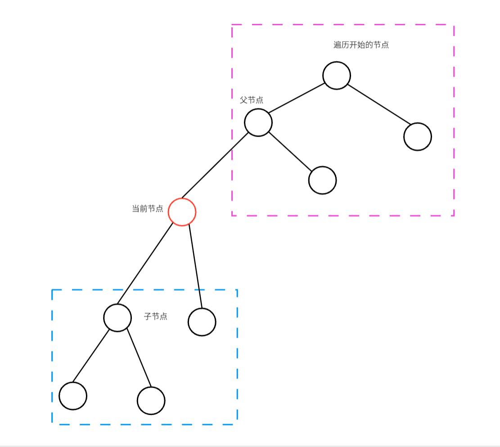
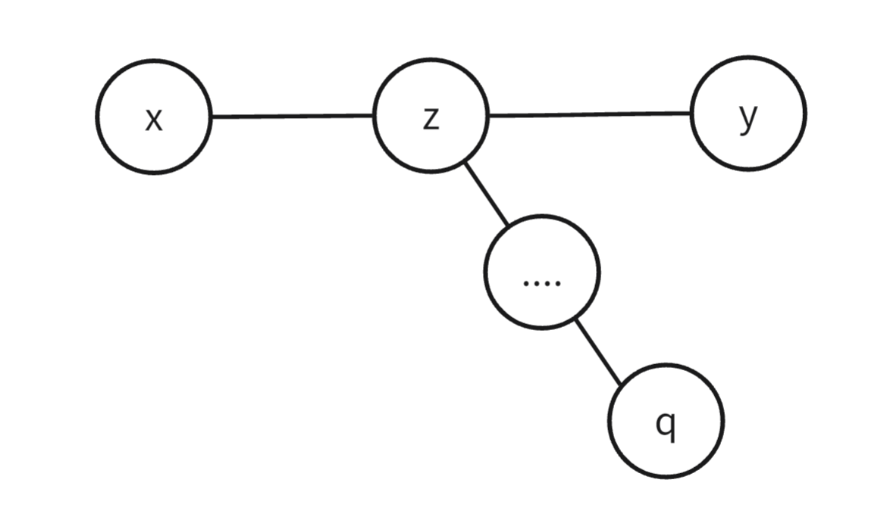
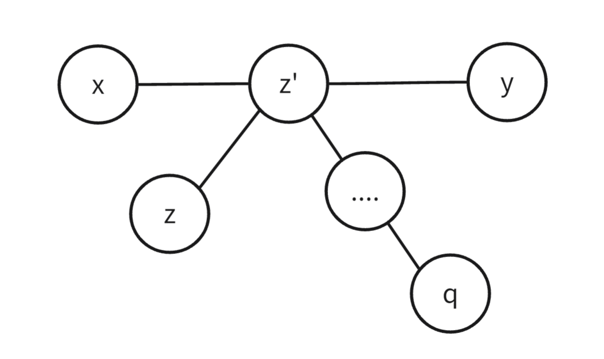
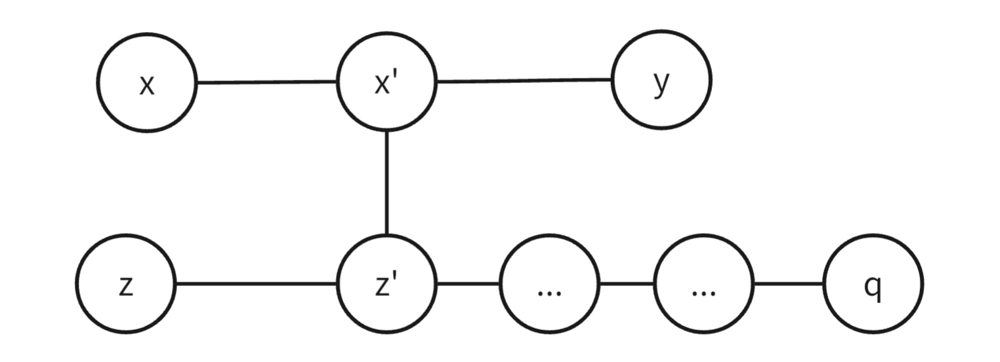

# 树基础

## **定义**

树是一个特殊的图，就是没有环的连通图。

一棵树有一下特点：

- 树根。基于有向图的树，有且只有一个树根；基于无向图的树，任意节点都可以作为树的树根。
- 一个有 $n$ 个节点的树，有 $n-1$ 条边。
- 连通性。从根出发能够到任意节点。
- 去掉一条边时，树被分成不连通的两颗树。
- 在树中任意添加一条边，就会出现环。
- 从根出发到一个节点，有且只有一条边。

## **树的重心**

### **定义**

树的重心是一个节点，该节点被定为：如果节点$u$为树根，其所有子树中节点数最大的子树，比其他任意节点为根时的最大子树的节点数都少，那么 $u$ 被称为该树的重心。


### **找重心**

我们用$DFS$的方式找一棵树的重心，以下面的题目为例：[Godfather](http://poj.org/problem?id=3107)

题目中要求最大子树最小，就是找重心。

我们从任意一节点开始遍历整棵树。在遍历过程中求每个位置为根时其最大子树的大小。

<figure markdown="span">
  { width="550" }
</figure>

<!-- <div align="center"></div> -->

每个节点为根时，其子树有蓝色和紫色框出的部分。
蓝色部分可以 $DFS$ 下去得到，紫色部分我们可通过整个的节点个数 $n$ 减去蓝色部分和当前节点得到。那么以当前节点为根节点的最大子树就是蓝色部分中最大的子树和紫色部分二者中较大的一个。

我们用一个数组 $d[]$ 记录每个节点 $DFS$ 过程的子节点个数，即蓝色框出的节点个数。

```cpp
void dfs(int u, int fa)
{
	d[u] = 1;
	int t = 0;
	for (int i = head[u]; ~i; i = edge[i].nxt) //链式前向星存储方式
	{
		int v = edge[i].to;
		if (v == fa)continue;    //不回到父节点
		dfs(v,u);                //计算蓝色部分节点个数
		d[u] += d[v];   
		t = max(t, d[v]);        //记录蓝色部分中最大的子树
	}
	t = max(t, n - d[u]);           //得到当前位置的最大子树
	if (t < ma)                     // 记录答案
	{
		cnt = 1;
		ans[cnt] = u;
		ma = t;
	}
	else if (t == ma)ans[++cnt] = u;
}
```

### **性质**

树重心的**性质**：

- 树的重心如果不唯一，则至多有两个，且这两个重心相邻。
- 一个点是重心，等价于，以这个点为根，它的每个子树的大小，都不会超过整个树大小的一半。
- 树中所有点到某个点的距离和中，到重心的距离和是最小的。如果有两个重心，那么到它们的距离和一样。更进一步，距离和最小与是重心等价。
- 如果一个树增添或删去一个叶子，则整个树的同一个重心最多移动一个节点。
- 通过连接一条端点分别在两个树的边，来将两个树合并成一个，那么新的重心肯定是在原来这两个树的重心的路径上。

## **树的直径**

树的直径是指树上最远两点之间的简单路径的长度，又称为树的最远点对。

### **求树的直径**

#### **两次 $DFS$**

我们从任意节点开始，通过 $dfs$ 找到距离当前节点最远的节点，这个节点就是直径上其中一个节点，我们再从这个节点再进行一次 $dfs$ 就可以找到直径的另一个端点。

**证明：** 显然，如果第一次 $DFS$ 到达的节点 $z$ 是直径的一端，那么第二次 $DFS$ 到达的节点 $z'$ 一定是直径的一端。我们只需证明在任意情况下，$z$ 必为直径的一端。

我们设 $x,y$ 为直径的端点，$x$ 到 $y$ 的路径记为 $P_{x,y}$，路径 $P_{x,y}$ 的长度记为 $l_{x,y}$，从 $z$ 出发到达的最远节点为 $q$，如果 $q$ 不为直径的端点，则有以下三种情况：

- **当 $z$ 在 $P_{x,y}$ 路径上**

<figure markdown="span">
  { width="350" }
</figure>

那么有 $l_{z,q} > l_{z,y}$ ，所以一定有 $l_{x,z} + l_{z,q} > l_{x,z} + l_{z,y}$ ，即 $l_{x,q} > l_{x,y}$ ，与 $P_{x,y}$ 是树直径冲突，所以这个情况是不存在的。


- **当 $z$ 不在 $P_{x,y}$ 路径上，且 $P_{z,p}$ 与 $P_{x,y}$ 有路径重叠**

<figure markdown="span">
  { width="350" }
</figure>

那么有 $l_{z,q} > l_{z,y}$ ，所以有 $l_{z',q} > l_{z',y}$ ，继而 $l_{x,z'} + l_{z',q} > l_{x,z'} + l_{z',y}$ ，即 $l_{x,q} > l_{x,y}$ ，与 $P_{x,y}$ 是树直径冲突，所以这个情况也是不存在的。

- **当 $z$ 不在 $P_{x,y}$ 路径上，且 $P_{z,p}$ 与 $P_{x,y}$ 没路径重叠**

<figure markdown="span">
  { width="450" }
</figure>

那么有 $l_{z,q} > l_{z,y}$，所以有 $l_{z',q} > l_{z',y}$ ，并且显而易见的 $l_{z',y} = l_{z',x'} + l_{x',y}$ ，那么显然 $l_{z',q} + l_{x',z'} > l_{x'y}$，所以有 $l_{x,x'} + l_{x',z'} + l_{z',q} > l_{x,x'} + l_{x'y}$ ，即 $l_{x,q} > l_{x,y}$ ，与 $P_{x,y}$ 是树直径冲突，所以这个情况也是不存在的。

--------------

**结论：所以从任意节点 $z$ 出发到达最远节点 $q$，此时 $q$ 节点一定为直径的端点。**该证明不考虑负边权，当有负边权时上述证明就不在成立，所以两次 $DFS$ 只有在没有负边权时才能正确求得树直径。当有负边权时只能通过树形 $dp$ 去求。

下面以边权为 $1$ ，节点编号为 $[1,n]$ 为例给出两次 $DFS$ 求直径的代码：

```cpp
int n,a = 0,b = 0; 		// a,b 是直径的两个端点 
cin >> n;
vector<int> d(n + 1);	// 记录到当前节点的距离
vector<vector<int>> g(n + 1); // 存树
for(int i = 1;i < n;++i)
{
	int u,v;
	cin >> u >> v;
	g[u].push_back(v);
	g[v].push_back(u);
}
function<void(int,int,int&)> dfs = [&](int u,int fa,int& id)
{
	for(auto& v:g[u])
	{
		if(v == fa)continue;
		d[v] = d[u] + 1;
		if(d[v] > d[id]) id = v;
		dfs(v,u,id);
	}
};
dfs(1,0,a);
d[a] = 0,dfs(a,0,b);
// d[b] 就是树的直径
```

#### **树形 $dp$**

设 $dp[u]$ 为以 $u$ 为根节点的子树中，从 $u$ 出发的最长路径长度。那么我们可以写出递推式:

$$
dp[u] = max\{dp[u],dp[v] + w_{u,v}\}
$$

其中 $w_{u,v}$ 代表 $u,v$ 间的边权。对于直径 $d$，其实就是从某个节点出发不同的两条路径相加的最大值，那么求 $d$ 就有以下公式：

$$
d = max\{d,dp[u] + dp[v] + w_{u,v} \}
$$

下面是树形 $dp$ 求直径的实现：

```cpp
int d = 0,n;			// d 代表直径
cin >> n;
vector<int> dp(n + 1);	// 含义如上
vector<vector<int>> g(n + 1);	// 存树
for(int i = 1;i < n;++i)
{
	int u,v;
	cin >> u >> v;
	g[u].push_back(v);
	g[v].push_back(u);
}
function<void(int,int)> dfs = [&](int u,int fa)
{
	for(auto& v:g[u])
	{
		if(v == fa)continue;
		dfs(v,u);
		d = max(d,dp[u] + dp[v] + 1);
		dp[u] = max(dp[u],dp[v] + 1);
	}
};
dfs(1,0);
// d 为直径
```

### **性质**

- 直径的中点如果不唯一，则至多有两个，且这两个中心相邻。
  
- 若树上所有边边权均为正，则树的所有直径的中点重合。
