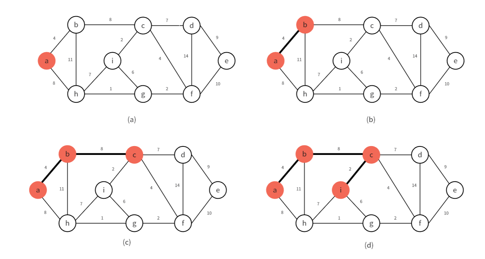
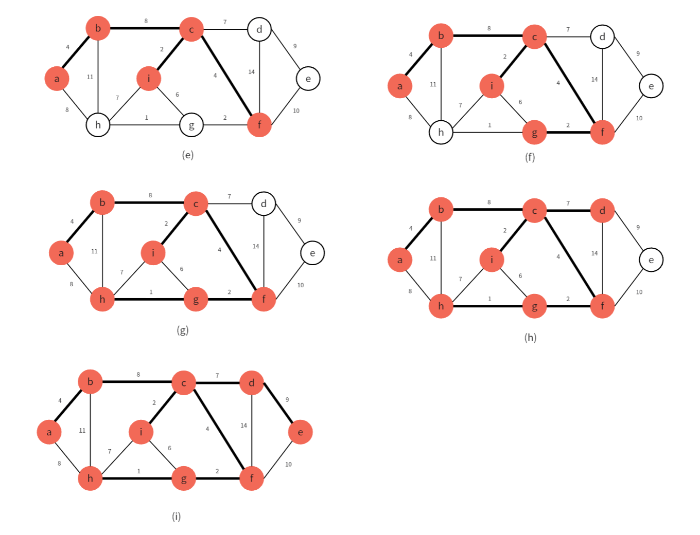

## **定义**

**连通图**：任意两个顶点之间都有一条路径相通。

**生成树**：一个连通无向图的生成子图，同时要求是树。也即在图的边集中选择$ n - 1$条，将所有顶点连通。

**最小生成树**：边权和最小的生成树。只有连通图才有生成树。

[【模板】最小生成树](https://www.luogu.com.cn/problem/P3366)

## **$Kruskal$算法**

### **思路**
$Kruskal$算法是利用贪心方法实现的最小生成树算法。算法思路也很简单，每次将图中边权最小且不会构成回路的边加入到生成树中，最终将$n-1$条边都加入后，就得到了最小生成树。

### **实现**

我们可以利用并查集来实现，将连通的节点加入到同一集合中。

在加入新边时，先判断边连接的两个顶点是否所属同一集合，如果已经在同一集合，说明两点已近连通，不能再连边了；如果不在同一集合中，那就将两节点合并 到一个集合中。

时间复杂度就是对边的排序，$O(m\log m)$

## **$Prim$算法**

### **思路**

$Prim$算法也利用了贪心的思想，但是贪心的策略和$Kruskal$不同。

$Prim$算法从一个起始节点开始，我假设起始节点为$a$，我们将$a$加入到集合$V$中，集合$V$表示最小生成树中的节点。

我们从所有和$V$中的顶点相连的边中选取边权最小的那一条，将其连接的顶点加入到集合$V$中，并且选取的边不能使最小生成树中出现环。循环此过程，当所有$n$个节点都被选完，就得到最小生成树了。

下面是$Prim$算法的运行过程：

<figure markdown="span">
  { width="850" }
</figure>

<!-- 

 -->

<figure markdown="span">
  { width="850" }
</figure>

<!-- 

 -->

### **实现**

朴素的实现方式是：每次向最小生成树中加入顶点时，枚举所有与$V$相连的边，从中选取满足条件的最小边权加入的最小生成树中，这样时间复杂度不太美丽，$O(n^2+m)$。

我们可以用优先队列来进行优化，我们将与$V$相连的边都加入到有限队列中，这样就不需要枚举来找到最小边权了，时间复杂度就低很多了$O((n+m)\log n)$。

