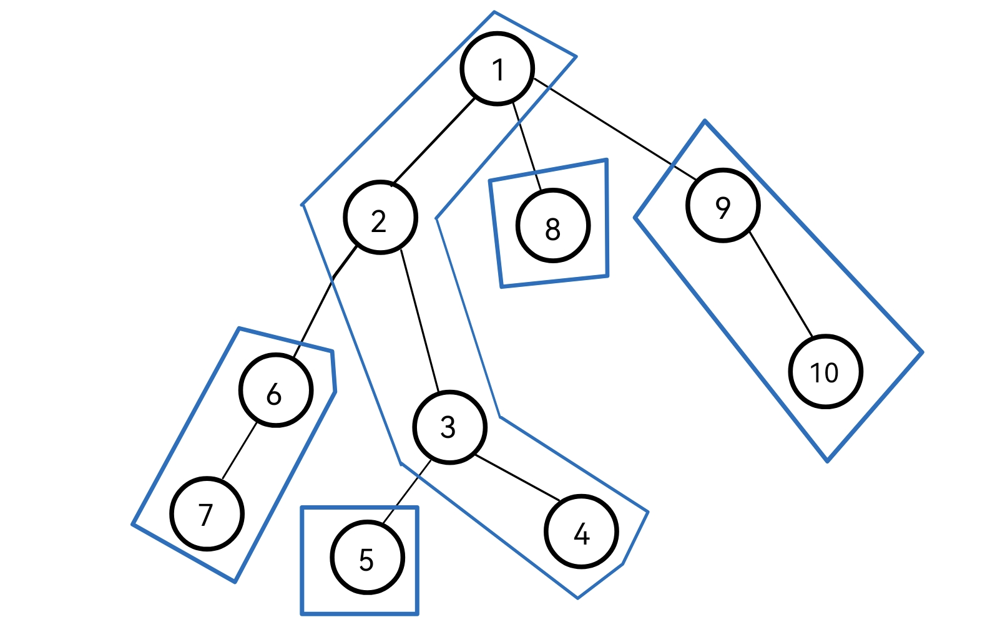
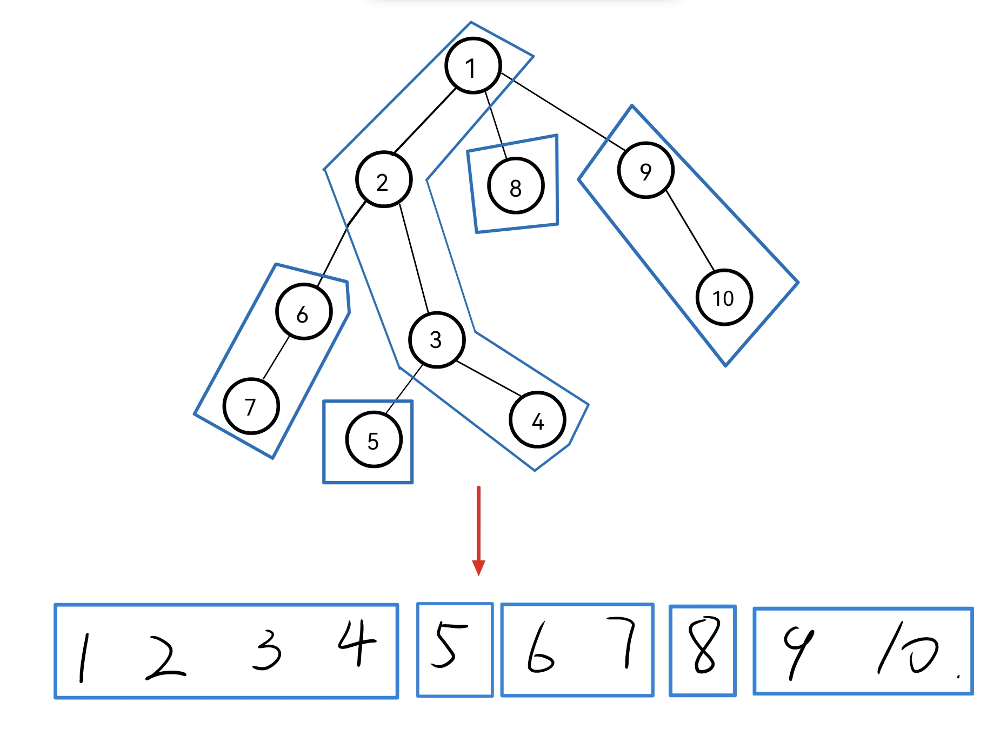

## **树链剖分思想**

树链剖分的主要思路就是将一棵树，若干条链，让每条链上的 $dfs$ 序是连续的，这样就能将一个树形结构转化为一个线性结构，在处理一条树上路径时，就可以转化为对若干条链进行处理，这就可以用一些线性数据结构来处理，例如线段树。

想要有比较优秀的时间复杂度的话，那么一条路劲上的链就不能太多，应当是像 $\log n$ 或 $\sqrt{n}$ 这样的数量。这就取决于链的划法了。

通常有两种剖分方法，**重链剖分**和**长链剖分**。因为重链剖分通常有更优的复杂度，所以树链剖分一般指的就是重链剖分。


## **重链剖分**

重链剖分的划分思路是这样的：

- 每个节点给的儿子被划分成两部分，**重儿子**和**轻儿子**。重儿子只有一个，表示子节点中子树最大的那个子结点。如果有多个子树最大的子结点，取其一。如果没有子节点，就无重子节点。其余节点都是轻儿子。

- 与重儿子连接的边被称作重边，与轻儿子连接的边被称作轻边。

- 在 $dfs$ 遍历整个树时，每次优先走重儿子，按照这个顺序依次给节点编号，就会将树划分为如下结构：


<figure markdown="span">
  { width="450" }
</figure>

蓝色框框起来的就是一条重链，图中已将按照上述 $dfs$ 的顺序将节点编号，我们会发现一条链上的编号是连续的，一个子树的编号也是连续的，这样我们就可以将一些树上问题转化为线性的问题。

要将树划成上图这样的结构，需要进行两次 $dfs$，第一次 $dfs$ 计算每个节点的深度、父节点、该节点为根的子树的大小，以及节点的重儿子。


```cpp 
vector<int> sz(n + 1); // 记录子树大小
vevtor<int> fa(n + 1);  // 记录父节点
vector<int> dep(n + 1); // 记录深度
vector<int> hson(n + 1);// 记录重儿子
function<void(int,int)> dfs1 = [&](int u,int ffa)
{
    fa[u] = ffa;
    dep[u] = dep[ffa] + 1;
    sz[u] = 1;
    for(auto& v:g[u])
    {
        if(v == ffa)continue;
        dfs1(v,u);
        sz[u] += sz[v];
        if(sz[v] > sz[hson[u]])
            hson[u] = v;
    }
};
```

第二次 $dfs$ 为节点编号，并且记录每个节点所在链的链头：

```cpp
vector<int> a(n + 1);   // 节点权值
vector<int> top(n + 1); // 节点所在链的链头
vector<int> rnk(n + 1); // 将节点原编号转化为我们赋值的新编号
vector<int> id(n + 1);  // 将节点新编号转化为原编号
int t = 0; // 已分配编号的数量
function<void(int,int,int)> dfs2 = [&](int u,int ffa,int tp)
{
    top[u] = tp;
    rnk[u] = ++t;
    id[t] = u;
    if(hson[u])d2(hson[u],u,tp);// 重链
    for(auto&v:g[u])
    {
        if(v == ffa or hson[u] == v)continue;
        dfs2(v,u,v);			// 轻链
    }
};
```

这样就将树剖分成了若干条链，从一个树形结构被划分成了线性结构：

<figure markdown="span">
  { width="450" }
</figure>

这样划分出的树会有一些特点：

- 树上每个节点都属于且仅属于一条重链。所有的重链将整棵树 完全剖分。

- 一颗子树内的 DFS 序是连续的。在剖分时 重边优先遍历，最后树的 DFS 序上，重链内的 DFS 序是连续的。

因为这些特点，使得我们可以将剖分得到的线性数组交给线段树之类的数据结构维护。当要修改一条树上路径时，就是修改几条链，每次对链的修改就是，就是对该序列的 $[top[rnk[u]],rnk[u]]$ 这个范围的修改。

比如说我们要将 $8$ 号节点和 $3$ 号节点路径上的每个节点权值都加 $1$，其实就是修改数组中 $[1,3]$ 和 $[8,8]$ 两个区间。这个操作的代码实现在后面模板题目中介绍。

### **时间复杂度**

对于上述的路径修改，我们可以使用线段树或差分，实现 $O(\log n)$ 或 $O(1)$ 的复杂度，只要整个路径上我们要修改的链的数量在一个合理范围内，复杂度就不会很高。

所以树剖的最坏复杂度取决于两点间经过的链的最大数量。对于重链剖分，我们可以想到每走一次轻边，子树的大小至少会除以 $2$，因为重子节点的个数是最多的，任意一个轻儿子的子树大小都不可能超过当前子树节点数量的一半。那么对于一个有 $n$ 个节点的树，最多只会有 $\log n$ 条链。

所以在在任意两点间移动，经过的链也不会超过 $\log n$ 条。所以树剖也可以求 $LCA$。

### **模板**

我们来看下面这道模板题：

[P3384 【模板】重链剖分/树链剖分](https://www.luogu.com.cn/problem/P3384){target=_blank}：已知一棵包含 $N$ 个结点的树（连通且无环），每个节点上包含一个数值，需要支持以下操作：

- `1 x y z`，表示将树从 $x$ 到 $y$ 结点最短路径上所有节点的值都加上 $z$。

- `2 x y`，表示求树从 $x$ 到 $y$ 结点最短路径上所有节点的值之和。

- `3 x z`，表示将以 $x$ 为根节点的子树内所有节点值都加上 $z$。

- `4 x` 表示求以 $x$ 为根节点的子树内所有节点值之和。

这个板子题就是我们上面介绍的，把树剖分一下，丢给一个线段树去维护就行了，复杂度在 $m\log^2 n$

这里主要讲一下修改路径权值这个操作的实现，主要是怕大家不理解如何通过链在树上快速移动，我们直接把操作 1 的代码贴过来，主要思路就是优先跳**所在链深度较低**的，就是为了防止错过。当两个点到同一条链上时，在根据两个点所在深度，修该对区间。

```cpp
if(op == 1)
{
    cin >> y >> z;
    while(top[x] != top[y])
    {
        if(dep[top[x]] > dep[top[y]])   // 优先跳所在链深度较低的
        {
            update(1,rnk[top[x]],rnk[x],z); // 修改链
            x = fa[top[x]];
        }
        else 
        {
            update(1,rnk[top[y]],rnk[y],z);
            y = fa[top[y]];
        }
    }
    if(dep[x] > dep[y]) 
        update(1,rnk[y],rnk[x],z);
    else 
        update(1,rnk[x],rnk[y],z);
}
```


??? code "AC代码"
    这里写了好多闭包函数，可能看起来不是很舒服，但作者太懒了，有愿意修改的可以提个 PR（码风好看些）。
    ```cpp
    #include <bits/stdc++.h>
    using namespace std;
    using ll = long long;
    using ull = unsigned long long;
    constexpr int MAX = 1e6 + 100;
    constexpr ll mod = 1e9 + 7;
    constexpr double pi = 3.1415926535;
    extern void solve();

    int main()
    {
        ios::sync_with_stdio(false);
        cin.tie(0), cout.tie(0);

    #ifdef LOCAL
        freopen("in.in", "r", stdin);
        freopen("out.out", "w", stdout);
    #endif

        // int T = 0;
        // for (cin >> T; T--;)
            solve();
        return 0;
    }

    struct seg
    {
        int l = 0,r = 0, a = 0,tag = 0;
    }f[MAX << 3];


    void solve()
    {
        int n,m,r,p;
        cin >> n >> m >> r >> p;
        vector<int> a(n + 1),sz(n + 1),fa(n + 1),top(n + 1),dep(n + 1),rnk(n + 1),id(n + 1),hson(n + 1);
        vector<vector<int>> g(n + 1); 
        for(int i = 1;i <= n;++i)cin >> a[i];
        for(int i = 0;i < n - 1;++i)
        {
            int u,v;
            cin >> u >> v;
            g[u].push_back(v);
            g[v].push_back(u);
        }

        function<void(int,int)> d1 = [&](int u,int ffa)
        {
            fa[u] = ffa;
            dep[u] = dep[ffa] + 1;
            sz[u] = 1;
            for(auto& v:g[u])
            {
                if(v == ffa)continue;
                d1(v,u);
                sz[u] += sz[v];
                if(sz[v] > sz[hson[u]])
                    hson[u] = v;
            }
        };
        int t = 0;
        function<void(int,int,int)> d2 = [&](int u,int ffa,int tp)
        {
            top[u] = tp;
            rnk[u] = ++t;
            id[t] = u;
            if(hson[u])d2(hson[u],u,tp);// 重链
            for(auto&v:g[u])
            {
                if(v == ffa or hson[u] == v)continue;
                d2(v,u,v);			// 轻链
            }
        };

        // 树链剖分
        d1(r,0);
        d2(r,0,r);

        auto push_up = [&](int k) { f[k].a = f[k << 1].a + f[k << 1 | 1].a; };

        function<void(int,int,int)> build = [&](int k,int l,int r)	
        {
            f[k].l = l,f[k].r = r;
            if(l == r)
            {
                f[k].a = a[id[l]];
                return;
            }
            int mid = (l + r) >> 1;
            build(k << 1,l,mid);
            build(k << 1 | 1,mid + 1,r);
            push_up(k);
        };

        auto add_tag = [&](int k,int x)
        {
            (f[k].a += x * (f[k].r - f[k].l + 1)) %= p;
            (f[k].tag += x) %= p;
        };

        auto push_down = [&](int k) 
        {
            if(f[k].tag)
            {
                add_tag(k << 1,f[k].tag);
                add_tag(k << 1 | 1,f[k].tag);
                f[k].tag = 0;
            }
        };

        function<int(int,int,int)> ask = [&](int k,int l,int r) -> int
        {
            if(l <= f[k].l and f[k].r <= r)
                return f[k].a;
            push_down(k);	
            int mid = (f[k].l + f[k].r) >> 1;
            int res = 0;
            if(l <= mid) (res += ask(k << 1,l,r)) %= p;
            if(r > mid) (res += ask(k << 1 | 1,l,r)) %= p ;
            push_up(k);
            return res; 
        };

        function<void(int,int,int,int)> update = [&](int k,int l,int r,int x)
        {
            if(l <= f[k].l and f[k].r <= r)
                return add_tag(k,x),void();
            push_down(k);
            int mid = (f[k].l + f[k].r) >> 1;
            if(l <= mid) update(k << 1,l,r,x);
            if(r > mid) update(k << 1 | 1,l,r,x);
            push_up(k);
        };

        build(1,1,n);
        while(m--)
        {
            int op,x,y,z;
            cin >> op >> x;
            if(op == 1)
            {
                cin >> y >> z;
                while(top[x] != top[y])
                {
                    if(dep[top[x]] > dep[top[y]])update(1,rnk[top[x]],rnk[x],z),x = fa[top[x]];
                    else update(1,rnk[top[y]],rnk[y],z),y = fa[top[y]];
                }
                if(dep[x] > dep[y]) update(1,rnk[y],rnk[x],z);
                else update(1,rnk[x],rnk[y],z);
            }
            else if(op == 2)
            {
                cin >> y;
                int res = 0;
                while(top[x] != top[y])
                {
                    if(dep[top[x]] > dep[top[y]]) (res += ask(1,rnk[top[x]],rnk[x])) %= p,x = fa[top[x]];
                    else (res += ask(1,rnk[top[y]],rnk[y])) %= p,y = fa[top[y]];
                }
                if(dep[x] > dep[y]) (res += ask(1,rnk[y],rnk[x])) %= p;
                else (res += ask(1,rnk[x],rnk[y])) %= p;
                cout << res % p << '\n';
            }
            else if(op == 3)
            {
                cin >> z;
                update(1,rnk[x],rnk[x] + sz[x] - 1,z);
            }
            else 
            {
                cout << ask(1,rnk[x],rnk[x] + sz[x] - 1) % p << '\n';
            }
        }
    }
    ```

## **长链剖分**

长链剖分和重链剖分核心思想相同，就是划分重儿子的标准改为了子树高度最高的那个儿子节点。

长链剖分具有一些性质：

- 从一个节点跳向链顶的父亲，所在的链长度一定增加，证明显然。

- 从一个节点跳链顶，$O(\sqrt{n})$ 次可以到达树根，结合上一性质可证，最坏情况是每跳一个节点链长增加 $1$，那跳的步数就是 $1+2+\cdots +\sqrt{n}$，这里是大概估计，要准确算一下的话就是解 $n=\frac{(1 + x)x}{2}$ 这个式子，解出来也是一个 $\sqrt{n}$ 的数量级。

### **优化 DP**


<hr>

参考：

[【学习笔记】长链剖分 ](https://www.cnblogs.com/SoyTony/p/Learning_Notes_about_Long_Chain_Tree_Decomposition.html){target=_blank}