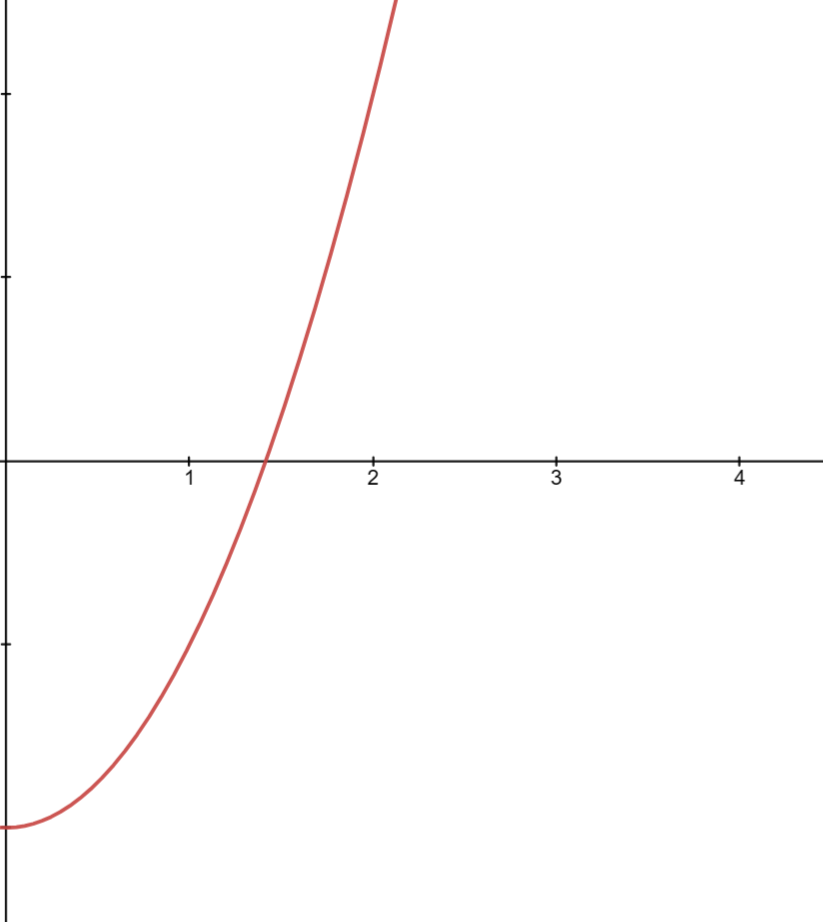
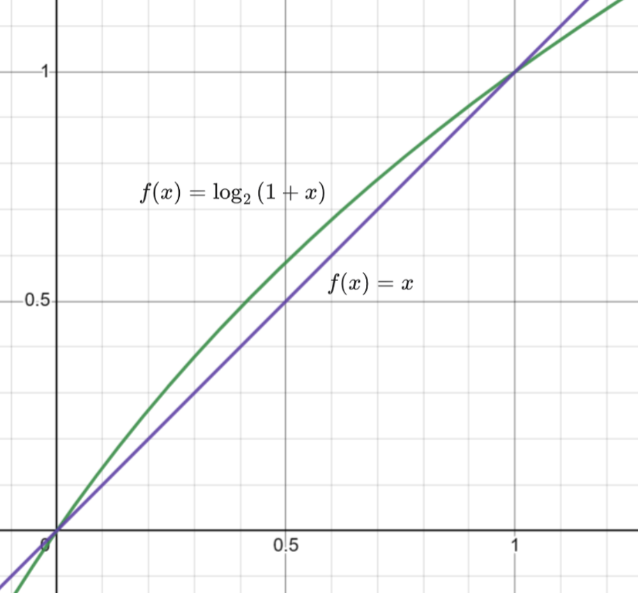

# 快速平方根倒数算法

## **引入**

如果不调用库函数$sqrt$，应该怎么求一个数的平法根呢？

首先我们可以想到将一个数的平方根转化成方程的形式，求解 $n$ 的平方根其实就是求解下面的方程：

$$
\sqrt{n}=x
$$

左右平方得：

$$
n=x^2
$$

也就是求 $f(x)=x^2 - n\space (x\ge 0)$ 的零点。我们以 $n=2$为例画出函数图像：

<figure markdown="span">
  { width="350" }
</figure>

<!-- <div align="center"></div> -->

我们会发现在定义域内函数是单调连续的，那么求零点的方法就很多了，二分法，牛顿迭代法都可以很好的解决该问题。

后文将的算法就是对牛顿法的优化，那么我们先来看看，一般牛顿法是如何求解的。

## **牛顿迭代法求解平方根**

函数上文已经写出来了$f(x) = x^2-n$。根据牛顿迭代法的递推式我们可以写出迭代的方程：

$$
x_{i+1} = x_i-\frac{f(x_i)}{f'(x_i)}\\
$$

$$
x_{i+1} = x_i-\frac{x_i^2-n}{2x_i}
$$

$$
x_{i+1} = \frac{x_i+\frac{n}{x_i}}{2}
$$

有了迭代公式代码就很好写了：

```cpp
constexpr double eps = 1e-10;//控制精度
double Newton_sqrt(double n)
{
    double x = 1;
    while(1)
    {
        double next_x = (x + n / x) / 2;//递推公式
        if(abs(next_x - x) < eps)break; //达到精度要求就跳出
        x = next_x;
    }
    return x;
}
```

牛顿迭代法收敛速率是平方级的，所以时间复杂度为 $O(\log{n})$

而由格雷格·沃什提出的算法只要 $O(1)$ 就可以算出足够精确的平方根。

## **快速平方根算法**

首先我们要直到，牛顿法的效率和初始值的选择关系很大，初始值越接近最终答案，所需迭代的次数越少，牛顿法的效率就越高。

那么想要快速得到平方根的值，首先要知道一个足够接近答案的近似解。

什么牛魔？我想快速知道答案，首先得知道答案？换一般人已经放弃这个优化思路了，但是格雷格·沃什提出一种绝妙的方法。

### **IEEE 浮点数存储方法**

首先我们来复习一下由IEEE提出的浮点数的二进制储存标准。

我们以 $float$ 为例，标准规定浮点出由三部分组成：

<figure markdown="span">
  { width="850" }
</figure>

<!-- <div align="center"></div> -->

该存储标准类似于科学计数法（其实就是二进制的科学计数法），其中 $S$ 表示数字的正负。$E$ 表示的是幂次，相当科学计数法$10$右上角的数字，$M$ 表示有效数字。

举个例子，一个十进制的科学计数法 $-1\times3.46\times 10^{13}$，如果把他按上面的标准分类，$-1$就是上面的 $S$ ，$13$就是上面的 $E$ ，$3.46$就是上面的 $M$。


但是 $E$ 和 $M$，又有一些细节与十进制不同。

- **$E$的不同：**
  $E$有 $8$ 个比特位，可以表示 $[0,255]$ 的数字，但是为了表示负幂次，最后真实的幂次要减去 $127$ ，即为 $E-127$ ，所以 $float$ 的幂次范围应该是 $[-127,128]$。
  
<br>

- **$M$的不同：**
  为了保证有效数字表示的唯一性，科学计数法规定了，有效数字中小数点前的数只能有一位，且该位不能为 $0$ ，但是二进制中每位只能是 $0$ 或 $1$ ，所以该位只能是 $1$，如果只能是 $1$ 的话其实就没必要存储了，在用到时候直接前一位补 $1$ 即可。

### **优化思路**

#### **$float$类型**

因为格雷格·沃什最初写出的快速平方根倒数算法是 $float$ 类型的，所以这里先将 $float$ 类型。
 
我们讨论的求平方根的数一定是正数，那么浮点数存储中的 $S$ 一定为 $0$ 这里就忽略它。

那么我们就可以用上面标准中的 $M,E$ 表示一个浮点数：

$$
x =  (1+\frac{M}{2^{23}})\times 2^{E-127}
$$

好像变得更复杂了啊，喂！别急来看看大佬是如何化简它的。

我们把上面求解平方根的方程拿下来，带入上面的浮点数表达式：

$$
\sqrt{n}=x\\
$$

$$
n^{\frac{1}{2}}=x\\
$$

$$
[(1+\frac{M}{2^{23}})\times 2^{E-127}]^{\frac{1}{2}}=x
$$

妙的来了，左右同时取对数：

$$
\log_2{[(1+\frac{M}{2^{23}})\times 2^{E-127}]^{\frac{1}{2}}}=\log_2{x}
$$

$$
\frac{1}{2}\times \log_2{[(1+\frac{M}{2^{23}})\times 2^{E-127}]}=\log_2{x}
$$

$$
\frac{1}{2}\times [\log_2{(1+\frac{M}{2^{23}})}+\log_2{2^{E-127}}]=\log_2{x}
$$

$$
\frac{1}{2}\times [\log_2{(1+\frac{M}{2^{23}})}+E-127]=\log_2{x}
$$

化简到这好像卡住了。$\log_2{(1+\frac{M}{2^{23}})}$ 不是很好处理。可以注意到 $M$ 是一个 $23bit$的二进制数，那么 $\frac{M}{2^{23}}$ 的值一定介于 $[0,1]$ 之间。我们画出 $\log_2{(1+x)}$ 在定义域 $[0,1]$ 的函数图像：

<figure markdown="span">
  { width="650" }
</figure>

<!-- <div align="center"></div> -->


我们发现这个函数在 $[0,1]$ 之间和和 $f(x)=x$ 非常接近，那么我们直接用 $\frac{M}{2^{23}}$ 来替换 $\log_2{(1+\frac{M}{2^{23}})}$，再带入上式得：

$$
\frac{1}{2}\times (\frac{M}{2^{23}}+E-127)=\log_2{x}\\
$$

再化简几步，我们能得到下式：

$$
\frac{1}{2}\times [\frac{1}{2^{23}}\times(2^{23}\times E+M)-127]=\log_2{x}\\
$$

我们会发现一个很熟悉的形式 $2^{23}\times E+M$ ，这不就是 $n$ 这个浮点数的二进制形式表示的整数吗？没看出来？$E\times 2^{23}$ 不就是把 $E$ 的二进制位左移 $23$ 位吗，然后加上 $M$ 这个数。把上面的图拿下来就很直观了。

<figure markdown="span">
  { width="850" }
</figure>

<!-- <div align="center"></div> -->

我们写程序时就可以以整数的形式来处理这的数据即可，下面我们以 $N$ 来表示 $n$ 的二进制形式所表示的整数。

那么上面的式子就可以进一步化简：

$$
\frac{1}{2}\times (\frac{1}{2^{23}}\times N-127)=\log_2{x}\\
$$

我们把右边的 $\log_2{x}$ 也以同样的过程化简成相同的形式：

$$
\frac{1}{2}\times (\frac{1}{2^{23}}\times N-127)=\frac{1}{2^{23}}\times X-127\\
$$

$$
X=\frac{1}{2} N + 2^{22}\cdot 127
$$

用这个式子求出 $X$ 再以浮点数的形式读取数据就能得到一个还算接近答案的初始值。

但是我们在用 $x$ 替换 $\log_2{x}$ 的过程才粗糙了，因为 $\log_2{x}$ 只有在 $[0,1]$ 区间的两个端点才非常接近，当在区间的中间时误差还是比较大的，如果想让整体区间的误差小一点，我们可以将 $x$ 直线向上移动一点，即将 $x$ 变为 $x + \varepsilon$。最终体现在结果式中就是给 $2^{23}\cdot 127$ 加上一个修正值。

但是这个修正值是多少比较好呢，我们从 $2^{23}\cdot 127$ 开始向两边暴力搜索一下，会发现当常数是$531,961,421$ 精度是比较不错的。

我们再进行一次牛顿迭代就可以得到一个精度还可以的答案：

```cpp
float Q_sqrt(float n)
{
	int N, X;
	float x;
	N = *(int*)&n;
  	// 0x1FB5164D -> 531,961,421
	X = 0x1FB5164D + (N >> 1);
	x = *(float*)&X;
	x = (x + n / x) / 2;    // 1st iteration
	return x;
}
```

为什么说精度还可以呢？因为受限于 $float$ 型变量，最终算出的值精度也不会超过 $10^{-8}$ ，所以下面我们用类似的思路推导 $double$ 类型的快速平方根。

#### **$double$类型**

有了上面的推导的基础，下面推导会简单很多。

我们先把 $double$ 类型的组成拿出来看看：

<figure markdown="span">
  { width="850" }
</figure>

<!-- <div align="center"></div> -->

我们很容易就能写出它的浮点数表达式：

$$
x =  (1+\frac{M}{2^{52}})\times 2^{E-1023 }
$$

那么 $\frac{1}{2}\log_2{n}=\log_2{x}$ 就可以化简为：

$$
X = \frac{1}{2}N+2^{51}\cdot 1023
$$

这里不是很好找到一个修正量来得到一个足够紧缺的近似解，所以只能多进行两次牛顿法，来得到足够精确的答案。

```cpp
double Q_sqrt(double n)
{
	ll N,X;
	double x;
	N = *(ll*)&n;
  // 0x1FF8000000000000ll -> 1023 * (1 << 51)
	X = 0x1FF8000000000000ll + (N >> 1);
	x = *(double*)&X;
	x = (x + n / x) / 2;    // 1st iteration
	x = (x + n / x) / 2;    // 2nd iteration
	x = (x + n / x) / 2;    // 3th iteration
	return x;
}	
```

### **快速求平方根倒数**

对于 $3D$ 图像处理来说求平方根倒数是非常重要的，而由格雷格·沃什写出的快速求平方根倒数算法极大的提高的求解平方根倒数的效率，之后也被运用到游戏 《雷神之锤3》的源码中。

快速求平方根倒数算法的原理和上文介绍的相同，只不过幂次换成了 $-\frac{1}{2}$ 。

```cpp
float Q_rsqrt( float number )
{
	long i;
	float x2, y;
	const float threehalfs = 1.5F;

	x2 = number * 0.5F;
	y  = number;
	i  = * ( long * ) &y;                       // evil floating point bit level hacking
	i  = 0x5f3759df - ( i >> 1 );               // what the fuck? 
	y  = * ( float * ) &i;
	y  = y * ( threehalfs - ( x2 * y * y ) );   // 1st iteration
//	y  = y * ( threehalfs - ( x2 * y * y ) );   // 2nd iteration, this can be removed

	return y;
}
```

现在来看学习快速平方根算法好像没什么必要，因为各个硬件厂商都对平方根算法有很多硬件上的优化，计算速度很快。

但是这段代码可以说对游戏历史产生了巨大影响，在那个没有显卡的年代，让人们可以玩到 $3D$ 作品，不得不说在那个受限于硬件的年代，人人都是算法优化大师。
