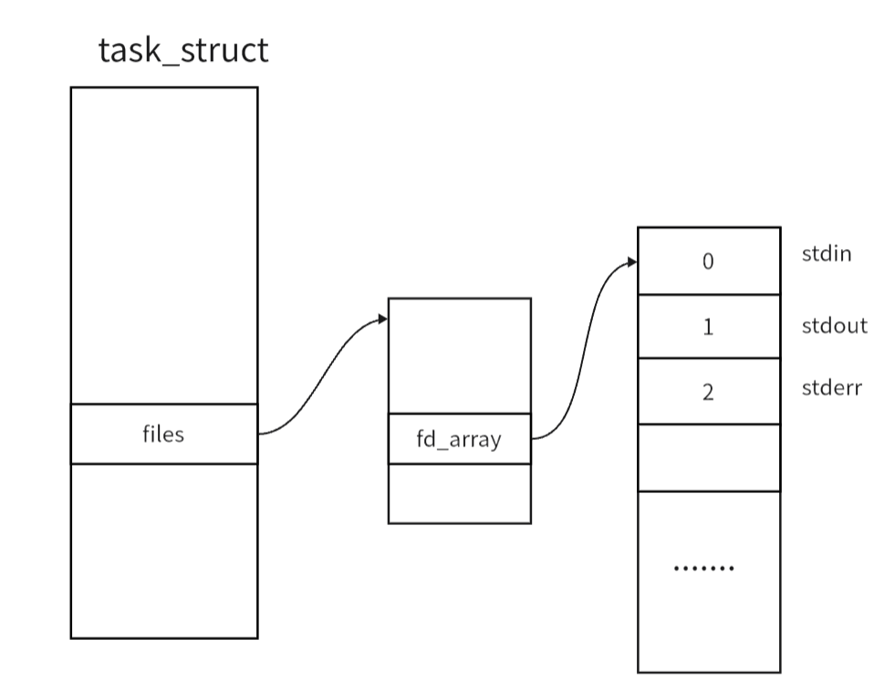
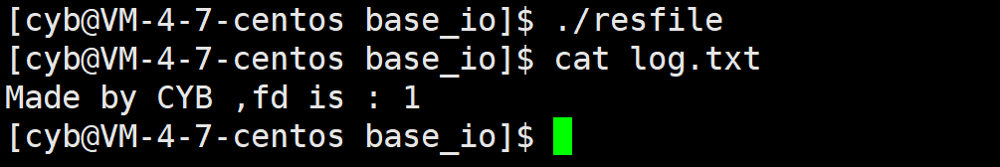
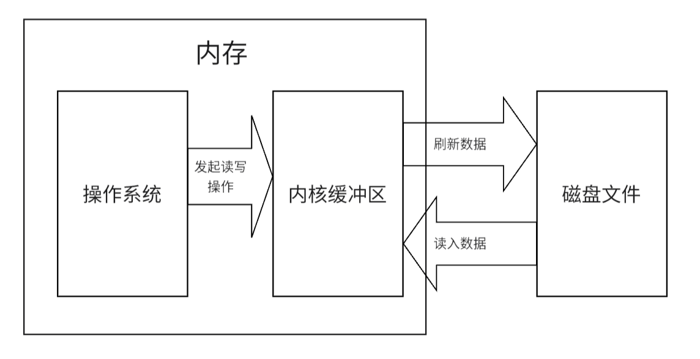
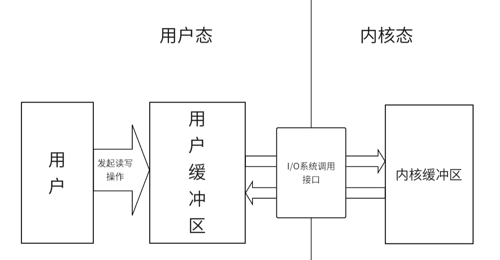
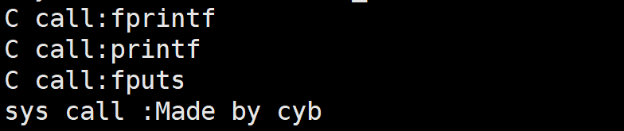
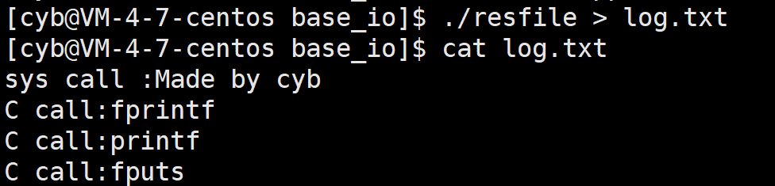
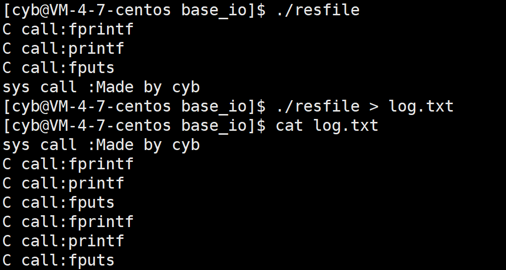
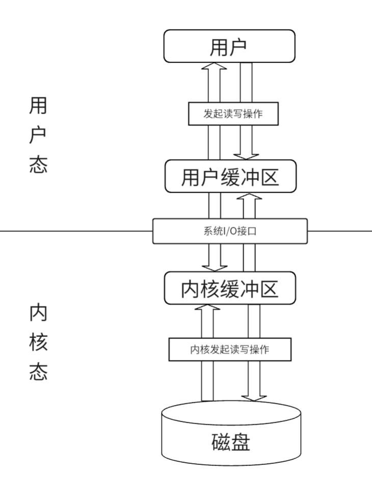

## **文件描述符**

操作系统在运行过程中会使用很多文件，使用文件要将其数据加载到内存中，那么对于这些在内存中的文件数据，操作系统理所当然的就要构建一些内核数据结构对这些文件进行管理。

在 Linux 下有结构体 `struct file` ，它存储了文件打开的所有属性:

```cpp
struct file {
	struct list_head	f_list;
	struct dentry		*f_dentry;
	struct vfsmount         *f_vfsmnt;
	struct file_operations	*f_op;
	atomic_t		f_count;
	unsigned int 		f_flags;
	mode_t			f_mode;
	int			f_error;
	loff_t			f_pos;
	struct fown_struct	f_owner;
	unsigned int		f_uid, f_gid;
	struct file_ra_state	f_ra;

	unsigned long		f_version;
	void			*f_security;

	/* needed for tty driver, and maybe others */
	void			*private_data;

#ifdef CONFIG_EPOLL
	/* Used by fs/eventpoll.c to link all the hooks to this file */
	struct list_head	f_ep_links;
	spinlock_t		f_ep_lock;
#endif /* #ifdef CONFIG_EPOLL */
	struct address_space	*f_mapping;
};
```
如：`f_count` 记录打开该文件的进程数量，`f_flags` 记录该文件的打开方式，`f_mode` 是文件访问的权限，`f_pos` 记录当前文件读写位置。

而我们知道文件是由进程打开，也是进程要进行访问修改的，那么进程就要知道自己打开了那些文件，所以在进程的 `task_struct` 中有一个结构体指针 `files`：

```cpp
/* open file information */
struct files_struct *files
```

`struct files_struct ` 结构体内就封装了一个指针数组，来维护该进程打开的所有文件，以及其他的信息:

```cpp
struct files_struct {
        atomic_t count;
        spinlock_t file_lock;     /* Protects all the below members.  Nests inside tsk->alloc_lock */
        int max_fds;
        int max_fdset;
        int next_fd;
        struct file ** fd;      /* current fd array */
        fd_set *close_on_exec;
        fd_set *open_fds;
        fd_set close_on_exec_init;
        fd_set open_fds_init;
        struct file * fd_array[NR_OPEN_DEFAULT];
};
```

这里的 `fd_array` 就是维护当前进程打开文件的数组，**它的下标就是对应文件的文件描述符**。

他的前三个元素是 C 程序自动帮我们打开的标准输入(`stdin`)，标准输出(`stdout`)，标准错误(`stderr`)。

|标准流|FILE|文件描述符|
|:-:|:-:|:-:|
|标准输入|stdin|0
|标准输出|stdout|1
|标准错误|stderr|2

按照上面的代码逻辑可以画出以下的图：

<figure markdown="span">
  { width="550" }
</figure>

### **文件描述符的分配规则**

当我们新打开文件时，系统会自动分配最小的没有被使用的文件描述符。

## **系统 IO 接口**

文件是由内容和属性两部分组成，那么自然的对文件的操作就有两种：对文件属性的操作和对文件内容的操作。而文件的内容和属性都是磁盘上的数据，所以进程想要对文件做出任何修改，第一步要做的就是将文件数据加载到内存。

文件数据加载到内存涉及到访问磁盘设备，修改文件内容也会对内核数据结构做出修改，那么这中间的工作一定是由操作系统来完成的，所以 OS 会提供一系列 IO 接口来完成对文件数据的修改。

### **打开文件**

在 C 语言中我们使用函数 `fopen` 来打开一个文件。这里打开文件所作的工作就是将文件数据加载到内存中去，`fopen` 就是对系统调用 `open` 函数的封装。

```cpp
# include <sys/types.h> 
# include <sys/stat.h> 
# include <fcntl.h>
int open(const char *pathname, int flags);
int open(const char *pathname, int flags, mode_t mode);
```

**参数解释:**

1.pathname:想要打开的文件路径名
2.flags:标志位，表示打开文件所采用的操作

标志位中必须下面三个常量的一种:

- O_RDONLY：只读模式
- O_WRONLY：只写模式
- O_RDWR：可读可写

下面的标志位是可选的：

- O_APPEND: 追加内容
- O_CREAT: 创建文件
- O_TRUNC：表示截断，如果文件存在，并且以只写、读写方式打开，则将其长度截断为 0。


3.mode：创建文件的初始权限。

- 文件权限由 open 的 mod e参数和当前进程的umask掩码共同决定。
- 第三个参数是在第二个参数中有 O_CREAT 时才作用，如果没有，则第三个参数可以忽略。

**返回值：**

open函数的返回值如果操作成功，它将返回一个文件描述符，如果操作失败，它将返回-1。 


### **文件写入**

C 语言中有很多文件写入的函数，而这些函数都是对系统调用 `write` 函数的封装。

```cpp
#include <unistd.h>
ssize_t write(int fd, const void *buf, size_t count);
```

参数解释：

1.fd：要写入文件的文件描述符

2.buf：写入文件的内容

3.count：写入文件的数据大小

返回值：

成功返回写入的字节数，出错返回-1。

### **文件读取**


 
```cpp
#include <unistd.h>
ssize_t read(int fd, void *buf, size_t count);
```

参数解释：

1.fd：要读取文件的文件描述符

2.buf：存储读取到数据的起始地址

3.count：要读取的数据字节数

返回值：

成功时，返回实际读取到的字节数，出错返回-1。

### **文件关闭**

C 语言中 `fclose` 函数就是对 `close` 和函数的封装。

```cpp
#include <unistd.h>
int close(int fd);
```

参数解释：

fd: 要关闭文件的文件描述符

返回值：当关闭成功时返回 0 ，失败时返回 -1。


## **输出重定向**

我们在 Linux 中会见到以下的指令:

```
echo "Made by CYB" > file.txt
```

这里的 `>` 就是重定向符，将 `echo` 原本打印到屏幕上的信息，输出到了 `file.txt`  文件中。

这是怎样做到的？

我们知道 C 语言中用来标识文件的的是一个结构体 `FILE` ，但是在系统层面，对于文件的标识只认文件描述符，通过上面的系统调用 IO 就能看出。

这就说明在 C 语言中的 `FILE` 内封装了文件描述符，那么在 C 程序中调用输出函数 `printf` 向 `stdout` 写数据的本质其实就是向 `fd_array` 下标为 1 所指向的文件写内容，只不过在初始化时 1 下标指向的文件是屏幕。


那么我们可以调用 `close` 将 1 位置的文件关闭，再打开我们想要写入的文件，通过上面所说的文件描述符的分配规则，就能实现标准输出的重定向。

```cpp
# include <stdio.h>    
# include <unistd.h>    
# include <sys/types.h>    
# include <sys/stat.h>    
# include <fcntl.h>    
int main()    
{    
    close(1);    
    int fd = open("./log.txt",O_WRONLY | O_TRUNC );
    printf("Made by CYB ,fd is : %d\n",fd);
    return 0;    
}   
```

<figure markdown="span">
  { width="450" }
</figure>

### **dup2**

当然系统也提供了系统接口，更方便的实现文件的重定向。

```cpp
#include <unistd.h>
int dup2(int oldfd, int newfd);
```

参数解释：

1.oldfd：需要被重定向的文件描述符

2.newfd：新的文件描述符

该函数的内部的实现其实就是将 oldfd 下标存储的地址，直接拷贝到 newfd 下标的位置。并且如果需要的话会将 newfd 位置指向的文件关闭。


## **缓冲区**


### **内核缓冲区**

当我们加载磁盘数据时到内存中时，其数据会被加载到内核缓冲区中，当我们对文件做修改时，真正修改的内容其实是内核缓冲区中的数据，操作系统会在特定时刻将内核缓冲区中修改后的数据刷新到磁盘上，实现修改的保存。

<figure markdown="span">
  { width="650" }
</figure>

有了内核缓冲区，在访问磁盘数据时， OS 不用频繁的读取磁盘，而是直接访问内存上的内核缓冲区，在 OS 的级别上提高了 IO 效率，优化的磁盘读写操作。


### **用户缓冲区**

用户进程在通过系统调用访问系统资源时，会从用户态转换到内核态，提高 CPU 执行权限，这个转换过程需要建立环境，会有很长的耗时，所以每个进程都有对应用户缓冲区，来减少系统调用次数，而降低操作系统在用户态与核心态切换所耗费的时间。

<figure markdown="span">
  { width="650" }
</figure>

我们在 C 语言中调用各种输出函数就不会立刻将数据写入到内核缓冲区中，而是先写入到输出缓冲区中，再根据不同的缓冲策略将数据写入到内核缓冲区。

对应用户缓冲区有以下几种缓冲策略：

- 无缓冲：立即刷新
- 行缓冲：遇到换行刷新
- 全缓冲：缓冲区满了刷新

当然在一些情况下，也会强制刷新用户缓冲区：

- 调用 `exit()` 结束进程
- 进程结束
- 调用 `fflush()` 刷新对应流缓冲区的数据
- 调用 `fclose()` 关闭流，并刷新对应流缓冲区的数据

我们写一个例子，帮助理解：

```cpp
# include <stdio.h>    
# include <string.h>    
# include <unistd.h>    
# include <sys/types.h>    
# include <sys/stat.h>    
# include <fcntl.h>    
    
int main()    
{    
    fprintf(stdout,"C call:fprintf\n");    
    printf("C call:printf\n");    
    fputs("C call:fputs\n",stdout); 
    const char* buffer = "sys call :Made by cyb\n";
    write(1,buffer,strlen(buffer));
    return 0;    
}    
```

输出如下：

<figure markdown="span">
  { width="450" }
</figure>

这都在意料之中，但我们将它重定向到文件中呢？


<figure markdown="span">
  { width="450" }
</figure>

为什么系统调用的输出会在 C 语言之上？

因为再向显示器写入时默认是采用行缓冲，而其他文件中默认采用全缓冲，所以再向显示器写入时 C 语言函数在调用时就将数据刷新到了内核缓冲区中，所以会在系统调用之上；而在向文件中写入时 C 语言函数只写入到用户缓冲区中，在程序结束时才将数据写入内核缓冲区，所以会在系统调用之后。

我们再将程序改成下面这样：

```cpp
# include <stdio.h>    
# include <string.h>    
# include <unistd.h>    
# include <sys/types.h>    
# include <sys/stat.h>    
# include <fcntl.h>    
int main()    
{    
    fprintf(stdout,"C call:fprintf\n");    
    printf("C call:printf\n");    
    fputs("C call:fputs\n",stdout);    
    const char* buffer = "sys call :Made by cyb\n";
    write(1,buffer,strlen(buffer));    
    
    fork(); // 注意 fork 位置    
    return 0; 
}    
```

<figure markdown="span">
  { width="450" }
</figure>

我们观察到在向显示器写时正常输出，而在向文件中写时 C 函数都写了两遍。

这是应为在向文件中写时采用全缓冲，在子进程和父进程的用户缓冲区中都有一份输出数据，在程序结束时两个进程都将数据刷新到了内核缓冲区中，所以有两份。

### **总结**

最后根据上面介绍的缓冲区，得到一个进程完整的文件 IO 过程如下：

<figure markdown="span">
  { width="450" }
</figure>

对于用户缓冲区和内核缓冲区，可以手动调用库函数和系统接口来将缓冲区中的数据强制刷新，如 C 库函数的 `fflush` 和 Linux 系统调用的 `fsync`，可以避免一些情况下进程崩溃或系统崩溃后导致数据丢失的问题，但是可能会损失一些效率。