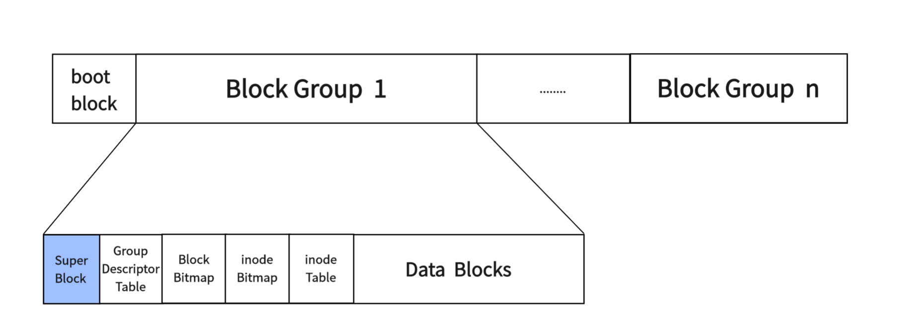
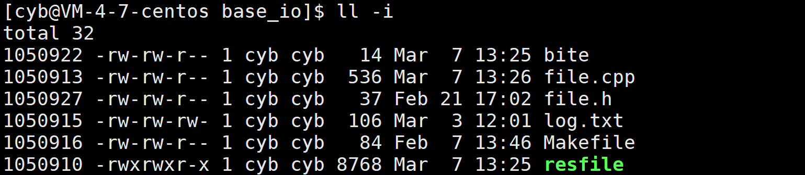
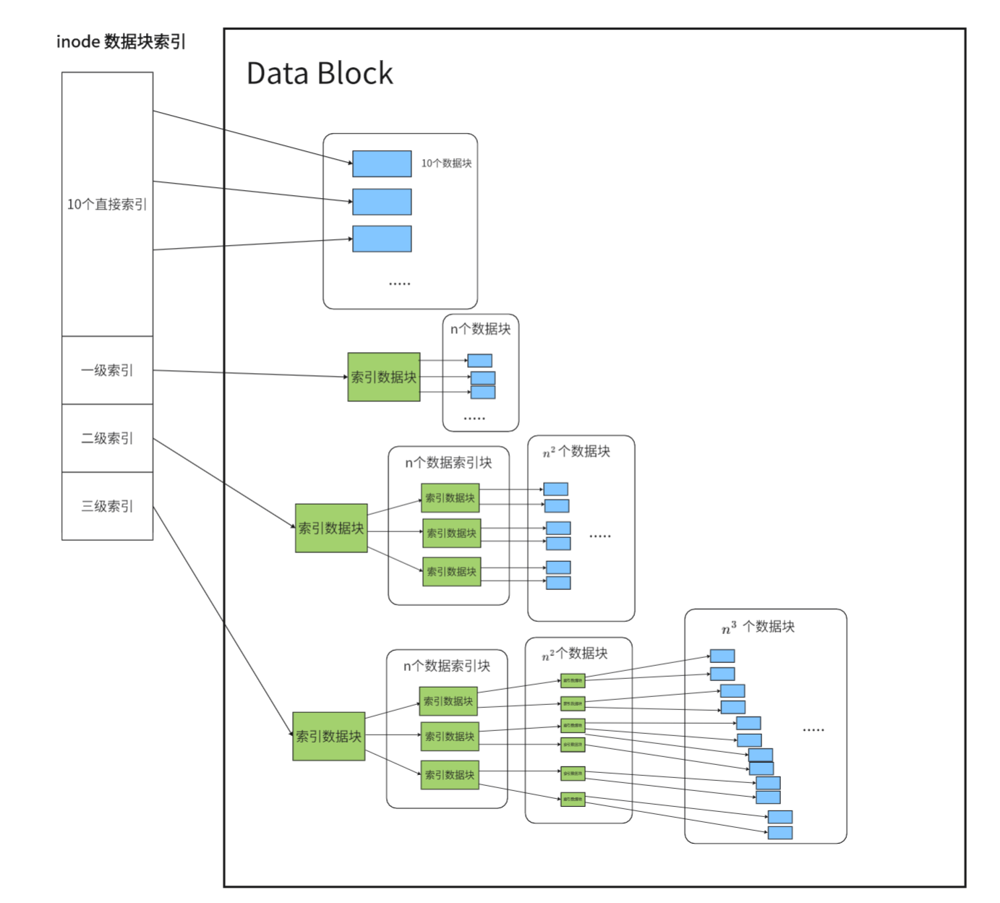
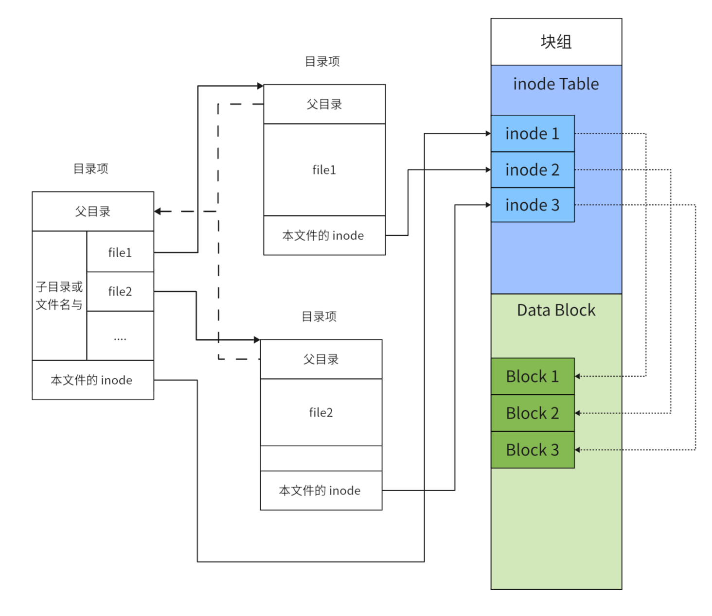
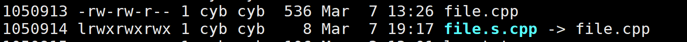
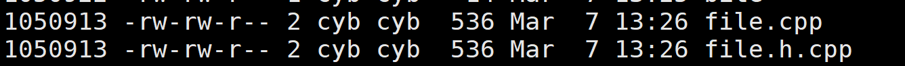

## **引入**

之前介绍过文件在内存中是如何被操作系统管理的，但是有很大一部分的文件是在未被打开的，存储在磁盘当中，那么操作系统是如果管理这些磁盘文件的，能让我们快速的寻址访问这些文件数据的呢？靠的就是文件系统。

## **磁盘分区**

对于一个几百 G ，甚至几 TB 的磁盘，这样大的一个空间，如果我们只是吧文件一股脑的放在一起，在遇到病毒或者系统崩溃时整个磁盘的文件都会受到波及，所以我们通常会将磁盘进行分区，如 Windows下的磁盘分成 C,D,E 盘等等，这样也便于自己查找文件。当系统出现问题时，也只需要重装系统后也只会影响系统文件的分区，不会影响其他数据。

一个文件系统只能够管理一个磁盘分区，而且不同的磁盘分区是可以由不同的文件系统以不同方式进行管理的。

## **Linux常见文件系统**

对于 Linux 早期使用 ext2 文件系统，后来又发展出 ext3 和 ext4。ext3 和 ext4 虽然对 ext2 进行了增强，但是其核心设计并没有发生变化，Linux 下常见的还有 XFS、ZFS、Btrfs。

下文我们主要介绍 ext2 文件系统。

## **Ext2**

ext2 文件系统在格式化的时候会将一个磁盘分区分为多个区块群组，每个区块群组采用相同的格式进行管理：

<figure markdown="span">
  { width="850" }
</figure>

- **boot block**：启动块，它存在于第一个分区的开头，用于启动磁盘上的操作系统，加载对应信息等。

- **Super Block**：超级块，存放文件系统本身的结构信息。Super Block的信息被破坏，可以说整个文件系统结构就被破坏了。所以 Super Block 会在多个块组的开头进行存储，但不是所有的，目的就是防止第一个块组的 Super Block 数据损坏。

- **Group Descriptor Table**：块组描述符，描述块组属性信息。

- **Block Bitmap**：Block Bitmap 中记录着 Data Block 中哪个数据块已经被占用，哪个数据块没有被占用。

- **inode Bitmap**：每个 bit 表示一个 inode 是否空闲可用。

- **inode Table**：存放文件属性数据， 如 文件大小，所有者，ACM 时间等。

- **Data Blocks**：存放文件内容数据。

### **块(Block)**

那么就有疑问了？块组，的块是是什么？

首先我们要知道系统怎么在磁盘上读数据，不可能一次读一个二进制位，这样读写的效率太低，而且磁盘读写的单位是扇区，一个扇区是 `512Byte`，但一次读一个扇区还是太少，所以文件系统会把多个扇区组成一个逻辑块，在 ext2 中默认是 8 个扇区为一个块也就是 `4KB` ，当然也可以使用命令 `mke2fs` 的 `-b` 选项将分区的块大小进行修改，修改范围是 `1~4KB`。

总结来说**操作系统在磁盘上访问的单位就是 数据块，默认数据块大小是 `4KB`**，这也是为什么磁盘被叫做块设备。


### **索引节点(inode)**

我们通过指令 `ls` 的 `-i` 选项，可以查看一个文件的 inode 编号：

<figure markdown="span">
  { width="550" }
</figure>

上图中的第一列就是一个文件的 inode 编号。

inode 是文件在系统层面的唯一标识，他会记录一个文件所有属性信息，和该文件在 Data Block 中使用的块编号，以及该文件所在的块组编号和对应 inode 信息在 inode Table 中存储的位置。

也就是说 inode 也会占用磁盘资源，就存储在对应块组的 inode Table 中，系统又通过 inode bitmap 来记录 inode Table 某个元素位置是否被使用，1 代表该位置被占用，0 代表该位置未被占用。

#### **索引数据块**

在 inode 中有一个记录该文件使用的数据块在 Data Block 中编号的数组。针对不同大小的文件，对应编号会有不同的索引方式，有直接索引，一级索引，二级索引，三级索引，直接索引的有 10 个，后三级索引每个有一个。


直接索引的指针，直接指向对应的数据块。

一级索引的指针，指向一个数据块，该数据块不记录数据，而是记录其他数据块的地址。

二级索引的指针，会指向一个记录一级指针的数据块。三级指针以此类推。


<figure markdown="span">
  { width="950" }
</figure>

对于直接索引，可以索引到 10 个数据块的内容，也就是 `40KB` 的数据。

每个索引记录的是 Data Block 中的数据块的编号，那么一个索引占据的就是 `4B`，所以一个数据块中可以存储 `1KB` 的数据块索引，也就是 $2^{10}$ 个，那么一级索引就可以索引到 $2^{10}$ 个数据块也就是 $2^{10}\times 4KB=4MB$ 的数据。以此类推。

对于二级索引就是 $2^{10}\times 4MB=4GB$ 的数据。

对于三级索引就是 $2^{10}\times 4GB=4TB$ 的数据。

当本快组的数据块不够用时，数据块索引还会索引到其他块组的数据块，但是当分区数据块不够时是不能索引到其他分区的，因为不同分区是由不同的文件系统管理的。

Ext2 文件系统采取上面的方式索引文件数据块是存在一些问题，就是在对大文件访问时要进行大量的查询，效率比较低。Ext4 文件系统对此做出优化，这里不做展开。


#### **索引文件**

我们一般在 Linux 中索引文件时一般都是通过文件路径，而不是 inode 编号，但是操作系统在磁盘上索引文件是不会使用文件名的。

在理解系统如何索引磁盘文件前，首先要理解目录文件，目录在 Linux 视角下也是文件，也会有 inode ，也会在 Data Block 中使用数据块。目录的数据块中所存储的是自己目录下直接保存文件的文件名和对应 inode 的映射关系。

这也是为什么同一个目录下不允许出现同名文件，因为文件名在映射时是作为 key 来使用的，不能出现一个 key 对应多个 inode。但是我们允许一个 inode 对应多个 key ，这也就是硬链接。

有了这个映射关系，系统就很容易找到目标文件对应的 inode，只需要通过映射关系，将用 `/` 分隔开的文件名依次转换为 inode 即可。

现在当我访问 `/home/cyb/test.cpp` 该路径文件时，首先到 `/` 目录的磁盘数据块中找到 `home` 文件的映射的 inode，跳转到 `home` ，再从 `home` 的磁盘数据块中找到 `cyb` 对应的 inode，再跳转.....，我们会发现怎么每次跳转都要进行一次磁盘 IO ，这样操作系统的效率也太低了吧。

所以操作系统为了提高文件的访问效率，减少一些对磁盘的 IO ，会将常用的一些目录和文件的树形结构加载到内存中，用内核数据结构维护起来，这个数据结构就是 `dentry`，我们将内存中的一个 `dentry` 实例称作**目录项**。

下面是 `dentry` 的源码：

```cpp
struct dentry {
	atomic_t d_count;
	unsigned int d_flags;		/* protected by d_lock */
	spinlock_t d_lock;		/* per dentry lock */
	struct inode *d_inode;		/* Where the name belongs to - NULL is
					 * negative */
	/*
	 * The next three fields are touched by __d_lookup.  Place them here
	 * so they all fit in a 16-byte range, with 16-byte alignment.
	 */
	struct dentry *d_parent;	/* parent directory */
	struct hlist_head *d_bucket;	/* lookup hash bucket */
	struct qstr d_name;

	struct list_head d_lru;		/* LRU list */
	struct list_head d_child;	/* child of parent list */
	struct list_head d_subdirs;	/* our children */
	struct list_head d_alias;	/* inode alias list */
	unsigned long d_time;		/* used by d_revalidate */
	struct dentry_operations *d_op;
	struct super_block *d_sb;	/* The root of the dentry tree */
	void *d_fsdata;			/* fs-specific data */
 	struct rcu_head d_rcu;
	struct dcookie_struct *d_cookie; /* cookie, if any */
	struct hlist_node d_hash;	/* lookup hash list */	
	int d_mounted;
	unsigned char d_iname[DNAME_INLINE_LEN_MIN];	/* small names */
};
```

我们会看到当前目录项的 inode 字段 `struct inode *d_inode;`，用于维护树形结构的父指针和儿子列表头 `struct dentry *d_parent;`、`struct list_head d_subdirs;`，以及记录文件与其 inode 编号的哈希关系的字段 `struct qstr d_name;` 。

有了 `dentry` ，那么大多数情况下，操作系统就可以直接通过目录项做到对文件的快速索引。

下图就是磁盘数据和目录项之间的关系：

<figure markdown="span">
  { width="800" }
</figure>


## **软硬链接**

### **软连接**

建立软连接使用下面的指令

```
ln -s target file_name
```
它会给 `target` 创建一个以 `file_name` 为名的链接。

软连接方式创建的链接与原文件有不同的 inode 编号，说明其本质是创建了一个新的文件，相当于 Windows 下的快捷方式。

<figure markdown="span">
  { width="650" }
</figure>

### **硬链接**

建立软连接使用下面的指令

```
ln target file_name
```
它会给 `target` 创建一个以 `file_name` 为名的链接。

硬链接与源文件有着相同的 inode 编号，这说明这两个文件事实上是一个文件，也就是原文件的别名。本质上硬链接就是在指定目录下创建一个新的文件名与 inode 的映射关系。

<figure markdown="span">
  { width="650" }
</figure>

这里我们看到对应文件的链接数也增加到了 2，只有当我们将文件的所有硬链接都删除时文件才会被删除。要注意的是 Linux 是不允许用户对目录创建硬链接的。


