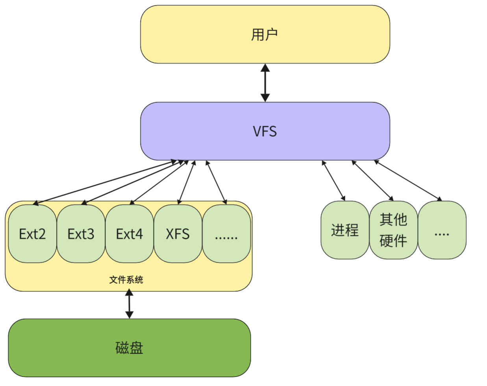

## **一切皆文件**

在 Linux 下，我们常说 **一切皆文件**，也就是说在 Linux 内核视角下目录、进程、管道等是文件，磁盘、显示器、键盘这些硬件也是文件。那么他们是文件就要读写等一系列文件操作，那针对不同软硬件读写操作一定是不同的。

光是不同的文件系统的，其对磁盘文件的读写方式都不同。那我们针对不同对象还要用不同的接口吗？这样太麻烦了。操作系统一定希望对用户提供一套统一的文件操作接口，于是就有了 **VFS(Virtual File System)** ，套在不同的文件对象和用户之间。

<figure markdown="span">
  { width="650" }
</figure>

不同的文件，会提供给 VFS 不同的文件操作的函数，经由 VFS 后，变成 Linux 下的 `write/read` 等系统调用函数。这样没有将不同文件操作的实现暴露给用户，内核无论怎么修改，都和应用层编程无关。

我们在系统的 `struct file` 下的 `struct file_operations	*f_op;` 字段可以看到下面的函数指针：

```cpp
struct file_operations {
	struct module *owner;
	loff_t (*llseek) (struct file *, loff_t, int);
	ssize_t (*read) (struct file *, char __user *, size_t, loff_t *);
	ssize_t (*aio_read) (struct kiocb *, char __user *, size_t, loff_t);
	ssize_t (*write) (struct file *, const char __user *, size_t, loff_t *);
	ssize_t (*aio_write) (struct kiocb *, const char __user *, size_t, loff_t);
	int (*readdir) (struct file *, void *, filldir_t);
	unsigned int (*poll) (struct file *, struct poll_table_struct *);
	int (*ioctl) (struct inode *, struct file *, unsigned int, unsigned long);
	int (*mmap) (struct file *, struct vm_area_struct *);
	int (*open) (struct inode *, struct file *);
	int (*flush) (struct file *);
	int (*release) (struct inode *, struct file *);
	int (*fsync) (struct file *, struct dentry *, int datasync);
	int (*aio_fsync) (struct kiocb *, int datasync);
	int (*fasync) (int, struct file *, int);
	int (*lock) (struct file *, int, struct file_lock *);
	ssize_t (*readv) (struct file *, const struct iovec *, unsigned long, loff_t *);
	ssize_t (*writev) (struct file *, const struct iovec *, unsigned long, loff_t *);
	ssize_t (*sendfile) (struct file *, loff_t *, size_t, read_actor_t, void *);
	ssize_t (*sendpage) (struct file *, struct page *, int, size_t, loff_t *, int);
	unsigned long (*get_unmapped_area)(struct file *, unsigned long, unsigned long, unsigned long, unsigned long);
	int (*check_flags)(int);
	int (*dir_notify)(struct file *filp, unsigned long arg);
	int (*flock) (struct file *, int, struct file_lock *);
};
```

这些都是 VFS 提供的文件操作。不同的文件提供不同写函数，不同的读函数等，最后将函数的指针赋值到这个结构体中，在调用时不同的文件进行的 `write/read` 函数是不同的，相当于 C 语言下的多态。

