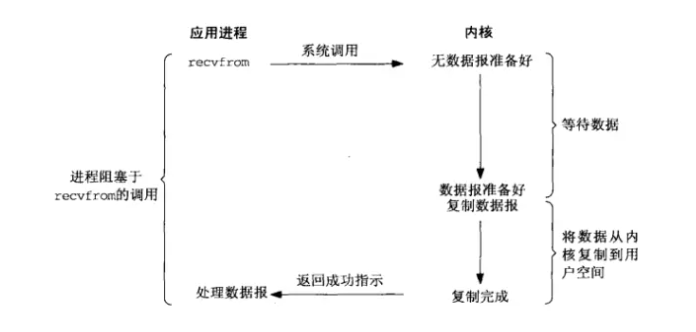
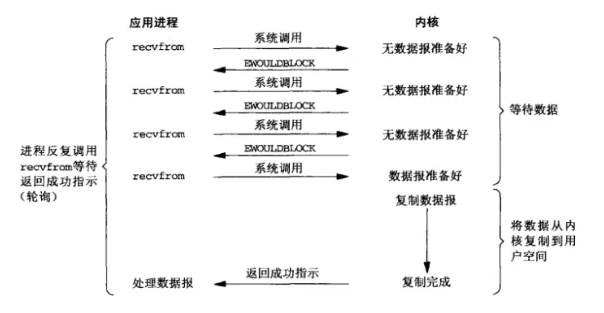
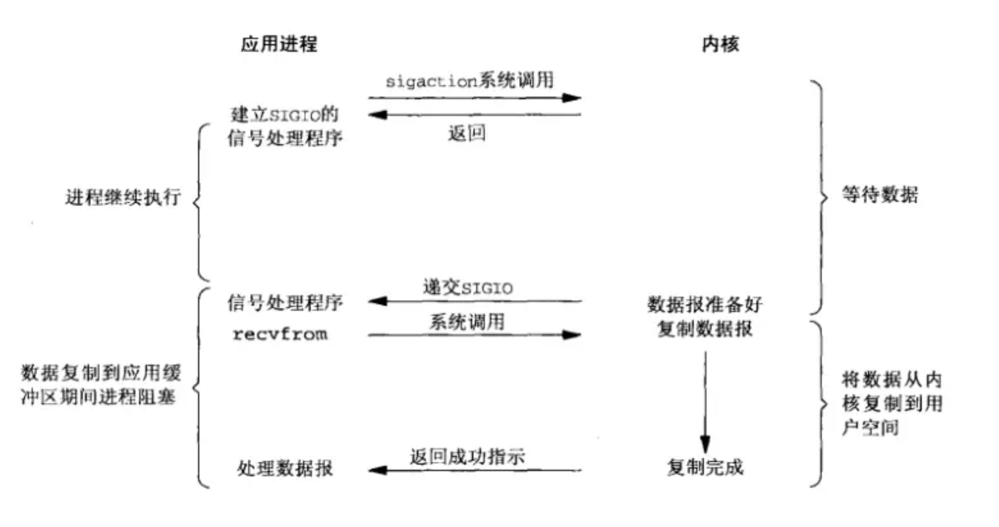
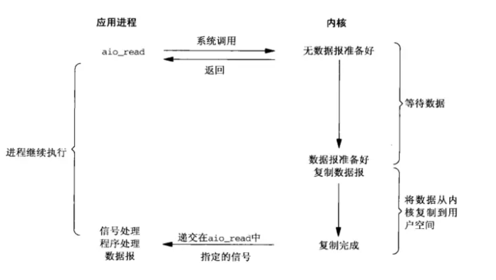

我们通常说 I/O 是效率低的，因为 CPU 在进行 I/O 时大部分时间都在等待磁盘网卡这些慢速设备，只有很少的时间会花费在数据传输上。而根据不同的 I/O 场景，有五种不同的 I/O 模型，所谓 I/O 模型就是指在计算机系统中处理输入/输出操作的方式和方法。


## **阻塞式 IO**

这是最简单的一种 I/O 模型。在该模型中，当一个进程执行 I/O 操作时，它会被阻塞，直到数据完全准备好并被传输完毕。

<figure markdown="span">
  { width="750" }
</figure>

我们使用的大多数 IO 系统调用都是默认阻塞式 IO。

??? note "blockIO"
    ```cpp
    #include <unistd.h>
    #include <iostream>
    #include <cerrno>

    int main() 
    {
        for(;;)
        {
            char buff[1024];
            ssize_t n = read(0,buff,sizeof(buff) - 1);
            if(n > 0)
            {
                buff[n] = 0;
                std::cout << "echo#" << buff;
            }
            else if(n == 0)
            {
                std::cout << "EOF" << std::endl;
                break;
            }
            else 
            {
                std::cout << "errno" << errno << std::endl;
                break;
            }
        }
        return 0;
    }
    ```

## **非阻塞 IO**

在非阻塞 I/O 模型中，进程在发起 I/O 操作后立即返回，而不是等待数据准备好。如果数据未准备好，I/O 操作会返回一个标志，表示需要重试。

<figure markdown="span">
  { width="750" }
</figure>

我们使用 `open` 打开文件时 flags 可以设置文件描述符的属性，可以通过选项 `O_NONBLOCK` 来设置为非阻塞，这样对该文件的所以 IO 操作都是非阻塞的。

`send`/`recv`，`sendto`/`recvfrom` 在使用时会提供一个 flags 的选项，可以通过选项 `MSG_DONTWAIT` 来设置为非阻塞 IO，但只有这次操作是非阻塞的。

`read`/`wirte` 只能同在 `open` 时设置的 IO 模式一样。

系统还未我们提供了一个函数 `fcntl` 来控制文件描述符的 flags 选项，函数原型如下：

```c
#include <unistd.h>
#include <fcntl.h>

int fcntl(int fd, int cmd, ... /* arg */ );
```

传入的cmd的值不同, 后面追加的参数也不相同。

`fcntl` 函数有5种功能：

- 复制一个现有的描述符（cmd = F_DUPFD）。

- 获得/设置文件描述符的 mode 和 flags (cmd = F_GETFL 或 F_SETFL)。

- 获得/设置异步I/O所有权(cmd = F_GETOWN 或 F_SETOWN)。

- 获得/设置记录锁(cmd = F_GETLK,F_SETLK 或 F_SETLKW)。

当文件被设置为非阻塞时，当读事件还未就绪时，read 等读取函数会返回 -1，要与真的出错区分开就要判断 errno，读事件未就绪 errno 被设置为 `EWOULDBLOCK` 或 `EAGAIN` ，这两个宏是相同的都是值 11。当读函数还未读任何数据时，被一个信号打断，这也不算是错误，errno 被设置为 `EINTR`。

??? note "blockIO"
    ```cpp
    #include <unistd.h>
    #include <iostream>
    #include <cerrno>
    #include <fcntl.h>

    void set_unblock(int fd)
    {
        int flags = fcntl(fd,F_GETFL);
        if(flags < 0)
        {
            std::cerr << "fcntl error" << std::endl;
            return ;
        }
        fcntl(fd,F_SETFL,flags | O_NONBLOCK);
    }

    int main() 
    {
        set_unblock(0);
        for(;;)
        {
            char buff[1024] = { 0 };
            ssize_t n = read(0,buff,sizeof(buff) - 1);
            if(n > 0)
            {
                buff[n] = 0;
                std::cout << "echo#" << buff << std::endl;
            }
            else if(n == 0)
            {
                std::cout << "EOF" << std::endl;
                break;
            }
            else 
            {
                if(errno == EAGAIN)    // 无数据
                    std::cout << "No Message..." << std::endl;
                else if(errno == EINTR)     // 被中断
                    std::cout << "The call was interrupted by a signal" << std::endl;
                else    // 出错
                {
                    std::cout << "errno" << errno << std::endl;
                    break;
                }
            }
            sleep(1);
        }
        return 0;
    }
    ```

## **多路复用 IO**

该模型使用 select、poll 或 epoll 等系统调用来同时监控多个 I/O 事件。当某个 I/O 事件准备就绪时，进程会被通知并进行处理。

该模型在 [多路复用 IO 模型](../Multiplexing/Multiplexing.md) 介绍。

## **信号驱动 IO**

该模型利用信号机制。当 I/O 设备准备好时，操作系统会向进程发送信号。进程在收到信号后，进行相应的 I/O 操作。

<figure markdown="span">
  { width="750" }
</figure>

## **异步 IO**

在异步 I/O 模型中，进程发起 I/O 操作后立即返回，不需要等待 I/O 完成。当 I/O 操作完成时，操作系统会通知进程，进程再进行处理。

<figure markdown="span">
  { width="750" }
</figure>