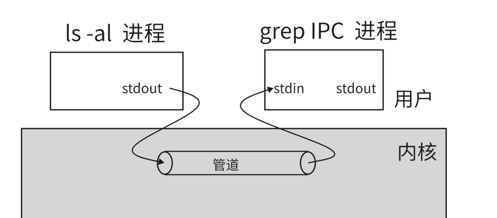
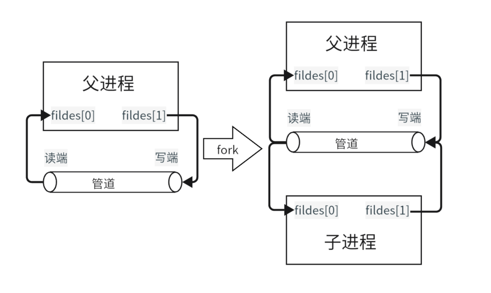
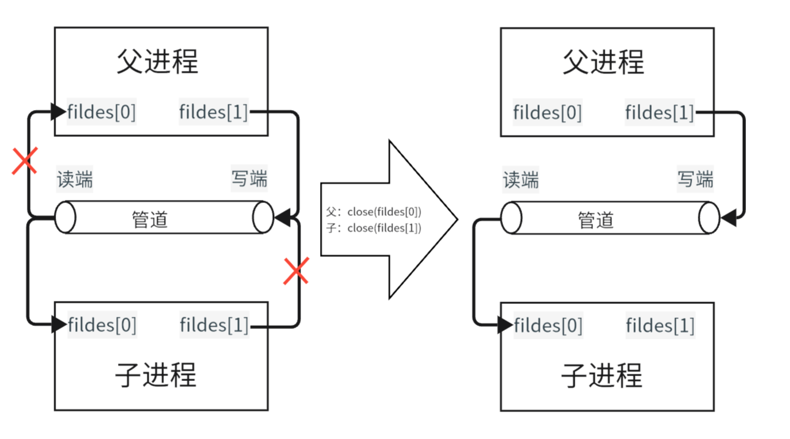

## **进程间通信**

进程间通信 (InterProcess Communication，IPC)，就是进程之间进行信息交换、共享资源、事件通知以及进程间的控制等行为。

因为每个进程之间是相互独立的，所以他们想要进行通信，就要借助到操作系统。操作系统提供了多种进程间通信的方式：

- 管道
- 共享内存
- 消息队列
- 信号量

共享内存、消息队列、信号量有基于不同标准的两套接口：POSIX 和 System V，System V 是基于内核的，可以实现毫无关系的两个进程之间的通信等，POSIX 是通过用户空间的库函数实现的，只能维护有亲缘关系的进程间的通信，通常用来管理线程。这里进程间通信中我们只介绍少 System V 标准下的接口。在线程同步中会介绍 POSIX 标准下控制线程同步互斥的接口。
 
## **管道**

管道是 Unix 系统最古老的一种进程间通信方式。我们在 Unix 命令行下一定用过 `|` ，来实现将上一个命令的输出交给下一命令作为输入，例如下面的命令：

<figure markdown="span">
  { width="550" }
</figure>

这里 `|` 就是创建了一个匿名管道。

我们知道每个进程是相互独立的所以，不可能直接在两个进程的地址空间上互相交换数据，而是由内核提供一个媒介，上面这里管道就是一个进程数据流向另一个进程的媒介。

<figure markdown="span">
  { width="550" }
</figure>


### **原理**

现在思考一下，如果没有管道，我们该怎么实现将一个进程的输出交给另一个进程？

我们可以让两个进程打开同一个文件，一个以读方式，一个以写方式打开，因为同一个文件只会在内存创建一个文件对象，所以我们的写进程每次直接将数据写到文件缓冲区中，这样读进程就可以在该文件缓存区中读到写进程写入的数据。但是这样当文件缓冲区写满后，会将数据刷新到磁盘中，通信效率很低。

所以系统给我们提供了管道，管道的本质其实就是一个文件对象，但是其文件信息只存在于内存中，当管道文件被从内存中释放时，并不会将数据写入磁盘。

### **管道读写规则**

并且对于一些特殊情况，管道会比普通文件更易处理：

- 如果管道中没有数据，读端会阻塞，等待到管道中有数据为止。
- 如果管道被写满了，写端会阻塞，直到有空间后（即有数据被读端读走），才能写入。
- 写端关闭，读端读取，`read` 会返回 0。
- 读端关闭，则 `write` 操作会产生信号 `SIGPIPE`

管道还有下面的特性，便于使用：

- 字节流通信，管道中数据的读写单位是字节。
- 单向通信，要么一边读，要么一边写，不可以边读边写。
- 同步机制，读端只能按照写端写入的顺序读取数据。
- 管道声明周期随进程，进程结束，管道也会结束。


### **匿名管道**

匿名管道使用库函数 `pipe()`，可以创建一个匿名管道。

```cpp
# include<unistd.h>
int pipe(int fildes[2]);
```

该函数会创建一个文件对象作为管道，并且将读端 fd 存在 `fildes[0]` 中，写端 fd 存在 `fildes[1]` 中。

匿名管道是只存在于内存中的，完全不占据磁盘空间。并且只能让有亲缘关系的进程间进行通信，当 `fork` 得到子进程后，子进程会继承父进程该管道的两个文件描述：

<figure markdown="span">
  { width="550" }
</figure>

这时我们只需要按需求关闭父子进程的读写端，就可以完成父子进程的单向通信了。

<figure markdown="span">
  { width="550" }
</figure>

匿名管道的局限性是只能让具有亲属关系的进程间进行通信，两个毫不相关的进程无法通过继承文件描述符的方式来得到对匿名管道的读写权限，这时就需要命名管道。


### **命名管道**

命名管道的创建可以使用指令：

```shell
mkfifo [pipe_name]
```

也可也使用库函数：

```cpp
int mkfifo(const char *pathname, mode_t mode);
```

会创建一个名为 `pipe_name` 的命名管道。对于命名管道的使用就和我们上文介绍的普通文件通信的方式相同，一个进程以读方式打开，一个进程以写方式打开，但是不需要我们做强制写入。

#### **命名管道打开规则**

在管道已经存在的情况下

- 当写端未打开时，读端打开管道时会阻塞。

- 当读端未打开时，写端打开管道时也会阻塞。


## **System V 共享内存**

共享内存，顾名思义就是允许两个不相关的进程访问同一个物理内存，共享内存是两个正在运行的进程之间共享和传递数据的一种非常有效的方式。不同的进程将同一块物理内存通过页表映射到逻辑内存，并且该内存空间由操作系统分配与管理。

Linux 下的 `shm_ds` 结构体来维护共享内存。

```cpp
struct shmid_ds {
    struct ipc_perm shm_perm;    /* Ownership and permissions */
    size_t          shm_segsz;   /* Size of segment (bytes) */
    time_t          shm_atime;   /* Last attach time */
    time_t          shm_dtime;   /* Last detach time */
    time_t          shm_ctime;   /* Creation time/time of last
                                    modification via shmctl() */
    pid_t           shm_cpid;    /* PID of creator */
    pid_t           shm_lpid;    /* PID of last shmat(2)/shmdt(2) */
    shmatt_t        shm_nattch;  /* No. of current attaches */
    ...
};
struct ipc_perm {
    key_t          __key;    /* Key supplied to shmget(2) */
    ....
    unsigned short mode;     /* Permissions + SHM_DEST and
                                SHM_LOCKED flags */
    ....
};
```

共享内存的速度比管道要快，但是共享内存不支持阻塞等待，读端和写端可以同时访问共享内存，即 **全双工**。


### **共享内存的使用**

#### **创建**

我们使用 `shmget` 来获取一块共享内存。

```cpp
#include <sys/ipc.h>
#include <sys/shm.h>
int shmget(key_t key, size_t size, int shmflg);
```

`shmget` 会根据 key 值创建一个大小为 size 的共享内存，并返回其共享内存的 id，即 shmid，shmid 是共享内存在内核中的唯一标识，因此当创建多个共享内存时，每一个 key 值要独一无二。

**参数解释：**

- key：

获得 key 值可以使用库函数 `ftok` 专门获取一个独一无二的 `key_t` 类型值。

```cpp
#include <sys/types.h>
#include <sys/ipc.h>
key_t ftok(const char *pathname, int proj_id);
```

参数 pathname 为路径，必须是真实存在且可以访问的路径。

参数 `proj_id`是 `int` 类型数字，且必须传入非零值。

ftok函数内部会根据路径和 `proj_id` 通过算法生成一个独一无二的 `key_t` 返回值。

多进程通信时，需要通信双方使用同一个 key 值，因此双方使用的 `ftok` 参数应该一致。

- size：

共享内存的大小，尽量是内存块的整数倍，因为即便我们需要的空间大小不是块大小的整数倍，操作系统实际上也还是分配块的倍数个。但在使用时，那些超过 size 大小的多余分配空间不能访问。  

- shmfg：

该参数用于确定共享内存属性。

使用上为：标志位 | 内存权限

标志位参数有两种：IPC_CREAT、IPC_EXCL。

|方式|含义|
|:-:|:-:|
|shmget(..., IPC_CREAT \| 权限)|创建失败不报错返回已有shmid|
|shmget(..., IPC_CREAT \| IPC_EXCL \| 权限)|创建失败报错返回-1|

注意：IPC_EXCL 不能单独使用。

#### **挂接**


我们使用 `shmat` 来将共享内存挂接到进程地址空间的共享区。

```cpp
#include <sys/types.h>
#include <sys/shm.h>
void *shmat(int shmid, const void *shmaddr, int shmflg);
```

将 shmid 所对应的共享内存挂接到 shmaddr 地址处，一般填 nullptr 让内核自己确定挂接位置，shmflg 用于确定挂接方式，一般填 0。

挂接成功会返回共享内存的起始地址，否则返回 -1。

#### **分离**

我们使用 `shmdt` 来分离共享内存。

```cpp
#include <sys/types.h>
#include <sys/shm.h>
int shmdt(const void *shmaddr);
```

将 `shmaddr` 位置的共享内存分离。

分离成功返回0，失败返回-1。 

#### **销毁**

我们使用 `shmctl` 来销毁共享内存。

```cpp
#include <sys/ipc.h>
#include <sys/shm.h>
int shmctl(int shmid, int cmd, struct shmid_ds *buf);
```

该接口本身用于控制共享内存，可用于销毁。 

cmd 传入 IPC_RMID ，buf 传 nullptr。 

我们还可以将 cmd 传入 IPC_STAT，来获取共享内存的信息，传入 IPC_SET ，设置共享内存的信息。

#### **使用**

在调用 shmat 后会返回一个地址，读端直接读地址内容即可，写端直接向该地址写入即可。

#### **常用指令**

- ipcs：

该指令为系统指令。使用时可以查看当前全部共享内存。

```shell
ipcs -m
```

- ipcrm:

删除指定共享内存

```shell
ipcrm -m [shmid]
```

## **System V 消息队列**

消息队列允许进程间以块为单位进行数据交换。消息队列的接口使用和共享内存十分类似。

```cpp
#include <sys/types.h>
#include <sys/ipc.h>
#include <sys/msg.h>

int msgget(key_t key, int msgflg);  // 创建消息队列
int msgsnd(int msqid, const void *msgp, size_t msgsz, int msgflg); // 向消息队列发送消息
ssize_t msgrcv(int msqid, void *msgp, size_t msgsz, long msgtyp,  
              int msgflg);    // 从消息队列接受消息。
/*
The msgp argument is a pointer to a caller-defined structure of the following general form:

struct msgbuf {
    long mtype;        message type, must be > 0
    char mtext[1];     message data 
};

msgbuf 结构体要自己定义 
long mtype ：用于区分不同进程间的消息。 
char mtext[1]：队列中的数据块。
*/
int msgctl(int msqid, int cmd, struct msqid_ds *buf);   // 控制消息队列
```

使用 `ipcs -q` 来查看系统中当前的消息队列。

## **System V 信号量**

### **基础概念**

互斥：确保同一时间只有一个进程可以访问共享资源。

同步：控制进程执行的顺序，确保特定的执行顺序或条件。

临界资源：一次只能由一个进程使用的资源。

临界区：一个进程中访问临界资源的代码段。

**信号量：**是一种用于进程间同步和互斥的机制,信号量是一个变量或抽象数据类型，用于控制对共享资源的访问。简单地说，它是一个用于保护共享资源的“守门员”。当多个进程或线程需要访问同一资源时，信号量确保任何时刻只有特定数量的进程可以访问该资源。

信号量的主要操作有两个：等待（Wait）和信号（Signal）。在 POSIX 中，这些操作通常称为 P（Proberen，荷兰语“测试”的意思）和 V（Verhogen，荷兰语“增加”的意思）。

- 等待（Wait）: 如果信号量的值大于零，则将其减一，进程继续执行。如果信号量的值为零，则进程休眠，直到信号量值增加。
- 信号（Signal）: 增加信号量的值。如果有任何进程因等待这个信号量而被阻塞，唤醒其中一个。

在编程中，这两个操作通常被实现为原子操作，确保在多线程环境中的安全性。


以下是System V信号量的主要接口及其功能：

1. **semget()**：


	* 功能：创建一个新信号量或取得一个已有信号量。
	* 函数原型：`int semget(key_t key, int num_sems, int sem_flags);`
		+ `key`：一个整数值（唯一非零），可以理解成是信号量的标识符。
		+ `num_sems`：指定了需要的信号量数目，通常为1。
		+ `sem_flags`：一组标志，当创建一个新的信号量时，设定权限与值IPC_CREAT做按位或操作。设置了IPC_CREAT标志后，即使给出的键是一个已有信号量的键，也不会产生错误。而IPC_CREAT | IPC_EXCL则可以创建一个新的、唯一的信号量，如果信号量已存在，返回一个错误。
	* 返回值：成功返回一个相应信号标识符（非零），失败返回-1。
2. **semctl()**：


	* 功能：对信号量集执行控制操作，如设置信号量的值、获取信号量集的状态等。
	* 函数原型：`int semctl(int semid, int semnum, int cmd, ...);`
		+ `semid`：由semget()返回的信号量标识符。
		+ `semnum`：要操作的信号量在信号量集中的索引（通常从0开始）。
		+ `cmd`：控制命令，如IPC_RMID（删除信号量集）、SETVAL（设置信号量的值）等。
		+ `...`：根据cmd参数的不同，可能需要额外的参数。
3. **semop()**：


	* 功能：对信号量集执行一系列操作，如P操作（等待信号量）和V操作（发布信号量）。
	* 函数原型：`int semop(int semid, struct sembuf *sops, unsigned nsops);`
		+ `semid`：由semget()返回的信号量标识符。
		+ `sops`：指向sembuf结构数组的指针，该数组定义了要执行的操作序列。
		+ `nsops`：sops数组中元素的数量。
	* sembuf结构通常用于定义P和V操作，其中sem_num指定信号量在信号量集中的索引，sem_op指定要执行的操作（对于P操作，通常为负数；对于V操作，通常为正数），sem_flg则是一组标志位。

需要注意的是，由于System V信号量是基于内核的，因此它们比用户空间的同步原语（如互斥锁和条件变量）具有更高的开销。然而，它们也提供了更强大的功能和更广泛的适用范围，特别是在需要跨多个进程进行同步的场景中。